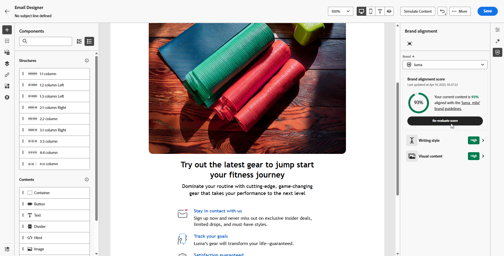

# Merk uitlijnen {#brands-score}

>[!CONTEXTUALHELP]
>id="ajo_brand_score"
>title="Merkuitlijningsscore"
>abstract="Met de score voor Brand Alignment kunt u meten in hoeverre de inhoud voldoet aan de richtlijnen van uw merk. Zo bent u verzekerd van consistentie in kleuren, lettertypen, logo, afbeeldingen en schrijfstijl."

>[!CONTEXTUALHELP]
>id="ajo_brand_colors"
>title="Kleurscore"
>abstract="Kleurscore"

>[!CONTEXTUALHELP]
>id="ajo_brand_fonts"
>title="Lettertypescore"
>abstract="Lettertypescore"

>[!CONTEXTUALHELP]
>id="ajo_brand_logos"
>title="Logos score"
>abstract="Logos score"

>[!AVAILABILITY]
>
>U moet met de [&#x200B; gebruikersovereenkomst &#x200B;](https://www.adobe.com/legal/licenses-terms/adobe-dx-gen-ai-user-guidelines.html){target="_blank"} akkoord gaan alvorens u de Medewerker AI in Adobe Journey Optimizer kunt gebruiken. Neem voor meer informatie contact op met uw Adobe-vertegenwoordiger.

Met de functie Merkuitlijning kunt u inhoud maken, bekijken en beheren die voldoet aan uw richtlijnen voor merken. Het zorgt voor consistentie in toon, overseinen, en visuele identiteit over uw e-mailcampagnes, terwijl ook als kwaliteitscontrole dient alvorens uw inhoud live gaat.

## Uw inhoud valideren met uitlijning van het merk {#validate-content}

Zodra [&#x200B; uw merk opstelling en gepubliceerd &#x200B;](brands.md) is, bepaal uw merk groeperingsscore direct binnen uw e-mailcampagne om uw inhoud te verzekeren richt zich op uw merkrichtlijnen:

1. Creeer uw [&#x200B; e-mailcampagne &#x200B;](../campaigns/create-campaign.md).

1. Open het menu **[!UICONTROL Brand Alignment]** in de E-mail-Designer.

   Uw inhoud wordt automatisch afgezet tegen uw standaardmerk. [&#x200B; Leer hoe te om een standaardmerk &#x200B;](brands.md) toe te wijzen.

   

1. Als u een ander merk wilt gebruiken, selecteert u het in de vervolgkeuzelijst **[!UICONTROL Brand]** en klikt u op **[!UICONTROL Evaluate score]** .

   

1. Blader door **[!UICONTROL Writing style]** of **[!UICONTROL Visual content]** om meer inzichten in de score te zien.

   

1. Klik het  pictogram om meer inzichten in uw score te zien.

   

1. Selecteer een gemarkeerde hulplijn om specifieke feedback en suggesties weer te geven. De uitlijning van het merk evalueert de volgende categorieën:

   * **[!UICONTROL Writing style]**:
      * **[!UICONTROL Brand communication style]**: definieert de persoonlijkheid en emotionele tinten om te zorgen voor een consistente stem van het merk in alle kanalen.
      * **[!UICONTROL Brand messaging standards]**: Structuur- en opmaakregels voor effectieve marketing- en promotietekst.
      * **[!UICONTROL Legal compliance standards]**: zorgt ervoor dat alle communicatie voldoet aan wettelijke vereisten, inclusief controlelijsten voor tekstplaatsing en compatibiliteit.

   * **[!UICONTROL Visual content]**:
      * **[!UICONTROL Photography standards]**: Vereisten voor fotografische inhoud, zoals resolutie, compositie, belichting en bestandsindelingen.
      * **[!UICONTROL Illustration standards]**: stijlparameters, lijndikten, kleurgebruik en vereisten voor de bestandsindeling voor illustraties.
      * **[!UICONTROL Icon standards]**: specificaties voor pictogramontwerp, inclusief rastersystemen, lijndikten en grootten voor uniformiteit.
      * **[!UICONTROL Usage guidelines]**: aanbevolen procedures voor het selecteren, plaatsen en context van afbeeldingen om de merkidentiteit te behouden.

   

1. Bewerk de inhoud op basis van de aanbevelingen om de uitlijning van merken te verbeteren.

1. Controleer de inhoud handmatig opnieuw nadat u wijzigingen hebt aangebracht om de uitlijningsscore te vernieuwen.

## De kwaliteit van uw inhoud valideren {#validate-quality}

>[!NOTE]
>
>Evaluatie van de kwaliteit van de inhoud is merkagnostisch. Zelfs als een merk is geselecteerd in het keuzemenu, worden de richtlijnen niet toegepast op de kwaliteitscontrole. De merkselectie is alleen van belang voor de merkuitlijningsscoring.

Naast de uitlijning van merken kunt u de algemene kwaliteit van de inhoud beoordelen om mogelijke problemen met leesbaarheid, samenhang van de inhoud en efficiëntie te identificeren, onafhankelijk van uw merkrichtlijnen.

De kwaliteit van uw inhoud evalueren:

1. Creeer uw [&#x200B; e-mailcampagne &#x200B;](../campaigns/create-campaign.md).

1. Open het menu **[!UICONTROL Brand Alignment]** in de E-mail-Designer.

   

1. Klik op **[!UICONTROL Evaluate score]** om zowel de uitlijning van het merk als de scores voor de kwaliteit van de inhoud te genereren.

   

1. Navigeer naar het tabblad **[!UICONTROL Overall quality]** om de inzichten en aanbevelingen van de inhoudkwaliteit te bekijken.

   

1. Klik het  pictogram voor een gedetailleerde mening van uw kwaliteitsscore.

   

1. Selecteer een gemarkeerd item om specifieke feedback en activeerbare suggesties voor verbetering weer te geven. Scores zijn gebaseerd op de volgende categorieën:

   * **[!UICONTROL CTA effectiveness]**: evalueert hoe goed je call-to-action lezers motiveert om de gewenste actie te ondernemen.
   * **[!UICONTROL Subject Line]**: beoordeelt de kwaliteit van helderheid, relevantie en aandacht om het openen van e-mail aan te moedigen.
   * **[!UICONTROL Readability]**: geeft aan hoe gemakkelijk en aantrekkelijk uw inhoud is voor lezers.
   * **[!UICONTROL Spam Check]**: Identificeert algemene spamtriggers die invloed kunnen hebben op de leverbaarbaarheid.
   * **[!UICONTROL Content Cohesiveness]**: zorgt ervoor dat uw inhoud vloeiend verloopt en op het onderwerp blijft staan.
   * **[!UICONTROL Proofreading]**: hiermee wordt gecontroleerd op problemen met spelling, grammatica en helderheid.

   

1. Bewerk de inhoud op basis van de aanbevelingen om de leesbaarheid, de samenhang van de inhoud en de algehele kwaliteit te verbeteren.

1. Klik op **[!UICONTROL Re-evaluate score]** nadat u wijzigingen hebt aangebracht om de kwaliteitsscore te vernieuwen.

## Hoe kan ik-video {#video}

De video hieronder toont hoe te om uw eigen merken tot stand te brengen en aan te passen om uw visuele en verbale identiteit over mededelingen duidelijk te bepalen.

+++ Zie video

>[!VIDEO](https://video.tv.adobe.com/v/3470552/?captions=dut&learn=on)

+++
