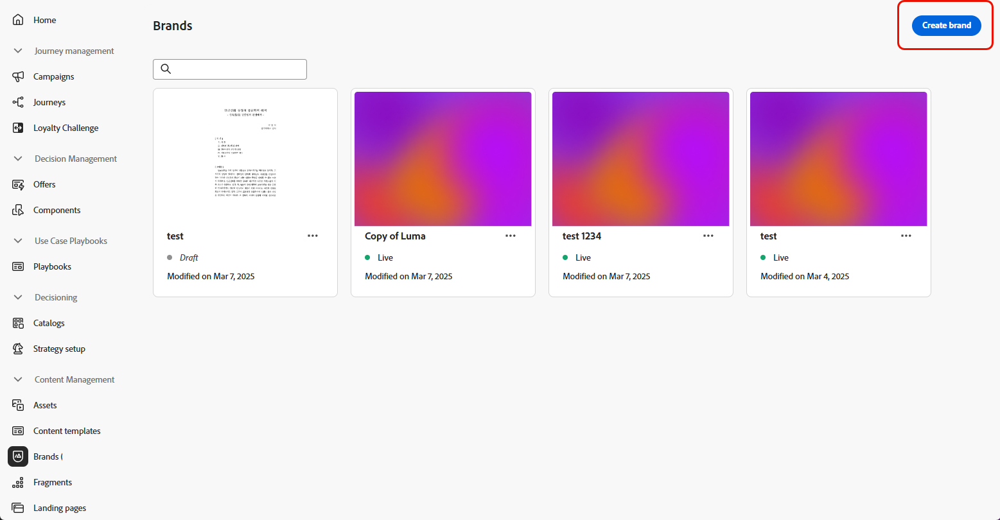

# Uw merken maken en beheren {#brands}

>[!CONTEXTUALHELP]
>id="ajo_brand_overview"
>title="Aan de slag met merken"
>abstract="Creëer en pas uw eigen merken aan om uw unieke visuele en verbale identiteit te bepalen terwijl het gemakkelijker wordt om inhoud te produceren die de stijl en de stem van uw merk aanpast."

>[!CONTEXTUALHELP]
>id="ajo_brand_ai_menu"
>title="Merk selecteren"
>abstract="Kies uw merk om ervoor te zorgen dat alle door AI gegenereerde inhoud is afgestemd op de specificaties en richtlijnen van uw merk."

>[!CONTEXTUALHELP]
>id="ajo_brand_score_overview"
>title="Merk selecteren"
>abstract="Selecteer uw merk om ervoor te zorgen dat uw inhoud is samengesteld in overeenstemming met de specifieke richtlijnen, standaarden en identiteit, zodat consistentie en brandintegriteit behouden blijven."

Merkrichtlijnen zijn een gedetailleerde reeks regels en normen die de visuele en verbale identiteit van een merk bepalen. Zij fungeren als referentie om een consistente merkweergave te behouden op alle marketing- en communicatieplatforms.

In [!DNL Journey Optimizer] hebt u nu de optie om uw merkdetails handmatig in te voeren en in te delen of documenten met brandrichtlijnen te uploaden voor automatische informatie-extractie.

>[!AVAILABILITY]
>
>U moet met de [&#x200B; gebruikersovereenkomst &#x200B;](https://www.adobe.com/legal/licenses-terms/adobe-dx-gen-ai-user-guidelines.html){target="_blank"} akkoord gaan alvorens u de Medewerker AI in Adobe Journey Optimizer kunt gebruiken. Neem voor meer informatie contact op met uw Adobe-vertegenwoordiger.

## Handelsmerken {#generative-access}

Gebruikers die het menu **[!UICONTROL Brands]** in [!DNL Adobe Journey Optimizer] willen openen, moeten de machtigingen **[!UICONTROL Manage brand kit]** of **[!UICONTROL Enable AI assistant]** hebben. [Meer informatie](../administration/permissions.md)

+++  Leer hoe u merkgerelateerde machtigingen kunt toewijzen

Voer de volgende stappen uit om machtigingen voor merken toe te wijzen:

1. In het **product van Toestemmingen**, ga naar het **lusje van Rollen** en selecteer de gewenste **Rol**.

1. Klik **uitgeven** om de toestemmingen te wijzigen.

1. Voeg het **AI Medewerker** middel toe, dan uitgezocht **merkKit** of **[!UICONTROL Enable Ai assistant]** van het drop-down menu beheert.

   **[!UICONTROL Enable Ai assistant]** geeft alleen alleen alleen-lezen toegang tot het menu **[!UICONTROL Brands]** .

   {zoomable="yes"}

1. Klik **sparen** om veranderingen toe te passen.

   Voor alle gebruikers die al zijn toegewezen aan deze rol, worden hun machtigingen automatisch bijgewerkt.

1. Om deze rol aan nieuwe gebruikers toe te wijzen, navigeer aan het **lusje van Gebruikers** binnen het **dashboard van Rollen** en klik **toevoegen Gebruiker**.

1. Ga de naam van de gebruiker, e-mailadres in, of kies van de lijst, dan klik **sparen**.

1. Als de gebruiker niet eerder werd gecreeerd, verwijs naar [&#x200B; deze documentatie &#x200B;](https://experienceleague.adobe.com/en/docs/experience-platform/access-control/abac/permissions-ui/users).

+++

## Uw merk maken en beheren {#create-brand-kit}

>[!CONTEXTUALHELP]
>id="ajo_brands_create"
>title="Uw merk maken"
>abstract="Voer uw merknaam in en upload het bestand met uw merkrichtlijnen. Met dit gereedschap worden automatisch belangrijke details opgehaald, zodat u de identiteit van uw merk eenvoudiger kunt behouden."

Als u de richtlijn voor uw merk wilt maken en beheren, kunt u de details zelf invoeren of het document met uw merkenrichtlijnen uploaden om de informatie automatisch te laten ophalen:

1. Klik in het menu **[!UICONTROL Brands]** op **[!UICONTROL Create brand]** .

   

1. Voer een **[!UICONTROL Name]** in voor uw merk.

1. Sleep of selecteer het bestand om de richtlijnen van uw merk te uploaden en automatisch relevante merkgegevens te extraheren. Klik op **[!UICONTROL Create brand]**.

   Het uitpakken van informatie begint nu. Het kan enkele minuten duren voordat de bewerking is voltooid.

   

1. Uw standaarden voor het maken van inhoud en visuele weergave worden nu automatisch ingevuld. Blader door de verschillende tabbladen om de informatie naar wens aan te passen. [Meer informatie](#personalize)

1. Vanuit het geavanceerde menu in elke sectie of categorie kunt u verwijzingen toevoegen om automatisch relevante informatie over het merk te extraheren of de extractie opnieuw uit te voeren om bestaande richtlijnen bij te werken.

   Gebruik de opties **[!UICONTROL Clear section]** of **[!UICONTROL Clear category]** om bestaande inhoud te verwijderen.

   

1. Klik op **[!UICONTROL Filter]** om hulplijnen te filteren op kanaal of elementtype.

   

1. Als u de configuratie hebt voltooid, klikt u op **[!UICONTROL Save]** en vervolgens op **[!UICONTROL Publish]** om uw merkenhulplijn beschikbaar te maken in AI Assistant.

1. Klik op **[!UICONTROL Edit brand]** om wijzigingen aan te brengen in uw gepubliceerde merk.

   >[!NOTE]
   >
   >Er wordt dan een tijdelijke kopie gemaakt in de bewerkingsmodus, waarbij de live versie wordt vervangen nadat deze is gepubliceerd.

   

1. Open het geavanceerde menu op het dashboard van **[!UICONTROL Brands]** door op het pictogram  te klikken op:

   * Merk weergeven
   * Openen op nieuw tabblad
   * Bewerken
   * Markeren als standaardmerk
   * Dupliceren
   * Publiceren
   * Publiceren ongedaan maken
   * Verwijderen

   

De richtlijnen voor uw merk zijn nu beschikbaar in het keuzemenu **[!UICONTROL Brand]** in AI Assistant, waarmee u inhoud en elementen kunt genereren die zijn afgestemd op uw specificaties. [&#x200B; Leer meer over Medewerker AI &#x200B;](gs-generative.md)

### Een standaardmerk instellen {#default-brand}

U kunt een standaardmerk aanwijzen dat automatisch moet worden toegepast bij het genereren van inhoud en het berekenen van uitlijningsscores tijdens het maken van de campagne.

Als u een standaardmerk wilt instellen, gaat u naar het **[!UICONTROL Brands]** -dashboard. Open het geavanceerde menu door op het pictogram  te klikken en **[!UICONTROL Mark as default brand]** te selecteren.

