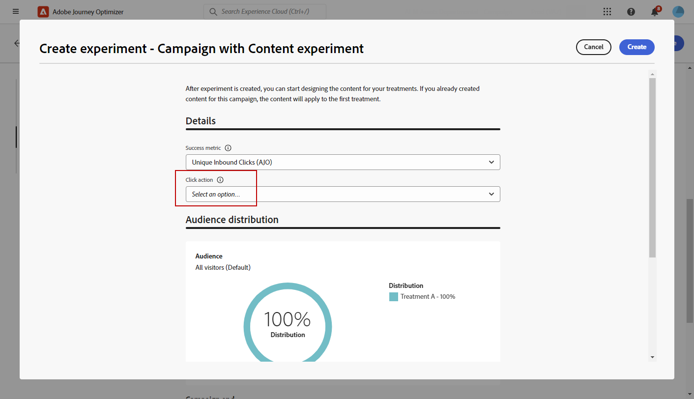

# Een inhoudexperiment maken {#content-experiment}

>[!CONTEXTUALHELP]
>id="ajo_campaigns_content_experiment"
>title="Inhoudsexperiment"
>abstract="U kunt kiezen om de berichtinhoud of het onderwerp te variëren om veelvoudige behandelingen te bepalen en de beste combinatie voor uw publiek te bepalen."

>[!NOTE]
>
>Alvorens met de Experimenteer van de Inhoud te beginnen, zorg ervoor dat uw rapporteringsconfiguratie voor uw douanedatasets wordt geplaatst. Lees meer in [deze sectie](../reports/reporting-configuration.md).

Met het Journey Optimizer Content Experiment kunt u meerdere leveringsbehandelingen definiëren om te meten welke het beste presteert voor uw doelgroep. U kunt de inhoud of het onderwerp van de levering variëren. Het betrokken publiek wordt willekeurig toegewezen aan elke behandeling om te bepalen welke het beste in termen van gespecificeerde metrisch werkt.

In het onderstaande voorbeeld is de leveringsdoelstelling opgesplitst in twee groepen, die elk 45% van de doelpopulatie vertegenwoordigen, en een holdoutgroep van 10%, die de levering niet zal ontvangen.

Elke persoon in het doelpubliek ontvangt één versie van een e-mail, met een onderwerpregel die één van de volgende twee is:

* een rechtstreekse bevordering van een aanbod van 10 % voor de nieuwe collectie en een afbeelding .
* de andere reclame maakt alleen reclame voor een speciale aanbieding zonder dat de 10 % korting zonder afbeelding wordt opgegeven .

Het doel is hier te zien of zullen de ontvangers met e-mail afhankelijk van het ontvangen experiment interactie aangaan. Daarom kiezen we **[!UICONTROL Email Opens]** als primaire doel-metrische waarde in dit Content Experiment.

➡️ Leer hoe te om inhoudexperimenten te gebruiken om besluiten met het op code-gebaseerde ervaringskanaal in [ te vergelijken dit gebruiksgeval ](../experience-decisioning/experience-decisioning-uc.md).

## Uw inhoud maken {#campaign-experiment}

1. Begin door uw [ campagne ](../campaigns/create-campaign.md) of [ reis ](../building-journeys/journeys-message.md) volgens uw vereisten te creëren en te vormen.

1. Start vanuit het venster **[!UICONTROL Edit content]** de aanpassing A.

   Voor deze behandeling zullen wij het speciale aanbod rechtstreeks in de onderwerpregel specificeren en personalisatie toevoegen.

   

1. Maak of importeer de originele inhoud en pas deze indien nodig aan.

## Uw inhoudexperiment configureren {#configure-experiment}

>[!CONTEXTUALHELP]
>id="ajo_campaigns_content_experiment_dimension"
>title="Dimension"
>abstract="Kies de specifieke dimensie die u wilt bijhouden voor uw expert, zoals specifieke kliks of weergaven van specifieke pagina&#39;s."

>[!CONTEXTUALHELP]
>id="ajo_campaigns_content_experiment_success_metric"
>title="Metrisch met succes"
>abstract="Succesvolle maatstaf wordt gebruikt om de best presterende behandeling in een experiment bij te houden en te evalueren. Ben zeker aan opstelling uw dataset voor bepaalde metriek alvorens het te gebruiken."

Bij het experimenteren met de inhoud kunt u kiezen uit drie typen experimenten:

* **[!UICONTROL A/B experiment]**: definieer de verkeersverdeling tussen de behandelingen aan het begin van de test. De prestaties worden beoordeeld op basis van de gekozen primaire maatstaf, de Experimentation Accelerator, rapporteert dan de waargenomen lift tussen de behandelingen.

* **[!UICONTROL Multi-armed bandit]**: verkeer dat tussen behandelingen wordt opgesplitst, wordt automatisch afgehandeld. Om de 7 dagen, worden de prestaties op primaire metrisch beoordeeld, en de gewichten worden dienovereenkomstig aangepast. Uit de rapportage in de Experimentation Accelerator blijkt nog steeds dat Lift aanwezig is, als A/B-tests.

* **[!UICONTROL Bring your own Multi-armed bandit]**: verkeer dat tussen behandelingen wordt opgesplitst, wordt automatisch afgehandeld. U hebt de flexibiliteit om te bepalen wanneer en hoe het zou moeten veranderen door de Experiment APIs te gebruiken om toewijzingen in real time aan te passen.

➡️ [ Leer meer op het verschil tussen A/B en Multi-gewapende bandit experimenten ](mab-vs-ab.md)

>[!BEGINTABS]

>[!TAB  A/B experiment ]

1. Wanneer uw bericht wordt gepersonaliseerd, van het **[!UICONTROL Actions]** lusje, klik **[!UICONTROL Create experiment]** beginnen uw inhoudexperiment te vormen.

   

1. Selecteer de **[!UICONTROL Success metric]** die u voor het experiment wilt instellen.

   In dit voorbeeld selecteert u **[!UICONTROL Email open]** om te testen of profielen hun e-mails openen als de promotiecode zich op de onderwerpregel bevindt.

   

1. Wanneer u een experiment instelt met de In-app of het webkanaal en **[!UICONTROL Inbound Clicks]** , **[!UICONTROL Unique Inbound Clicks]** , **[!UICONTROL Page Views]** of **[!UICONTROL Unique Page Views metrics]** kiest, kunt u in het veld **[!UICONTROL Dimensions]** klikken en weergaven op specifieke pagina&#39;s nauwkeurig bijhouden en controleren.

   

1. Als u een API-getriggerde campagne hebt gemaakt, selecteert u **[!UICONTROL A/B Experiment]** in de vervolgkeuzelijst **[!UICONTROL Experiment type]** .

1. Klik op **[!UICONTROL Add treatment]** om zoveel nieuwe verwerkingen te maken als nodig is.

   

1. Wijzig de **[!UICONTROL Title]** van uw behandeling om deze beter te kunnen onderscheiden.

1. Kies of u een **[!UICONTROL Holdout]** -groep wilt toevoegen aan uw levering. Deze groep zal geen inhoud van deze campagne ontvangen.

   Als u de schakelbalk inschakelt, neemt dit automatisch 10% van uw bevolking in beslag. Indien nodig kunt u dit percentage aanpassen.

   >[!IMPORTANT]
   >
   >Wanneer een holdout-groep wordt gebruikt in een actie voor het experimenteren met inhoud, is de holdout-toewijzing alleen van toepassing op die specifieke actie. Nadat de actie wordt voltooid, zullen de profielen in de holdout groep de weg verdergaan en berichten van andere acties kunnen ontvangen. Daarom zorg ervoor dat om het even welke verdere berichten niet op het ontvangstbewijs van een bericht door een profiel vertrouwen dat in een holdout groep zou kunnen zijn. Als dat het geval is, moet u mogelijk de callout-toewijzing verwijderen.

   

1. Vervolgens kunt u een exact percentage toewijzen aan elke **[!UICONTROL Treatment]** of gewoon de schakelbalk van **[!UICONTROL Distribute evenly]** inschakelen.

   

1. Laat het auto-schaalexperiment toe om de winnende variatie van uw experiment automatisch uit te rollen. [ Leer meer op hoe te om winnaar te schrapen ](#scale-winner)

   

1. Klik op **[!UICONTROL Create]** wanneer de configuratie is ingesteld.

>[!TAB  Meervoudig-gewapende bandit ]

Merk op dat het multi-gewapende bandeexperiment slechts met het volgende beschikbaar is:

* Binnenkomende kanalen
* Eenheid
* API-actiecampagnes (zowel transactioneel als operationeel)
* Uitgaande Kanalen als het programma opnieuw voorkomt

1. Wanneer uw bericht wordt gepersonaliseerd, van het **[!UICONTROL Actions]** lusje, klik **[!UICONTROL Create experiment]** beginnen uw inhoudexperiment te vormen.

   

1. Selecteer de **[!UICONTROL Success metric]** die u voor het experiment wilt instellen.

   In dit voorbeeld selecteert u **[!UICONTROL Email open]** om te testen of profielen hun e-mails openen als de promotiecode zich op de onderwerpregel bevindt.

   

1. Als u een API-getriggerde campagne hebt gemaakt, selecteert u **[!UICONTROL Multi-armed bandit]** in de vervolgkeuzelijst **[!UICONTROL Experiment type]** .

   

1. Klik op **[!UICONTROL Add treatment]** om zoveel nieuwe verwerkingen te maken als nodig is.

   

1. Wijzig de **[!UICONTROL Title]** van uw behandeling om deze beter te kunnen onderscheiden.

1. Kies of u een **[!UICONTROL Holdout]** -groep wilt toevoegen aan uw levering. Deze groep zal geen inhoud van deze campagne ontvangen.

   Als u de schakelbalk inschakelt, neemt dit automatisch 10% van uw bevolking in beslag. Indien nodig kunt u dit percentage aanpassen.

   >[!IMPORTANT]
   >
   >Wanneer een holdout-groep wordt gebruikt in een actie voor het experimenteren met inhoud, is de holdout-toewijzing alleen van toepassing op die specifieke actie. Nadat de actie wordt voltooid, zullen de profielen in de holdout groep de weg verdergaan en berichten van andere acties kunnen ontvangen. Daarom zorg ervoor dat om het even welke verdere berichten niet op het ontvangstbewijs van een bericht door een profiel vertrouwen dat in een holdout groep zou kunnen zijn. Als dat het geval is, moet u mogelijk de callout-toewijzing verwijderen.

   

>[!TAB  breng uw eigen Multi-gewapende bandit ]

Merk op dat Breng uw eigen Multi-gewapende bandeexperiment slechts met het volgende beschikbaar is:

* Binnenkomende kanalen
* Eenheid
* API-actiecampagnes (zowel transactioneel als operationeel)
* Uitgaande Kanalen als het programma opnieuw voorkomt

1. Wanneer uw bericht wordt gepersonaliseerd, van het **[!UICONTROL Actions]** lusje, klik **[!UICONTROL Create experiment]** beginnen uw inhoudexperiment te vormen.

   

1. Selecteer de **[!UICONTROL Success metric]** die u voor het experiment wilt instellen.

   In dit voorbeeld selecteert u **[!UICONTROL Email open]** om te testen of profielen hun e-mails openen als de promotiecode zich op de onderwerpregel bevindt.

   

1. Als u een API-getriggerde campagne hebt gemaakt, selecteert u **[!UICONTROL Bring your own Multi-armed bandit]** in de vervolgkeuzelijst **[!UICONTROL Experiment type]** .

   

1. Klik op **[!UICONTROL Add treatment]** om zoveel nieuwe verwerkingen te maken als nodig is.

   

1. Wijzig de **[!UICONTROL Title]** van uw behandeling om deze beter te kunnen onderscheiden.

1. Kies of u een **[!UICONTROL Holdout]** -groep wilt toevoegen aan uw levering. Deze groep zal geen inhoud van deze campagne ontvangen.

   Als u de schakelbalk inschakelt, neemt dit automatisch 10% van uw bevolking in beslag. Indien nodig kunt u dit percentage aanpassen.

   >[!IMPORTANT]
   >
   >Wanneer een holdout-groep wordt gebruikt in een actie voor het experimenteren met inhoud, is de holdout-toewijzing alleen van toepassing op die specifieke actie. Nadat de actie wordt voltooid, zullen de profielen in de holdout groep de weg verdergaan en berichten van andere acties kunnen ontvangen. Daarom zorg ervoor dat om het even welke verdere berichten niet op het ontvangstbewijs van een bericht door een profiel vertrouwen dat in een holdout groep zou kunnen zijn. Als dat het geval is, moet u mogelijk de callout-toewijzing verwijderen.

   

>[!ENDTABS]

## Uw behandelingen ontwerpen {#treatment-experiment}

1. Selecteer in het venster **[!UICONTROL Edit content]** de gewenste B-methode om de inhoud te wijzigen.

   Hier kiezen we ervoor om de aanbieding niet op te geven in de **[!UICONTROL Subject line]** .

   

1. Klik op **[!UICONTROL Edit email body]** om uw behandeling B verder aan te passen.

   

1. Na het ontwerpen van uw behandelingen klikt u op **[!UICONTROL More actions]** voor toegang tot de opties die betrekking hebben op uw behandelingen: **[!UICONTROL Rename]** , **[!UICONTROL Duplicate]** en **[!UICONTROL Delete]** .

   

1. Ga zo nodig naar het menu **[!UICONTROL Experiment settings]** om de configuratie van de behandelingen te wijzigen.

   

1. Nadat de inhoud van uw bericht is gedefinieerd, klikt u op de knop **[!UICONTROL Simulate content]** om de weergave van uw levering te bepalen en controleert u instellingen voor de personalisatie met testprofielen. [Meer informatie](../content-management/preview-test.md)

Na het vormen van uw experimenteren, kunt u het succes van uw levering met uw rapport volgen. [Meer informatie](../reports/campaign-global-report-cja-experimentation.md)

## De winnaar schalen {#scale-winner}

>[!AVAILABILITY]
>
>De functie Winner schalen wordt momenteel ondersteund voor de volgende kanalen:
>
>* Binnenkomende kanalen (bv. Web, In-app bericht, op code-gebaseerde ervaring) in om het even welke reis of campagne.
>* Uitgaande kanalen (bv. e-mail, pushmelding, SMS) in door API geactiveerde transactiecampagnes.

Schaal de Winner laat u toe om de het winnen variatie van een experiment aan uw volledige publiek automatisch of manueel uit te rollen. Met deze functie kunt u het bereik en de doeltreffendheid van de functie vergroten wanneer een winnaar eenmaal is aangewezen, zonder dat u het experiment voortdurend hoeft te volgen.

U kunt kiezen uit twee modi:

* **auto-schrapen**: Vorm auto-schrapende montages wanneer het creëren van uw experiment door de timing en de voorwaarden voor het schrapen van de het winnen behandeling of een fallback optie te kiezen als geen winnaar verschijnt.

* **Handmatig Schalen**: Herzie manueel experimenteerresultaten en stel de terugwinning van de het winnen behandeling in werking, die volledige controle over timing en besluiten handhaaft.

### Automatisch schalen {#autoscaling}

Met Automatisch schalen kunt u vooraf gedefinieerde regels instellen voor het tijdstip waarop de winnende bewerking of een fallback moet worden uitgevoerd, op basis van de resultaten van het experiment.

Wanneer automatisch schalen is opgetreden, is handmatig schalen niet meer beschikbaar.

Automatisch schalen inschakelen voor experimenten:

1. Stel uw campagne of reis in en configureer uw experiment naar wens. [Meer informatie](#configure-experiment)

1. Schakel de optie voor automatisch schalen in wanneer u het experiment instelt.

   

1. Selecteer wanneer de winnaar moet worden geschaald:

   * Zodra de winnaar is gevonden.
   * Na het experiment wordt live gedurende de geselecteerde tijd uitgevoerd.

   De automatisch schaalbare tijd moet voor de einddatum van het experiment zijn gepland. Als deze voor een tijd na de einddatum wordt ingesteld, verschijnt er een validatiewaarschuwing en wordt de campagne of de reis niet gepubliceerd.

   

1. Kies het terugvalgedrag als er geen winnaar is gevonden op schaaltijd:

   * Ga door met experimenteren tot de geplande einddatum.
   * Schaal de alternatieve behandeling na een bepaalde tijd.

Wanneer aan alle parameters is voldaan, wordt de winnende of alternatieve behandeling naar uw publiek verzonden.

### Handmatige schaling {#manual-scaling}

Met handmatig schalen kunt u de resultaten van het experiment bekijken en bepalen wanneer u de winnende behandeling volgens uw eigen schema wilt uitvoeren.

Als u de winnaar handmatig schaalt vóór de geplande tijd voor automatisch schalen, wordt de automatische schaling geannuleerd.

De winnaar van uw experimenten handmatig schalen:

1. Stel uw campagne of reis in en configureer uw experiment naar wens. [Meer informatie](#configure-experiment)

1. Laat het experiment lopen totdat een winnaar is geïdentificeerd of statistische significantie is bereikt.

1. Open het campagnesashboard of selecteer uw kanaalactiviteit op uw reis.

   Bekijk de resultaten in het menu **[!UICONTROL Content Experiment]** om de best presterende behandeling te identificeren.

   

1. Klik op **[!UICONTROL Scale treatment]** om de winnende bewerking door te voeren naar de rest van uw publiek.

   

1. Selecteer in de keuzelijst de behandeling die u wilt schalen en klik op **[!UICONTROL Scale]** .

   

Let erop dat het schalen van de behandeling maximaal één uur kan duren. U ontvangt een melding als het handmatig schalen is voltooid.

