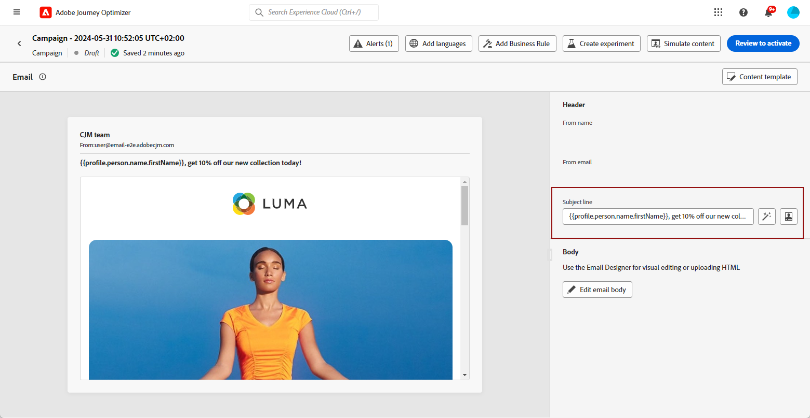
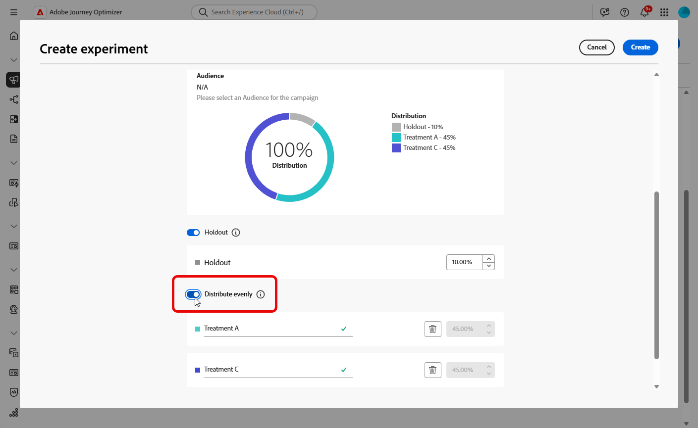

# Een inhoudexperiment maken {#content-experiment}

>[!CONTEXTUALHELP]
>id="ajo_campaigns_content_experiment"
>title="Inhoudsexperiment"
>abstract="U kunt verkiezen om de berichtinhoud, onderwerp, of afzender te variëren om veelvoudige behandelingen te bepalen en de beste combinatie voor uw publiek te bepalen."

>[!NOTE]
>
>Alvorens met de Experimenteer van de Inhoud te beginnen, zorg ervoor dat uw rapporteringsconfiguratie voor uw douanedatasets wordt geplaatst. Lees meer in [deze sectie](reporting-configuration.md).

Met het Journey Optimizer Content Experiment kunt u meerdere leveringsbehandelingen definiëren om te meten welke het beste presteert voor uw doelgroep. U kunt kiezen om de leveringsinhoud, het onderwerp, of de afzender te variëren. Het betrokken publiek wordt willekeurig toegewezen aan elke behandeling om te bepalen welke het beste in termen van gespecificeerde metrisch werkt.

In het onderstaande voorbeeld is de leveringsdoelstelling opgesplitst in twee groepen, die elk 45% van de doelpopulatie vertegenwoordigen, en een holdoutgroep van 10%, die de levering niet zal ontvangen.

Elke persoon in het doelpubliek ontvangt één versie van een e-mail, met een onderwerpregel die één van de volgende twee is:

* een rechtstreekse bevordering van een aanbod van 10 % voor de nieuwe collectie en een afbeelding .
* de andere reclame maakt alleen reclame voor een speciale aanbieding zonder dat de 10 % korting zonder afbeelding wordt opgegeven .

Het doel is hier te zien of zullen de ontvangers met e-mail afhankelijk van het ontvangen experiment interactie aangaan. Daarom zullen wij kiezen **[!UICONTROL Email Opens]** als het primaire doel metrisch in deze Content Experiment.

## Uw inhoud maken {#campaign-experiment}

1. Begin met het maken en configureren van uw e-mail-, sms- of pushmelding [campagne](../campaigns/create-campaign.md) of [reis](../building-journeys/journeys-message.md) volgens uw vereisten.

   >[!AVAILABILITY]
   >
   >Experimentatie op reis is momenteel alleen beschikbaar voor een aantal organisaties (beperkte beschikbaarheid). Neem contact op met uw Adobe als u toegang wilt.

1. Van de **[!UICONTROL Edit content]** begin de behandeling A aan te passen.

   Voor deze behandeling zullen wij het speciale aanbod rechtstreeks in de onderwerpregel specificeren en personalisatie toevoegen.

   

1. Maak of importeer de originele inhoud en pas deze indien nodig aan.

## Uw inhoudexperiment configureren {#configure-experiment}

>[!CONTEXTUALHELP]
>id="ajo_campaigns_content_experiment_dimension"
>title="Dimension"
>abstract="Kies de specifieke dimensie die u wilt bijhouden voor uw expert, zoals specifieke kliks of weergaven van specifieke pagina&#39;s."

>[!CONTEXTUALHELP]
>id="ajo_campaigns_content_experiment_success_metric"
>title="Metrisch met succes"
>abstract="Succesvolle maatstaf wordt gebruikt om de best presterende behandeling in een experiment bij te houden en te evalueren. Ben zeker aan opstelling uw dataset voor bepaalde metriek alvorens het te gebruiken."

1. Wanneer uw bericht wordt gepersonaliseerd, van de pagina van het campagneresamenvatting, klik **[!UICONTROL Create experiment]** om uw inhoudexperiment te configureren.

   

1. Selecteer de **[!UICONTROL Success metric]** u wilt instellen voor uw experiment.

   In dit voorbeeld selecteert u **[!UICONTROL Email open]** om te testen of profielen hun e-mails openen als de promotiecode zich op de onderwerpregel bevindt.

   

1. Wanneer u een experiment instelt met de In-app of het webkanaal en de optie **[!UICONTROL Inbound Clicks]**, **[!UICONTROL Unique Inbound Clicks]** , **[!UICONTROL Page Views]** , of **[!UICONTROL Unique Page Views metrics]** de **[!UICONTROL Click Action]**  kunt u klikken en weergaven op specifieke pagina&#39;s nauwkeurig bijhouden en controleren.

   

1. Klikken **[!UICONTROL Add treatment]** zoveel nieuwe behandelingen te creëren als nodig is.

   

1. Wijzig de **[!UICONTROL Title]** van uw behandeling om ze beter te onderscheiden.

1. Kies of u een **[!UICONTROL Holdout]** groeperen voor levering. Deze groep zal geen inhoud van deze campagne ontvangen.

   Als u de schakelbalk inschakelt, neemt dit automatisch 10% van uw bevolking in beslag. Indien nodig kunt u dit percentage aanpassen.

   >[!IMPORTANT]
   >
   >Wanneer een holdout-groep wordt gebruikt in een actie voor het experimenteren met inhoud, is de holdout-toewijzing alleen van toepassing op die specifieke actie. Nadat de actie wordt voltooid, zullen de profielen in de holdout groep de weg verdergaan en berichten van andere acties kunnen ontvangen. Daarom zorg ervoor dat om het even welke verdere berichten niet op het ontvangstbewijs van een bericht door een profiel vertrouwen dat in een holdout groep zou kunnen zijn. Als dat het geval is, moet u mogelijk de callout-toewijzing verwijderen.

   

1. Vervolgens kunt u een exact percentage toewijzen aan elk **[!UICONTROL Treatment]** of schakelt u gewoon de **[!UICONTROL Distribute evenly]** schakelbalk.

   

1. Klikken **[!UICONTROL Create]** wanneer uw configuratie wordt geplaatst.

## Uw behandelingen ontwerpen {#treatment-experiment}

1. Van de **[!UICONTROL Edit content]** Selecteer uw behandeling B om de inhoud te wijzigen.

   Hier kiezen we ervoor het aanbod niet op te geven in het **[!UICONTROL Subject line]**.

   

1. Klikken **[!UICONTROL Edit email body]** om uw behandeling verder aan te passen B.

   

1. Na het ontwerpen van uw behandelingen klikt u op **[!UICONTROL More actions]** voor toegang tot opties met betrekking tot uw behandelingen: **[!UICONTROL Rename]**, **[!UICONTROL Duplicate]** en **[!UICONTROL Delete]**.

   

1. Indien nodig, toegang tot **[!UICONTROL Experiment settings]** om de configuratie van uw behandelingen te wijzigen.

   

1. Als de inhoud van het bericht is gedefinieerd, klikt u op de knop **[!UICONTROL Simulate content]** om de rendering van uw levering te beheren en personalisatie-instellingen te controleren met testprofielen. [Meer informatie](../content-management/preview-test.md)

Na het vormen van uw experimenteren, kunt u het succes van uw levering met uw rapport volgen. [Meer informatie](../reports/campaign-global-report.md#experimentation-report)
