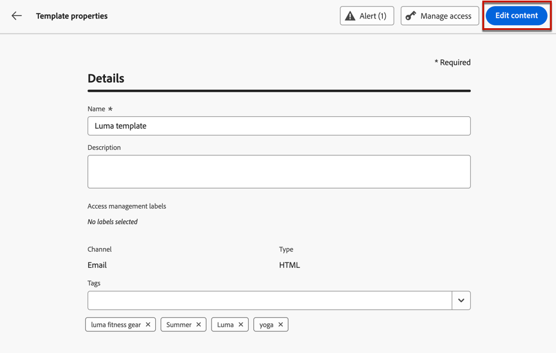

# Werken met inhoudssjablonen {#content-templates}

Voor een versnelde en verbeterde ontwerpprocedure kunt u zelfstandige sjablonen maken om aangepaste inhoud eenvoudig te hergebruiken in [!DNL Journey Optimizer] campagnes en reizen.

Met deze functionaliteit kunnen gebruikers die op inhoud zijn gericht, aan sjablonen werken buiten campagnes of reizen. Marketing-gebruikers kunnen deze zelfstandige inhoudssjablonen vervolgens hergebruiken en aanpassen binnen hun eigen reizen of campagnes.

>[!NOTE]
>
>Momenteel alleen de **email** inhoudssjablonen worden ondersteund.

Een gebruiker in uw bedrijf is bijvoorbeeld alleen verantwoordelijk voor inhoud en heeft daarom geen toegang tot campagnes of reizen. Deze gebruiker kan echter een e-mailsjabloon maken die de marketers van uw organisatie kunnen selecteren voor gebruik in alle e-mails als startpunt.

U kunt inhoudssjablonen ook maken en beheren met API&#39;s. Raadpleeg voor meer informatie de [Journey Optimizer API-documentatie](https://developer.adobe.com/journey-optimizer-apis/references/content/){target="_blank"}.

➡️ [Leer hoe u in deze video sjablonen maakt en gebruikt](#video-templates)

>[!CAUTION]
>
>U moet beschikken over de **[!DNL Manage library items]** bevoegdheid opgenomen in de **[!DNL Content Library Manager]** productprofiel. [Meer informatie](../administration/ootb-product-profiles.md#content-library-manager)

## Sjablonen openen en beheren {#access-manage-templates}

Als u de lijst met inhoudssjablonen wilt openen, selecteert u **[!UICONTROL Content Management]** > **[!UICONTROL Content Templates]** in het linkermenu.

Alle sjablonen die op de huidige sandbox zijn gemaakt - van een reis of een campagne met de [Opslaan als sjabloon](#save-as-template) van de **[!UICONTROL Content Templates]** menu - worden weergegeven.

U kunt inhoudssjablonen sorteren op aanmaak- of wijzigingsdatum. U kunt er ook voor kiezen om alleen de items weer te geven die u hebt gemaakt of gewijzigd.

Als u sjablooninhoud wilt bewerken, klikt u op het gewenste item in de lijst en selecteert u **[!UICONTROL Edit content]**.

Als u een sjabloon wilt verwijderen, selecteert u het prullenbakpictogram naast de gewenste sjabloon.

>[!NOTE]
>
>Wanneer een sjabloon wordt bewerkt of verwijderd, hebben campagnes of reizen, inclusief e-mails die met deze sjabloon zijn gemaakt, geen invloed op deze sjabloon.

## Inhoudssjablonen maken {#create-content-templates}

>[!CONTEXTUALHELP]
>id="ajo_create_template"
>title="Uw eigen inhoudssjabloon definiëren"
>abstract="Maak een volledig zelfstandig aangepaste sjabloon, zodat uw inhoud tijdens meerdere reizen en campagnes opnieuw kan worden gebruikt."

U kunt inhoudssjablonen op twee manieren maken:

* Een geheel nieuw inhoudssjabloon maken met de linkerrails **[!UICONTROL Content Templates]** -menu. [Meer informatie](#create-template-from-scratch)

* Sla uw e-mailinhoud op als sjabloon wanneer u een e-mail ontwerpt in een campagne of een reis. [Meer informatie](#save-as-template)

Nadat u de inhoudssjabloon hebt opgeslagen, kunt u deze gebruiken voor een campagne of een reis. Of deze sjabloon nu op basis van een blanco formulier of op basis van een vorige e-mail is gemaakt, u kunt deze sjabloon nu gebruiken bij het samenstellen van [email](../email/get-started-email-design.md) binnen [!DNL Journey Optimizer]. [Meer informatie](../email/use-email-templates.md)

>[!NOTE]
>
>* Wijzigingen in inhoudssjablonen worden niet doorgegeven aan campagnes of reizen, of het nu live of conceptueel gaat.
>
>* Op dezelfde manier wanneer sjablonen worden gebruikt in een campagne of een reis, hebben alle bewerkingen die u aanbrengt in uw campagne en inhoud van de reis geen invloed op de eerder gebruikte inhoudssjabloon.

### Een geheel nieuwe sjabloon maken {#create-template-from-scratch}

Voer de onderstaande stappen uit om een volledig nieuwe inhoudssjabloon te maken.

1. Open de lijst met inhoudssjablonen via **[!UICONTROL Content Management]** > **[!UICONTROL Content Templates]** links.

1. Selecteer **[!UICONTROL Create template]**.

1. Vul de sjabloondetails in.

   

   >[!NOTE]
   >
   >Momenteel alleen de **E-mail** kanaal en **HTML** type worden ondersteund.

1. Als u aangepaste of basislabels voor gegevensgebruik aan de sjabloon wilt toewijzen, selecteert u **[!UICONTROL Manage access]**. [Leer meer op de Controle van de Toegang van het Niveau van Objecten (OLAC)](../administration/object-based-access.md).

1. Adobe Experience Platform-tags selecteren of maken vanuit het menu **[!UICONTROL Tags]** veld om de sjabloon te categoriseren voor een betere zoekopdracht. [Meer informatie](../start/search-filter-categorize.md#tags)

1. Klikken **[!UICONTROL Create]** en kies uit de verschillende opties hoe u de sjabloon wilt ontwerpen:

   * [Ontwerp uw e-mail helemaal zelf](../email/content-from-scratch.md) via de interface van E-mailontwerper.

   * [Code of copy-paste onbewerkte HTML](../email/code-content.md) rechtstreeks in de e-mailontwerper.

   * [Bestaande HTML-inhoud importeren](../email/existing-content.md) uit een bestand of een ZIP-map.

   * Bestaande inhoud uit een lijst met ingebouwde of aangepaste sjablonen gebruiken. De stappen voor het gebruik van een inhoudssjabloon in een e-mail worden beschreven in [deze sectie](../email/use-email-templates.md).

   

1. De [E-mailDesigner](../email/get-started-email-design.md) worden weergegeven. Bewerk uw inhoud naar wens, net zoals u dat zou doen voor elke e-mail binnen een reis of campagne, afhankelijk van de optie die u hebt geselecteerd.

   U kunt de inhoud desgewenst testen. [Meer informatie](#test-template)

1. Als de sjabloon klaar is, klikt u op **[!UICONTROL Save]**.

1. Klik zo nodig op de pijl naast de sjabloonnaam om terug te gaan naar de **[!UICONTROL Details]** het scherm en geeft uw malplaatje uit.

   

Deze sjabloon kan nu worden gebruikt wanneer u e-mailberichten maakt binnen [!DNL Journey Optimizer]. [Meer informatie](../email/use-email-templates.md)

### Opslaan als sjabloon {#save-as-template}

>[!CONTEXTUALHELP]
>id="ajo_messages_depecrated_inventory"
>title="Leer hoe u berichten kunt migreren"
>abstract="Op 25 juli 2022 is het menu Berichten verdwenen en worden berichten nu rechtstreeks vanuit een reis geschreven. Als u oude berichten tijdens reizen opnieuw wilt gebruiken, moet u ze opslaan als sjablonen."

Wanneer u een [email](../email/get-started-email-design.md) in een campagne of een reis, kunt u uw e-mailinhoud voor toekomstig hergebruik bewaren. Volg de onderstaande stappen om dit te doen.

1. Klik in de E-mailontwerper op de ellips rechtsboven in het scherm.

1. Selecteren **[!UICONTROL Save as content template]** in het keuzemenu.

   

1. Voeg een naam en beschrijving toe voor deze sjabloon.

   

1. Als u aangepaste of basislabels voor gegevensgebruik aan de sjabloon wilt toewijzen, selecteert u **[!UICONTROL Manage access]**. [Meer informatie](../administration/object-based-access.md).

1. Selecteer of maak een Adobe Experience Platform-tag in het menu **Tags** veld om uw sjabloon te categoriseren. [Meer informatie](../start/search-filter-categorize.md#tags)

1. Klik op **[!UICONTROL Save]**.

1. De sjabloon wordt opgeslagen in de **[!UICONTROL Content Templates]** lijst, toegankelijk via de [!DNL Journey Optimizer] speciaal menu. Het wordt een standalone inhoudsmalplaatje dat kan worden betreden, worden uitgegeven en worden geschrapt zoals om het even welk ander punt op die lijst. [Meer informatie](#access-manage-templates)

U kunt deze sjabloon nu gebruiken wanneer u een [email](../email/get-started-email-design.md) binnen [!DNL Journey Optimizer]. [Meer informatie](../email/use-email-templates.md)

>[!NOTE]
>
>Om het even welke verandering in dat nieuwe malplaatje wordt niet verspreid aan e-mail het uit komt. Op dezelfde manier wordt de nieuwe sjabloon niet gewijzigd wanneer de oorspronkelijke inhoud in die e-mail wordt bewerkt.

## De inhoudssjabloon testen {#test-template}

U kunt de rendering van elke sjabloon voor e-mailinhoud testen, ongeacht of deze geheel nieuw of via een e-mail is gemaakt. Hiervoor voert u de volgende stappen uit.

1. Open de lijst met inhoudssjablonen via **[!UICONTROL Content Management]** > **[!UICONTROL Content Templates]** en selecteert u een sjabloon.

1. Klikken **[!UICONTROL Edit content]** van de **[!UICONTROL Template properties]**.

1. Klikken **[!UICONTROL Simulate Content]** en selecteer een testprofiel om de weergave van uw e-mail te controleren. U kunt kiezen voor de weergave Computer of Mobiel. [Meer informatie](../content-management/preview-test.md)

   

1. U kunt een bewijs verzenden om uw inhoud te testen en het door sommige interne gebruikers te laten goedkeuren alvorens het in een reis of een campagne te gebruiken.

   * Klik hiertoe op de knop **[!UICONTROL Send proof]** en voert u de in [deze sectie](../content-management/proofs.md).

   * Voordat u de proefdruk verzendt, moet u de optie [e-mailoppervlak](../configuration/channel-surfaces.md) die wordt gebruikt om uw inhoud te testen.

     

>[!CAUTION]
>
>Het bijhouden van wijzigingen wordt momenteel niet ondersteund bij het testen van sjablonen voor e-mailinhoud. Dit houdt in dat volggebeurtenissen, UTM-parameters en landingspagina-koppelingen niet effectief zijn in de proefdrukken die vanuit een sjabloon worden verzonden. Om het volgen te testen, [de inhoudssjabloon gebruiken](../email/use-email-templates.md) in een e-mail en [een bewijs verzenden](../content-management/preview-test.md#send-proofs).

## Hoe kan ik-video {#video-templates}

Leer hoe u inhoudssjablonen kunt maken, bewerken en gebruiken in [!DNL Journey Optimizer].

>[!VIDEO](https://video.tv.adobe.com/v/3413743/?quality=12)
