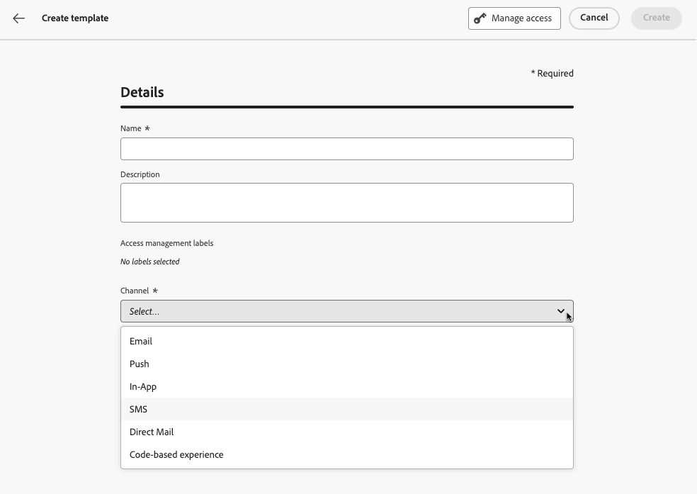
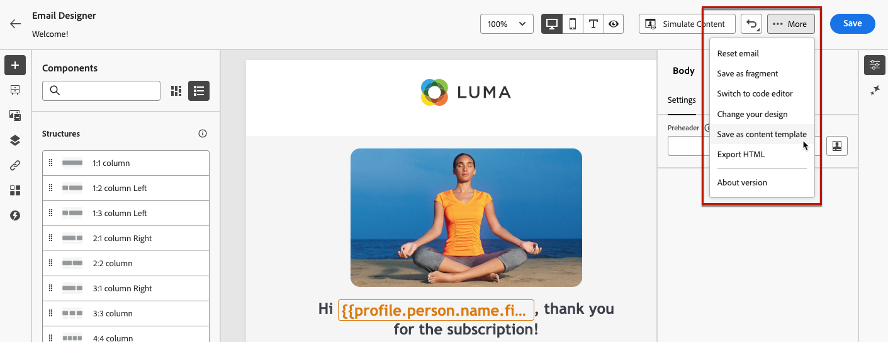

# Werken met inhoudssjablonen {#content-templates}

Voor een versnelde en verbeterde ontwerpprocedure kunt u zelfstandige sjablonen maken om aangepaste inhoud eenvoudig te hergebruiken in [!DNL Journey Optimizer] campagnes en reizen.

Met deze functionaliteit kunnen gebruikers die op inhoud zijn gericht, aan sjablonen werken buiten campagnes of reizen. Marketing-gebruikers kunnen deze zelfstandige inhoudssjablonen vervolgens hergebruiken en aanpassen binnen hun eigen reizen of campagnes.

<!---->

>[!NOTE]
>
>Momenteel zijn inhoudssjablonen niet beschikbaar voor het webkanaal.

Een gebruiker in uw bedrijf is bijvoorbeeld alleen verantwoordelijk voor inhoud en heeft daarom geen toegang tot campagnes of reizen. Deze gebruiker kan echter een e-mailsjabloon maken die de marketers van uw organisatie kunnen selecteren voor gebruik in alle e-mails als startpunt.

U kunt inhoudssjablonen ook maken en beheren met API&#39;s. Raadpleeg voor meer informatie de [Journey Optimizer API-documentatie](https://developer.adobe.com/journey-optimizer-apis/references/content/){target="_blank"}.

➡️ [Leer hoe u in deze video sjablonen maakt en gebruikt](#video-templates)

>[!CAUTION]
>
>U moet beschikken over de **[!DNL Manage library items]** bevoegdheid opgenomen in de **[!DNL Content Library Manager]** productprofiel. [Meer informatie](../administration/ootb-product-profiles.md#content-library-manager)

## Sjablonen openen en beheren {#access-manage-templates}

Als u de lijst met inhoudssjablonen wilt openen, selecteert u **[!UICONTROL Content Management]** > **[!UICONTROL Content Templates]** in het linkermenu.

Alle sjablonen die op de huidige sandbox zijn gemaakt - van een reis of een campagne met de **[!UICONTROL Save as template]** van de **[!UICONTROL Content Templates]** menu - worden weergegeven. [Leer hoe u sjablonen maakt](#create-content-templates)

U kunt inhoudssjablonen sorteren op:
* Type
* Kanaal
* Aanmaakdatum of wijzigingsdatum
* Tags - [Meer informatie over tags](../start/search-filter-categorize.md#tags)

U kunt er ook voor kiezen om alleen de zelf gemaakte of gewijzigde items weer te geven.

* Als u sjablooninhoud wilt bewerken, klikt u op het gewenste item in de lijst en selecteert u **[!UICONTROL Edit content]**.

  

* Als u een sjabloon wilt verwijderen, selecteert u de **[!UICONTROL More actions]** naast de gewenste sjabloon en selecteer **[!UICONTROL Delete]**.

  

>[!NOTE]
>
>Wanneer een sjabloon wordt bewerkt of verwijderd, hebben campagnes of reizen met inbegrip van inhoud die met deze sjabloon is gemaakt, geen invloed op deze sjabloon.

### Sjablonen weergeven als miniaturen {#template-thumbnails}

Selecteer de **[!UICONTROL Grid view]** om elke sjabloon als een miniatuur weer te geven.

>[!AVAILABILITY]
>
>Dit vermogen wordt vrijgegeven in Beperkte Beschikbaarheid (LA) voor een kleine reeks klanten.

>[!NOTE]
>
>Er kunnen momenteel alleen juiste miniaturen worden gegenereerd voor sjablonen voor e-mailinhoud van het type HTML.

Wanneer u inhoud bijwerkt, moet u mogelijk een paar seconden wachten voordat de wijzigingen in de miniatuur worden doorgevoerd.

## Inhoudssjablonen maken {#create-content-templates}

>[!CONTEXTUALHELP]
>id="ajo_create_template"
>title="Uw eigen inhoudssjabloon definiëren"
>abstract="Maak een volledig zelfstandig aangepaste sjabloon, zodat uw inhoud tijdens meerdere reizen en campagnes opnieuw kan worden gebruikt."

U kunt inhoudssjablonen op twee manieren maken:

* Een geheel nieuw inhoudssjabloon maken met de linkerrails **[!UICONTROL Content Templates]** -menu. [Meer informatie](#create-template-from-scratch)

* Wanneer u inhoud ontwerpt binnen een campagne of een reis, slaat u deze op als een sjabloon. [Meer informatie](#save-as-template)

Nadat u de inhoudssjabloon hebt opgeslagen, kunt u deze gebruiken voor een campagne of een reis. Of deze sjabloon nu op basis van een blanco sjabloon of op basis van een vorige inhoud is gemaakt, u kunt deze sjabloon nu gebruiken bij het samenstellen van inhoud binnen [!DNL Journey Optimizer]. [Meer informatie](#use-content-templates)

>[!NOTE]
>
>* Wijzigingen in inhoudssjablonen worden niet doorgegeven aan campagnes of reizen, of het nu live of conceptueel gaat.
>
>* Op dezelfde manier wanneer sjablonen worden gebruikt in een campagne of een reis, hebben alle bewerkingen die u aanbrengt in uw campagne en inhoud van de reis geen invloed op de eerder gebruikte inhoudssjabloon.

### Een geheel nieuwe sjabloon maken {#create-template-from-scratch}

Voer de onderstaande stappen uit om een volledig nieuwe inhoudssjabloon te maken.

1. Open de lijst met inhoudssjablonen via **[!UICONTROL Content Management]** > **[!UICONTROL Content Templates]** links.

1. Selecteer **[!UICONTROL Create template]**.

1. Vul de sjabloondetails in en selecteer het gewenste kanaal.

   

   >[!NOTE]
   >
   >Momenteel zijn alle kanalen beschikbaar behalve Web.

1. Kies een **[!UICONTROL Type]** voor het geselecteerde kanaal.

   

   * Voor **[!UICONTROL Email]**, als u **[!UICONTROL Content]** kunt u de [Onderwerpregel](../email/create-email.md#define-email-content) als onderdeel van uw sjabloon. Als u **[!UICONTROL HTML]**, kunt u alleen de inhoud van de hoofdtekst van de e-mail definiëren.

   * Voor **[!UICONTROL SMS]**, **[!UICONTROL Push]**, **[!UICONTROL In-App]** en **[!UICONTROL Direct Mail]**, is alleen het standaardtype beschikbaar voor het huidige kanaal. U moet het nog selecteren.

1. Adobe Experience Platform-tags selecteren of maken vanuit het menu **[!UICONTROL Tags]** veld om de sjabloon te categoriseren voor een betere zoekopdracht. [Meer informatie](../start/search-filter-categorize.md#tags)

1. Als u aangepaste of basislabels voor gegevensgebruik aan de sjabloon wilt toewijzen, kunt u **[!UICONTROL Manage access]**. [Leer meer op de Controle van de Toegang van het Niveau van Objecten (OLAC)](../administration/object-based-access.md).

1. Klikken **[!UICONTROL Create]** en ontwerp uw inhoud zo nodig op dezelfde manier als voor inhoud binnen een reis of campagne - afhankelijk van het kanaal dat u hebt geselecteerd.

   

   Leer hoe u inhoud maakt voor de verschillende kanalen in de volgende secties:
   * [E-mailinhoud definiëren](../email/get-started-email-design.md)
   * [Pushinhoud definiëren](../push/design-push.md)
   * [SMS-inhoud definiëren](../sms/create-sms.md#sms-content)
   * [Inhoud direct mail definiëren](../direct-mail/create-direct-mail.md)
   * [In-app-inhoud definiëren](../in-app/design-in-app.md)

1. Als u een **[!UICONTROL Email]** sjabloon met de **[!UICONTROL HTML]** typt, kunt u de inhoud testen. [Meer informatie](#test-template)

1. Als de sjabloon klaar is, klikt u op **[!UICONTROL Save]**.

1. Klik op de pijl naast de sjabloonnaam om terug te gaan naar de map **[!UICONTROL Details]** scherm.

   

Deze sjabloon kan nu worden gebruikt wanneer u inhoud maakt binnen [!DNL Journey Optimizer]. [Meer informatie](#use-content-templates)

### Opslaan als sjabloon {#save-as-template}

>[!CONTEXTUALHELP]
>id="ajo_messages_depecrated_inventory"
>title="Leer hoe u berichten kunt migreren"
>abstract="Op 25 juli 2022 is het menu Berichten verdwenen en worden berichten nu rechtstreeks vanuit een reis geschreven. Als u oude berichten tijdens reizen opnieuw wilt gebruiken, moet u ze opslaan als sjablonen."

Wanneer u inhoud ontwerpt in een campagne of een reis, kunt u deze opslaan voor toekomstig hergebruik. Volg de onderstaande stappen om dit te doen.

1. Van het bericht **[!UICONTROL Edit content]** scherm, klik **[!UICONTROL Content template]** knop.

1. Selecteren **[!UICONTROL Save as content template]** in het keuzemenu.

   

   Als u zich in de [E-mailDesigner](../email/get-started-email-design.md)kunt u deze optie ook selecteren in het menu **[!UICONTROL More]** vervolgkeuzelijst rechtsboven in het scherm.

   

1. Voeg een naam en beschrijving toe voor deze sjabloon.

   

   >[!NOTE]
   >
   >Het huidige kanaal en type worden automatisch ingevuld en kunnen niet worden bewerkt. Voor e-mailsjablonen die zijn gemaakt met de [E-mailDesigner](../email/get-started-email-design.md)de **[!UICONTROL HTML]** tekst wordt automatisch geselecteerd.

1. Selecteer of maak een Adobe Experience Platform-tag in het menu **Tags** veld om uw sjabloon te categoriseren. [Meer informatie](../start/search-filter-categorize.md#tags)

1. Als u aangepaste of basislabels voor gegevensgebruik aan de sjabloon wilt toewijzen, kunt u **[!UICONTROL Manage access]**. [Meer informatie](../administration/object-based-access.md).

1. Klik op **[!UICONTROL Save]**.

1. De sjabloon wordt opgeslagen in de **[!UICONTROL Content Templates]** lijst, toegankelijk via de [!DNL Journey Optimizer] speciaal menu. Het wordt een standalone inhoudsmalplaatje dat kan worden betreden, worden uitgegeven en worden geschrapt zoals om het even welk ander punt op die lijst. [Meer informatie](#access-manage-templates)

U kunt deze sjabloon nu gebruiken wanneer u inhoud maakt binnen [!DNL Journey Optimizer]. [Meer informatie](#use-content-templates)

>[!NOTE]
>
>Om het even welke verandering in dat nieuwe malplaatje wordt niet verspreid aan de inhoud het uit komt. Op dezelfde manier wordt de nieuwe sjabloon niet gewijzigd wanneer de oorspronkelijke inhoud wordt bewerkt binnen die inhoud.

## Sjablonen voor e-mailinhoud testen {#test-template}

U kunt de rendering van sommige van uw e-mailsjablonen testen, ongeacht of deze zijn gemaakt op basis van een blanco sjabloon of op basis van een bestaande inhoud. Volg de onderstaande stappen om dit te doen.

1. Open de lijst met inhoudssjablonen via **[!UICONTROL Content Management]** > **[!UICONTROL Content Templates]** en selecteer een e-mailsjabloon.

1. Klikken **[!UICONTROL Edit content]** van de **[!UICONTROL Template properties]**.

1. Klikken **[!UICONTROL Simulate Content]** en selecteer een testprofiel om de rendering te controleren. [Meer informatie](../content-management/preview-test.md)

   

1. U kunt een bewijs verzenden om uw inhoud te testen en het door sommige interne gebruikers te laten goedkeuren alvorens het in een reis of een campagne te gebruiken.

   * Klik hiertoe op de knop **[!UICONTROL Send proof]** en voert u de in [deze sectie](../content-management/proofs.md).

   * Voordat u de proefdruk verzendt, moet u de optie [e-mailoppervlak](../configuration/channel-surfaces.md) die wordt gebruikt om uw inhoud te testen.

     

>[!CAUTION]
>
>Het bijhouden van wijzigingen wordt momenteel niet ondersteund bij het testen van sjablonen voor e-mailinhoud. Dit houdt in dat volggebeurtenissen, UTM-parameters en landingspagina-koppelingen niet effectief zijn in de proefdrukken die vanuit een sjabloon worden verzonden. Om het volgen te testen, [de inhoudssjabloon gebruiken](../email/use-email-templates.md) in een e-mail en [een bewijs verzenden](../content-management/preview-test.md#send-proofs).

## Inhoudssjablonen gebruiken {#use-content-templates}

Bij het maken van inhoud voor een kanaal (behalve Web) in [!DNL Journey Optimizer]kunt u een aangepaste sjabloon gebruiken die u:

* Geheel nieuw gemaakt met de **[!UICONTROL Content templates]** -menu. [Meer informatie](#create-template-from-scratch)

* Opgeslagen op basis van bestaande inhoud in een reis of een campagne met behulp van de **[!UICONTROL Save as content template]** -optie. [Meer informatie](#save-as-template)

Voer de onderstaande stappen uit om uw inhoud met een van deze sjablonen te gaan samenstellen.

1. Of het nu gaat om een campagne of reis, na selectie **[!UICONTROL Edit content]** klikt u op de knop **[!UICONTROL Content template]** knop.

1. Selecteer **[!UICONTROL Apply content template]**.

   

1. Selecteer de gewenste sjabloon in de lijst. Alleen sjablonen die compatibel zijn met het geselecteerde kanaal en/of type worden weergegeven.

   

   >[!NOTE]
   >
   >Vanuit dit scherm kunt u ook een nieuwe sjabloon maken met de toegewezen knop, waarmee een nieuw tabblad wordt geopend.

1. Klik op **[!UICONTROL Confirm]**. De sjabloon wordt toegepast op uw inhoud.

1. Ga door met het bewerken van de inhoud.

>[!NOTE]
>
>Als u een e-mailbericht wilt ontwerpen vanaf een inhoudssjabloon, gebruikt u de opdracht [E-mailDesigner](../email/get-started-email-design.md)volgt u de stappen die worden beschreven in [deze sectie](../email/use-email-templates.md).

## Hoe kan ik-video {#video-templates}

Leer hoe u inhoudssjablonen kunt maken, bewerken en gebruiken in [!DNL Journey Optimizer].

>[!VIDEO](https://video.tv.adobe.com/v/3413743/?quality=12)
