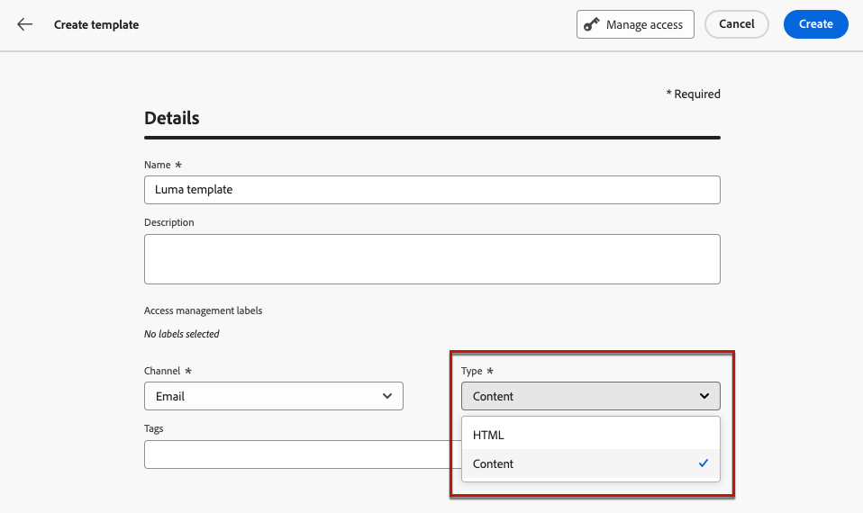

# Inhoudssjablonen maken {#create-content-templates}

>[!CONTEXTUALHELP]
>id="ajo_create_template"
>title="Uw eigen inhoudssjabloon definiëren"
>abstract="Maak een volledig zelfstandig aangepaste sjabloon, zodat uw inhoud tijdens meerdere reizen en campagnes opnieuw kan worden gebruikt."

U kunt inhoudssjablonen op twee manieren maken:

* Een geheel nieuw inhoudssjabloon maken met de linkerrails **[!UICONTROL Content Templates]** -menu. [Meer informatie](#create-template-from-scratch)

* Wanneer u inhoud ontwerpt binnen een campagne of een reis, slaat u deze op als een sjabloon. [Meer informatie](#save-as-template)

Nadat u de inhoudssjabloon hebt opgeslagen, kunt u deze gebruiken voor een campagne of een reis. Of deze sjabloon nu op basis van een blanco sjabloon of op basis van een vorige inhoud is gemaakt, u kunt deze sjabloon nu gebruiken bij het samenstellen van inhoud binnen [!DNL Journey Optimizer]. [Meer informatie](#use-content-templates)

>[!NOTE]
>
>* Wijzigingen in inhoudssjablonen worden niet doorgegeven aan campagnes of reizen, of het nu live of conceptueel gaat.
>
>* Op dezelfde manier wanneer sjablonen worden gebruikt in een campagne of een reis, hebben alle bewerkingen die u aanbrengt in uw campagne en inhoud van de reis geen invloed op de eerder gebruikte inhoudssjabloon.

## Een geheel nieuwe sjabloon maken {#create-template-from-scratch}

Voer de onderstaande stappen uit om een volledig nieuwe inhoudssjabloon te maken.

1. Open de lijst met inhoudssjablonen via **[!UICONTROL Content Management]** > **[!UICONTROL Content Templates]** links.

1. Selecteer **[!UICONTROL Create template]**.

1. Vul de sjabloondetails in en selecteer het gewenste kanaal.

   

   >[!NOTE]
   >
   >Momenteel zijn alle kanalen beschikbaar behalve Web.

1. Kies een **[!UICONTROL Type]** voor het geselecteerde kanaal.

   

   * Voor **[!UICONTROL Email]**, als u **[!UICONTROL Content]** kunt u de [Onderwerpregel](../email/create-email.md#define-email-content) als onderdeel van uw sjabloon. Als u **[!UICONTROL HTML]**, kunt u alleen de inhoud van de hoofdtekst van de e-mail definiëren.

   * Voor **[!UICONTROL SMS]**, **[!UICONTROL Push]**, **[!UICONTROL In-App]** en **[!UICONTROL Direct Mail]**, is alleen het standaardtype beschikbaar voor het huidige kanaal. U moet het nog selecteren.

1. Adobe Experience Platform-tags selecteren of maken vanuit het menu **[!UICONTROL Tags]** veld om de sjabloon te categoriseren voor een betere zoekopdracht. [Meer informatie](../start/search-filter-categorize.md#tags)

1. Als u aangepaste of basislabels voor gegevensgebruik aan de sjabloon wilt toewijzen, kunt u **[!UICONTROL Manage access]**. [Leer meer op de Controle van de Toegang van het Niveau van Objecten (OLAC)](../administration/object-based-access.md).

1. Klikken **[!UICONTROL Create]** en ontwerp uw inhoud zo nodig op dezelfde manier als voor inhoud binnen een reis of campagne - afhankelijk van het kanaal dat u hebt geselecteerd.

   

   Leer hoe u inhoud maakt voor de verschillende kanalen in de volgende secties:
   * [E-mailinhoud definiëren](../email/get-started-email-design.md)
   * [Pushinhoud definiëren](../push/design-push.md)
   * [SMS-inhoud definiëren](../sms/create-sms.md#sms-content)
   * [Inhoud direct mail definiëren](../direct-mail/create-direct-mail.md)
   * [In-app-inhoud definiëren](../in-app/design-in-app.md)

1. Als u een **[!UICONTROL Email]** sjabloon met de **[!UICONTROL HTML]** typt, kunt u de inhoud testen. [Meer informatie](#test-template)

1. Als de sjabloon klaar is, klikt u op **[!UICONTROL Save]**.

1. Klik op de pijl naast de sjabloonnaam om terug te gaan naar de map **[!UICONTROL Details]** scherm.

   

Deze sjabloon kan nu worden gebruikt wanneer u inhoud maakt binnen [!DNL Journey Optimizer]. [Meer informatie](#use-content-templates)

## Inhoud opslaan als inhoudssjabloon {#save-as-template}

>[!CONTEXTUALHELP]
>id="ajo_messages_depecrated_inventory"
>title="Leer hoe u berichten kunt migreren"
>abstract="Op 25 juli 2022 is het menu Berichten verdwenen en worden berichten nu rechtstreeks vanuit een reis geschreven. Als u oude berichten tijdens reizen opnieuw wilt gebruiken, moet u ze opslaan als sjablonen."

Wanneer u inhoud ontwerpt in een campagne of een reis, kunt u deze opslaan voor toekomstig hergebruik. Volg de onderstaande stappen om dit te doen.

1. Van het bericht **[!UICONTROL Edit content]** scherm, klik **[!UICONTROL Content template]** knop.

1. Selecteren **[!UICONTROL Save as content template]** in het keuzemenu.

   

   Als u zich in de [Designer e-mailen](../email/get-started-email-design.md)kunt u deze optie ook selecteren in het menu **[!UICONTROL More]** vervolgkeuzelijst rechtsboven in het scherm.

   

1. Voeg een naam en beschrijving toe voor deze sjabloon.

   

   >[!NOTE]
   >
   >Het huidige kanaal en type worden automatisch ingevuld en kunnen niet worden bewerkt. Voor e-mailsjablonen die zijn gemaakt met de [Designer e-mailen](../email/get-started-email-design.md)de **[!UICONTROL HTML]** tekst wordt automatisch geselecteerd.

1. Selecteer of maak een Adobe Experience Platform-tag in het menu **Tags** veld om uw sjabloon te categoriseren. [Meer informatie](../start/search-filter-categorize.md#tags)

1. Als u aangepaste of basislabels voor gegevensgebruik aan de sjabloon wilt toewijzen, kunt u **[!UICONTROL Manage access]**. [Meer informatie](../administration/object-based-access.md).

1. Klik op **[!UICONTROL Save]**.

1. De sjabloon wordt opgeslagen in de **[!UICONTROL Content Templates]** lijst, toegankelijk via de [!DNL Journey Optimizer] speciaal menu. Het wordt een standalone inhoudsmalplaatje dat kan worden betreden, worden uitgegeven en worden geschrapt zoals om het even welk ander punt op die lijst. [Meer informatie](#access-manage-templates)

U kunt deze sjabloon nu gebruiken wanneer u inhoud maakt binnen [!DNL Journey Optimizer]. [Meer informatie](#use-content-templates)

>[!NOTE]
>
>Om het even welke verandering in dat nieuwe malplaatje wordt niet verspreid aan de inhoud het uit komt. Op dezelfde manier wordt de nieuwe sjabloon niet gewijzigd wanneer de oorspronkelijke inhoud wordt bewerkt binnen die inhoud.
