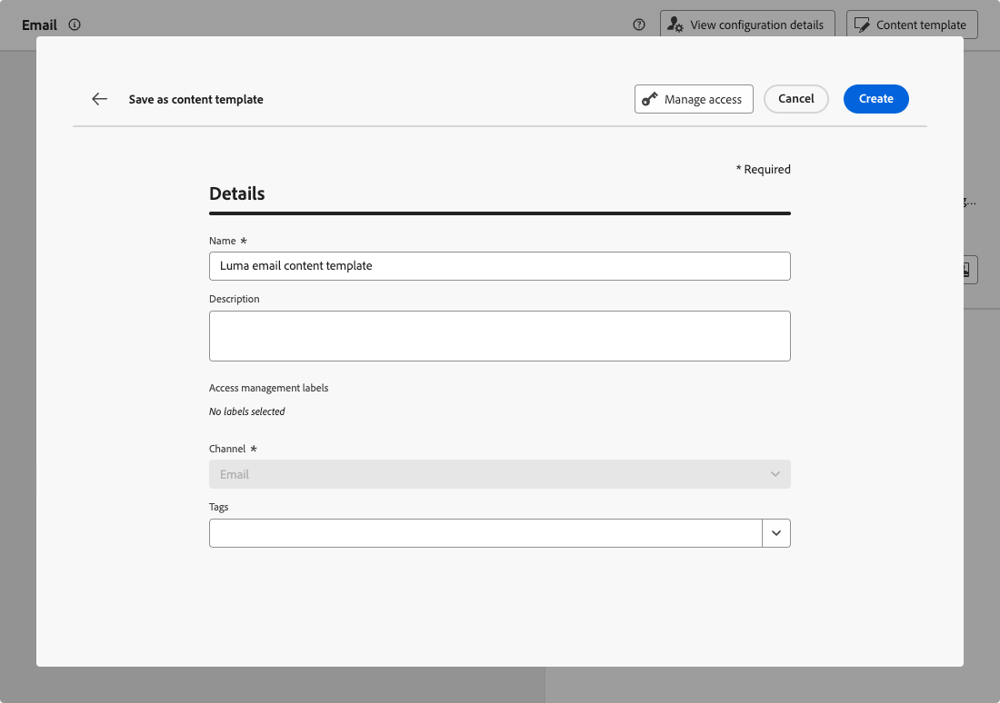

# Inhoudssjablonen maken {#create-content-templates}

>[!CONTEXTUALHELP]
>id="ajo_create_template"
>title="Uw eigen inhoudssjabloon definiëren"
>abstract="Maak een volledig zelfstandig aangepaste sjabloon, zodat uw inhoud tijdens meerdere reizen en campagnes opnieuw kan worden gebruikt."

U kunt inhoudssjablonen op twee manieren maken:

* Maak een geheel nieuw inhoudssjabloon met behulp van het menu met de linkerrails **[!UICONTROL Content templates]** . [ leer hoe ](#create-template-from-scratch)

* Wanneer u inhoud ontwerpt binnen een campagne of een reis, slaat u deze op als een sjabloon. [ leer hoe ](#save-as-template)

Nadat u de inhoudssjabloon hebt opgeslagen, kunt u deze gebruiken voor een campagne of een reis. Of het nu om nieuwe inhoud of om inhoud uit vorige inhoud gaat, u kunt deze sjabloon nu gebruiken wanneer u inhoud maakt binnen [!DNL Journey Optimizer] . [ leer hoe ](#use-content-templates)

>[!NOTE]
>
>* Wijzigingen in inhoudssjablonen worden niet doorgegeven aan campagnes of reizen, of het nu live of conceptueel gaat.
>
>* Op dezelfde manier wanneer sjablonen worden gebruikt in een campagne of een reis, hebben alle bewerkingen die u aanbrengt in uw campagne en inhoud van de reis geen invloed op de eerder gebruikte inhoudssjabloon.

## Een geheel nieuwe sjabloon maken {#create-template-from-scratch}

>[!NOTE]
>
>Vanaf maart 2025 zijn de sjablonen voor HTML-inhoud nu vervangen. U kunt nog steeds bestaande HTML-inhoudssjablonen gebruiken die eerder in [!DNL Journey Optimizer] zijn gemaakt.

Voer de onderstaande stappen uit om een volledig nieuwe inhoudssjabloon te maken.

1. Open de lijst met inhoudssjablonen via **[!UICONTROL Content Management]** > **[!UICONTROL Content Templates]** links menu.

1. Selecteer **[!UICONTROL Create template]**.

1. Vul de sjabloondetails in en selecteer het gewenste kanaal.

   

   >[!NOTE]
   >
   >Momenteel zijn alle kanalen beschikbaar behalve Web.

1. Selecteer of maak Adobe Experience Platform-tags in het veld **[!UICONTROL Tags]** om uw sjabloon te categoriseren voor een verbeterde zoekopdracht. [Meer informatie](../start/search-filter-categorize.md#tags)

1. Als u aangepaste of basislabels voor gegevensgebruik aan de sjabloon wilt toewijzen, kunt u **[!UICONTROL Manage access]** selecteren. [ leer meer over de Controle van de Toegang van het Niveau van Objecten (OLAC) ](../administration/object-based-access.md).

1. Klik op **[!UICONTROL Create]** en ontwerp de inhoud zo nodig op dezelfde manier als voor alle inhoud binnen een reis of campagne, afhankelijk van het geselecteerde kanaal.

   

   Leer hoe u inhoud maakt voor de verschillende kanalen in de volgende secties:
   * [E-mailinhoud definiëren](../email/get-started-email-design.md)
   * [Pushinhoud definiëren](../push/design-push.md)
   * [SMS-inhoud definiëren](../sms/create-sms.md#sms-content)
   * [Inhoud direct mail definiëren](../direct-mail/create-direct-mail.md)
   * [In-app-inhoud definiëren](../in-app/design-in-app.md)
   * [ bepaal webinhoud ](../web/create-web.md#edit-web-content)
   * [Op code gebaseerde ervaringsinhoud definiëren](../code-based/create-code-based.md)

     >[!NOTE]
     >
     >U kunt besluitvormingsbeleid aan code-gebaseerde malplaatjes van de ervaringsinhoud toevoegen. [Meer informatie](../experience-decisioning/create-decision.md#add-decision)

1. U kunt de inhoud testen. [ leer hoe ](#test-template)

1. Klik op **[!UICONTROL Save]** als de sjabloon gereed is.

1. Klik op de pijl naast de sjabloonnaam om terug te keren naar het scherm **[!UICONTROL Details]** .

   

Deze sjabloon kan nu worden gebruikt wanneer u inhoud maakt binnen [!DNL Journey Optimizer] . [ leer hoe ](#use-content-templates)

>[!NOTE]
>
>Als u een sjabloon voor e-mailinhoud maakt en snel een specifieke stijl wilt toepassen die past bij uw merk en ontwerp, kunt u een thema toepassen op uw inhoud. [Meer informatie](../email/apply-email-themes.md)

## Inhoud opslaan als inhoudssjabloon {#save-as-template}

>[!CONTEXTUALHELP]
>id="ajo_messages_depecrated_inventory"
>title="Leer hoe u berichten kunt migreren"
>abstract="Op 25 juli 2022 is het menu Berichten verdwenen en worden berichten nu rechtstreeks vanuit een reis geschreven. Als u oude berichten tijdens reizen opnieuw wilt gebruiken, moet u ze opslaan als sjablonen."

Wanneer u inhoud ontwerpt in een campagne of een reis, kunt u deze opslaan voor toekomstig hergebruik. Volg de onderstaande stappen om dit te doen.

1. Klik in het scherm message **[!UICONTROL Edit content]** op de knop **[!UICONTROL Content template]** .

1. Selecteer **[!UICONTROL Save as content template]** in de vervolgkeuzelijst.

   

   Als u in [ E-mail Designer ](../email/get-started-email-design.md) bent, kunt u deze optie van de **[!UICONTROL More]** drop-down lijst op bovenkant recht van het scherm ook selecteren.

   

1. Voeg een naam en beschrijving toe voor deze sjabloon.

   

   >[!NOTE]
   >
   >Het huidige kanaal wordt automatisch ingevuld en kan niet worden bewerkt.

1. Selecteer of creeer een markering van Adobe Experience Platform van het **gebied van Markeringen** om uw malplaatje te categoriseren. [Meer informatie](../start/search-filter-categorize.md#tags)

1. Als u aangepaste of basislabels voor gegevensgebruik aan de sjabloon wilt toewijzen, kunt u **[!UICONTROL Manage access]** selecteren. [Meer informatie](../administration/object-based-access.md).

1. Klik op **[!UICONTROL Save]**.

1. De sjabloon wordt opgeslagen in de lijst **[!UICONTROL Content Templates]** , die toegankelijk is via het [!DNL Journey Optimizer] toegewezen menu. Het wordt een standalone inhoudsmalplaatje dat kan worden betreden, worden uitgegeven en worden geschrapt zoals om het even welk ander punt op die lijst. [Meer informatie](#access-manage-templates)

U kunt deze sjabloon nu gebruiken wanneer u inhoud maakt binnen [!DNL Journey Optimizer] . [ leer hoe ](#use-content-templates)

>[!NOTE]
>
>Om het even welke verandering in dat nieuwe malplaatje wordt niet verspreid aan de inhoud het uit komt. Op dezelfde manier wordt de nieuwe sjabloon niet gewijzigd wanneer de oorspronkelijke inhoud wordt bewerkt binnen die inhoud.
