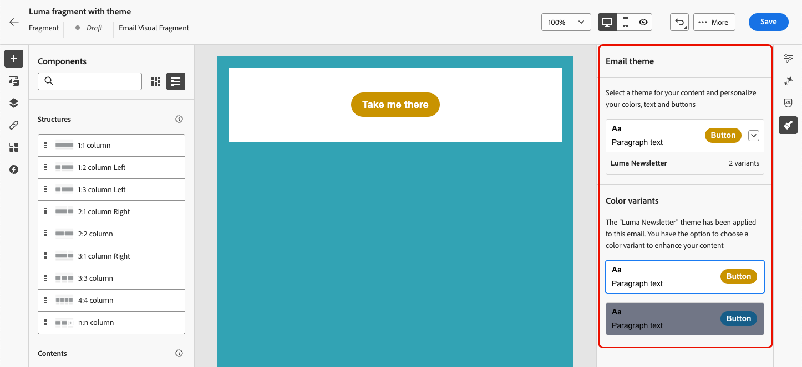

# Een fragment maken {#create-fragments}

>[!CONTEXTUALHELP]
>id="ajo_create_visual_fragment"
>title="Selecteer het visuele type"
>abstract="Maak een zelfstandig visueel fragment om uw inhoud te hergebruiken in een e-mail binnen een reis, een campagne of een inhoudssjabloon."
>additional-url="https://experienceleague.adobe.com/en/docs/journey-optimizer/using/channels/email/design-email/add-content/use-visual-fragments" text="Visuele fragmenten toevoegen aan uw e-mails"

>[!CONTEXTUALHELP]
>id="ajo_create_expression_fragment"
>title="Expressietype selecteren"
>abstract="Maak een zelfstandig expressiefragment om uw inhoud te hergebruiken voor meerdere reizen en campagnes. Wanneer u de verpersoonlijkingseditor gebruikt, kunt u alle uitdrukkingsfragmenten benutten die in de huidige sandbox zijn gemaakt."
>additional-url="https://experienceleague.adobe.com/en/docs/journey-optimizer/using/content-management/personalization/personalization-build-expressions" text="Werken met de verpersoonlijkingseditor"

U kunt geheel nieuwe fragmenten maken in het menu links van **[!UICONTROL Fragments]** . Bovendien kunt u een gedeelte van bestaande inhoud als fragment opslaan wanneer u inhoud ontwerpt. [ leer hoe ](save-fragments.md#)

Als het fragment eenmaal is opgeslagen, kan het worden gebruikt in een reis, een campagne of een sjabloon. U kunt dit fragment gebruiken bij het maken van inhoud binnen reizen en campagnes. Zie [ visuele fragmenten ](../email/use-visual-fragments.md) en [ de uitdrukkingsfragmenten van de Leverage ](../personalization/use-expression-fragments.md) toevoegen.

Voer de onderstaande stappen uit om een fragment te maken.

## De eigenschappen van het fragment definiëren {#properties}

1. Open de fragmentlijst via het menu **[!UICONTROL Content Management]** > **[!UICONTROL Fragments]** links.

1. Selecteer **[!UICONTROL Create fragment]** en vul de fragmentnaam en -beschrijving in (indien nodig).

   

1. Selecteer of maak Adobe Experience Platform-tags in het veld **[!UICONTROL Tags]** om het fragment te categoriseren voor een betere zoekopdracht. [ Leer hoe te met Verenigde Markeringen ](../start/search-filter-categorize.md#tags) te werken

1. Selecteer het fragmenttype: **Visueel fragment** of **het fragment van de Uitdrukking**. [Meer informatie](../content-management/fragments.md#visual-expression)

   >[!NOTE]
   >
   >Momenteel, zijn de visuele fragmenten beschikbaar voor het **E-mail** slechts kanaal.

1. Als u een expressiefragment maakt, selecteert u het type code dat u wilt gebruiken: **[!UICONTROL HTML]**, **[!UICONTROL JSON]** of **[!UICONTROL Text]** .

   

1. Als u aangepaste of basislabels voor gegevensgebruik aan het fragment wilt toewijzen, klikt u op de knop **[!UICONTROL Manage access]** in de bovenste sectie van het scherm. [ leer meer over de Controle van de Toegang van het Niveau van Objecten (OLAC) ](../administration/object-based-access.md).

1. Klik op **[!UICONTROL Create]** om de inhoud van het fragment te ontwerpen.

## De fragmentinhoud ontwerpen {#content}

Nadat u de eigenschappen van het fragment hebt geconfigureerd, wordt de e-mail-Designer of de personalisatie-editor geopend, afhankelijk van het type fragment dat u maakt.

>[!NOTE]
>
>[ Contextafhankelijke attributen ](../personalization/personalization-build-expressions.md) worden niet gesteund binnen fragmenten.
>
>Wanneer het volgen in een reis of een campagne wordt toegelaten, als u verbindingen aan een fragment toevoegt en als dit fragment in een bericht wordt gebruikt, worden deze verbindingen gevolgd zoals alle andere verbindingen inbegrepen in het bericht. [ leer meer op verbindingen en het volgen ](../email/message-tracking.md)

* Voor visuele fragmenten kunt u de inhoud naar wens bewerken, net zoals u dat zou doen voor elke e-mail in een rit of campagne. [Meer informatie](../email/get-started-email-design.md)

  

  Om een specifieke het stileren snel toe te passen die uw merk en ontwerp past, kunt u a [ thema ](../email/apply-email-themes.md) op uw fragment toepassen.

  

  >[!CAUTION]
  >
  >Fragmenten zijn niet compatibel met de modi Thema&#39;s gebruiken en Handmatige stijlen. Wanneer u een fragment in e-mailinhoud gebruikt, moet u een thema toepassen dat u voor dit fragment hebt gedefinieerd. [Meer informatie](../email/apply-email-themes.md#leverage-themes-fragment)

* Voor expressiefragmenten gebruikt u de [!DNL Journey Optimizer] personalization-editor met al zijn personalisatie- en ontwerpmogelijkheden om de fragmentinhoud samen te stellen. [Meer informatie](../personalization/personalization-build-expressions.md)

  

Klik op de knop **[!UICONTROL Save]** wanneer de inhoud gereed is.

>[!NOTE]
>
>Visuele fragmenten mogen niet groter zijn dan 100 kB. Expressiefragmenten mogen niet groter zijn dan 200 kB.

Het fragment wordt gemaakt en aan de fragmentlijst toegevoegd met de status **[!UICONTROL Draft]** . U kunt een voorvertoning weergeven en deze publiceren om deze beschikbaar te maken tijdens reizen en campagnes.

## Het fragment voorvertonen en publiceren {#publish}

>[!NOTE]
>
>Om een fragment te publiceren, moet u [ hebben publiceren het Fragment ](../administration/ootb-product-profiles.md#content-library-manager) gebruikerstoestemming van het Fragment.

Als uw fragment klaar is om live te gaan, kunt u het voorbeeld bekijken en publiceren en het beschikbaar maken tijdens uw reizen en campagnes. Volg de onderstaande stappen om dit te doen.

1. Ga terug naar het scherm voor het maken van fragmenten nadat u de inhoud hebt ontworpen, of open het vanuit de lijst met fragmenten.

1. Er is een voorvertoning van het fragment beschikbaar onder het veld **[!UICONTROL Tags]** , zodat de rendering ervan kan worden gecontroleerd. Als u wijzigingen wilt aanbrengen, klikt u op de knop **[!UICONTROL Edit]** in de bovenste sectie van het scherm om de E-mail Designer of de personalisatie-editor te openen, afhankelijk van het fragmenttype. [Meer informatie](manage-fragments.md#edit-fragments)

   

1. Klik op de knop **[!UICONTROL Publish]** in de rechterbovenhoek om het fragment te publiceren.

1. Als het fragment tijdens een live reis of campagne wordt gebruikt, wordt een bericht geopend om u op de hoogte te brengen. Klik op de koppeling **[!UICONTROL See more]** om de lijst met reizen en/of campagnes te openen waarnaar wordt verwezen. [ leer hoe te om verwijzingen van een fragment ](../content-management/manage-fragments.md#explore-references) te onderzoeken

   {width="70%" align="center"}

   Klik op **[!UICONTROL Confirm]** om het fragment te publiceren en bij te werken in de live ritten/campagnes die het gebruiken.

Het fragment is nu **[!UICONTROL Live]** en wordt beschikbaar wanneer u inhoud maakt in de [!DNL Journey Optimizer] E-mail-Designer of personalisatie-editor.

* [Leer hoe u visuele fragmenten kunt gebruiken](../email/use-visual-fragments.md)
* [Leer hoe u expressiefragmenten kunt gebruiken](../personalization/use-expression-fragments.md)
