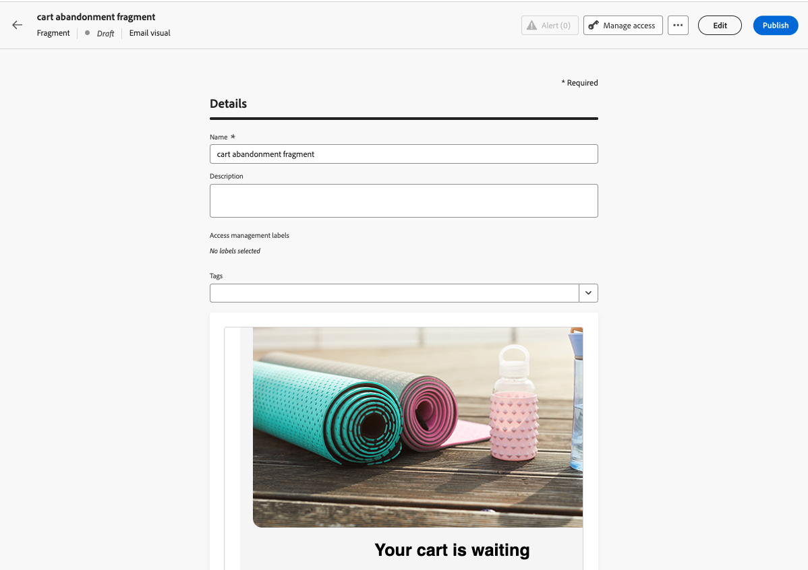
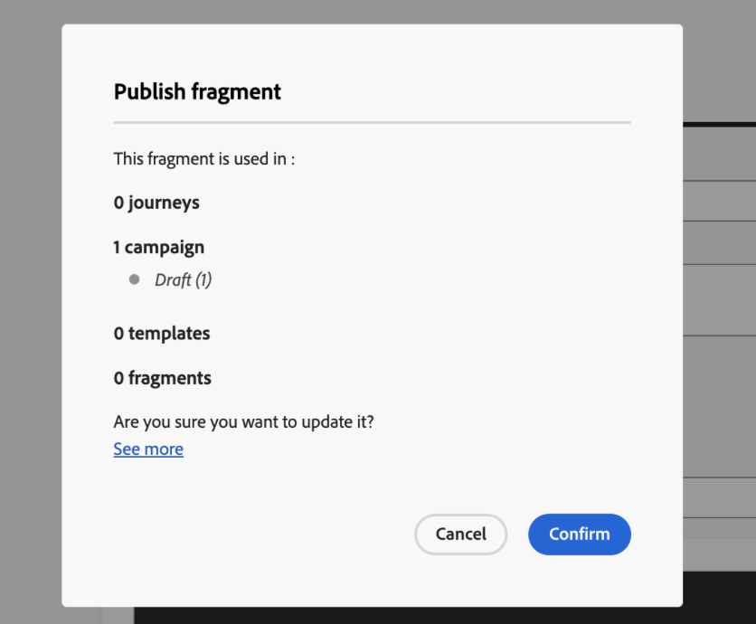

# Een fragment maken {#create-fragments}

>[!CONTEXTUALHELP]
>id="ajo_create_visual_fragment"
>title="Selecteer het visuele type"
>abstract="Maak een zelfstandig visueel fragment om uw inhoud te hergebruiken in een e-mail binnen een reis, een campagne of een inhoudssjabloon."
>additional-url="https://experienceleague.adobe.com/en/docs/journey-optimizer/using/email/design-email/add-content/use-visual-fragments" text="Visuele fragmenten toevoegen aan uw e-mails"

>[!CONTEXTUALHELP]
>id="ajo_create_expression_fragment"
>title="Expressietype selecteren"
>abstract="Maak een zelfstandig expressiefragment om uw inhoud te hergebruiken voor meerdere reizen en campagnes. Wanneer u de verpersoonlijkingseditor gebruikt, kunt u alle uitdrukkingsfragmenten benutten die in de huidige sandbox zijn gemaakt."
>additional-url="https://experienceleague.adobe.com/docs/journey-optimizer/using/content-management/personalization/expression-editor/use-expression-fragments.html" text="Expressiefragmenten benutten"

Fragmenten kunnen helemaal vanaf het tabblad **[!UICONTROL Fragments]** links. Bovendien kunt u een gedeelte van bestaande inhoud als fragment opslaan wanneer u inhoud ontwerpt. [Meer informatie](#save-as-fragment)

Als het fragment eenmaal is opgeslagen, kan het worden gebruikt in een reis, een campagne of een sjabloon. U kunt dit fragment gebruiken bij het maken van inhoud binnen reizen en campagnes. Zie [Visuele fragmenten toevoegen](../email/use-visual-fragments.md) en [Expressiefragmenten benutten](../personalization/use-expression-fragments.md)

Voer de onderstaande stappen uit om een fragment te maken.

## De eigenschappen van het fragment definiëren {#properties}

1. Open de fragmentlijst via de **[!UICONTROL Content Management]** > **[!UICONTROL Fragments]** links.

1. Selecteren **[!UICONTROL Create fragment]** en vul de fragmentnaam en -beschrijving in (indien nodig).

   

1. Adobe Experience Platform-tags selecteren of maken vanuit het menu **[!UICONTROL Tags]** veld om het fragment te categoriseren voor een betere zoekopdracht. [Leer hoe te met Verenigde Markeringen werken](../start/search-filter-categorize.md#tags)

1. Selecteer het fragmenttype: **Visueel fragment** of **Expressiefragment**. [Meer informatie over visuele fragmenten en uitdrukkingsfragmenten](../content-management/fragments.md#visual-expression)

   >[!NOTE]
   >
   >Op dit moment zijn er visuele fragmenten beschikbaar voor de **E-mail** alleen kanaal.

1. Als u een expressiefragment maakt, selecteert u het type code dat u wilt gebruiken: **[!UICONTROL HTML]**, **[!UICONTROL JSON]** of **[!UICONTROL Text]**.

   

1. Als u aangepaste of basislabels voor gegevensgebruik aan het fragment wilt toewijzen, klikt u op de knop **[!UICONTROL Manage access]** in de bovenste sectie van het scherm. [Leer meer op de Controle van de Toegang van het Niveau van Objecten (OLAC)](../administration/object-based-access.md).

1. Klikken **[!UICONTROL Create]** om de inhoud van het fragment te ontwerpen.

## De fragmentinhoud ontwerpen {#content}

Nadat u de eigenschappen van het fragment hebt geconfigureerd, wordt de e-mail-Designer of de personalisatie-editor geopend, afhankelijk van het type fragment dat u maakt.

* Voor visuele fragmenten kunt u de inhoud naar wens bewerken, net zoals u dat zou doen voor elke e-mail in een rit of campagne. [Meer informatie](../email/get-started-email-design.md)

  

* Gebruik voor expressiefragmenten de optie [!DNL Journey Optimizer] personalisatie-editor met al zijn personalisatie- en ontwerpmogelijkheden om uw fragmentinhoud samen te stellen. [Meer informatie](../personalization/personalization-build-expressions.md)

  

Wanneer uw inhoud klaar is, klikt u op de knop **Opslaan** knop. Het fragment wordt gemaakt en aan de fragmentlijst toegevoegd met de opdracht **Concept** status. U kunt een voorvertoning weergeven en deze publiceren om deze beschikbaar te maken tijdens reizen en campagnes.

>[!NOTE]
>
>De publicatie van fragmenten wordt geleidelijk uitgevoerd in de loop van enkele dagen na de release van Journey Optimizer in juni. Terwijl sommige gebruikers directe toegang zullen hebben, kunnen anderen een vertraging ervaren alvorens het in hun milieu&#39;s beschikbaar wordt. Als deze verbetering nog niet in uw milieu beschikbaar is, gelieve te merken dat het publiceren van fragment niet wordt vereist om fragmenten in uw reizen en campagnes te gebruiken.

## Het fragment voorvertonen en publiceren {#publish}

>[!NOTE]
>
>Als u een fragment wilt publiceren, moet u beschikken over **Publish-fragment** verwante machtigingen. [Meer informatie over machtigingen](../administration/ootb-permissions.md)

Als uw fragment klaar is om live te gaan, kunt u het voorbeeld bekijken en publiceren en het beschikbaar maken tijdens uw reizen en campagnes. Voer hiertoe de volgende stappen uit:

1. Ga terug naar het scherm voor het maken van fragmenten nadat u de inhoud hebt ontworpen, of open het vanuit de lijst met fragmenten.

1. Er is een voorvertoning van het fragment beschikbaar onder de **Tags** veld, zodat de rendering ervan kan worden gecontroleerd. Als u wijzigingen wilt aanbrengen, klikt u op de knop **Bewerken** in de bovenste sectie van het scherm om de E-mail-Designer of de personalisatie-editor te openen, afhankelijk van het fragmenttype.

   

1. Klik op de knop **Publish** in de rechterbovenhoek om het fragment te publiceren.

   Als het fragment tijdens een live reis of campagne wordt gebruikt, verschijnt er een bericht om u hiervan op de hoogte te stellen. Klik op de knop **Meer weergeven** link naar toegang tot de lijst van reizen en/of campagnes waar ernaar wordt verwezen. [Meer informatie over verwijzingen naar een fragment](../content-management/manage-fragments.md#explore-references)

   Klikken **Bevestigen** het fragment publiceren en bijwerken in de live reizen/campagnes die het gebruiken.

   {width="70%" align="center"}

Het fragment is nu **Live** en wordt beschikbaar wanneer u inhoud binnen de [!DNL Journey Optimizer] Designer-mailadres of personalisatie-editor:

* [Leer hoe u visuele fragmenten kunt gebruiken](../email/use-visual-fragments.md)
* [Leer hoe u expressiefragmenten kunt gebruiken](../personalization/use-expression-fragments.md)
