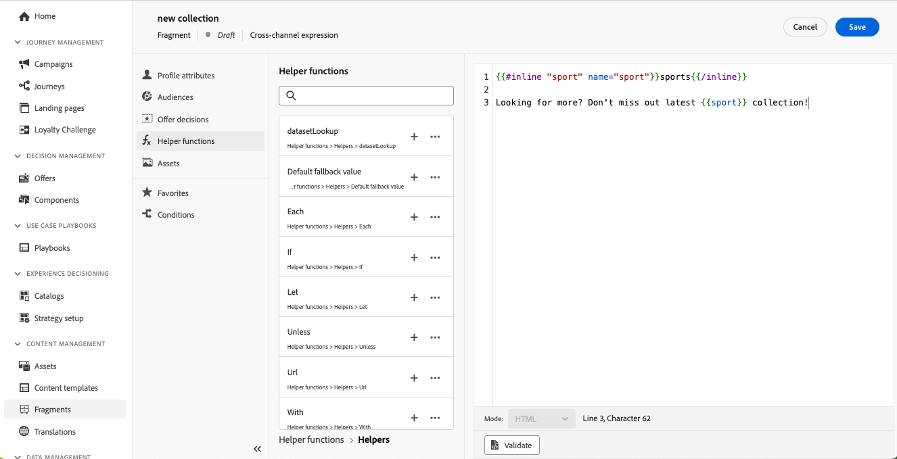

# Aanpasbare fragmenten {#customizable-fragments}

Wanneer fragmenten worden gebruikt in een campagne- of reisactie, worden ze standaard vergrendeld vanwege overerving. Dit betekent dat alle wijzigingen die in een fragment worden aangebracht, automatisch worden doorgevoerd in alle campagnes en reizen waar het fragment wordt gebruikt. Met aanpasbare fragmenten kunnen specifieke velden in een fragment als bewerkbaar worden gedefinieerd wanneer het fragment aan een campagne- of reisactie wordt toegevoegd. Stel dat u een fragment hebt met een banner, tekst of knop. U kunt bepaalde velden, zoals de URL van het afbeeldingsdoel of knopdoel, instellen als bewerkbaar. Hierdoor kunnen gebruikers deze elementen wijzigen wanneer ze het fragment opnemen in hun campagne of reis, zodat ze een op maat gemaakte ervaring hebben zonder dat dit van invloed is op het oorspronkelijke fragment.

Aanpasbare fragmenten zorgen ervoor dat de fragmentovererving niet wordt verbroken. Hierdoor zijn gecentraliseerde wijzigingen op fragmentniveau eerder niet meer doorgevoerd in de campagnes en reizen. Op deze manier kunnen delen van inhoud op het moment van gebruik worden aangepast, zodat u de standaardwaarden kunt overschrijven met contextspecifieke details.

Door aanpasbare fragmenten te gebruiken, kunt u uw inhoud efficiënt beheren en aanpassen zonder geheel nieuwe inhoudsblokken te maken of de overerving van het oorspronkelijke fragment te onderbreken. Dit zorgt ervoor dat de veranderingen die op het fragmentniveau worden aangebracht nog worden verspreid, terwijl het toestaan van noodzakelijke aanpassing op het campagne of het reisniveau.

Fragmenten met zowel visuele als expressies kunnen worden gemarkeerd als aanpasbaar. Raadpleeg de onderstaande secties voor gedetailleerde instructies over hoe u met elk type fragment kunt doorgaan.

## Bewerkbare velden toevoegen aan visuele fragmenten {#visual}

Voer de volgende stappen uit om gedeelten van een visueel fragment bewerkbaar te maken:

>[!NOTE]
>
>Bewerkbare velden kunnen worden toegevoegd aan **image**, **text** en **knop** componenten. Voor **HTML** componenten, worden de editable gebieden toegevoegd gebruikend de verpersoonlijkingsredacteur, gelijkend op uitdrukkingsfragmenten. [Leer hoe u bewerkbaar veld kunt toevoegen in HTML-componenten en expressiefragmenten](#expression)

1. Open het scherm voor de editie van de fragmentinhoud.

1. Selecteer de component in het fragment waar u bewerkbare velden wilt configureren.

1. Het deelvenster Eigenschappen van component wordt aan de rechterkant geopend. Selecteer de **Bewerkbare velden** en schakelt u vervolgens de **Versie inschakelen** -optie.

1. Alle velden die voor de geselecteerde component kunnen worden bewerkt, worden in het deelvenster weergegeven. Welke velden beschikbaar zijn voor bewerking, is afhankelijk van het geselecteerde componenttype.

   In het onderstaande voorbeeld kunnen we de URL van de knop &quot;Klik hier&quot; bewerken.

   

1. Klik op de knop **Overzicht** om alle bewerkbare velden en hun standaardwaarden te controleren.

   In dit voorbeeld wordt het veld URL van de knop weergegeven met de standaardwaarde die in de component is gedefinieerd. Deze waarde kan door gebruikers worden aangepast nadat ze het fragment aan hun inhoud hebben toegevoegd.

   

1. Sla de wijzigingen op als u klaar bent om het fragment bij te werken.

1. Nadat u het fragment in een e-mail hebt toegevoegd, kunnen gebruikers alle bewerkbare velden aanpassen die in het fragment zijn geconfigureerd. [Leer hoe u bewerkbare velden in een visueel fragment kunt aanpassen](../email/use-visual-fragments.md#customize-fields)

## Bewerkbare velden toevoegen aan HTML-componenten en expressiefragmenten {#expression}

Als u delen van een HTML-component of een expressiefragment bewerkbaar wilt maken, moet u een specifieke syntaxis gebruiken in de expressie-editor. Hiervoor moet u een **variabel** met een standaardwaarde die gebruikers kunnen overschrijven nadat ze het fragment aan hun inhoud hebben toegevoegd.

Stel dat u een fragment wilt maken om het toe te voegen aan uw e-mails en gebruikers de mogelijkheid wilt geven een specifieke kleur aan te passen die op verschillende locaties wordt gebruikt, zoals de achtergrondkleuren van frames of knoppen. Wanneer u een fragment maakt, moet u een variabele met een **unieke id**, bijvoorbeeld &quot;color&quot;, en roep deze op de gewenste locaties in de fragmentinhoud aan waar u deze kleur wilt toepassen. Wanneer gebruikers het fragment aan hun inhoud toevoegen, kunnen ze de kleur aanpassen die wordt gebruikt op de plaats waar naar de variabele wordt verwezen.

Voor HTML-componenten kunnen alleen specifieke elementen bewerkbare velden worden. Vouw de onderstaande sectie uit voor meer informatie.

+++Bewerkbare elementen in HTML-componenten:

De onderstaande elementen kunnen bewerkbare velden in een HTML-component worden:

* Een deel van tekst
* Een volledige URL voor koppeling of afbeelding (werkt niet met een gedeelte van een URL)
* Gehele CSS-eigenschap (werkt niet met een gedeeltelijke eigenschap)

In de onderstaande code kan bijvoorbeeld elk rood gemarkeerd element een eigenschap worden:

{width="70%"}

+++

Voer de volgende stappen uit om een variabele te declareren en in het fragment te gebruiken:

1. Open het expressiefragment en bewerk de inhoud ervan in de personalisatie-editor. Voor HTML-componenten selecteert u de component in het fragment en klikt u op de knop **De broncode weergeven** knop.

   

1. Declareer de variabele die gebruikers moeten bewerken. Ga naar de **Helpfuncties** in het linkernavigatievenster en voegt u de opdracht **inline** helperfunctie. De syntaxis voor het declareren en aanroepen van de variabele wordt automatisch toegevoegd aan de inhoud.

   

1. Vervangen `"name"` met een unieke id om het bewerkbare veld te identificeren.

   >[!NOTE]
   >
   >De veld-id moet uniek zijn en mag geen spaties bevatten. Deze id moet overal in de inhoud worden gebruikt waar u de waarde van de variabele wilt weergeven.

1. Pas de syntaxis aan uw behoeften aan door parameters toe te voegen die in de onderstaande tabel worden beschreven:

   | Actie | Parameter | Voorbeeld |
   | ------- | ------- | ------- |
   | Een bewerkbaar veld declareren met een **standaardwaarde**. Wanneer u het fragment aan uw inhoud toevoegt, wordt deze standaardwaarde gebruikt als u het niet aanpast. | Voeg de standaardwaarde tussen de inline-tags toe. | `{{#inline "editableFieldID"}}default_value{{/inline}}` |
   | Een **label** voor het bewerkbare veld. Dit label wordt weergegeven in de e-mailtoepassing van de Designer wanneer de velden van het fragment worden bewerkt. | `name="title"` | `{{#inline "editableFieldID" name="title"}}default_value{{/inline}}` |
   | Declareer een bewerkbaar veld dat een **Afbeeldingsbron** dat moet worden gepubliceerd . | `assetType="image"` | `{{#inline "editableFieldID" assetType="image"}}default_value{{/inline}}` |
   | Declareer een bewerkbaar veld dat een **URL** dat moet worden bijgehouden. Merk op dat vooraf gedefinieerde blokken die buiten het vak &#39;URL van pagina spiegelen&#39; en &#39;Koppeling opzeggen&#39; staan, niet bewerkbare velden kunnen worden. | `assetType="url"` | `{{#inline "editableFieldID" assetType="url"}}default_value{{/inline}}` |

1. Gebruik de `{{{name}}}` in uw code op elke plaats waar u de waarde van het bewerkbare veld wilt weergeven. Vervangen `name` met de unieke id van het veld dat u eerder hebt gedefinieerd.

   

1. Sla het fragment op.

Wanneer gebruikers het fragment aan hun e-mailinhoud toevoegen, kunnen ze nu de standaardwaarden van de variabelen overschrijven met de door hen gekozen waarden:

* Voor expressiefragmenten wordt een specifieke syntaxis gebruikt om de waarden van variabelen te overschrijven. [Leer hoe u bewerkbare velden in een expressiefragment kunt aanpassen](../personalization/use-expression-fragments.md#customize-fields)

* Voor HTML-componenten wordt de variabele weergegeven in de lijst met bewerkbare velden in de E-mail-Designer. [Leer hoe u bewerkbare velden in een visueel fragment kunt aanpassen](../email/use-visual-fragments.md#customize-fields)

## Voorbeeld van bewerkbaar expressiefragment {#example}

In het onderstaande voorbeeld maken we een expressiefragment dat nieuwe sportcollecties presenteert. Standaard geeft het fragment deze inhoud weer: *Op zoek naar meer? Mis onze nieuwste sportcollectie niet!*

We willen gebruikers toestaan om &quot;sport&quot; in deze inhoud te vervangen door de sport van hun keuze. Bijvoorbeeld: *Op zoek naar meer? Mis onze nieuwste yoga-collectie niet!*

Dit doet u als volgt:

1. Declareer een &quot;sport&quot;variabele met identiteitskaart &quot;sport&quot;.

   Als gebruikers de waarde van de variabele niet wijzigen nadat ze het fragment in hun inhoud hebben toegevoegd, wordt standaard de waarde weergegeven die is gedefinieerd tussen de `{{#inline}}` en `{{/inline}}` tags, d.w.z. &quot;sport&quot;.

1. Voeg de ``{{{sport}}}`` syntaxis in de fragmentinhoud waar u de variabelewaarde wilt weergeven, dat wil zeggen standaard &quot;sport&quot; of de waarde die door de gebruikers wordt gekozen.

   

1. Wanneer gebruikers het uitdrukkingsfragment aan hun inhoud toevoegen, kunnen de waarde van de variabele met hun keus direct van de uitdrukkingsredacteur veranderen. [Leer hoe u bewerkbare velden in een expressiefragment kunt aanpassen](../personalization/use-expression-fragments.md#customize-fields)

   
