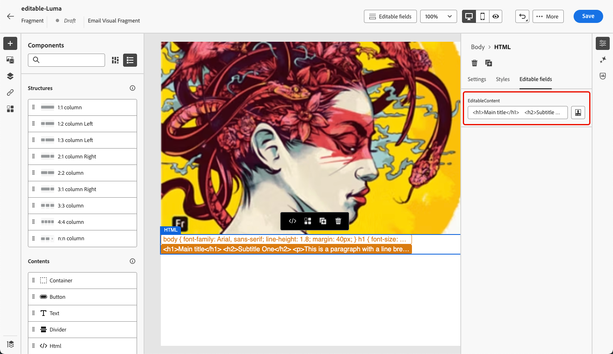

# Aanpasbare fragmenten {#customizable-fragments}

Wanneer fragmenten worden gebruikt in een campagne- of reisactie, worden ze standaard vergrendeld vanwege overerving. Dit betekent dat alle wijzigingen die in een fragment worden aangebracht, automatisch worden doorgevoerd in alle campagnes en reizen waar het fragment wordt gebruikt.

Met **klantgerichte fragmenten**, kunnen de specifieke gebieden binnen een fragment als editable worden bepaald wanneer het fragment aan een campagne of een reisactie wordt toegevoegd. Stel dat u een fragment hebt met een banner, tekst of knop. U kunt bepaalde velden, zoals de URL van het afbeeldingsdoel of knopdoel, instellen als bewerkbaar. Hierdoor kunnen gebruikers deze elementen wijzigen wanneer ze het fragment opnemen in hun campagne of reis, zodat ze een op maat gemaakte ervaring hebben zonder dat dit van invloed is op het oorspronkelijke fragment.

Aanpasbare fragmenten zorgen ervoor dat de fragmentovererving niet wordt verbroken. Hierdoor zijn gecentraliseerde wijzigingen op fragmentniveau eerder niet meer doorgevoerd in de campagnes en reizen. Op deze manier kunnen delen van inhoud op het moment van gebruik worden aangepast, zodat u de standaardwaarden kunt overschrijven met contextspecifieke details.

Door aanpasbare fragmenten te gebruiken, kunt u uw inhoud efficiënt beheren en aanpassen zonder geheel nieuwe inhoudsblokken te maken of de overerving van het oorspronkelijke fragment te onderbreken. Dit zorgt ervoor dat de veranderingen die op het fragmentniveau worden aangebracht nog worden verspreid, terwijl het toestaan van noodzakelijke aanpassing op het campagne of het reisniveau.

Fragmenten met zowel visuele als expressies kunnen worden gemarkeerd als aanpasbaar. Raadpleeg de onderstaande secties voor gedetailleerde instructies over hoe u met elk type fragment kunt doorgaan.

## Bewerkbare velden toevoegen aan visuele fragmenten {#visual}

Voer de volgende stappen uit om gedeelten van een visueel fragment bewerkbaar te maken:

>[!NOTE]
>
>Bewerkbare gebieden kunnen aan **beeld** worden toegevoegd, **tekst** en **knoop** componenten. Voor **HTML** componenten, worden de editable gebieden toegevoegd gebruikend de verpersoonlijkingsredacteur, gelijkend op uitdrukkingsfragmenten. [ Leer hoe te om editable gebied in de componenten van HTML en uitdrukkingsfragmenten toe te voegen ](#expression)

1. Open het scherm voor de editie van de fragmentinhoud.

1. Selecteer de component in het fragment waar u bewerkbare velden wilt configureren.

1. Het deelvenster Eigenschappen van component wordt aan de rechterkant geopend. Selecteer de **Bewerkbare gebieden** tabel, dan knevel **toelaten uitgave** optie.

1. Alle velden die voor de geselecteerde component kunnen worden bewerkt, worden in het deelvenster weergegeven. Welke velden beschikbaar zijn voor bewerking, is afhankelijk van het geselecteerde componenttype.

   In het onderstaande voorbeeld kunnen we de URL van de knop &quot;Klik hier&quot; bewerken.

   

1. Klik het **Overzicht** om alle editable gebieden en hun standaardwaarden te controleren.

   In dit voorbeeld wordt het veld URL van de knop weergegeven met de standaardwaarde die in de component is gedefinieerd. Deze waarde kan door gebruikers worden aangepast nadat ze het fragment aan hun inhoud hebben toegevoegd.

   

1. Sla de wijzigingen op als u klaar bent om het fragment bij te werken.

1. Nadat u het fragment in een e-mail hebt toegevoegd, kunnen gebruikers alle bewerkbare velden aanpassen die in het fragment zijn geconfigureerd. [ Leer hoe te om editable gebieden in een visueel fragment aan te passen ](../email/use-visual-fragments.md#customize-fields)

>[!CAUTION]
>
>Wanneer zowel het **etiket** als **URL** van een knoopcomponent editable in een fragment wordt gemaakt, toont het volgen rapporten URL in plaats van het knoopetiket. [ Leer meer over het volgen ](../email/message-tracking.md)

## Bewerkbare velden toevoegen aan HTML-componenten en expressiefragmenten {#expression}

Als u delen van een HTML-component of een expressiefragment bewerkbaar wilt maken, moet u een specifieke syntaxis gebruiken in de expressie-editor. Dit impliceert het verklaren van a **variabele** met een standaardwaarde die de gebruikers na het toevoegen van het fragment aan hun inhoud kunnen met voeten treden.

Stel dat u een fragment wilt maken om het toe te voegen aan uw e-mails en gebruikers de mogelijkheid wilt geven een specifieke kleur aan te passen die op verschillende locaties wordt gebruikt, zoals de achtergrondkleuren van frames of knoppen. Wanneer het creëren van uw fragment, moet u een variabele met a **unieke identiteitskaart**, bijvoorbeeld &quot;kleur&quot;verklaren, en het roepen bij de gewenste plaatsen in de fragmentinhoud roepen waar u deze kleur wilt toepassen. Wanneer gebruikers het fragment aan hun inhoud toevoegen, kunnen ze de kleur aanpassen die wordt gebruikt op de plaats waar naar de variabele wordt verwezen.

Voor HTML-componenten kunnen alleen specifieke elementen bewerkbare velden worden. Vouw de onderstaande sectie uit voor meer informatie.

+++Bewerkbare elementen in HTML-componenten:

De onderstaande elementen kunnen bewerkbare velden in een HTML-component worden:

* Een deel van tekst
* Een volledige URL voor koppeling of afbeelding (werkt niet met een gedeelte van een URL)
* Volledige CSS-eigenschap (werkt niet met een gedeeltelijke eigenschap)

In de onderstaande code kan bijvoorbeeld elk rood gemarkeerd element een eigenschap worden:

{width="70%"}

+++

Voer de volgende stappen uit om een variabele te declareren en in het fragment te gebruiken:

1. Open het expressiefragment en bewerk vervolgens de inhoud ervan in de personalisatie-editor.

   

   Voor de componenten van HTML, selecteer de component in het fragment en klik **tonen de broncode** knoop.

1. Declareer de variabele die gebruikers moeten bewerken. Navigeer aan het **de functies van de Helper** menu in de linkernavigatieruit en voeg de **gealigneerde** hulpfunctie toe. De syntaxis voor het declareren en aanroepen van de variabele wordt automatisch toegevoegd aan de inhoud.

   

1. Vervang `"name"` door een unieke id om het bewerkbare veld te identificeren.

   >[!NOTE]
   >
   >De veld-id moet uniek zijn en mag geen spaties bevatten. Deze id moet overal in de inhoud worden gebruikt waar u de waarde van de variabele wilt weergeven.

1. Pas de syntaxis aan uw behoeften aan door parameters toe te voegen die in de onderstaande tabel worden beschreven:

   | Actie | Parameter | Voorbeeld |
   | ------- | ------- | ------- |
   | Declareer een editable gebied met a **standaardwaarde**. Wanneer u het fragment aan uw inhoud toevoegt, wordt deze standaardwaarde gebruikt als u het fragment niet aanpast. | Voeg de standaardwaarde tussen de inline-tags toe. | `{{#inline "editableFieldID"}}default_value{{/inline}}` |
   | Bepaal a **etiket** voor het editable gebied. Dit label wordt weergegeven in de e-mailtoepassing van de Designer wanneer de velden van het fragment worden bewerkt. | `name="title"` | `{{#inline "editableFieldID" name="title"}}default_value{{/inline}}` |
   | Verklaar een editable gebied dat een **bron van het Beeld** bevat die moet worden gepubliceerd. | `assetType="image"` | `{{#inline "editableFieldID" assetType="image"}}default_value{{/inline}}` |
   | Declareer een editable gebied dat een **URL** bevat die moet worden gevolgd.  Merk op dat de uit-van-de-doos &quot;pagina URL van de Spiegel&quot;en de &quot;verbinding van Unsubscribe&quot;vooraf bepaalde blokken niet editable gebieden kunnen worden. | `assetType="url"` | `{{#inline "editableFieldID" assetType="url"}}default_value{{/inline}}` |

1. Gebruik de syntaxis `{{{name}}}` in uw code op elke plaats waar u de waarde van het bewerkbare veld wilt weergeven. Vervang `name` door de unieke id van het veld dat u eerder hebt gedefinieerd.

   

1. Sla het fragment op en publiceer het.

Wanneer gebruikers het fragment aan hun e-mailinhoud toevoegen, kunnen ze nu de standaardwaarden van de variabelen overschrijven met de door hen gekozen waarden:

* Voor expressiefragmenten wordt een specifieke syntaxis gebruikt om de waarden van variabelen te overschrijven. [ Leer hoe te om editable gebieden in een uitdrukkingsfragment aan te passen ](../personalization/use-expression-fragments.md#customize-fields)

* Voor HTML-componenten wordt de variabele weergegeven in de lijst met bewerkbare velden in de E-mail Designer. [ Leer hoe te om editable gebieden in een visueel fragment aan te passen ](../email/use-visual-fragments.md#customize-fields)

### Voorbeeld van bewerkbaar expressiefragment {#example}

In het onderstaande voorbeeld maken we een expressiefragment dat nieuwe sportcollecties presenteert. Door gebrek, toont het fragment deze inhoud: *zoekend naar meer? Mis onze nieuwste sportcollectie niet!*

We willen gebruikers toestaan om &quot;sport&quot; in deze inhoud te vervangen door de sport van hun keuze. Bijvoorbeeld: *zoek meer? Mis onze nieuwste yoga-verzameling niet!*

Dit doet u als volgt:

1. Declareer een &quot;sport&quot;variabele met identiteitskaart &quot;sport&quot;.

   Als gebruikers de waarde van de variabele niet wijzigen nadat ze het fragment in hun inhoud hebben toegevoegd, wordt standaard de waarde weergegeven die is gedefinieerd tussen de tags `{{#inline}}` en `{{/inline}}` , dat wil zeggen &#39;sport&#39;.

1. Voeg de syntaxis ``{{{sport}}}`` in de fragmentinhoud toe waar u de variabelewaarde wilt weergeven, dat wil zeggen standaard &#39;sport&#39; of de waarde die door gebruikers wordt gekozen.

   

1. Wanneer gebruikers het uitdrukkingsfragment aan hun inhoud toevoegen, kunnen de waarde van de variabele met hun keus direct van de uitdrukkingsredacteur veranderen. [ Leer hoe te om editable gebieden in een uitdrukkingsfragment aan te passen ](../personalization/use-expression-fragments.md#customize-fields)

   

## RTF-tekst toevoegen aan een aanpasbaar fragment {#rich-text}

RTF-tekst, zoals regeleinden, vet, cursief, enzovoort, kan met HTML-componenten aan een bewerkbaar fragment worden toegevoegd. Volg de onderstaande stappen om dit te doen.
<!--
➡️ [Learn how to add and use rich text to an editable fragment in this video](#video)-->

### Een fragment met opgemaakte tekst maken {#add-rich-text}

1. Creeer een visueel [ fragment ](create-fragments.md) en begin componenten toe te voegen.

1. Voeg een [ component van HTML ](../email/content-components.md#HTML) toe en open de redacteur van HTML.

1. Navigeer aan het **[!UICONTROL Helper functions]** menu in de linkernavigatieruit en voeg de **gealigneerde** hulpfunctie toe.

1. Vervang `"name"` door de id die u voor bewerkbare inhoud wilt gebruiken, bijvoorbeeld &quot;EditableContent&quot;.

1. Vervang `render_content` door de HTML-code die overeenkomt met de standaard rijke inhoud die u wilt. U kunt vette, cursieve, regeleinden, lijsten met opsommingstekens enzovoort toevoegen.

   

1. Binnen de zelfde component van HTML, voeg een andere **gealigneerde** hulpfunctie voor uw het stileren elementen toe.

1. Vervang `"name"` en `render_content` door de id- en HTML-code die overeenkomen met de gewenste standaardopmaak.

   

1. Sla uw inhoud op. De geselecteerde bewerkbare velden worden rechts weergegeven.

   

1. Sparen en [ publiceer ](create-fragments.md#publish) het fragment.

### bewerkbare fragmenten met RTF-indeling gebruiken {#use-rich-text}

Wanneer gebruikers het fragment aan hun e-mailinhoud toevoegen, kunnen ze nu de RTF-inhoud en -opmaak bewerken die u hebt gemaakt. Voer de onderstaande stappen uit als u bewerkbare tekstfragmenten met tekstopmaak wilt gebruiken als een markering.

1. [ creeer e-mail ](../email/create-email.md) in een campagne of een reis, dan voeg het fragment met rijke tekst toe die  werd gecreeerd.

   U ziet de twee bewerkbare velden die aan de rechterkant zijn gemaakt.

   

1. U kunt op **[!UICONTROL Simulate content]** klikken om te zien hoe de bewerkbare inhoud en opmaak worden weergegeven. [ leer meer bij het voorvertonen van inhoud ](preview-test.md)

1. Selecteer het pictogram **[!UICONTROL Add personalization]** naast een van de bewerkbare velden.

1. In de verpersoonlijkingsredacteur die opent, werk <!--CSS--> het stileren en/of inhoud bij zoals gewenst door elementen van het editable gebied toe te voegen of te verwijderen.

   

<!--
## How-to video {#video}

This video shows how to make HTML components within a fragment editable, allowing for dynamic updates to both content and styling.

>[!VIDEO](https://video.tv.adobe.com/v/3464363/?learn=on&#x26;enablevpops)
-->