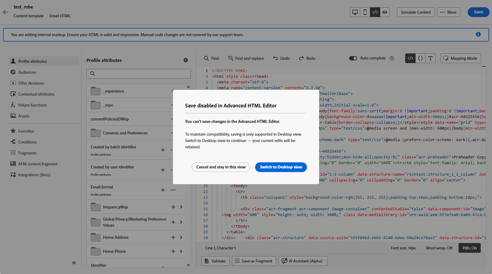

# E-mailsjablonen bewerken met de geavanceerde HTML-editor {#email-template-expert-mode}

>[!AVAILABILITY]
>
>Deze mogelijkheid is beschikbaar in Beperkte Beschikbaarheid. Neem contact op met uw Adobe-vertegenwoordiger voor toegang.

De **geavanceerde redacteur van HTML** is een deskundige wijze die u de ruwe broncode van e-mailinhoudsmalplaatjes van de [!DNL Journey Optimizer] e-mailinterface van Designer direct laat bekijken en uitgeven.

Met deze functie kunt u geavanceerde expressies, zoals condities, rechtstreeks in de bron invoegen. Wanneer u terugschakelt naar de visuele weergave (Computer), wordt de inhoud opnieuw gerenderd, zodat u kunt controleren hoe de inhoud eruitziet en in beide weergaven verder kunt bewerken.

>[!NOTE]
>
>Deze functie is alleen beschikbaar in inhoudssjablonen en voor het e-mailkanaal.

## Beveiligingsmechanismen {#guardrails}

Wanneer u de geavanceerde HTML-editor gebruikt, zijn de volgende instructies beschikbaar om de compatibiliteit van inhoud te beschermen en verwachtingen in te stellen.

* Momenteel, is er geen bevestigingsproces **in de geavanceerde redacteur van HTML.** Syntaxisfouten en verbroken layouts worden niet gecontroleerd. Controleer de inhoud zorgvuldig voordat u deze opslaat.

* Tijdens toekomstige systeemupdates kunnen wijzigingen in standaardmarkeringen worden hersteld. Houd er rekening mee dat **uw wijzigingen kunnen worden overschreven** .

* De kwesties die door douanecode en handveranderingen **worden veroorzaakt kunnen niet** worden problemen opgelost of door het [!DNL Adobe] ondersteuningsteam worden opgelost. Zorg ervoor dat u een reservekopie hebt van uw inhoud voor het geval u naar een vorige versie moet terugkeren.

* Om inhoudsverenigbaarheid te verzekeren, **sparen is niet beschikbaar** in de geavanceerde mening van HTML. Wanneer u klaar bent om uw veranderingen te bewaren, moet u terug naar de mening van de Desktop schakelen.

>[!WARNING]
>
>De geavanceerde HTML-editor in de inhoudssjabloon is niet dezelfde als de modus **[!UICONTROL Code your own]** in de e-mailtoepassing van Designer. In de modus [!UICONTROL Code your own] kunt u niet terugschakelen naar de visuele editor. Als u eenmaal dat pad hebt gekozen, kunt u alleen codebewerkingen uitvoeren. Met de geavanceerde HTML-editor kunt u daarentegen op elk gewenst moment schakelen tussen de HTML-weergave en de (visuele) desktopweergave. [&#x200B; leer meer over de coderedacteur &#x200B;](../email/code-content.md)

## Overschakelen naar de geavanceerde HTML-weergave {#switch-to-desktop-view}

1. Open of creeer een [&#x200B; e-mailmalplaatje &#x200B;](../content-management/create-content-templates.md) en open [&#x200B; E-mail Designer &#x200B;](../email/get-started-email-design.md) om de inhoud uit te geven.

1. Klik op de knop **[!UICONTROL HTML]** in de rechterbovenhoek van het scherm.

   

1. De eerste keer dat u de geavanceerde HTML-editor opent, wordt een waarschuwingsbericht weergegeven. Bekijk deze zorgvuldig en klik op **[!UICONTROL OK]** om door te gaan. [Meer informatie](#guardrails)

   >[!NOTE]
   >
   >Deze waarschuwing wordt alleen weergegeven wanneer u de geavanceerde HTML-editor voor de eerste keer opent en elke maand opnieuw instelt.

   {zoomable="yes"}

1. De geavanceerde HTML-editor wordt weergegeven.

   

1. Voeg de gewenste wijzigingen toe aan uw e-mailinhoud.

   >[!WARNING]
   >
   >Zorg ervoor dat u de juiste HTML- en CSS-code invoert omdat er geen syntaxisvalidatieproces is en er geen ondersteuning wordt geboden door [!DNL Adobe] . [Meer informatie](#guardrails)

1. Opslaan is niet beschikbaar in de geavanceerde HTML-weergave. Schakel terug naar de weergave Computer om uw wijzigingen op te slaan.

   {zoomable="yes"}

   >[!NOTE]
   >
   >Inhoud kan alleen worden opgeslagen in de bureaubladweergave om redenen van inhoucompatibiliteit. Uw bewerkingen blijven behouden wanneer u van weergave verandert.

1. Inhoud simuleren is niet beschikbaar in de geavanceerde HTML-weergave. Schakel over naar de bureaubladweergave om de inhoud te simuleren.

   {zoomable="yes"}

