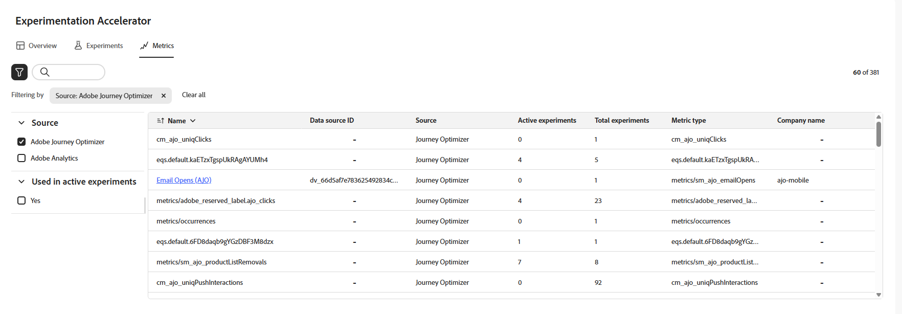

# Metrics {#experiment-accelerator-metrics}

Op de pagina **[!UICONTROL Metrics]** worden succesgegevens van Journey Optimizer- en Target-experimenten op één plaats weergegeven, zodat prestatiebewaking, vergelijking en diepgaande inzichten mogelijk zijn.

## Dashboard {#dashboard}

Wanneer u het tabblad **[!UICONTROL Metrics]** opent, worden alle beschikbare succesgegevens van Journey Optimizer en Adobe Target weergegeven in een geconsolideerde weergave, zodat u de prestaties van verschillende initiatieven kunt bijhouden, resultaten kunt vergelijken en snel gebieden kunt identificeren die aandacht behoeven.

U kunt filters openen door op  te klikken. Dit biedt contextspecifieke opties, zoals filteren op **[!UICONTROL Source]** of **[!UICONTROL Used in active experiments]** .

U kunt ook snel elke gewenste metrische waarde zoeken door de naam ervan in de zoekbalk te typen.

## Metrische details {#metric-details}

### Incrementeel in de tijd

Het **[!UICONTROL Incremental over time]** -diagram geeft een visuele uitsplitsing van hoe de geselecteerde metrische waarde over een gekozen tijdbereik loopt. Met het keuzemenu kunt u schakelen tussen de dagelijkse of wekelijkse weergave om de mate van granulariteit aan te passen.

U kunt de volgende samenvattingswaarden snel raadplegen:

* **[!UICONTROL Total]**: De cumulatieve waarde van de geselecteerde metrische waarde gedurende de rapportageperiode.

* **[!UICONTROL Average]**: De gemiddelde waarde van de metrische waarde die over het geselecteerde tijdbereik wordt berekend. Door dagelijkse of wekelijkse schommelingen in evenwicht te brengen, geeft het een duidelijker beeld van de normale prestaties en kan het als basislijn voor vergelijking worden gebruikt.

* **[!UICONTROL Conversion rate]**: percentage profielen dat de gewenste actie heeft uitgevoerd (bijv. aankoop, aanmelden) na het zien van de behandeling.

Elke waarde bevat een procentuele wijziging ten opzichte van de vorige periode, zodat u gemakkelijk kunt zien of de prestaties verbeteren, verminderen of stabiel blijven.

### Experimenteer, effect

In deze sectie worden alle actieve experimenten binnen de geselecteerde tijdsperiode (Laatste 90 dagen, Laatste 30 dagen of Laatste 7 dagen) weergegeven en wordt hun bijdrage aan de meting gemarkeerd.

De volgende keuzelijsten zijn beschikbaar:

* **[!UICONTROL Lift]**: maat voor de procentuele verbetering van de conversiesnelheid van een bepaalde behandeling ten opzichte van de basislijn.

* **[!UICONTROL Confidence]**: Bewijs dat een bepaalde behandeling gelijk is aan de basisbehandeling. [Meer informatie](../content-management/experiment-calculations.md#understand-confidence)

* **[!UICONTROL Contribution]**: Het aandeel van de totale verandering in de metrische waarde dat kan worden toegeschreven aan een specifiek experiment of een specifieke behandeling, waardoor de initiatieven die de grootste relatieve impact hebben, kunnen worden geïdentificeerd.
