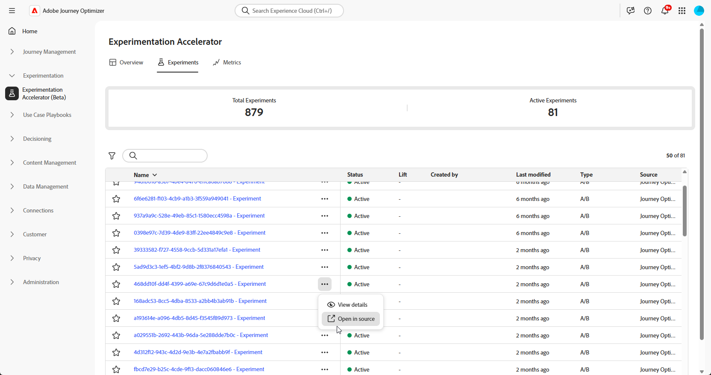
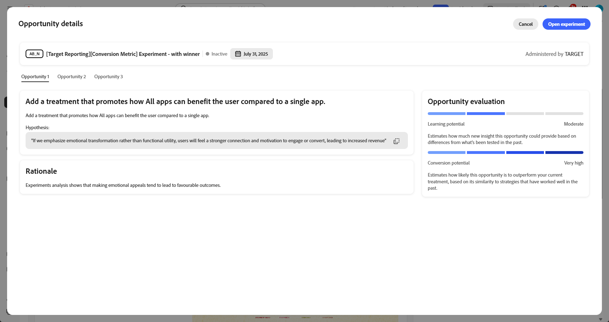

# Uw experimenten bijhouden {#monitor}

>[!BEGINSHADEBOX]

* [Aan de slag met de Journey Optimizer Experimentation Accelerator](experiment-accelerator.md)
* [Gegevensgebruik in AI met Journey Optimizer Experimentation Accelerator](experiment-accelerator-security.md)
* [Aanbevolen procedures voor Journey Optimizer Experimentation Accelerator](experiment-accelerator-best-practices.md)
* **[experimenten van de Monitor](experiment-accelerator-monitor.md)**
* [Metrische experimenten](experiment-accelerator-metrics.md)

>[!ENDSHADEBOX]

Het tabblad **[!UICONTROL Experiments]** centraliseert het bijhouden en analyseren van tests vanuit Adobe Journey Optimizer en Adobe Target. U kunt alle experimenten bekijken, KPIs herzien, en filter of onderzoek om van specifieke tests de plaats te bepalen.

## Dashboard {#dashboard}

Wanneer u het tabblad Experimenten opent, worden alle beschikbare experimenten van Journey Optimizer en Adobe Target weergegeven in een geconsolideerde weergave. Hierdoor kunt u experimenten op beide platforms snel op één locatie bekijken en vergelijken.
De lijst met experimenten bevat:

* Journey Optimizer-experimenten die zijn gemaakt in Campaigns of Reizen.

* Adobe Target-experimenten beschikbaar in de standaard Journey Optimizer-sandbox voor productie die aan dezelfde IMS-organisatie zijn gekoppeld.

De KPI-sectie biedt belangrijke meetgegevens, zoals het totale aantal gemaakte experimenten en het aantal experimenten dat momenteel wordt uitgevoerd en biedt een momentopname van de algemene experimenteringsactiviteit

U kunt filters openen door op  te klikken. Hiermee kunt u contextspecifieke opties instellen, zoals filteren op **[!UICONTROL Type]** , **[!UICONTROL Starred]** , **[!UICONTROL Status]** of **[!UICONTROL Source]** . U kunt bijvoorbeeld filteren om alleen actieve experimenten van Journey Optimizer weer te geven.

U kunt uw experiment ook snel vinden door de naam ervan in de zoekbalk te typen.

## Uw experimenten controleren {#monitor-page}

Als u uw experimenten wilt openen en volgen, selecteert u het eerder geconfigureerde experiment in de lijst met experimenten op het tabblad **[!UICONTROL Experiments]** of gebruikt u het menu Geavanceerd van **[!UICONTROL View details]** of **[!UICONTROL Open in source]** .

De detailpagina van het experiment wordt gesplitst in de volgende sectie:

* [Experimentele resultaten](#experiment-outcome)
* [Hypothese](#hypothesis)
* [Details](#details)
* [Kansen](#opportunities)
* [Resultaten](#results)
* [Experimentele inzichten](#insights)

### Experimentele uitkomst {#experiment-outcome}

De **[!UICONTROL Experiment outcome]** geeft u een snel overzicht van de winnende variatie in uw experiment.

### Instellen {#set-up}

In **[!UICONTROL Hypothesis]** worden de geplande wijzigingen vastgelegd die moeten worden getest en wordt het verwachte effect op de primaire metrische waarde beschreven. Als u een duidelijke **[!UICONTROL Hypothesis]** definitie opgeeft, weet u zeker dat elk experiment een meetbaar doel heeft, waardoor het gemakkelijker wordt om resultaten te evalueren en te bepalen of de wijzigingen tot betekenisvolle verbeteringen leiden.

Merk op dat voor [ Experimenteerde inzichten ](#insights) worden geproduceerd, u hypothese en behandelingsdetails en statistische betekenis moet bevestigen om worden bereikt.

1. Klik op **[!UICONTROL Add]** om een **[!UICONTROL Hypothesis]** -object voor uw experiment te maken.

   

1. Typ uw **[!UICONTROL Hypothesis]** in door de aangebrachte wijzigingen en de invloed van deze wijzigingen op de primaire metrische waarde in te vullen.

   Klik op **[!UICONTROL Save]**.

1. Klik op **[!UICONTROL Review]** om de afbeelding voor elke bewerking toe te voegen of te vervangen.

   

1. Behandelingsafbeeldingen worden automatisch gegenereerd, maar u kunt **[!UICONTROL Add image]** of **[!UICONTROL Replace image]** selecteren om een voorkeursschermafbeelding van uw lokale bestanden te uploaden voor uw **[!UICONTROL Treatments]** .

   Houd er rekening mee dat in de schermafbeelding de volledige pagina moet worden vastgelegd.

1. Klik op het pictogram  om de **[!UICONTROL Hypothesis]** -code indien nodig bij te werken.

Zodra u klaar was met het vormen van uw **[!UICONTROL Hypothesis]**, zult u waardevolle [ Inzichten ](#insights) en [ Kansen ](#opportunities) krijgen.

### Details {#details}

De **[!UICONTROL Experiment Effect]** -widget geeft een gedetailleerde weergave van hoe uw experiment de doelsegmenten beïnvloedde. Het bevat belangrijke prestatie-indicatoren die u helpen uw betrokkenheid en gedrag te beoordelen, zoals:

* **[!UICONTROL Success metric]** vanuit Journey Optimizer of de **[!UICONTROL Primary metric]** vanuit Adobe Target, afhankelijk van wat tijdens het maken van het experiment is geconfigureerd.

* **[!UICONTROL Visitors]**: Het totale aantal unieke bezoekers dat aan het experiment is blootgesteld.

U kunt ook een momentopname in real time bekijken van hoe de belangrijke behandeling door de volgende metriek uitvoert:

* **[!UICONTROL Current Leader]**: identificeert de behandeling die momenteel de beste prestaties levert.

* **[!UICONTROL Lift Over Baseline]**: meet de procentuele verbetering van de eerstelijnsbehandeling in vergelijking met de controle of basislijn.

* **[!UICONTROL Success metric]** vanuit Journey Optimizer of de **[!UICONTROL Primary metric]** vanuit Adobe Target, afhankelijk van wat tijdens het maken van het experiment is geconfigureerd.

Onder aan de widget vindt u een beknopte samenvatting van de configuratie van uw experiment, zoals:

* **[!UICONTROL Success metric]** vanuit Journey Optimizer of de **[!UICONTROL Primary metric]** vanuit Adobe Target, afhankelijk van wat tijdens het maken van het experiment is geconfigureerd.

* **[!UICONTROL Number of Treatments]**: Het totale aantal geteste variaties.

* **[!UICONTROL Audience]**: Het (de) gedefinieerde gebruikerssegment(en) dat (die) tijdens het experiment als doel heeft (hebben).

### Kansen {#opportunities}

>[!AVAILABILITY]
>
>De functie Opportunity is beperkt tot experimenten met op tekst gebaseerde wijzigingen.

In het deelvenster **[!UICONTROL Opportunities]** worden door AI gegenereerde aanbevelingen weergegeven die zijn ontworpen om de testprestaties te verbeteren en die zijn afgestemd op bredere bedrijfsdoelstellingen en KPI&#39;s.

Merk op dat voor de Te produceren kansen van de Experimenteer, u eerst hypothese en behandelingsdetails [ moet ](#set-up) bevestigen.

1. Blader door de voorgestelde optie en klik op **[!UICONTROL View Opportunity]** .

   

1. Het selecteren van een kans opent het **venster van de Details van de Kans**, dat een specifieke behandeling of een variatie schetst die door Journey Optimizer Experimentation Accelerator wordt voorgesteld. Deze weergave omvat:

   * **[!UICONTROL Hypothesis]**: Een door AI gegenereerde hypothese die het verwachte resultaat van de voorgestelde behandeling toelicht.

   * **[!UICONTROL Rationale]**: Een uitleg van waarom de Journey Optimizer Experimentation Accelerator deze mogelijkheid heeft voorgesteld.

   * **[!UICONTROL Opportunity evaluation]**: Een dubbele beoordeling van de aanbeveling op basis van:

      * **[!UICONTROL Learning potential]**: Een schatting van hoeveel nieuwe insight de kans kan bieden, op basis van hoe anders deze is dan wat eerder is getest.

      * **[!UICONTROL Conversion potential]**: Een schatting van hoe waarschijnlijk de kans is om huidige behandelingen te overtreffen, gebaseerd op overeenkomsten met strategieën die historisch goed hebben gewerkt.
   <!--
   * **[!UICONTROL New text treatment example]**: Words or phrases that demonstrate the style the AI recommends using.
   -->

   

1. Vervolgens kunt u het rechtstreeks aan het experiment toevoegen door **[!UICONTROL Open Experiment]** te selecteren.

1. Als het oorspronkelijke experiment in Adobe Journey Optimizer is gemaakt en beheerd, wordt met deze actie de **[!UICONTROL Content Experimentation Panel]** in die campagne geopend.

   Voor experimenten die afkomstig zijn uit **[!DNL Adobe Target]** , worden de voorgestelde wijzigingen geladen in de testworkflow van **[!DNL Adobe Target]** .

   ➡️ [ Leer meer in de documentatie van Adobe Target ](https://experienceleague.adobe.com/en/docs/target/using/activities/abtest/test-ab)

1. In de experimentele weergave zijn dezelfde AI **[!UICONTROL Experimentation Opportunities]** die de Journey Optimizer Experimentation Accelerator heeft aangetroffen, toegankelijk.

   Selecteer **[!UICONTROL View]** om de opportuniteitsdetails te openen.

1. Als u de voorgestelde wijzigingen wilt toepassen en **[!UICONTROL Modify Experiment]** selecteert, kunt u het bestaande experiment rechtstreeks bewerken.

### Resultaten {#results}

De tabel **[!UICONTROL Results]** bevat een gedetailleerde prestatie-indeling van elke behandeling binnen een experiment. Deze indicatoren helpen doeltreffendheid, gebruikersbetrokkenheid, en algemene invloed op belangrijkste bedrijfsresultaten evalueren:

* **[!UICONTROL Place]**: de positie van de behandeling wordt bepaald op basis van prestaties die aangeven hoe de behandeling wordt vergeleken met andere behandelingen.

* **[!UICONTROL Success metric]** vanuit Journey Optimizer of de **[!UICONTROL Primary metric]** vanuit Adobe Target, afhankelijk van wat tijdens het maken van het experiment is geconfigureerd.

* **[!UICONTROL People]**: Aantal gebruikersprofielen dat als doelprofielen voor uw berichten in aanmerking komt.

* **[!UICONTROL Lift]**: maat voor de procentuele verbetering van de conversiesnelheid van een bepaalde behandeling ten opzichte van de basislijn.

* **[!UICONTROL Confidence]**: Bewijs dat een bepaalde behandeling gelijk is aan de basisbehandeling. [Meer informatie](../content-management/experiment-calculations.md#understand-confidence)

* **[!UICONTROL Conversion rate]**: percentage profielen dat de gewenste actie heeft uitgevoerd (bijv. aankoop, aanmelden) na het zien van de behandeling.

### Experimentele inzichten {#insights}

>[!AVAILABILITY]
>
>De functie Experimentation Insights is beperkt tot experimenten met op tekst gebaseerde wijzigingen.

**[!UICONTROL Experiment Insights]** zijn door AI gegenereerde lessen die zijn afgeleid van dit experiment. Deze inzichten komen beschikbaar zodra het experiment statistisch significant is geworden en een contextueel inzicht verschaft in wat heeft bijgedragen tot het succes ervan. Zij benadrukken de belangrijkste kenmerken die aanwezig zijn in de winnende behandeling, los van de controle, die waarschijnlijk het resultaat beïnvloedden.

Merk op dat voor de Inzichten van de Experimenten die moeten worden geproduceerd, u eerst hypothese en behandelingsdetails [ en statistische betekenis moet bevestigen om worden bereikt.](#set-up)

Klik op **[!UICONTROL View details]** voor meer informatie over alle inzichten.

 

