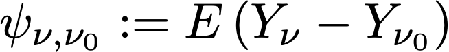
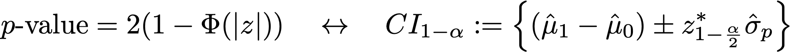

# Statistische berekeningen in het Experimentenrapport begrijpen {#experiment-report-calculations}

Op deze pagina worden de gedetailleerde statistische berekeningen beschreven die in het Experimentatierapport voor campagnes in Adobe Journey Optimizer worden gebruikt.

Deze pagina is bedoeld voor technische gebruikers.

## Conversiesnelheid

De omzettingspercentage of **gemiddelde**, wordt ν   voor elke behandeling `ν` in een Experiment bepaald als verhouding van de som metrisch aan het aantal profielen die aan metrisch, N  worden toegewezen ν :

{width="125" align="center"}

Hier, is Y  ν  de waarde van objectieve metrisch voor elk profiel `i`, dat aan een bepaalde variant *ν* is toegewezen. Wanneer de objectieve metrische waarde een &quot;unieke&quot; metrische waarde is, d.w.z., is het een telling van het aantal profielen dat een bepaalde actie doet, wordt dit getoond als omzettingspercentage, en geformatteerd als percentage. Wanneer metrisch een &quot;telling&quot;of &quot;totale waarde&quot;metrisch (b.v. opent e-mail, opbrengst respectievelijk) is, wordt de gemiddelde schatting voor metrisch getoond als &quot;Aantal per Profiel&quot;, of &quot;Waarde per Profiel&quot;.

Waar nodig wordt de standaardafwijking van het monster gebruikt met de uitdrukking:

{width="225" align="center"}

## Optillen {#lift}

De lift tussen een variant *ν*, en de controlevariant *ν  0* is de relatieve &quot;delta&quot;in omzettingspercentages, die als berekening hieronder worden bepaald waar de individuele omzettingspercentages hierboven worden bepaald. Dit wordt weergegeven als een percentage.

{width="125" align="center"}

 

## Intervallen voor altijd geldige betrouwbaarheidsintervallen voor individuele behandelingen

In het deelvenster Journey Experimentation worden &#39;op elk moment geldige&#39; betrouwbaarheidsintervallen (betrouwbaarheidsreeksen) weergegeven voor afzonderlijke behandelingen in een experiment.

De betrouwbaarheidsvolgorde voor een individuele variant `ν` staat centraal in de statistische methodologie die door Adobe wordt gebruikt. U kunt zijn definitie op [&#x200B; vinden deze pagina &#x200B;](https://doi.org/10.48550/arXiv.2103.06476) (die van [ Waudby-Smith en al.] wordt gereproduceerd).

Als u geïnteresseerd bent in het schatten van een doelparameter `ψ` zoals de conversiesnelheid van een variant in een Experiment, kan de tweedeling tussen een sequentie van &#39;fixed-time&#39; Trust Intervals (CI&#39;s) en een time-uniform Vertrouwensreeks (CS) als volgt worden samengevat:

{width="500" align="center"}

Voor een regelmatig Interval van het Vertrouwen, is de probabilistische garantie dat de doelparameter binnen de waaier van waarden Ċ  n  geldig slechts bij één enkele vaste waarde van `n` (waar `n` het aantal steekproeven is). Omgekeerd geldt voor een reeks vertrouwen dat de waarde &#39;true&#39; van de interesseparameter altijd binnen de grenzen ligt. Dit geldt voor alle waarden van de samplegrootte `t` .

Dit heeft een aantal diepgaande implicaties die zeer belangrijk zijn voor online tests:

* Het CS kan desgewenst worden bijgewerkt wanneer nieuwe gegevens beschikbaar komen.
* Experimenten kunnen continu worden bewaakt, adaptief worden gestopt of voortgezet.
* De type-I fout wordt gecontroleerd bij alle stoptijden, met inbegrip van gegeven-afhankelijke tijden.

Adobe maakt gebruik van Asymptotic Trust Sequences, dat voor een individuele variant met een gemiddelde schatting `μ` de volgende vorm heeft:

{width="300" align="center"}

Waarbij:

* `N` is het aantal eenheden voor die variant.
* `σ` is een steekproefschatting van de standaardafwijking (hierboven gedefinieerd).
* `α` is het gewenste niveau van type-I fout (of wandekkingswaarschijnlijkheid). Dit is altijd ingesteld op 0,05.
*    is een constante die de steekproefgrootte aanpast waarbij CS strak is. Adobe heeft een universele waarde van  2  = 10  - 2.8  gekozen, die voor de soorten omzettingspercentages aangewezen die in online experimenten worden gezien.

## Vertrouwen {#confidence}

Het door Adobe gebruikte vertrouwen is een &quot;op elk moment geldig&quot; vertrouwen, dat wordt verkregen door de betrouwbaarheidsvolgorde voor het gemiddelde behandelingseffect om te keren.

Om precies te zijn, in een twee steekproef *t* test voor het verschil in middel tussen twee varianten, is er een 1:1 afbeelding tussen *p* -waarde voor deze test, en het betrouwbaarheidsinterval voor het verschil in middelen. Door analogie, kan een op elk ogenblik geldige *p* -waarde worden verkregen door de (om het even welk tijd geldige) vertrouwensopeenvolging voor de gemiddelde schatter van het behandelingseffect om te keren:

{width="200" align="center"}

Hier, *E* is een verwachting. De gebruikte schatter is een inverse propensiteit gewogen (IPW) schatter. Overweeg N = N  0  +N  1  eenheden, de varianttoewijzingen voor elke eenheid `i` geëtiketteerd door A  i =0,1 als de eenheid aan variant `ν`=0,1 wordt toegewezen. Als de gebruikers met vaste waarschijnlijkheid (neiging) π  , (1-π  0 ) worden toegewezen, en hun resultaat metrisch is Y  i , dan is de IPW schatter voor het gemiddelde behandelingseffect:

{width="400" align="center"}

Opvallend dat *f* de invloedsfunctie, Waudby-Smith e.a. is. toonde aan dat de Vertrouwensvolgorde voor deze schatter:

{width="500" align="center"}

Vervangend de toewijzingswaarschijnlijkheid door zijn empirische ramingen: π  0  = N  0 /N, kan de variatieterm in termen van individuele steekproefgemiddelde ramingen worden uitgedrukt  0,1  en standaarddeviatieramingen, σ  0,1  als:

{width="500" align="center"}

Daarna, herinner eraan dat voor een regelmatige hypothesetest met teststatistiek z = (μ A  - /σ  0  / p ) er een correspondentie tussen `p` - waarden en betrouwbaarheidsintervallen is:

{width="500" align="center"}

waarbij `Φ` de cumulatieve distributie van de standaard normaal is. Op elk moment kunnen geldige `p` -waarden, gezien de betrouwbaarheidsvolgorde voor het gemiddelde behandelingseffect zoals hierboven gedefinieerd, deze relatie omkeren:

{width="600" align="center"}

Tot slot is het **op elk ogenblik geldige vertrouwen**:

{width="200" align="center"}

## Een experiment declareren als &quot;Sluiten&quot;

Voor een Experimenteer met twee armen, toont het paneel van de Experimentatie van Journey Optimizer een bericht verklarend dat een Experiment **&#x200B;**&#x200B;overtuigend is wanneer het op om het even welke tijd geldige vertrouwen 95% overschrijdt (d.w.z., is de op om het even welk ogenblik geldige `p` - waarde minder dan 5%).

Als er meer dan twee varianten aanwezig zijn, wordt de Bonferoni-correctie toegepast om het gezinssgewijze foutenpercentage te regelen. Voor een experiment met `K` -behandelingen en een enkele basisbehandeling (controle) zijn er `K-1` onafhankelijke hypothesetests. De Bonferoni-correctie betekent dat we de nulhypothese verwerpen dat het besturingselement en een bepaalde variant gelijke middelen hebben, als de op elk moment geldige `p` -waarde (hierboven gedefinieerd) onder een drempelwaarde van `α/(K-1)` ligt.

## Best presterende arm

Wanneer een experiment overtuigend wordt verklaard, wordt de best presterende arm getoond. Dit is de arm met de beste prestaties (hoogste gemiddelde of conversiesnelheid), onder de Set die het besturingselement bevat, en alle armen met een `p` -waarde die onder de Bonferonni-drempel ligt.
