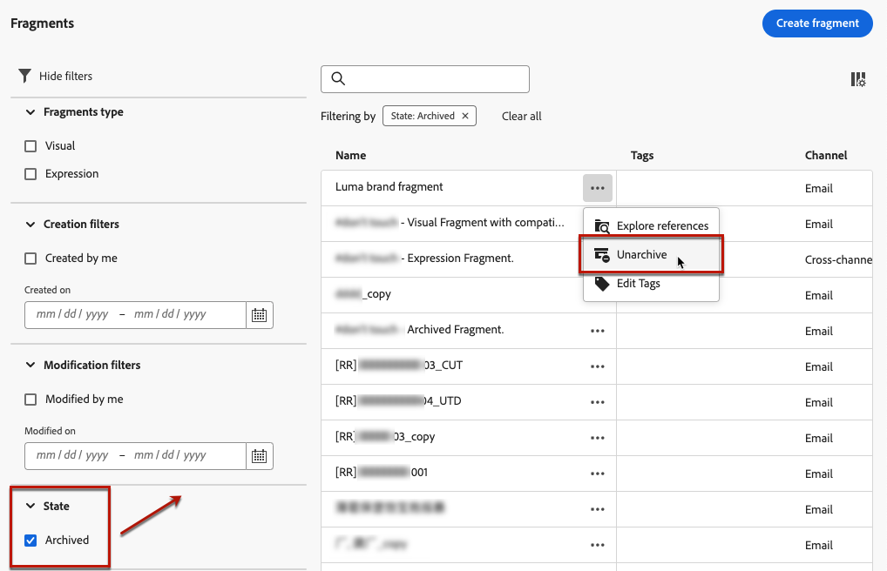

# Werken met fragmenten {#fragments}

>[!CONTEXTUALHELP]
>id="ajo_create_fragment"
>title="Uw eigen fragmenten definiëren"
>abstract="Maak en beheer standalone fragmenten om uw inhoud te hergebruiken voor meerdere reizen en campagnes."
>additional-url="https://experienceleague.adobe.com/docs/journey-optimizer/using/content-management/reusable-content/fragments.html#create-fragments" text="Fragmenten maken"

Een fragment is een herbruikbare component waarnaar in een of meer e-mails kan worden verwezen [!DNL Journey Optimizer] campagnes en reizen.

Met deze functionaliteit kunt u meerdere blokken met aangepaste inhoud vooraf samenstellen. Deze blokken kunnen door marketinggebruikers worden gebruikt om snel e-mailinhoud samen te stellen in een verbeterd ontwerpproces.

➡️ [Leer hoe u fragmenten beheert, ontwerpt en gebruikt in deze video&#39;s](#video-fragments)

U kunt zo veel mogelijk gebruikmaken van fragmenten:

* Maak uw eigen fragmenten. U kunt visuele fragmenten of expressiefragmenten maken. [Meer informatie](#create-fragments)

* Gebruik deze zo vaak als nodig is in de inhoud. Zie [Visuele fragmenten toevoegen](../email/use-visual-fragments.md) en [Expressiefragmenten benutten](../personalization/use-expression-fragments.md)

## Voordat u begint {#fragment-prerequisites}

U moet beschikken over de **[!DNL Manage Library Items]** bevoegdheid opgenomen in de **[!DNL Content Library Manager]** productprofiel. [Meer informatie](../administration/ootb-product-profiles.md#content-library-manager)

In deze versie gelden de volgende beperkingen:

* Visuele fragmenten zijn alleen beschikbaar voor het e-mailkanaal

* Expressiefragmenten zijn niet beschikbaar voor het web en in-app kanalen

## Fragmenten openen en beheren {#access-manage-fragments}

Als u de fragmentlijst wilt openen, selecteert u **[!UICONTROL Content Management]** > **[!UICONTROL Fragments]** in het linkermenu.

Alle fragmenten die op de huidige sandbox zijn gemaakt - ofwel [van de **[!UICONTROL Fragments]** menu](#create-fragments), waarbij de [Opslaan als fragment](#save-as-fragment) -optie - worden weergegeven.

U kunt fragmenten filteren op hun:

* Type: **[!UICONTROL Visual]** of **[!UICONTROL Expression]**
* Tags
* Aanmaakdatum of wijzigingsdatum

U kunt ervoor kiezen om alle fragmenten weer te geven, of alleen de items die de huidige gebruiker heeft gemaakt of gewijzigd.

U kunt ook de **[!UICONTROL Archived]** fragmenten. [Meer informatie](#archive-fragments)

Van de **[!UICONTROL More actions]** naast elk fragment kunt u:

* Dupliceer een fragment.

* Gebruik de **[!UICONTROL Explore references]** de reis, de campagnes of de sjablonen waar deze worden gebruikt. [Meer informatie](#explore-references)

* Kopieer een fragment naar een andere sandbox. <!--Learn more?-->

* Archiveer een fragment. [Meer informatie](#archive-fragments)

* Een fragment bewerken [tags](../start/search-filter-categorize.md#tags).

### Fragmenten bewerken {#edit-fragments}

Voer de onderstaande stappen uit om een fragment te bewerken.

1. Klik op het gewenste item in het pop-upmenu **[!UICONTROL Fragments]** lijst.
1. Vanuit de fragmenteigenschappen kunt u [verwijzingen verkennen](#explore-references), [zijn toegang beheren](../administration/object-based-access.md)en werkt de fragmentdetails bij, inclusief [tags](../start/search-filter-categorize.md#tags).

   

1. Selecteer de bijbehorende knop om de inhoud te bewerken zoals u zou doen bij het maken van een geheel nieuw fragment. [Meer informatie](#create-from-scratch)

>[!NOTE]
>
>Wanneer u een fragment bewerkt, worden de wijzigingen automatisch doorgegeven aan alle inhoud die dat fragment gebruikt, met uitzondering van inhoud die wordt gebruikt in **[!UICONTROL Live]** reizen of campagnes. U kunt de overerving van het oorspronkelijke fragment ook verbreken. Meer informatie in het dialoogvenster [Visuele fragmenten toevoegen aan uw e-mails](../email/use-visual-fragments.md#break-inheritance) en [Expressiefragmenten benutten](../personalization/use-expression-fragments.md#break-inheritance) secties.

### Verwijzingen verkennen {#explore-references}

U kunt een lijst weergeven met de reizen, campagnes en inhoudssjablonen die momenteel een fragment gebruiken.

Selecteer **[!UICONTROL Explore references]** hetzij van de **[!UICONTROL More actions]** in de fragmentlijst of vanuit het scherm met fragmenteigenschappen.

Selecteer een tabblad om te schakelen tussen reizen, campagnes, sjablonen en fragmenten. U kunt hun status zien en op een naam klikken die moet worden omgeleid naar het corresponderende item waar naar het fragment wordt verwezen.

>[!NOTE]
>
>Als het fragment wordt gebruikt in een reis, campagne of sjabloon met een label dat u ervan weerhoudt het te openen, wordt boven op het geselecteerde tabblad een waarschuwingsbericht weergegeven. [Leer meer op de Controle van de Toegang van het Niveau van Objecten (OLAC)](../administration/object-based-access.md)

### Fragmenten archiveren {#archive-fragments}

U kunt de fragmentlijst opruimen van de items die niet meer van belang zijn voor uw merk.

Klik hiertoe op de knop **[!UICONTROL More actions]** naast het gewenste fragment en selecteer **[!UICONTROL Archive]**. Deze verdwijnt uit de fragmentlijst, zodat gebruikers deze niet meer kunnen gebruiken in toekomstige e-mails of sjablonen.

>[!NOTE]
>
>Als u een fragment archiveert dat in een inhoud wordt gebruikt, <!--it will remain in the email or template, but you won't be able to select it from the fragment list to edit it-->de inhoud wordt niet beïnvloed.

Als u een fragment ongedaan wilt maken, filtert u op het tabblad **[!UICONTROL Archived]** items en selecteer **[!UICONTROL Unarchive]** van de **[!UICONTROL More actions]** -menu. Het is nu weer toegankelijk vanuit de fragmentlijst en kan in elke e-mail of sjabloon worden gebruikt.

## Fragmenten maken {#create-fragments}

U kunt op twee manieren fragmenten maken:

* Een geheel nieuw fragment maken met de opdracht **[!UICONTROL Fragments]** speciaal menu. [Meer informatie](#create-from-scratch)

* Sla bij het ontwerpen van inhoud een deel van de inhoud op als fragment. [Meer informatie](#save-as-fragment)

Als het fragment eenmaal is opgeslagen, kan het worden gebruikt in een reis, een campagne of een sjabloon. Of het nu om een geheel nieuw fragment of om bestaande inhoud gaat, u kunt dit fragment nu gebruiken bij het maken van inhoud binnen [!DNL Journey Optimizer]. Zie [Visuele fragmenten toevoegen](../email/use-visual-fragments.md) en [Expressiefragmenten benutten](../personalization/use-expression-fragments.md)

### Maken op basis van niets {#create-from-scratch}

Voer de onderstaande stappen uit om een geheel nieuw fragment te maken.

1. [De fragmentlijst openen](#access-manage-fragments) via de **[!UICONTROL Content Management]** > **[!UICONTROL Fragments]** links.

1. Selecteer **[!UICONTROL Create fragment]**.

1. Vul de fragmentdetails in, d.w.z. naam en beschrijving (indien nodig).

   

1. Selecteer het fragmenttype: [Visueel fragment](#create-visual-fragment) of [Expressiefragment](#create-expression-fragment).

1. Als u aangepaste of basislabels voor gegevensgebruik aan het fragment wilt toewijzen, selecteert u **[!UICONTROL Manage access]**. [Leer meer op de Controle van de Toegang van het Niveau van Objecten (OLAC)](../administration/object-based-access.md).

1. Adobe Experience Platform-tags selecteren of maken vanuit het menu **[!UICONTROL Tags]** veld om het fragment te categoriseren voor een betere zoekopdracht. [Meer informatie](../start/search-filter-categorize.md#tags)

1. Klik op **[!UICONTROL Create]**.

### Een visueel fragment maken {#create-visual-fragment}

>[!CONTEXTUALHELP]
>id="ajo_create_visual_fragment"
>title="Selecteer het visuele type"
>abstract="Maak een zelfstandig visueel fragment om uw inhoud te hergebruiken in een e-mail binnen een reis, een campagne of een inhoudssjabloon."
>additional-url="https://experienceleague.adobe.com/docs/journey-optimizer/using/email/design-email/add-content/use-visual-fragments.html" text="Visuele fragmenten toevoegen aan uw e-mails"

1. [Een fragment maken](#create-from-scratch) van de **[!UICONTROL Content Management]** > **[!UICONTROL Fragments]** en selecteert u de **[!UICONTROL Visual fragment]** type.

   >[!NOTE]
   >
   >Op dit moment geldt voor visuele fragmenten alleen het dialoogvenster **E-mail** wordt ondersteund.

1. De [E-mailDesigner](../email/get-started-email-design.md) worden weergegeven. Bewerk uw inhoud naar wens, net zoals u dat zou doen voor elke e-mail binnen een reis of campagne.

   >[!NOTE]
   >
   >U kunt aanpassingsvelden en dynamische inhoud toevoegen, maar contextafhankelijke kenmerken worden niet ondersteund in fragmenten.

   

1. Wanneer het fragment gereed is, klikt u op **[!UICONTROL Save]**. Het wordt toegevoegd aan de [fragmentlijst](#access-manage-fragments).

1. Klik zo nodig op de pijl naast de fragmentnaam om terug te gaan naar de map **[!UICONTROL Details]** en bewerken.

   

Dit fragment kan nu worden gebruikt bij het maken van [email](../email/get-started-email-design.md) of [inhoudssjabloon](content-templates.md) binnen [!DNL Journey Optimizer]. [Meer informatie](../email/use-visual-fragments.md)

### Een expressiefragment maken {#create-expression-fragment}

>[!CONTEXTUALHELP]
>id="ajo_create_expression_fragment"
>title="Expressietype selecteren"
>abstract="Maak een zelfstandig expressiefragment om uw inhoud te hergebruiken voor meerdere reizen en campagnes. Wanneer u de expressie-editor gebruikt, kunt u alle uitdrukkingsfragmenten benutten die in de huidige sandbox zijn gemaakt."
>additional-url="https://experienceleague.adobe.com/docs/journey-optimizer/using/content-management/personalization/expression-editor/use-expression-fragments.html" text="Expressiefragmenten benutten"

1. [Een fragment maken](#create-from-scratch) van de **[!UICONTROL Content Management]** > **[!UICONTROL Fragments]** en selecteert u de **[!UICONTROL Expression fragment]** type.

1. Selecteer het type code dat u wilt gebruiken: **[!UICONTROL HTML]**, **[!UICONTROL JSON]** of **[!UICONTROL Text]**.

   

   <!--Expression fragments can be used in any channel.-->

1. Klik op **[!UICONTROL Create]**. De expressie-editor wordt geopend.

1. U kunt de [!DNL Journey Optimizer] De redacteur van de uitdrukking met al zijn verpersoonlijking en auteursmogelijkheden. [Meer informatie](../personalization/personalization-build-expressions.md)

   

1. Wanneer het fragment gereed is, klikt u op **[!UICONTROL Save]**. Het wordt toegevoegd aan de [fragmentlijst](#access-manage-fragments).

1. Klik zo nodig op de pijl naast de fragmentnaam om terug te gaan naar de map **[!UICONTROL Details]** en bewerken.

Dit fragment kan nu worden gebruikt bij het maken van inhoud in het dialoogvenster [!DNL Journey Optimizer] Expressieeditor. [Meer informatie](../personalization/use-expression-fragments.md)

## Opslaan als fragment {#save-as-fragment}

Bij het bewerken van inhoud in [!DNL Journey Optimizer], kunt u de inhoud geheel of gedeeltelijk opslaan als fragment voor toekomstig hergebruik.

### Opslaan als visueel fragment {#save-as-visual-fragment}

Wanneer u een [inhoudssjabloon](content-templates.md) of een [email](../email/get-started-email-design.md) in een campagne of een reis, kunt u een gedeelte van uw inhoud als visueel fragment bewaren. Volg de onderstaande stappen om dit te doen.

1. In de [E-mailDesigner](../email/get-started-email-design.md)Klik op de ellips rechtsboven in het scherm.

1. Selecteren **[!UICONTROL Save as fragment]** in het keuzemenu.

   

1. De **[!UICONTROL Save as fragment]** schermweergaven. Hier selecteert u de elementen die u in het fragment wilt opnemen, inclusief personalisatievelden en dynamische inhoud. Contextuele kenmerken worden niet ondersteund in fragmenten.

   >[!CAUTION]
   >
   >U kunt alleen secties selecteren die aan elkaar grenzen. U kunt geen lege structuur of een ander fragment selecteren.

   

1. Klik op **[!UICONTROL Create]**. Vul de fragmentdetails in, d.w.z. naam en beschrijving (indien nodig).

1. Als u aangepaste of basislabels voor gegevensgebruik aan het fragment wilt toewijzen, selecteert u **[!UICONTROL Manage access]**. [Leer meer op de Controle van de Toegang van het Niveau van Objecten (OLAC)](../administration/object-based-access.md).

1. Adobe Experience Platform-tags selecteren of maken vanuit het menu **Tags** veld om de sjabloon te categoriseren voor een betere zoekopdracht. [Meer informatie](../start/search-filter-categorize.md#tags)

1. Klikken **[!UICONTROL Create]** opnieuw. Het fragment wordt opgeslagen in toegevoegd aan de [fragmentlijst](#access-manage-fragments), toegankelijk via de [!DNL Journey Optimizer] speciaal menu.

   Het wordt een zelfstandig fragment dat [benaderd](#access-manage-fragments), [bewerkt](#edit-fragments) en [gearchiveerd](#archive-fragments) zoals elk ander item op die lijst.

U kunt dit fragment nu gebruiken wanneer u een [email](../email/get-started-email-design.md) of [inhoudssjabloon](content-templates.md) binnen [!DNL Journey Optimizer]. [Meer informatie](../email/use-visual-fragments.md)

>[!NOTE]
>
>Wijzigingen in dat nieuwe fragment worden niet doorgegeven aan het e-mailbericht of de sjabloon waaruit het fragment afkomstig is. Op dezelfde manier wordt het nieuwe fragment niet gewijzigd wanneer de oorspronkelijke inhoud wordt bewerkt in het e-mailbericht of de sjabloon.

### Opslaan als expressiefragment {#save-as-expression-fragment}

>[!CONTEXTUALHELP]
>id="ajo_perso_library"
>title="Opslaan als expressiefragment"
>abstract="De [!DNL Journey Optimizer] Met de expressieeditor kunt u inhoud opslaan als expressiefragmenten. Deze expressies zijn vervolgens beschikbaar voor het samenstellen van gepersonaliseerde inhoud."

De [!DNL Journey Optimizer] Met de expressieeditor kunt u inhoud opslaan als expressiefragmenten. Deze expressies zijn vervolgens beschikbaar voor het samenstellen van gepersonaliseerde inhoud.

Voer de onderstaande stappen uit om inhoud op te slaan als een expressiefragment.

1. In de [Expression-editor](../personalization/personalization-build-expressions.md) interface, bouwt een uitdrukking, dan klikt **[!UICONTROL Save as fragment]**.

1. Voer in het rechterdeelvenster een naam en een beschrijving in voor de expressie, zodat gebruikers deze gemakkelijker kunnen vinden.

   

1. Klik op **[!UICONTROL Save fragment]**.

   <!--An expression fragment cannot be nested inside another fragment.-->

1. Het uitdrukkingsfragment wordt toegevoegd aan [fragmentlijst](#access-manage-fragments). U kunt het nu gebruiken om gepersonaliseerde inhoud te bouwen.

>[!NOTE]
>
>Expressies mogen niet groter zijn dan 200 kB.

## Hoe kan ik-video {#video-fragments}

Leer hoe u visuele fragmenten beheert, ontwerpt en gebruikt in [!DNL Journey Optimizer].

>[!VIDEO](https://video.tv.adobe.com/v/3419932/?quality=12)

Leer hoe u expressiefragmenten beheert, ontwerpt en gebruikt in [!DNL Journey Optimizer].

>[!VIDEO](https://video.tv.adobe.com/v/3424587/?quality=12)
