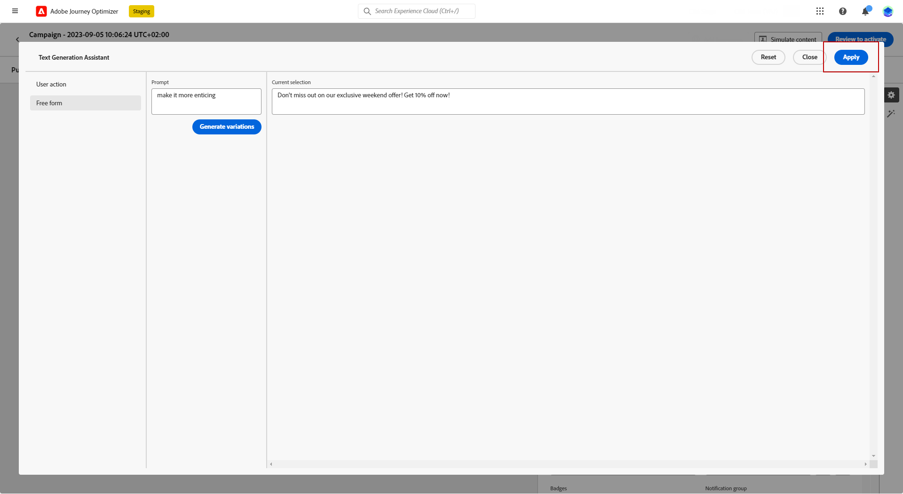

# Inhoud genereren met de inhoudsassistent {#title-content-assistant}

>[!BEGINSHADEBOX]

**Inhoudsopgave**

* [Aan de slag met de inhoudsassistent](gs-generative.md)
* **[Inhoud genereren met de inhoudsassistent](generative-content.md)**
* [Afbeeldingen genereren met de Content Assistant](generative-image.md)

>[!ENDSHADEBOX]

Zodra u hebt gecreeerd en uw berichten gepersonaliseerd, neem uw inhoud aan het volgende niveau met de medewerker van de Inhoud.

Door de Inhoudsassistent te benutten, hebt u de mogelijkheid om de impact van uw bericht te optimaliseren door te experimenteren met andere inhoud. Elke variant wordt beschouwd als een unieke behandeling, om te meten en te vergelijken welke inhoud effectief meer kliks produceert.

In dit voorbeeld leert u hoe u een aansprekende pushmelding verzendt met gebruik van Content Experiment. Voer de volgende stappen uit:

1. Nadat u de pushmeldingscampagne hebt gemaakt en geconfigureerd, klikt u op **[!UICONTROL Create content]**.

1. Gebruik de medewerker van de Generatie om het **[!UICONTROL Title]**.

   Volgende **[!UICONTROL Header]** veld, klikken **[!UICONTROL Edit with Text generation assistant]**.

   

1. Van de **[!UICONTROL User action]** , selecteert u de **[!UICONTROL Text refinement]**:

   * **[!UICONTROL Summarize]**: Gebruik deze optie om een tekst in te korten en de essentie te behouden.

   * **[!UICONTROL Elaborate]**: Gebruik deze optie om uw inhoud uit te breiden met extra creatieve varianten van de Content Assistant.

   

1. Kies de toon van de varianten met de **[!UICONTROL Change tone of voice]** -menu.

1. Van de **[!UICONTROL Free form]** kunt u er ook voor kiezen een vraag op te geven om de resultaten beter af te stemmen.

   

1. Als u de juiste variant hebt gevonden, klikt u op **[!UICONTROL User variant]** dan **[!UICONTROL Apply]**.

   

1. Na het aanpassen van **[!UICONTROL Body]** van uw pushmelding selecteert u **[!UICONTROL Show Content assistant]**.

   Hier is al een lijst met variaties beschikbaar die uw oorspronkelijke inhoud gebruikt.

   

1. Verfijn de inhoud door te beschrijven wat u wilt genereren.

   De optie **[!UICONTROL Enhance with current content]** optie voor de medewerker van de Inhoud om nieuwe inhoud te personaliseren die op uw bericht, naam van de campagne, en geselecteerd publiek wordt gebaseerd.

1. Klikken **[!UICONTROL Replace]** om de inhoud te wijzigen of meerdere **[!UICONTROL Variant]** om **[!UICONTROL Treatments]** voor uw Experimentatie en klik op **X-behandeling(en) toevoegen**.

   

1. Toegang krijgen tot de **[!UICONTROL Experiment settings]** of **[!UICONTROL Actions]** menu&#39;s om uw Experiment verder aan te passen. [Meer informatie](../campaigns/content-experiment.md)

   

1. Nadat u de inhoud van uw bericht hebt gedefinieerd, klikt u op de knop **[!UICONTROL Simulate content]** om de rendering te beheren en personalisatie-instellingen te controleren met testprofielen. [Meer informatie](../email/preview.md)

1. Wanneer uw inhoudexperiment gereed is, kunt u vanuit de overzichtspagina van de campagne op **[!UICONTROL Review to activate]** om een overzicht van de campagne weer te geven. Waarschuwt de weergave als een parameter onjuist is of ontbreekt.

1. Controleer voordat u de campagne start of alle configuraties correct zijn en klik op **[!UICONTROL Activate]**.

Na het met succes vormen van uw experimenteren en campagne, kunt u uw campagne in het campagnerapport volgen. [Meer informatie](../reports/campaign-global-report.md#experimentation-report)
