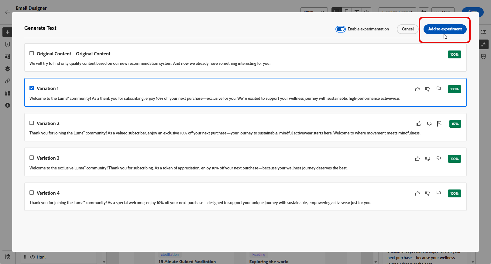

# Experimenteer met inhoud met AI Assistant{#generative-experimentation}

>[!IMPORTANT]
>
>Alvorens te beginnen gebruikend dit vermogen, lees uit verwante [&#x200B; Grafieken en Beperkingen &#x200B;](gs-generative.md#generative-guardrails).
> 
>
>U moet met a [&#x200B; gebruikersovereenkomst &#x200B;](https://www.adobe.com/legal/licenses-terms/adobe-dx-gen-ai-user-guidelines.html) akkoord gaan alvorens u AI Medewerker in Journey Optimizer kunt gebruiken. Neem voor meer informatie contact op met uw Adobe-vertegenwoordiger.

Nadat u uw berichten hebt gemaakt en gepersonaliseerd, kunt u de inhoud optillen met AI Assistant in Adobe Journey Optimizer, die de functie Experiment met inhoud bevat. Met dit gereedschap kunt u meerdere leveringsbehandelingen definiëren, variërende inhoud, om de prestaties voor het doelpubliek te meten.

1. Maak uw campagne en gebruik AI Assistant om uw varianten te genereren.

   In dit voorbeeld hebben we een bevestigingsbericht voor een abonnement met een promotiecode gegenereerd.

   

1. Blader door de gegenereerde **[!UICONTROL Variations]** tekst en klik op **[!UICONTROL Preview]** om een schermvullende versie van de geselecteerde variant weer te geven.

   

1. Selecteer **[!UICONTROL Enable Experiment]** om te beginnen met het maken van **[!UICONTROL Treatments]** voor uw experimenten.

1. Selecteer de variaties die u wilt opnemen in het experiment.

1. Klik **toevoegen aan experiment**.

   

1. Vanuit uw Content Experiment kunt u nu uw inhoud-experimenteren configureren. [&#x200B; Leer meer over de Experiment van de Inhoud &#x200B;](../content-management/content-experiment.md)

1. Wanneer uw Content-experiment gereed is, kunt u vanaf de overzichtspagina van de campagne op **[!UICONTROL Review to activate]** klikken om een overzicht van de campagne weer te geven. Waarschuwt de weergave als een parameter onjuist is of ontbreekt. [Meer informatie](../content-management/content-experiment.md#treatment-experiment)

1. Controleer voordat u de campagne start of alle configuraties correct zijn en klik op **[!UICONTROL Activate]** .

Nadat u uw campagne met succes hebt geconfigureerd en gepersonaliseerd, kunt u uw campagne bijhouden in het campagnerapport. [Meer informatie](../reports/campaign-global-report-cja.md)
