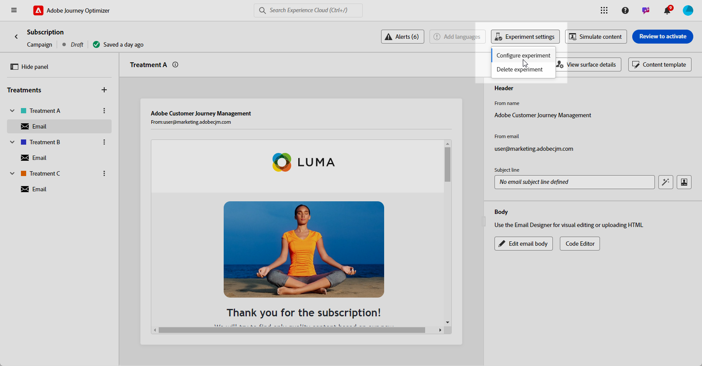

# Inhoud experimenteren met de AI Assistant {#generative-experimentation}

>[!BEGINSHADEBOX]

**Inhoudsopgave**

* [Aan de slag met de AI Assistant](gs-generative.md)
* [E-mailgeneratie met AI Assistant](generative-email.md)
* [SMS genereren met de AI Assistant](generative-sms.md)
* [Push generation met de AI Assistant](generative-push.md)
* Inhoud experimenteren met de AI Assistant

>[!ENDSHADEBOX]

Nadat u uw berichten hebt gemaakt en gepersonaliseerd, kunt u de inhoud optillen met de AI Assistant in Adobe Journey Optimizer, die de functie Experiment met inhoud bevat. Met dit gereedschap kunt u meerdere leveringsbehandelingen definiëren, variërende inhoud, om de prestaties voor het doelpubliek te meten.

1. Maak uw campagne en gebruik de AI-assistent om uw varianten te genereren.

   In dit voorbeeld hebben we een bevestigingsbericht voor een abonnement met een promotiecode gegenereerd.

   

1. Door de gegenereerde **[!UICONTROL Variations]** en klik op **[!UICONTROL Preview]** om een versie van de geselecteerde variatie op het volledige scherm weer te geven.

   

1. Selecteren **[!UICONTROL Enable Experiment]** om te beginnen met maken **[!UICONTROL Treatments]** voor uw experimenten.

1. Selecteer de variaties die u wilt opnemen in het experiment.

1. Klikken **X-behandeling(en) toevoegen**.

   

1. Open vanuit het venster van de Content Experiment de **[!UICONTROL Experiment settings]** om uw experiment te vormen. [Meer informatie over het experimenteren met inhoud](../campaigns/content-experiment.md)

   

1. Wanneer uw Content-experiment gereed is, kunt u vanuit de overzichtspagina van de campagne op **[!UICONTROL Review to activate]** om een overzicht van de campagne weer te geven. Waarschuwt de weergave als een parameter onjuist is of ontbreekt. [Meer informatie](../campaigns/content-experiment.md#treatment-experiment)

1. Controleer voordat u de campagne start of alle configuraties correct zijn en klik op **[!UICONTROL Activate]**.

Nadat u uw campagne met succes hebt geconfigureerd en gepersonaliseerd, kunt u uw campagne bijhouden in het campagnerapport. [Meer informatie](../reports/campaign-global-report.md)
