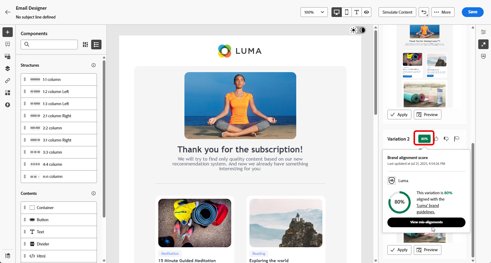

# Volledige inhoud genereren met AI Assistant {#generative-full-content}

>[!IMPORTANT]
>
>Alvorens te beginnen gebruikend dit vermogen, lees uit verwante [ Grafieken en Beperkingen ](gs-generative.md#generative-guardrails).
> 
>
>U moet met a [ gebruikersovereenkomst ](https://www.adobe.com/legal/licenses-terms/adobe-dx-gen-ai-user-guidelines.html) akkoord gaan alvorens u AI Medewerker in Journey Optimizer kunt gebruiken. Neem voor meer informatie contact op met uw Adobe-vertegenwoordiger.

Met AI Assistant in Journey Optimizer kunt u volledige inhoud genereren via uw e-mail-, web-, landingspagina&#39;s en pushberichtkanalen. Met AI Assistant kunt u de impact van uw leveringen optimaliseren door uitgebreide inhoud te maken die aansluit bij uw publiek.

## Voor e-mail- en webkanalen {#email-web-channels}

Met AI Assistant kunt u complete inhoud produceren voor uw e-mailcampagnes, webpagina&#39;s en bestemmingspagina&#39;s en zo zowel tekst als afbeeldingen genereren. Dankzij deze robuuste functionaliteit kunt u aantrekkelijke, on-brand-inhoud maken die op alle digitale aanraakpunten met uw publiek in verbinding staat.

### Toegang en configuratie {#access-configure}

Voordat u inhoud gaat maken met AI Assistant, moet u eerst uw campagne of reis instellen en de inhoudeditor openen. Gebruik de onderstaande stappen om uw werkruimte voor te bereiden en het deelvenster AI Assistant te openen.

1. Maak en configureer uw campagne of reis:
   * **E-mail**: Na het creëren van en het vormen van uw e-mailcampagne, klik **[!UICONTROL Edit content]**. [Meer informatie](../campaigns/create-campaign.md)
   * **Web**: Na het creëren van en het vormen van uw Web-pagina, klik **[!UICONTROL Edit web page]**. [Meer informatie](../web/create-web.md)
   * **het Bestaan Pagina**: Na het creëren van en het vormen van uw het landen pagina, klik **[!UICONTROL Open designer]**. [Meer informatie](../landing-pages/create-lp.md)

1. Selecteer **[!UICONTROL AI Assistant]** (of **[!UICONTROL Show Content Assistant]** voor web) in het rechtermenu.

   {zoomable="yes"}

### Inhoud genereren {#generate-content}

Met de open Medewerker van AI, kunt u de generatie montages nu vormen om inhoud tot stand te brengen die uw merk en campagnedoelstellingen aanpast. Pas tekst- en afbeeldingsparameters aan, voeg merkelementen toe en geef de AI aanwijzingen om relevante variaties voor uw publiek te genereren.

1. Selecteer **[!UICONTROL Brand]** om te zorgen dat door AI gegenereerde inhoud wordt uitgelijnd op de specificaties van uw merk. [ leer meer ](brands.md) op Banden.

1. Verfijn de inhoud door te beschrijven wat u wilt genereren in het veld **[!UICONTROL Prompt]** .

   Als u hulp bij het ontwerpen van uw herinnering zoekt, toegang **[!UICONTROL Prompt Library]** die een diverse waaier van snelle ideeën verstrekt om uw campagnes te verbeteren. [ Leer meer op snelle beste praktijken ](ai-assistant-prompting-guide.md)

   {zoomable="yes"}

1. **voor E-mail**, kunt u **[!UICONTROL Subject line]** en **[!UICONTROL Preheader]** opties van een knevel voorzien om hen in de variantgeneratie te omvatten.

1. Volg uw vraag met de optie **[!UICONTROL Text settings]** :

   * **[!UICONTROL Communication strategy]**: Kies de meest geschikte communicatiestijl voor de gegenereerde tekst.
   * **[!UICONTROL Languages]**: kies de taal van de gegenereerde inhoud.
   * **[!UICONTROL Tone]**: De toon zou met uw publiek moeten resoneren. Of u informatief wilt klinken, playful, of overtuigend, AI Medewerker kan het bericht dienovereenkomstig aanpassen.

     {zoomable="yes"}

1. Kies uw **[!UICONTROL Image settings]** :

   * **[!UICONTROL Content type]**: hiermee wordt de aard van het visuele element gecategoriseerd, waarbij onderscheid wordt gemaakt tussen verschillende vormen van visuele representatie, zoals foto&#39;s, afbeeldingen of illustraties.
   * **[!UICONTROL Visual intensity]**: U kunt de invloed van de afbeelding bepalen door de intensiteit ervan aan te passen. Bij een lagere instelling (2) wordt het uiterlijk zachter en minder sterk, terwijl bij een hogere instelling (10) de afbeelding levendiger en visueel krachtiger wordt.
   * **[!UICONTROL Color & tone]**: De algemene weergave van de kleuren in een afbeelding en de sfeer die of de sfeer die door de afbeelding wordt overgebracht.
   * **[!UICONTROL Lighting]**: hiermee wordt de bliksemschicht in een afbeelding bedoeld, die de atmosfeer van de afbeelding bepaalt en specifieke elementen markeert.
   * **[!UICONTROL Composition]**: dit heeft betrekking op de rangschikking van elementen binnen het kader van een afbeelding

     {zoomable="yes"}

1. Klik in het menu **[!UICONTROL Reference content]** op **[!UICONTROL Upload file]** om een merkelement toe te voegen dat inhoud bevat die extra context-AI-assistent kan bieden of selecteer een eerder geüpload element.

   Eerder geüploade bestanden zijn beschikbaar in de vervolgkeuzelijst **[!UICONTROL Uploaded reference content]** . Schakel eenvoudig de elementen in die u wilt opnemen in uw generatie.

   {zoomable="yes"}

1. Klik op **[!UICONTROL Generate]** als de vraag gereed is.

### Verfijnen en voltooien {#refine-finalize}

Nadat u variaties in de inhoud hebt gegenereerd, kunt u de resultaten perfectioneren om ervoor te zorgen dat deze precies aan uw vereisten voldoen. Bekijk de uitlijning van het merk, pas de toon en de taal aan en bereid de inhoud voor activering in uw campagne of reis.

1. Blader na het genereren door de **[!UICONTROL Variations]** .

1. Klik op het percentagepictogram om uw **[!UICONTROL Brand Alignment Score]** weer te geven en eventuele onjuiste uitlijningen met uw merk te identificeren.

   Leer meer op [ de groeperingsscore van het Merk ](brands-score.md).

   {zoomable="yes"} tonen

1. Klik op **[!UICONTROL Preview]** om een schermvullende versie van de geselecteerde variant weer te geven of op **[!UICONTROL Apply]** om de huidige inhoud te vervangen.

1. Navigeer naar de optie **[!UICONTROL Refine]** in het **[!UICONTROL Preview]** -venster voor toegang tot extra aanpassingsfuncties:

   * **[!UICONTROL Rephrase]**: herschrijf het bericht terwijl de betekenis behouden blijft. Met deze optie kunt u alternatieve bewoordingen genereren, de stroom verbeteren of de formulering aanpassen zonder het kernbericht te wijzigen.

   * **[!UICONTROL Use simpler language]**: Gebruik AI Assistant om uw taal te vereenvoudigen, zodat een groter publiek helderheid en toegankelijkheid krijgt.

   * **[!UICONTROL Translate]**: Vereenvoudig uw taal voor meer duidelijkheid en toegankelijkheid voor een groter publiek.

   * **[!UICONTROL Change tone]**: pas de toon van het bericht aan om uw communicatie stijl beter aan te passen, d.w.z. het vriendelijker, professioneel, dringend, of inspirerend te maken.

   * **[!UICONTROL Change Communication strategy]**: wijzig de berichtenbenadering op basis van uw doelstellingen, zoals het creëren van urgentie, of het benadrukken van opwindende aantrekkingskracht.

     {zoomable="yes"}

1. Open het **[!UICONTROL Brand Alignment]** lusje om te zien hoe uw inhoud zich op uw [ merkrichtlijnen ](brands.md) richt.

1. Klik op **[!UICONTROL Select]** zodra u de juiste inhoud hebt gevonden.

   U kunt ook experimenteren met uw inhoud inschakelen. [Meer informatie](generative-experimentation.md)

1. Voeg verpersoonlijkingsgebieden in om uw inhoud aan te passen die op profielgegevens wordt gebaseerd. Klik vervolgens op de knop **[!UICONTROL Simulate content]** om de rendering te beheren en controleer de instellingen voor aanpassing met testprofielen. [Meer informatie](../personalization/personalize.md)

1. Bekijk en activeer uw inhoud:
   * **E-mail**: Wanneer u uw inhoud, publiek en programma hebt bepaald, bent u klaar om uw e-mailcampagne voor te bereiden. [Meer informatie](../campaigns/review-activate-campaign.md)
   * **Web**: Zodra u uw montages van de Webcampagne bepaalde en uw inhoud zoals gewenst uitgeeft, kunt u uw Webcampagne herzien en activeren. [Meer informatie](../web/create-web.md#activate-web-campaign)
   * **het Bestaan Pagina**: Zodra uw het landen pagina klaar is, kunt u het publiceren om het voor gebruik in een bericht ter beschikking te stellen. [Meer informatie](../landing-pages/create-lp.md#publish-landing-page)

## Voor mobiele kanalen {#mobile-channels}

AI Assistant biedt ook ondersteuning voor het genereren van inhoud voor mobiele pushberichten, zodat u aantrekkelijke titels, berichten en afbeeldingen voor uw mobiele apps kunt maken. Hierdoor kunt u consistente communicatie van hoge kwaliteit onderhouden voor alle aanraakpunten van klanten, inclusief mobiele apparaten.

### Toegang en configuratie {#mobile-access-configure}

Als u AI Assistant wilt gebruiken voor pushberichten, moet u eerst de pushcampagne instellen en de inhoudeditor openen. De onderstaande stappen begeleiden u bij het voorbereiden van uw campagne en het openen van de AI Assistant-tools.

1. Klik op **[!UICONTROL Edit content]** nadat u de pushmeldingscampagne hebt gemaakt en geconfigureerd.

   Voor meer informatie over hoe te om uw campagne van het pushbericht te vormen, verwijs naar [ deze pagina ](../push/create-push.md).

1. Vul **[!UICONTROL Basic details]** in voor uw campagne. Klik op **[!UICONTROL Edit content]** als u klaar bent.

1. Pas uw pushmelding naar wens aan. [Meer informatie](../push/design-push.md)

1. Open het menu **[!UICONTROL Show AI Assistant]** .

   {zoomable="yes"}

### Inhoud genereren {#mobile-generate-content}

Als u AI Assistant hebt geopend voor pushberichten, kunt u de instellingen voor het genereren van aansprekende mobiele inhoud configureren. Definieer de tekst- en afbeeldingsvoorkeuren, selecteer merkelementen en gebruik aanwijzingen om variaties in pushmeldingen te genereren voor mobiele gebruikers.

1. Schakel de optie **[!UICONTROL Use original content]** voor AI Assistant in om nieuwe inhoud aan te passen op basis van de geselecteerde inhoud.

1. Selecteer **[!UICONTROL Brand]** om te zorgen dat door AI gegenereerde inhoud wordt uitgelijnd op de specificaties van uw merk. [ leer meer ](brands.md) op Banden.

   Merk op dat de eigenschap van Merken als privé bèta wordt vrijgegeven en aan alle klanten in toekomstige versies geleidelijk beschikbaar zal zijn.

1. Verfijn de inhoud door te beschrijven wat u wilt genereren in het veld **[!UICONTROL Prompt]** .

   Als u hulp bij het ontwerpen van uw herinnering zoekt, toegang **[!UICONTROL Prompt Library]** die een diverse waaier van snelle ideeën verstrekt om uw campagnes te verbeteren.

   {zoomable="yes"}

1. Kies welk veld u wilt genereren: **[!UICONTROL Title]** , **[!UICONTROL Message]** en/of **[!UICONTROL Image]** .

1. Volg uw vraag met de optie **[!UICONTROL Text settings]** :

   * **[!UICONTROL Communication strategy]**: Kies de meest geschikte communicatiestijl voor de gegenereerde tekst.
   * **[!UICONTROL Languages]**: kies de taal van de gegenereerde inhoud.
   * **[!UICONTROL Tone]**: De toon van uw pushberichten zou met uw publiek moeten resoneren. Of u informatief wilt klinken, playful, of overtuigend, AI Medewerker kan het bericht dienovereenkomstig aanpassen.

     {zoomable="yes"}

1. Kies uw **[!UICONTROL Image settings]** :

   * **[!UICONTROL Content type]**: hiermee wordt de aard van het visuele element gecategoriseerd, waarbij onderscheid wordt gemaakt tussen verschillende vormen van visuele representatie, zoals foto&#39;s, afbeeldingen of illustraties.
   * **[!UICONTROL Visual intensity]**: U kunt de invloed van de afbeelding bepalen door de intensiteit ervan aan te passen. Bij een lagere instelling (2) wordt het uiterlijk zachter en minder sterk, terwijl bij een hogere instelling (10) de afbeelding levendiger en visueel krachtiger wordt.
   * **[!UICONTROL Color & tone]**: De algemene weergave van de kleuren in een afbeelding en de sfeer die of de sfeer die door de afbeelding wordt overgebracht.
   * **[!UICONTROL Lighting]**: hiermee wordt de bliksemschicht in een afbeelding bedoeld, die de atmosfeer van de afbeelding bepaalt en specifieke elementen markeert.
   * **[!UICONTROL Composition]**: dit heeft betrekking op de rangschikking van elementen binnen het kader van een afbeelding

     {zoomable="yes"}

1. Klik in het menu **[!UICONTROL Reference content]** op **[!UICONTROL Upload file]** om een merkelement toe te voegen dat inhoud bevat die extra context-AI-assistent kan bieden of selecteer een eerder geüpload element.

   Eerder geüploade bestanden zijn beschikbaar in de vervolgkeuzelijst **[!UICONTROL Uploaded reference content]** . Schakel eenvoudig de elementen in die u wilt opnemen in uw generatie.

1. Klik op **[!UICONTROL Generate]** als de vraag gereed is.

### Verfijnen en voltooien {#mobile-refine-finalize}

Nadat u de gegenereerde variaties van pushmeldingen hebt bekeken, kunt u de inhoud perfectioneren. Gebruik verfijningsgereedschappen om de taal en toon aan te passen, de uitlijning van het merk te controleren en de inhoud aan te passen voordat u uw pushcampagne activeert.

1. Blader door het gegenereerde bestand **[!UICONTROL Variations]** .

1. Klik op het percentagepictogram om uw **[!UICONTROL Brand Alignment Score]** weer te geven en eventuele onjuiste uitlijningen met uw merk te identificeren.

   Leer meer op [ de groeperingsscore van het Merk ](brands-score.md).

   {zoomable="yes"}

1. Klik op **[!UICONTROL Preview]** om een schermvullende versie van de geselecteerde variant weer te geven of klik op **[!UICONTROL Apply]** om de huidige inhoud te vervangen.

1. Navigeer naar de optie **[!UICONTROL Refine]** in het **[!UICONTROL Preview]** -venster voor toegang tot extra aanpassingsfuncties:

   * **[!UICONTROL Use as reference content]**: De gekozen variant zal als verwijzingsinhoud voor het produceren van andere resultaten dienen.

   * **[!UICONTROL Rephrase]**: herschrijf het bericht terwijl de betekenis behouden blijft. Met deze optie kunt u alternatieve bewoordingen genereren, de stroom verbeteren of de formulering aanpassen zonder het kernbericht te wijzigen.

   * **[!UICONTROL Use simpler language]**: Gebruik AI Assistant om uw taal te vereenvoudigen, zodat een groter publiek helderheid en toegankelijkheid krijgt.

   * **[!UICONTROL Change tone]**: pas de toon van het bericht aan om uw communicatie stijl beter aan te passen, d.w.z. het vriendelijker, professioneel, dringend, of inspirerend te maken.

   * **[!UICONTROL Change Communication strategy]**: wijzig de berichtenbenadering op basis van uw doelstellingen, zoals het creëren van urgentie, of het benadrukken van opwindende aantrekkingskracht.

     {zoomable="yes"}

1. Open het **[!UICONTROL Brand Alignment]** lusje om te zien hoe uw inhoud zich op uw [ merkrichtlijnen ](brands.md) richt.

1. Klik op **[!UICONTROL Select]** zodra u de juiste inhoud hebt gevonden.

   U kunt ook experimenteren met uw inhoud inschakelen. [Meer informatie](generative-experimentation.md)

1. Voeg verpersoonlijkingsgebieden in om uw inhoud van het pushbericht aan te passen die op profielgegevens wordt gebaseerd. Klik vervolgens op de knop **[!UICONTROL Simulate content]** om de rendering te beheren en controleer de instellingen voor aanpassing met testprofielen. [Meer informatie](../personalization/personalize.md)

Wanneer u de inhoud, het publiek en het programma hebt gedefinieerd, kunt u uw pushcampagne voorbereiden. [Meer informatie](../campaigns/review-activate-campaign.md)

## Hoe kan ik-video {#video}

Leer hoe u met AI Assistant in Journey Optimizer volledige inhoud kunt genereren.

>[!VIDEO](https://video.tv.adobe.com/v/3433552)
