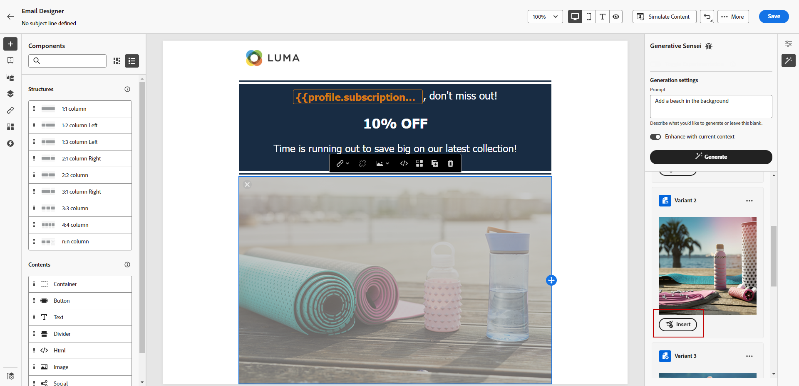

# Afbeeldingen genereren met de AI-assistent {#image-content-assistant}

>[!BEGINSHADEBOX]

**Inhoudsopgave**

* [Aan de slag met de AI Assistant](gs-generative.md)
* [Tekst genereren met de AI Assistant](generative-content.md)
* **[Afbeeldingen genereren met de AI Assistant](generative-image.md)**

>[!ENDSHADEBOX]

Als je eenmaal je e-mails of webpagina&#39;s hebt gemaakt en aangepast, ga je naar het volgende niveau met Journey Optimizer AI Assistant. Met dit krachtige gereedschap kunt u uw inhoud moeiteloos aanpassen en verbeteren.

In het onderstaande voorbeeld leert u hoe u de AI Assistant gebruikt om uw middelen bij te werken en te verbeteren voor een betere gebruikerservaring. Voer de volgende stappen uit:

1. Nadat u het bericht hebt gemaakt en geconfigureerd, klikt u op **[!UICONTROL Create content]** en indien nodig aanpassen.

1. Selecteer het element dat u wilt wijzigen met de AI-assistent.

1. Selecteer in het rechtermenu de optie **[!UICONTROL Experience generation]**.

   

1. Voeg een herinnering toe om uw resultaten beter te verfijnen en klik **[!UICONTROL Generate]**.

   De optie **[!UICONTROL Enhance with current content]** voor de AI Assistant om nieuwe elementen aan te passen op basis van uw bericht, de naam van de campagne en het geselecteerde publiek.

   

1. Bladeren in het dialoogvenster **[!UICONTROL Variation suggestions]** om het gewenste element te zoeken.

1. Zodra u uw **[!UICONTROL Variant]**, opent u het geavanceerde menu van het geselecteerde element.

   

1. U kunt **[!UICONTROL Make similar]** om meer variant te produceren die op de geselecteerde variant wordt gebaseerd.

1. Klikken **[!UICONTROL Edit image]** toegang tot **[!UICONTROL Select New Image]** -menu.

1. Vanuit dit menu kunt u een nieuw element genereren of een bestaand element uit de mappen Middelen gebruiken.

   

1. Klikken **[!UICONTROL Insert]** om het gegenereerde element aan uw inhoud toe te voegen.

   

1. Kies in welke map u het gegenereerde element wilt opslaan en klik op **[!UICONTROL Import]**.

   

1. Nadat u de inhoud van uw bericht hebt gedefinieerd, klikt u op de knop **[!UICONTROL Simulate content]** om de rendering te beheren en personalisatie-instellingen te controleren met testprofielen. [Meer informatie](../content-management/preview-test.md)

1. Wanneer uw bericht klaar is, kunt u vanuit de overzichtspagina van uw campagne op **[!UICONTROL Review to activate]** om een overzicht van de campagne weer te geven. Waarschuwt de weergave als een parameter onjuist is of ontbreekt.

1. Controleer voordat u de campagne start of alle configuraties correct zijn en klik op **[!UICONTROL Activate]**.

Nadat u uw experimenten en campagne hebt geconfigureerd, kunt u uw campagne bijhouden in het campagnerapport. [Meer informatie](../reports/campaign-global-report.md#experimentation-report)
