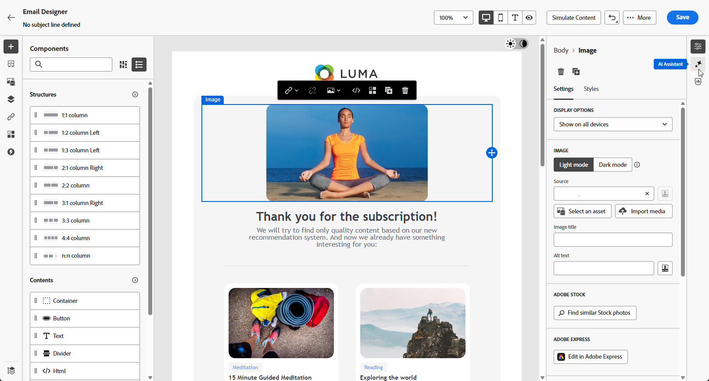
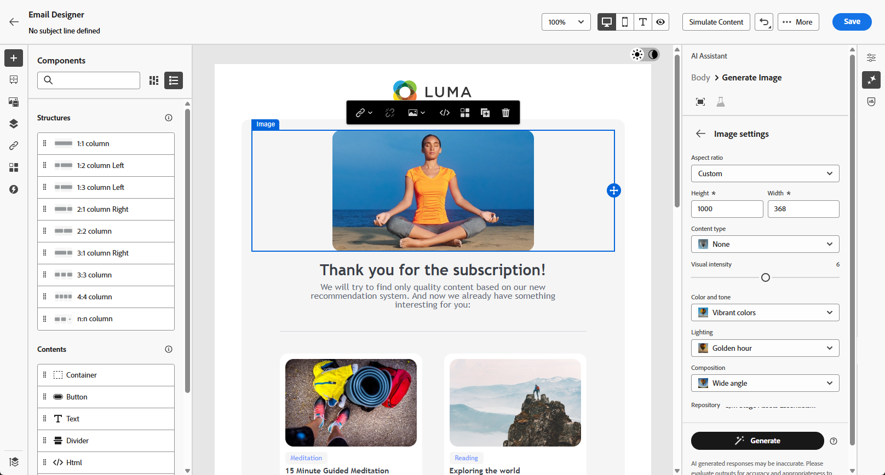

# Afbeeldingen genereren met AI Assistant {#generative-image}

>[!IMPORTANT]
>
>Alvorens te beginnen gebruikend dit vermogen, lees uit verwante [ Grafieken en Beperkingen ](gs-generative.md#generative-guardrails).
> 
>
>U moet met a [ gebruikersovereenkomst ](https://www.adobe.com/legal/licenses-terms/adobe-dx-gen-ai-user-guidelines.html) akkoord gaan alvorens u AI Medewerker in Journey Optimizer kunt gebruiken. Neem voor meer informatie contact op met uw Adobe-vertegenwoordiger.

Met AI Assistant in Journey Optimizer kunt u aansprekende visuele inhoud genereren waarmee uw berichten via e-mail, het web, landingspagina&#39;s en pushberichten worden verbeterd. Met AI Assistant kunt u uw middelen optimaliseren en verbeteren, zodat uw publiek een gebruiksvriendelijker en boeiender ervaring heeft.

## Voor e-mail- en webkanalen {#email-web-channels}

Met AI Assistant kunt u complete visuele ervaringen genereren voor e-mailcampagnes, webervaringen en bestemmingspagina&#39;s. Met deze functie kunt u on-brand, opvallende afbeeldingen produceren die op digitale aanraakpunten op uw publiek passen.

### Toegang en configuratie {#access-configure}

Als u afbeeldingen wilt genereren met AI Assistant, stelt u eerst uw campagne of reis in en opent u de inhoudeditor. Voer de onderstaande stappen uit om uw werkruimte voor te bereiden en het deelvenster AI Assistant te openen.

1. Maak en configureer uw campagne of reis:
   * **E-mail**: Na het creëren van en het vormen van uw e-mailcampagne, klik **[!UICONTROL Edit content]**. [Meer informatie](../email/create-email.md)
   * **Web**: Na het creëren van en het vormen van uw Web-pagina, klik **[!UICONTROL Edit web page]**. [Meer informatie](../web/create-web.md)
   * **het Bestaan Pagina**: Na het creëren van en het vormen van uw het landen pagina, klik **[!UICONTROL Edit content]**. [Meer informatie](../landing-pages/create-lp.md)

1. Selecteer het element dat u wilt wijzigen met AI Assistant.

1. Selecteer **[!UICONTROL AI Assistant]** (of **[!UICONTROL Show AI Assistant]** voor web) in het rechtermenu.

   {de activa van het 0} Beeld selecteerde en AI Hulp geopend paneel {zoomable="yes"}

### Inhoud genereren {#generate-content}

Leer hoe u effectieve herinneringen kunt maken en afbeeldingsinstellingen kunt configureren om visueel aantrekkelijke afbeeldingen te genereren met AI Assistant. Pas parameters zoals hoogte-breedteverhouding, visuele intensiteit en belichting aan om afbeeldingen te maken die zijn afgestemd op uw merk- en campagnedoelstellingen.

1. Schakel de optie **[!UICONTROL Reference style]** voor AI Assistant in om nieuwe inhoud aan te passen op basis van de referentie-inhoud. U kunt ook een afbeelding uploaden om context aan uw variatie toe te voegen.

1. Selecteer **[!UICONTROL Brand]** om te zorgen dat door AI gegenereerde inhoud wordt uitgelijnd op de specificaties van uw merk. [ leer meer ](brands.md) op Banden.

1. Verfijn de inhoud door te beschrijven wat u wilt genereren in het veld **[!UICONTROL Prompt]** .

   Als u hulp bij het ontwerpen van uw herinnering zoekt, toegang **[!UICONTROL Prompt Library]** die een diverse waaier van snelle ideeën verstrekt om uw campagnes te verbeteren.

   {zoomable="yes"}

1. Volg uw vraag met de optie **[!UICONTROL Image settings]** :

   * **[!UICONTROL Aspect ratio]**: hiermee bepaalt u de breedte en hoogte van het element. U hebt de optie om van gemeenschappelijke verhoudingen zoals 16 te kiezen :9, 4 :3, 3 :2, of 1 :1, of u kunt een douanegrootte ingaan.
   * **[!UICONTROL Content type]**: hiermee wordt de aard van het visuele element gecategoriseerd, waarbij onderscheid wordt gemaakt tussen verschillende vormen van visuele representatie, zoals foto&#39;s, afbeeldingen of illustraties.
   * **[!UICONTROL Visual intensity]**: U kunt de invloed van de afbeelding bepalen door de intensiteit ervan aan te passen. Bij een lagere instelling (2) wordt het uiterlijk zachter en minder sterk, terwijl bij een hogere instelling (10) de afbeelding levendiger en visueel krachtiger wordt.
   * **[!UICONTROL Color & tone]**: De algemene weergave van de kleuren in een afbeelding en de sfeer die of de sfeer die door de afbeelding wordt overgebracht.
   * **[!UICONTROL Lighting]**: hiermee wordt de bliksemschicht in een afbeelding bedoeld, die de atmosfeer van de afbeelding bepaalt en specifieke elementen markeert.
   * **[!UICONTROL Composition]**: dit heeft betrekking op de rangschikking van elementen binnen het kader van een afbeelding

   {zoomable="yes"}

1. Klik in het menu **[!UICONTROL Brand assets]** op **[!UICONTROL Upload brand asset]** om een merkelement toe te voegen dat inhoud bevat die extra context-AI-assistent kan bieden of selecteer een eerder geüpload element.

   Eerder geüploade bestanden zijn beschikbaar in de vervolgkeuzelijst **[!UICONTROL Uploaded brand assets]** . Schakel eenvoudig de elementen in die u wilt opnemen in uw generatie.

1. Als u tevreden bent met de snelle configuratie, klikt u op **[!UICONTROL Generate]** .

1. Blader in **[!UICONTROL Variation suggestions]** om het gewenste element te zoeken.

   Klik op **[!UICONTROL Preview]** om een schermvullende versie van de geselecteerde variant weer te geven of op **[!UICONTROL Apply]** om de huidige inhoud te vervangen.

1. Klik op het percentagepictogram om uw **[!UICONTROL Brand Alignment Score]** weer te geven en eventuele onjuiste uitlijningen met uw merk te identificeren.

   Leer meer op [ de groeperingsscore van het Merk ](brands-score.md).

### Verfijnen en voltooien {#refine-finalize}

Nadat u afbeeldingsvariaties hebt gegenereerd, kunt u de resultaten bekijken, de uitlijning van het merk controleren, de afbeelding bewerken in Adobe Express en de beste optie voor uw inhoud selecteren.

1. Navigeer naar de optie **[!UICONTROL Refine]** in het **[!UICONTROL Preview]** -venster voor toegang tot extra aanpassingsfuncties:

   * **[!UICONTROL Generate Similar]** om verwante afbeeldingen met deze variant weer te geven.
   * **[!UICONTROL Edit in Adobe Express]** om uw element verder aan te passen.

[Meer informatie over Adobe Express-integratie](../integrations/express.md)

   * **[!UICONTROL Save]** gebruiken om de elementen op te slaan, zodat u ze later kunt gebruiken.

   {zoomable="yes"}

1. Klik op **[!UICONTROL Select]** zodra u de juiste inhoud hebt gevonden.

   U kunt ook experimenteren met uw inhoud inschakelen. [Meer informatie](generative-experimentation.md)

1. Nadat u de inhoud van uw bericht hebt gedefinieerd, klikt u op de knop **[!UICONTROL Simulate content]** om de rendering te beheren en controleert u de instellingen voor de personalisatie met testprofielen. [Meer informatie](../personalization/personalize.md)

1. Bekijk en activeer uw inhoud:
   * **E-mail**: Wanneer u uw inhoud, publiek en programma hebt bepaald, bent u klaar om uw e-mailcampagne voor te bereiden. [Meer informatie](../campaigns/review-activate-campaign.md)
   * **Web**: Zodra u uw montages van de Webcampagne bepaalde en uw inhoud zoals gewenst uitgeeft, kunt u uw Webcampagne herzien en activeren. [Meer informatie](../web/create-web.md#activate-web-campaign)
   * **het Bestaan Pagina**: Zodra uw het landen pagina klaar is, kunt u het publiceren om het voor gebruik in een bericht ter beschikking te stellen. [Meer informatie](../landing-pages/create-lp.md#publish-landing-page)

## Voor mobiele kanalen {#mobile-channels}

Met AI Assistant kunt u aansprekende afbeeldingen genereren voor pushberichten, zodat u visueel aantrekkelijke mobiele communicatie kunt maken die aandacht krijgt en op maat van uw publiek kan reageren.

### Toegang en configuratie {#mobile-access-configure}

Als u AI Assistant wilt gebruiken voor pushberichten, moet u de levering via pushberichten instellen en naar de inhoudseditor navigeren. Deze stappen begeleiden u bij het maken van uw levering en het openen van de AI Assistant-functies.

1. Klik op **[!UICONTROL Edit content]** nadat u de pushmelding hebt gemaakt en geconfigureerd.

   Voor meer informatie bij het vormen van uw pushlevering, verwijs naar [ deze pagina ](../push/create-push.md).

1. Pas uw pushmelding naar wens aan. [Meer informatie](../push/design-push.md)

1. Open het menu **[!UICONTROL Show AI Assistant]** .

   {zoomable="yes"} toont

### Inhoud genereren {#mobile-generate-content}

Nadat u AI Assistant hebt geopend, kunt u de instellingen voor het genereren van afbeeldingen aanpassen en deze op uw merk afstemmen. Ook kunt u hiermee de doelstellingen voor pushmeldingen ondersteunen. Configureer de prompt- en afbeeldingsparameters om visuele effecten te genereren die zijn geoptimaliseerd voor mobiele schermen.

1. Schakel de optie **[!UICONTROL Reference style]** voor AI Assistant in om nieuwe inhoud aan te passen op basis van de referentie-inhoud. U kunt ook een afbeelding uploaden om context aan uw variatie toe te voegen.

1. Selecteer **[!UICONTROL Brand]** om te zorgen dat door AI gegenereerde inhoud wordt uitgelijnd op de specificaties van uw merk. [ leer meer ](brands.md) op Banden.

   Merk op dat de eigenschap van Merken als privé bèta wordt vrijgegeven en aan alle klanten in toekomstige versies geleidelijk beschikbaar zal zijn.

1. Verfijn de inhoud door te beschrijven wat u wilt genereren in het veld **[!UICONTROL Prompt]** .

   Als u hulp bij het ontwerpen van uw herinnering zoekt, toegang **[!UICONTROL Prompt Library]** die een diverse waaier van snelle ideeën verstrekt om uw campagnes te verbeteren.

   {zoomable="yes"}

1. Kies uw **[!UICONTROL Image settings]** :

   * **[!UICONTROL Content type]**: hiermee wordt de aard van het visuele element gecategoriseerd, waarbij onderscheid wordt gemaakt tussen verschillende vormen van visuele representatie, zoals foto&#39;s, afbeeldingen of illustraties.
   * **[!UICONTROL Visual intensity]**: U kunt de invloed van de afbeelding bepalen door de intensiteit ervan aan te passen. Bij een lagere instelling (2) wordt het uiterlijk zachter en minder sterk, terwijl bij een hogere instelling (10) de afbeelding levendiger en visueel krachtiger wordt.
   * **[!UICONTROL Color & tone]**: De algemene weergave van de kleuren in een afbeelding en de sfeer die of de sfeer die door de afbeelding wordt overgebracht.
   * **[!UICONTROL Lighting]**: hiermee wordt de bliksemschicht in een afbeelding bedoeld, die de atmosfeer van de afbeelding bepaalt en specifieke elementen markeert.
   * **[!UICONTROL Composition]**: dit heeft betrekking op de rangschikking van elementen binnen het kader van een afbeelding

1. Klik in het menu **[!UICONTROL Brand assets]** op **[!UICONTROL Upload brand asset]** om een merkelement toe te voegen dat inhoud bevat die extra context-AI-assistent kan bieden of selecteer een eerder geüpload element.

   Eerder geüploade bestanden zijn beschikbaar in de vervolgkeuzelijst **[!UICONTROL Uploaded brand assets]** . Schakel eenvoudig de elementen in die u wilt opnemen in uw generatie.

1. Klik op **[!UICONTROL Generate]** als de vraag gereed is.

1. Blader door het gegenereerde bestand **[!UICONTROL Variations]** .

1. Klik op het percentagepictogram om uw **[!UICONTROL Brand Alignment Score]** weer te geven en eventuele onjuiste uitlijningen met uw merk te identificeren.

   Leer meer op [ de groeperingsscore van het Merk ](brands-score.md).

### Verfijnen en voltooien {#mobile-refine-finalize}

Nadat u afbeeldingsvariaties voor uw pushberichten hebt gegenereerd, kunt u de resultaten perfectioneren om ervoor te zorgen dat deze precies aan uw vereisten voldoen. Bekijk de uitlijning van het merk, bewerk indien nodig de afbeelding in Adobe Express en selecteer de beste afbeelding voor uw mobiele campagne.

1. Navigeer naar de optie **[!UICONTROL Refine]** in het **[!UICONTROL Preview]** -venster voor toegang tot extra aanpassingsfuncties:

   * **[!UICONTROL Generate Similar]** om verwante afbeeldingen met deze variant weer te geven.
   * **[!UICONTROL Edit in Adobe Express]** om uw element verder aan te passen.

[Meer informatie over Adobe Express-integratie](../integrations/express.md)

   * **[!UICONTROL Save]** gebruiken om de elementen op te slaan, zodat u ze later kunt gebruiken.

   {zoomable="yes"}

1. Open het **[!UICONTROL Brand Alignment]** lusje om te zien hoe uw inhoud zich op uw [ merkrichtlijnen ](brands.md) richt.

1. Klik op **[!UICONTROL Select]** zodra u de juiste inhoud hebt gevonden.

   U kunt ook experimenteren met uw inhoud inschakelen. [Meer informatie](generative-experimentation.md)

Wanneer u de inhoud, het publiek en het programma hebt gedefinieerd, kunt u uw pushcampagne voorbereiden. [Meer informatie](../campaigns/review-activate-campaign.md)

