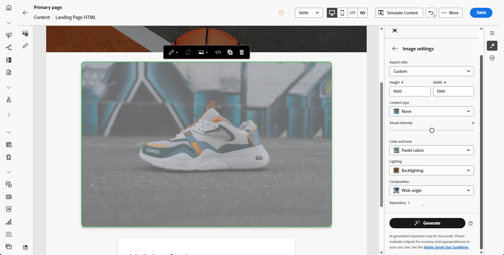
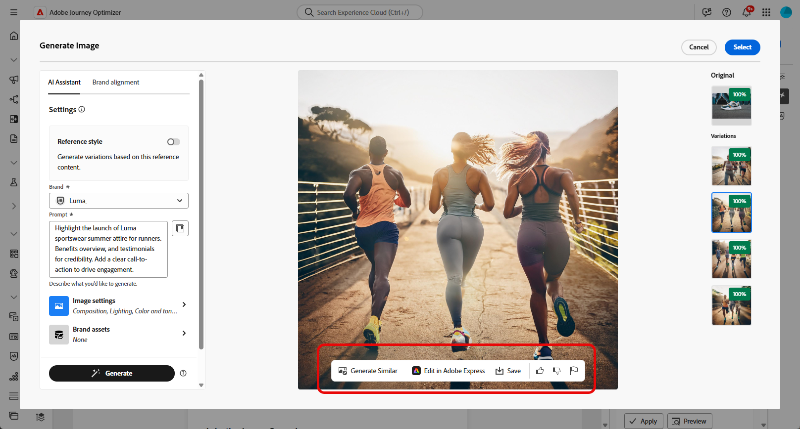

# Openingspagina&#39;s genereren met AI Assistant {#generative-lp}

>[!IMPORTANT]
>
>* Alvorens te beginnen gebruikend dit vermogen, lees uit verwante [ Grafieken en Beperkingen ](gs-generative.md#generative-guardrails).
>
>
>* U moet de [ gebruikersovereenkomst ](https://www.adobe.com/legal/licenses-terms/adobe-dx-gen-ai-user-guidelines.html) goedkeuren alvorens u AI Medewerker in Journey Optimizer kunt gebruiken. Neem voor meer informatie contact op met uw Adobe-vertegenwoordiger.

Transformeer uw bestemmingspagina&#39;s met AI Assistant in Journey Optimizer, aangedreven door generatieve AI.

Creëer moeiteloos impactvolle inhoud, waaronder complete pagina&#39;s, op maat gemaakte tekstfragmenten en aangepaste visuele voorbeelden die op uw publiek zijn afgestemd, waardoor uw betrokkenheid en interactie toenemen.

Bekijk de onderstaande tabbladen voor meer informatie over het gebruik van AI Assistant in Journey Optimizer.

>[!BEGINTABS]

>[!TAB  Volledige het landen paginageneratie ]

In het volgende voorbeeld gebruiken we AI Assistant om een bestaande sjabloon voor de landingspagina te verfijnen.

1. Klik op **[!UICONTROL Edit content]** nadat u de bestemmingspagina hebt gemaakt en geconfigureerd.

   Voor meer informatie over hoe te om uw het landen pagina te vormen, verwijs naar [ deze pagina ](../landing-pages/create-lp.md).

1. Pas de layout naar wens aan en open het menu **[!UICONTROL AI Assistant]** .

   {zoomable="yes"}

1. Schakel de optie **[!UICONTROL Use original content]** voor AI Assistant in om nieuwe inhoud aan te passen op basis van de geselecteerde inhoud.

1. Verfijn de inhoud door te beschrijven wat u wilt genereren in het veld **[!UICONTROL Prompt]** .

   Als u hulp bij het ontwerpen van uw herinnering zoekt, toegang **[!UICONTROL Prompt Library]** die een diverse waaier van snelle ideeën verstrekt om uw landende pagina te verbeteren.

   {zoomable="yes"}

1. Volg uw vraag met de optie **[!UICONTROL Text settings]** :

   * **[!UICONTROL Communication strategy]**: Kies de meest geschikte communicatiestijl voor de gegenereerde tekst.
   * **[!UICONTROL Languages]**: kies de taal van de gegenereerde inhoud.
   * **[!UICONTROL Tone]**: De tint van de bestemmingspagina moet op uw publiek reageren. Of u informatief wilt klinken, playful, of overtuigend, AI Medewerker kan het bericht dienovereenkomstig aanpassen.

   {zoomable="yes"}

1. Kies uw **[!UICONTROL Image settings]** :

   * **[!UICONTROL Content type]**: hiermee wordt de aard van het visuele element gecategoriseerd, waarbij onderscheid wordt gemaakt tussen verschillende vormen van visuele representatie, zoals foto&#39;s, afbeeldingen of illustraties.
   * **[!UICONTROL Visual intensity]**: U kunt de invloed van de afbeelding bepalen door de intensiteit ervan aan te passen. Bij een lagere instelling (2) wordt het uiterlijk zachter en minder sterk, terwijl bij een hogere instelling (10) de afbeelding levendiger en visueel krachtiger wordt.
   * **[!UICONTROL Color & tone]**: De algemene weergave van de kleuren in een afbeelding en de sfeer die of de sfeer die door de afbeelding wordt overgebracht.
   * **[!UICONTROL Lighting]**: hiermee wordt de bliksemschicht in een afbeelding bedoeld, die de atmosfeer van de afbeelding bepaalt en specifieke elementen markeert.
   * **[!UICONTROL Composition]**: dit heeft betrekking op de rangschikking van elementen binnen het kader van een afbeelding

   {zoomable="yes"}

1. Klik in het menu **[!UICONTROL Brand assets]** op **[!UICONTROL Upload brand asset]** om een merkelement toe te voegen dat inhoud bevat die extra context-AI-assistent kan bieden of selecteer een eerder geüpload element.

   Eerder geüploade bestanden zijn beschikbaar in de vervolgkeuzelijst **[!UICONTROL Uploaded brand assets]** . Schakel eenvoudig de elementen in die u wilt opnemen in uw generatie.

1. Klik op **[!UICONTROL Generate]** als de vraag gereed is.

1. Blader door het gegenereerde bestand **[!UICONTROL Variations]** .

   Klik op **[!UICONTROL Preview]** om een schermvullende versie van de geselecteerde variant weer te geven of klik op **[!UICONTROL Apply]** om de huidige inhoud te vervangen.

1. Klik op het percentagepictogram om uw **[!UICONTROL Brand Alignment Score]** weer te geven en eventuele onjuiste uitlijningen met uw merk te identificeren.

   Leer meer op [ de groeperingsscore van het Merk ](brands-score.md).

   {zoomable="yes"}

1. Navigeer naar de optie **[!UICONTROL Refine]** in het **[!UICONTROL Preview]** -venster voor toegang tot extra aanpassingsfuncties:

   * **[!UICONTROL Rephrase]**: De AI-assistent kan uw bericht op verschillende manieren herformuleren, zodat u steeds fris schrijft en aantrekkelijk wordt voor verschillende soorten publiek.

   * **[!UICONTROL Use simpler language]**: Gebruik AI Assistant om uw taal te vereenvoudigen, zodat een groter publiek helderheid en toegankelijkheid krijgt.

   U kunt ook de **[!UICONTROL Tone]** en **[!UICONTROL Communication strategy]** van de tekst wijzigen.

   {zoomable="yes"} tonen

1. Open het **[!UICONTROL Brand Alignment]** lusje om te zien hoe uw inhoud zich op uw [ merkrichtlijnen ](brands.md) richt.

1. Klik op **[!UICONTROL Select]** zodra u de juiste inhoud hebt gevonden.

1. Voeg verpersoonlijkingsgebieden in om uw het landen pagina inhoud aan te passen die op profielgegevens wordt gebaseerd. Klik vervolgens op de knop **[!UICONTROL Simulate content]** om de rendering te beheren en controleer de instellingen voor aanpassing met testprofielen. [Meer informatie](../personalization/personalize.md)

Als de landingspagina gereed is, kunt u deze publiceren en in een bericht gebruiken. [Meer informatie](../landing-pages/create-lp.md#publish-landing-page)

>[!TAB  text-only generatie ]

In het volgende voorbeeld gebruiken we AI Assistant om de inhoud van onze landingspagina te verbeteren.

1. Klik op **[!UICONTROL Edit content]** nadat u de bestemmingspagina hebt gemaakt en geconfigureerd.

   Voor meer informatie over hoe te om uw het landen pagina te vormen, verwijs naar [ deze pagina ](../landing-pages/create-lp.md).

1. Selecteer een **[!UICONTROL Text component]** als u alleen een specifieke inhoud als doel wilt instellen. en opent u het menu **[!UICONTROL AI Assistant]** .

   {zoomable="yes"}

1. Schakel de optie **[!UICONTROL Use original content]** voor AI Assistant in om nieuwe inhoud aan te passen op basis van de geselecteerde inhoud.

1. Verfijn de inhoud door te beschrijven wat u wilt genereren in het veld **[!UICONTROL Prompt]** .

   Als u hulp bij het ontwerpen van uw herinnering zoekt, toegang **[!UICONTROL Prompt Library]** die een diverse waaier van snelle ideeën verstrekt om uw landende pagina&#39;s te verbeteren.

   {zoomable="yes"}

1. Volg uw vraag met de optie **[!UICONTROL Text settings]** :

   * **[!UICONTROL Communication strategy]**: Kies de meest geschikte communicatiestijl voor de gegenereerde tekst.
   * **[!UICONTROL Languages]**: kies de taal van de gegenereerde inhoud.
   * **[!UICONTROL Tone]**: De tint van de bestemmingspagina moet op uw publiek reageren. Of u informatief wilt klinken, playful, of overtuigend, AI Medewerker kan het bericht dienovereenkomstig aanpassen.
   * **Lengte van de Tekst**: Gebruik de schuif om de gewenste lengte van uw tekst te selecteren.

   {zoomable="yes"}

1. Klik in het menu **[!UICONTROL Brand assets]** op **[!UICONTROL Upload brand asset]** om een merkelement toe te voegen dat inhoud bevat die extra context-AI-assistent kan bieden of selecteer een eerder geüpload element.

   Eerder geüploade bestanden zijn beschikbaar in de vervolgkeuzelijst **[!UICONTROL Uploaded brand assets]** . Schakel eenvoudig de elementen in die u wilt opnemen in uw generatie.

1. Klik op **[!UICONTROL Generate]** als de vraag gereed is.

1. Blader door het gegenereerde bestand **[!UICONTROL Variations]** .

   Klik op **[!UICONTROL Preview]** om een schermvullende versie van de geselecteerde variant weer te geven of klik op **[!UICONTROL Apply]** om de huidige inhoud te vervangen.

1. Klik op het percentagepictogram om uw **[!UICONTROL Brand Alignment Score]** weer te geven en eventuele onjuiste uitlijningen met uw merk te identificeren.

   Leer meer op [ de groeperingsscore van het Merk ](brands-score.md).

   {zoomable="yes"}

1. Navigeer naar de optie **[!UICONTROL Refine]** in het **[!UICONTROL Preview]** -venster voor toegang tot extra aanpassingsfuncties:

   * **[!UICONTROL Use as reference content]**: De gekozen variant zal als verwijzingsinhoud voor het produceren van andere resultaten dienen.

   * **[!UICONTROL Elaborate]**: De AI-assistent kan u helpen bij het uitvouwen van specifieke onderwerpen en biedt extra informatie voor een beter begrip en betrokkenheid.

   * **[!UICONTROL Summarize]**: langdurige informatie kan ontvangers van landingspagina&#39;s overladen. Met AI Assistant kunt u belangrijke punten samenvoegen tot heldere, beknopte samenvattingen die aandacht trekken en hen aanmoedigen om verder te lezen.

   * **[!UICONTROL Rephrase]**:TheAI Assistant kan uw bericht op verschillende manieren herformuleren, zodat u steeds fris schrijft en aantrekkelijk wordt voor verschillende soorten publiek.

   * **[!UICONTROL Use simpler language]**: Gebruik AI Assistant om uw taal te vereenvoudigen, zodat een groter publiek helderheid en toegankelijkheid krijgt.

   U kunt ook de **[!UICONTROL Tone]** en **[!UICONTROL Communication strategy]** van de tekst wijzigen.

   {zoomable="yes"}

1. Open het **[!UICONTROL Brand Alignment]** lusje om te zien hoe uw inhoud zich op uw [ merkrichtlijnen ](brands.md) richt.

1. Klik op **[!UICONTROL Select]** zodra u de juiste inhoud hebt gevonden.

1. Voeg verpersoonlijkingsgebieden in om uw het landen pagina inhoud aan te passen die op profielgegevens wordt gebaseerd. Klik vervolgens op de knop **[!UICONTROL Simulate content]** om de rendering te beheren en controleer de instellingen voor aanpassing met testprofielen. [Meer informatie](../personalization/personalize.md)

Als de landingspagina gereed is, kunt u deze publiceren en in een bericht gebruiken. [Meer informatie](../landing-pages/create-lp.md#publish-landing-page)

>[!TAB  Beeld-slechts generatie ]

In het onderstaande voorbeeld leert u hoe u AI Assistant kunt gebruiken om uw middelen te optimaliseren en te verbeteren, zodat u een gebruiksvriendelijker ervaring hebt.

1. Klik op **[!UICONTROL Edit content]** nadat u de bestemmingspagina hebt gemaakt en geconfigureerd.

   Voor meer informatie over hoe te om uw het landen pagina te vormen, verwijs naar [ deze pagina ](../landing-pages/create-lp.md).

1. Selecteer het element dat u wilt wijzigen met AI Assistant.

1. Selecteer **[!UICONTROL AI Assistant]** in het rechtermenu.

   {zoomable="yes"}

1. Schakel de optie **[!UICONTROL Reference style]** voor AI Assistant in om nieuwe inhoud aan te passen op basis van de referentie-inhoud. U kunt ook een afbeelding uploaden om context aan uw variatie toe te voegen.

1. Verfijn de inhoud door te beschrijven wat u wilt genereren in het veld **[!UICONTROL Prompt]** .

   Als u hulp bij het ontwerpen van uw herinnering zoekt, toegang **[!UICONTROL Prompt Library]** die een diverse waaier van snelle ideeën verstrekt om uw landende pagina&#39;s te verbeteren.

   {zoomable="yes"}

1. Volg uw vraag met de optie **[!UICONTROL Image settings]** :

   * **[!UICONTROL Aspect ratio]**: hiermee bepaalt u de breedte en hoogte van het element. U hebt de optie om van gemeenschappelijke verhoudingen zoals 16 te kiezen :9, 4 :3, 3 :2, of 1 :1, of u kunt een douanegrootte ingaan.
   * **[!UICONTROL Content type]**: hiermee wordt de aard van het visuele element gecategoriseerd, waarbij onderscheid wordt gemaakt tussen verschillende vormen van visuele representatie, zoals foto&#39;s, afbeeldingen of illustraties.
   * **[!UICONTROL Visual intensity]**: U kunt de invloed van de afbeelding bepalen door de intensiteit ervan aan te passen. Bij een lagere instelling (2) wordt het uiterlijk zachter en minder sterk, terwijl bij een hogere instelling (10) de afbeelding levendiger en visueel krachtiger wordt.
   * **[!UICONTROL Color & tone]**: De algemene weergave van de kleuren in een afbeelding en de sfeer die of de sfeer die door de afbeelding wordt overgebracht.
   * **[!UICONTROL Lighting]**: hiermee wordt de bliksemschicht in een afbeelding bedoeld, die de atmosfeer van de afbeelding bepaalt en specifieke elementen markeert.
   * **[!UICONTROL Composition]**: dit heeft betrekking op de rangschikking van elementen binnen het kader van een afbeelding

   {zoomable="yes"}

1. Klik in het menu **[!UICONTROL Brand assets]** op **[!UICONTROL Upload brand asset]** om een merkelement toe te voegen dat inhoud bevat die extra context-AI-assistent kan bieden of selecteer een eerder geüpload element.

   Eerder geüploade bestanden zijn beschikbaar in de vervolgkeuzelijst **[!UICONTROL Uploaded brand assets]** . Schakel eenvoudig de elementen in die u wilt opnemen in uw generatie.

1. Als u tevreden bent met de snelle configuratie, klikt u op **[!UICONTROL Generate]** .

1. Blader door het gegenereerde bestand **[!UICONTROL Variations]** .

   Klik op **[!UICONTROL Preview]** om een schermvullende versie van de geselecteerde variant weer te geven of klik op **[!UICONTROL Apply]** om de huidige inhoud te vervangen.

1. Klik op het percentagepictogram om uw **[!UICONTROL Brand Alignment Score]** weer te geven en eventuele onjuiste uitlijningen met uw merk te identificeren.

   Leer meer op [ de groeperingsscore van het Merk ](brands-score.md).

   {zoomable="yes"}

1. Navigeer naar de optie **[!UICONTROL Refine]** in het **[!UICONTROL Preview]** -venster voor toegang tot extra aanpassingsfuncties:

   * **[!UICONTROL Generate Similar]** om verwante afbeeldingen met deze variant weer te geven.
   * **[!UICONTROL Edit in Adobe Express]** om uw element verder aan te passen.

[Meer informatie over Adobe Express-integratie](../integrations/express.md)

   * **[!UICONTROL Save]** gebruiken om de elementen op te slaan, zodat u ze later kunt gebruiken.

   {zoomable="yes"} tonen

1. Open het **[!UICONTROL Brand Alignment]** lusje om te zien hoe uw inhoud zich op uw [ merkrichtlijnen ](brands.md) richt.

1. Klik op **[!UICONTROL Select]** zodra u de juiste inhoud hebt gevonden.

1. Nadat u de inhoud van uw bericht hebt gedefinieerd, klikt u op de knop **[!UICONTROL Simulate content]** om de rendering te beheren en controleert u de instellingen voor de personalisatie met testprofielen. [Meer informatie](../personalization/personalize.md)

Als de landingspagina gereed is, kunt u deze publiceren en in een bericht gebruiken. [Meer informatie](../landing-pages/create-lp.md#publish-landing-page)

>[!ENDTABS]
