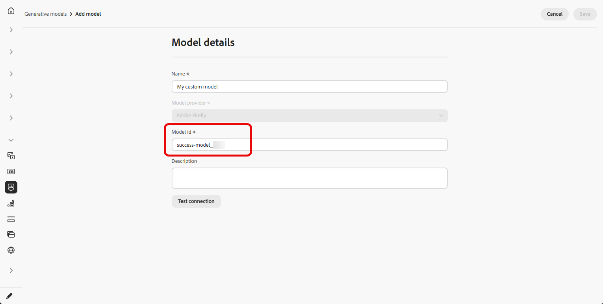
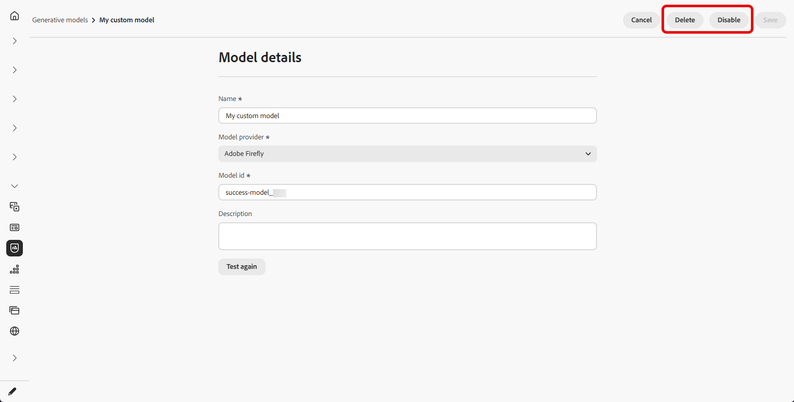

# Generatieve modellen maken en beheren {#generative-models}

Breid uw mogelijkheden voor het maken van AI-afbeeldingen uit met ingebouwde modellen, aangepaste Firefly-modellen en externe leveranciers van images om aan uw specifieke behoeften te voldoen en de uitlijning van uw merk te verbeteren.

Kies het juiste model voor uw behoeften:

- **[!UICONTROL Adobe model]** , aangedreven door Firefly Image Model 4, wordt uit de doos geleverd en klaar voor gebruik voor directe beeldgeneratie zonder extra opstelling.
- **[!UICONTROL Partner model]**, aangedreven door Gemini 2.5 Flash, biedt gespecialiseerde mogelijkheden voor specifieke gebruiksgevallen. Voor een geleidelijke werkschema dat **Gemini** met **tekstbedekkingen** op beelden in AI Medewerker gebruikt, zie [&#x200B; Gebruik Gemini als generatief model voor tekst-bedekking beeld &#x200B;](generative-uc.md#generative-gemini).
- **[!UICONTROL Custom models]** zijn merkspecifieke modellen die op uw eigen middelen zijn getraind en door uw organisatie zijn toegevoegd.

  Leer meer op **[!UICONTROL Custom models]** in [&#x200B; documentatie van Adobe Firefly &#x200B;](https://helpx.adobe.com/firefly/web/work-with-enterprise-features/train-custom-models/custom-models-overview.html)

Nadat u de configuratie hebt geconfigureerd, kunt u elk van uw generatieve modellen selecteren wanneer u afbeeldingen maakt in uw inhoud. [&#x200B; Leer meer over het produceren van beelden &#x200B;](generative-image.md).

## Generatieve modellen beheren

Beheer uw generatieve modellen vanaf een gecentraliseerde locatie. Bekijk alle beschikbare modellen, filter en onderzoek om specifieke degenen te vinden, en hun montages voor uw merken te vormen.

1. Selecteer in het menu **[!UICONTROL Brands]** de tab **[!UICONTROL Generative models]** .

   {zoomable="yes"}

1. Klik op het pictogram  om het filtermenu te openen. Filtermodellen op **[!UICONTROL Type]** of **[!UICONTROL Status]** .

   {zoomable="yes"}

1. Gebruik de zoekbalk om een specifiek generatief model op naam te zoeken.

1. Klik op het pictogram  om het geavanceerde menu te openen, waar u het model kunt in- of uitschakelen of verwijderen.

   Alleen **[!UICONTROL Custom models]** kan worden verwijderd.

   {zoomable="yes"}

1. Klik op **[!UICONTROL Add model]** om een geheel nieuw generatief model te maken.

U kunt nu al uw generatieve modellen selecteren wanneer u afbeeldingen maakt in uw inhoud. [&#x200B; Leer meer over het produceren van beelden &#x200B;](generative-image.md).

## Een generatief model toevoegen

>[!IMPORTANT]
>
>Voor het maken van aangepaste Firefly-modellen is een Firefly ETLA-overeenkomst vereist.

Aangepaste Firefly-modellen zijn merkspecifieke AI-modellen die zijn getraind op uw eigen middelen. Hierdoor kunt u afbeeldingen genereren die precies overeenkomen met uw merkidentiteit, stijl en visuele richtlijnen.

Door aangepaste Firefly-modelproviders te maken, kunt u uw AI-mogelijkheden uitbreiden tot buiten de standaardmodellen en ervoor zorgen dat de gegenereerde inhoud consistent voldoet aan de unieke esthetische behoeften en behoeften van uw merk.

➡️ [&#x200B; Leer hoe te om uw douanemodel te trainen &#x200B;](https://helpx.adobe.com/firefly/web/work-with-enterprise-features/train-custom-models/train-firefly-custom-models.html)

1. Open in het menu **[!UICONTROL Brands]** de tab **[!UICONTROL Generative Models]** en klik op **[!UICONTROL Add model]** .

   {zoomable="yes"}

1. Voer een **[!UICONTROL Name]** in voor uw model.

1. Voer uw **[!UICONTROL Model ID]** in.

   +++ Zoek je Firefly-model-id

   1. Ga naar de Firefly-website en navigeer naar uw getrainde modellen.
   1. Heb toegang tot [&#x200B; Voorproef &amp; test &#x200B;](https://helpx.adobe.com/firefly/web/work-with-enterprise-features/train-custom-models/train-firefly-custom-models.html#preview-and-test) menu.
   1. Zoek in de URL de waarde na `customModelId=` . Kopieer deze waarde voor gebruik als model-id.

   Voor meer informatie, verwijs naar de [&#x200B; documentatie van de douanemodellen van Firefly &#x200B;](https://helpx.adobe.com/firefly/web/work-with-enterprise-features/train-custom-models/manage-custom-models.html).

   {zoomable="yes"}

   +++

    

   {zoomable="yes"}

1. Voer desgewenst een **[!UICONTROL Description]** in om het model te identificeren.

1. Klik op **[!UICONTROL Test connection]** om de modelconfiguratie te controleren.

1. Als de verbindingstest is voltooid, klikt u op **[!UICONTROL Save]** om de modelconfiguratie op te slaan.

   {zoomable="yes"}

1. Na het opslaan wordt uw aangepaste model toegevoegd aan de lijst met modellen. U kunt deze op elk gewenst moment uitschakelen of verwijderen.

   {zoomable="yes"}

<!--
1. Once the connection test is successful, choose whether to enable the model for selected brands.

1. Enable or disable the option to connect the model to all brands.

    If disabled, select which brands this model should be applied to.
-->

Nadat u de configuratie hebt geconfigureerd, kunt u al uw aangepaste generatieve modellen selecteren wanneer u afbeeldingen maakt in uw inhoud. [&#x200B; Leer meer over het produceren van beelden &#x200B;](generative-image.md).

{zoomable="yes"}
