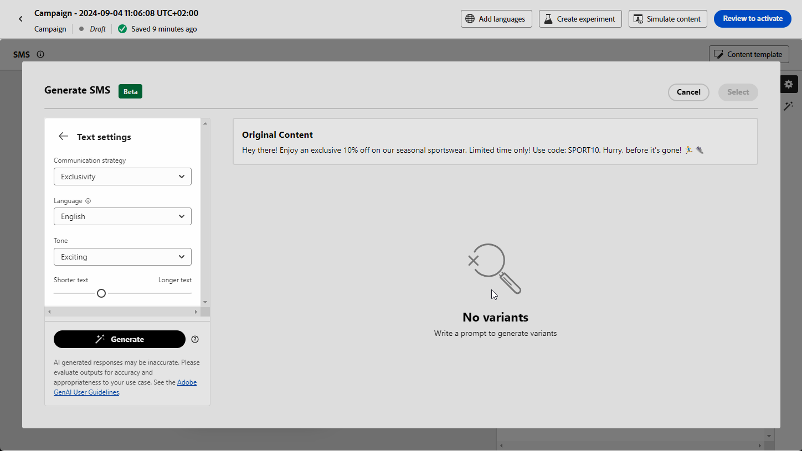

# SMS genereren met de AI Assistant {#generative-sms}

>[!BEGINSHADEBOX]

**Inhoudsopgave**

* [Aan de slag met de AI Assistant](gs-generative.md)
* [E-mailgeneratie met AI Assistant](generative-email.md)
* SMS genereren met de AI Assistant
* [Push generation met de AI Assistant](generative-push.md)
* [Inhoud experimenteren met de AI Assistant](generative-experimentation.md)

>[!ENDSHADEBOX]

Nadat u uw SMS-berichten hebt gemaakt en aangepast aan de voorkeuren van uw publiek, kunt u de communicatie met de AI Assistant in Journey Optimizer verbeteren.

Deze bron biedt inzichtelijke aanbevelingen om uw inhoud te verfijnen, zodat uw berichten kunnen resoneren en maximale betrokkenheid kunnen stimuleren.

Bekijk de onderstaande tabbladen voor meer informatie over het gebruik van de AI Assistant in Journey Optimizer.

>[!NOTE]
>
>Lees de verwante bestanden voordat u deze functie gaat gebruiken [Afvoerkanalen en beperkingen](gs-generative.md#generative-guardrails).

>[!BEGINTABS]

>[!TAB Volledige SMS-generatie]

1. Nadat u de SMS-campagne hebt gemaakt en geconfigureerd, klikt u op **[!UICONTROL Edit content]**.

   Voor meer informatie over hoe te om uw campagne van SMS te vormen, raadpleeg [deze pagina](../sms/create-sms.md).

1. Vul de **[!UICONTROL Basic details]** voor uw campagne. Klik op **[!UICONTROL Edit content]**.

1. Pas uw SMS-bericht naar wens aan. [Meer informatie](../sms/create-sms.md)

1. Toegang krijgen tot de **[!UICONTROL Show AI Assistant]** -menu.

   {zoomable=&quot;yes&quot;}

1. De optie **[!UICONTROL Use original content]** in dat geval past de AI Assistant de nieuwe inhoud aan op basis van de inhoud, de naam en het geselecteerde publiek van de campagne.

   Uw vraag moet altijd aan een specifieke context worden gebonden.

1. Perfectioneer de inhoud door te beschrijven wat u in wilt produceren **[!UICONTROL Prompt]** veld.

   Als u hulp bij het ontwerpen van uw herinnering zoekt, toegang tot **[!UICONTROL Prompt Library]** Dit biedt diverse snelle ideeën om uw campagnes te verbeteren.

   {zoomable=&quot;yes&quot;}

1. Selecteren **[!UICONTROL Upload brand asset]** om merkelementen toe te voegen die inhoud bevatten die extra context kan bieden, gebruikt de AI Assistant.

1. Volg uw vraag met de verschillende opties:

   * **[!UICONTROL Communication strategy]**: Selecteer de gewenste communicatieaanpak voor de gegenereerde tekst.
   * **[!UICONTROL Language]**: Kies de taal voor de inhoud van de variant.
   * **[!UICONTROL Tone]**: Zorg ervoor dat de tekst geschikt is voor uw publiek en doel.
   * **[!UICONTROL Length]**: Selecteer de lengte van de inhoud met de schuifregelaar voor het bereik.

   {zoomable=&quot;yes&quot;}

1. Zodra uw herinnering klaar is, klik **[!UICONTROL Generate]**.

1. Door de gegenereerde **[!UICONTROL Variations]** en klik op **[!UICONTROL Preview]** om een versie van de geselecteerde variatie op het volledige scherm weer te geven.

1. Ga naar de **[!UICONTROL Refine]** in de **[!UICONTROL Preview]** voor toegang tot extra aanpassingsfuncties en om uw variatie af te stemmen op uw voorkeuren:

   * **[!UICONTROL Use as reference content]**: De gekozen variant dient als referentie-inhoud voor het genereren van andere resultaten.

   * **[!UICONTROL Rephrase]**:De AI-assistent kan uw bericht op verschillende manieren herformuleren, zodat u steeds fris schrijft en aantrekkelijk wordt voor verschillende soorten publiek.

   * **[!UICONTROL Use simpler language]**: Gebruik de AI-assistent om uw taal te vereenvoudigen, zodat een groter publiek helderheid en toegankelijkheid krijgt.

   {zoomable=&quot;yes&quot;}

1. Klikken **[!UICONTROL Select]** zodra u de juiste inhoud hebt gevonden.

   U kunt ook experimenteren met uw inhoud inschakelen. [Meer informatie](generative-experimentation.md)

1. Voeg verpersoonlijkingsgebieden in om uw inhoud van SMS aan te passen die op profielgegevens wordt gebaseerd. [Meer informatie over content personalization](../personalization/personalize.md)

1. Nadat u de inhoud van uw bericht hebt gedefinieerd, klikt u op de knop **[!UICONTROL Simulate content]** om de rendering te beheren en personalisatie-instellingen te controleren met testprofielen. [Meer informatie](../personalization/personalize.md)

Wanneer u uw inhoud, publiek en planning hebt bepaald, bent u bereid om uw campagne van SMS voor te bereiden. [Meer informatie](../campaigns/review-activate-campaign.md)

>[!TAB Tekst genereren]

1. Nadat u de SMS-campagne hebt gemaakt en geconfigureerd, klikt u op **[!UICONTROL Edit content]**.

   Voor meer informatie over hoe te om uw campagne van SMS te vormen, raadpleeg [deze pagina](../sms/create-sms.md).

1. Vul de **[!UICONTROL Basic details]** voor uw campagne. Klik op **[!UICONTROL Edit content]**.

1. Pas uw SMS-bericht naar wens aan. [Meer informatie](../sms/create-sms.md)

1. Toegang krijgen tot de **[!UICONTROL Edit text with AI Assistant]** menu naast uw **[!UICONTROL Message]** veld.

   {zoomable=&quot;yes&quot;}

1. De optie **[!UICONTROL Use reference content]** in dat geval past de AI Assistant de nieuwe inhoud aan op basis van de inhoud, de naam en het geselecteerde publiek van de campagne.

   Uw vraag moet altijd aan een specifieke context worden gebonden.

1. Perfectioneer de inhoud door te beschrijven wat u in wilt produceren **[!UICONTROL Prompt]** veld.

   Als u hulp bij het ontwerpen van uw herinnering zoekt, toegang tot **[!UICONTROL Prompt Library]** Dit biedt diverse snelle ideeën om uw campagnes te verbeteren.

   {zoomable=&quot;yes&quot;}

1. Selecteren **[!UICONTROL Upload brand asset]** om merkelementen toe te voegen die inhoud bevatten die extra context kan bieden, gebruikt de AI Assistant.

1. Volg uw vraag met de verschillende opties:

   * **[!UICONTROL Communication strategy]**: Selecteer de gewenste communicatieaanpak voor de gegenereerde tekst.
   * **[!UICONTROL Language]**: Kies de taal voor de inhoud van de variant.
   * **[!UICONTROL Tone]**: Zorg ervoor dat de tekst geschikt is voor uw publiek en doel.
   * **[!UICONTROL Length]**: Selecteer de lengte van de inhoud met de schuifregelaar voor het bereik.

   {zoomable=&quot;yes&quot;}

1. Zodra uw herinnering klaar is, klik **[!UICONTROL Generate]**.

1. Door de gegenereerde **[!UICONTROL Variations]** en klik op **[!UICONTROL Preview]** om een versie van de geselecteerde variatie op het volledige scherm weer te geven.

1. Ga naar de **[!UICONTROL Refine]** in de **[!UICONTROL Preview]** voor toegang tot extra aanpassingsfuncties en om uw variatie af te stemmen op uw voorkeuren:

   * **[!UICONTROL Use as reference content]**: De gekozen variant dient als referentie-inhoud voor het genereren van andere resultaten.

   * **[!UICONTROL Rephrase]**:De AI-assistent kan uw bericht op verschillende manieren herformuleren, zodat u steeds fris schrijft en aantrekkelijk wordt voor verschillende soorten publiek.

   * **[!UICONTROL Use simpler language]**: Gebruik de AI-assistent om uw taal te vereenvoudigen, zodat een groter publiek helderheid en toegankelijkheid krijgt.

   {zoomable=&quot;yes&quot;}

1. Klikken **[!UICONTROL Select]** zodra u de juiste inhoud hebt gevonden.

   U kunt ook experimenteren met uw inhoud inschakelen. [Meer informatie](generative-experimentation.md)

1. Voeg verpersoonlijkingsgebieden in om uw inhoud van SMS aan te passen die op profielgegevens wordt gebaseerd. [Meer informatie over content personalization](../personalization/personalize.md)

1. Nadat u de inhoud van uw bericht hebt gedefinieerd, klikt u op de knop **[!UICONTROL Simulate content]** om de rendering te beheren en personalisatie-instellingen te controleren met testprofielen.

Wanneer u uw inhoud, publiek en planning hebt bepaald, bent u bereid om uw campagne van SMS voor te bereiden. [Meer informatie](../campaigns/review-activate-campaign.md)

>[!ENDTABS]
