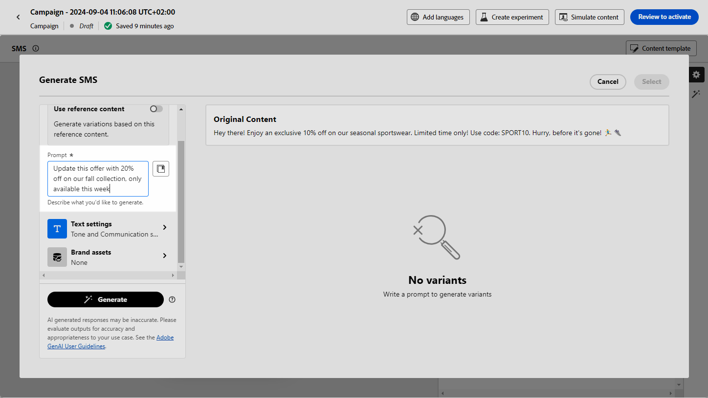

# SMS genereren met AI Assistant in Journey Optimizer {#generative-sms}

>[!IMPORTANT]
>
>Alvorens te beginnen gebruikend dit vermogen, lees uit verwante [ Grafieken en Beperkingen ](gs-generative.md#generative-guardrails).
> 
>
>U moet met a [ gebruikersovereenkomst ](https://www.adobe.com/legal/licenses-terms/adobe-dx-gen-ai-user-guidelines.html) akkoord gaan alvorens u AI Medewerker in Journey Optimizer kunt gebruiken. Neem voor meer informatie contact op met uw Adobe-vertegenwoordiger.

Nadat u uw SMS-berichten hebt gemaakt en aangepast aan de voorkeuren van uw publiek, kunt u de communicatie met AI Assistant in Journey Optimizer verbeteren.

Deze bron biedt inzichtelijke aanbevelingen om uw inhoud te verfijnen, zodat uw berichten kunnen resoneren en maximale betrokkenheid kunnen stimuleren.

Bekijk de onderstaande tabbladen voor meer informatie over het gebruik van AI Assistant in Journey Optimizer.

>[!BEGINTABS]

>[!TAB  Volledige generatie van SMS ]

1. Klik op **[!UICONTROL Edit content]** nadat u uw SMS-campagne hebt gemaakt en geconfigureerd.

   Voor meer informatie over hoe te om uw campagne van SMS te vormen, verwijs naar [ deze pagina ](../sms/create-sms.md).

1. Vul **[!UICONTROL Basic details]** in voor uw campagne. Klik op **[!UICONTROL Edit content]** als u klaar bent.

1. Pas uw SMS-bericht naar wens aan. [Meer informatie](../sms/create-sms.md)

1. Open het menu **[!UICONTROL Show AI Assistant]** .

   {zoomable="yes"}

1. Selecteer **[!UICONTROL Brand]** om te zorgen dat door AI gegenereerde inhoud wordt uitgelijnd op de specificaties van uw merk. [ leer meer ](brands.md) op Banden.

   Merk op dat de eigenschap van Merken als privé bèta wordt vrijgegeven en aan alle klanten in toekomstige versies geleidelijk beschikbaar zal zijn.

1. Verfijn de inhoud door te beschrijven wat u wilt genereren in het veld **[!UICONTROL Prompt]** .

   Als u hulp bij het ontwerpen van uw herinnering zoekt, toegang **[!UICONTROL Prompt Library]** die een diverse waaier van snelle ideeën verstrekt om uw campagnes te verbeteren.

   {zoomable="yes"}

1. Volg uw vraag met de optie **[!UICONTROL Text settings]** :

   * **[!UICONTROL Communication strategy]**: selecteer de gewenste communicatieaanpak voor de gegenereerde tekst.
   * **[!UICONTROL Languages]**: opties voor Spaanse, Italiaanse, Zweedse en Noorse talen worden vrijgegeven als een persoonlijke bètaversie en in toekomstige versies geleidelijk beschikbaar voor alle klanten.
   * **[!UICONTROL Tone]**: zorg ervoor dat de tekst geschikt is voor uw publiek en doel.
   * **[!UICONTROL Length]**: selecteer de lengte van de inhoud met de schuifregelaar voor het bereik.

   {zoomable="yes"}

1. Klik in het menu **[!UICONTROL Brand assets]** op **[!UICONTROL Upload brand asset]** om een merkelement toe te voegen dat inhoud bevat die extra context-AI-assistent kan bieden of selecteer een eerder geüpload element.

   Eerder geüploade bestanden zijn beschikbaar in de vervolgkeuzelijst **[!UICONTROL Uploaded brand assets]** . Schakel eenvoudig de elementen in die u wilt opnemen in uw generatie.

1. Klik op **[!UICONTROL Generate]** als de vraag gereed is.

1. Blader door het gegenereerde bestand **[!UICONTROL Variations]** .

1. Navigeer naar de optie **[!UICONTROL Refine]** in het **[!UICONTROL Preview]** -venster voor toegang tot extra aanpassingsfuncties en perfectioneer uw variatie aan uw voorkeuren:

   * **[!UICONTROL Use as reference content]**: De gekozen variant zal als verwijzingsinhoud voor het produceren van andere resultaten dienen.

   * **[!UICONTROL Rephrase]**:De AI-assistent kan uw bericht op verschillende manieren herformuleren, zodat u steeds fris schrijft en aantrekkelijk wordt voor verschillende soorten publiek.

   * **[!UICONTROL Use simpler language]**: Gebruik AI Assistant om uw taal te vereenvoudigen, zodat een groter publiek helderheid en toegankelijkheid krijgt.

   U kunt ook de **[!UICONTROL Tone]** en **[!UICONTROL Communication strategy]** van de tekst wijzigen.

   {zoomable="yes"}

1. Klik op **[!UICONTROL Select]** zodra u de juiste inhoud hebt gevonden.

   U kunt ook experimenteren met uw inhoud inschakelen. [Meer informatie](generative-experimentation.md)

1. Voeg verpersoonlijkingsgebieden in om uw inhoud van SMS aan te passen die op profielgegevens wordt gebaseerd. [ Leer meer over inhoudstijdpersonalisatie ](../personalization/personalize.md)

1. Nadat u de inhoud van uw bericht hebt gedefinieerd, klikt u op de knop **[!UICONTROL Simulate content]** om de rendering te beheren en controleert u de instellingen voor de personalisatie met testprofielen. [Meer informatie](../personalization/personalize.md)

Wanneer u uw inhoud, publiek en planning hebt bepaald, bent u bereid om uw campagne van SMS voor te bereiden. [Meer informatie](../campaigns/review-activate-campaign.md)

>[!TAB  Tekst slechts generatie ]

1. Klik op **[!UICONTROL Edit content]** nadat u uw SMS-campagne hebt gemaakt en geconfigureerd.

   Voor meer informatie over hoe te om uw campagne van SMS te vormen, verwijs naar [ deze pagina ](../sms/create-sms.md).

1. Vul **[!UICONTROL Basic details]** in voor uw campagne. Klik op **[!UICONTROL Edit content]** als u klaar bent.

1. Pas uw SMS-bericht naar wens aan. [Meer informatie](../sms/create-sms.md)

1. Open het menu **[!UICONTROL Edit text with AI Assistant]** naast het veld **[!UICONTROL Message]** .

   {zoomable="yes"}

1. Schakel de optie **[!UICONTROL Use reference content]** voor AI Assistant in om nieuwe inhoud aan te passen op basis van de geselecteerde inhoud.

1. Selecteer **[!UICONTROL Brand]** om te zorgen dat door AI gegenereerde inhoud wordt uitgelijnd op de specificaties van uw merk. [ leer meer ](brands.md) op Banden.

   Merk op dat de eigenschap van Merken als privé bèta wordt vrijgegeven en aan alle klanten in toekomstige versies geleidelijk beschikbaar zal zijn.

1. Verfijn de inhoud door te beschrijven wat u wilt genereren in het veld **[!UICONTROL Prompt]** .

   Als u hulp bij het ontwerpen van uw herinnering zoekt, toegang **[!UICONTROL Prompt Library]** die een diverse waaier van snelle ideeën verstrekt om uw campagnes te verbeteren.

   {zoomable="yes"}

1. Volg uw vraag met de optie **[!UICONTROL Text settings]** :

   * **[!UICONTROL Communication strategy]**: selecteer de gewenste communicatieaanpak voor de gegenereerde tekst.
   * **[!UICONTROL Languages]**: opties voor Spaanse, Italiaanse, Zweedse en Noorse talen worden vrijgegeven als een persoonlijke bètaversie en in toekomstige versies geleidelijk beschikbaar voor alle klanten.
   * **[!UICONTROL Tone]**: zorg ervoor dat de tekst geschikt is voor uw publiek en doel.
   * **[!UICONTROL Length]**: selecteer de lengte van de inhoud met de schuifregelaar voor het bereik.

   {zoomable="yes"}

1. Klik in het menu **[!UICONTROL Brand assets]** op **[!UICONTROL Upload brand asset]** om een merkelement toe te voegen dat inhoud bevat die extra context-AI-assistent kan bieden of selecteer een eerder geüpload element.

   Eerder geüploade bestanden zijn beschikbaar in de vervolgkeuzelijst **[!UICONTROL Uploaded brand assets]** . Schakel eenvoudig de elementen in die u wilt opnemen in uw generatie.

1. Klik op **[!UICONTROL Generate]** als de vraag gereed is.

1. Blader door de gegenereerde **[!UICONTROL Variations]** tekst en klik op **[!UICONTROL Preview]** om een schermvullende versie van de geselecteerde variant weer te geven.

1. Navigeer naar de optie **[!UICONTROL Refine]** in het **[!UICONTROL Preview]** -venster voor toegang tot extra aanpassingsfuncties en perfectioneer uw variatie aan uw voorkeuren:

   * **[!UICONTROL Use as reference content]**: De gekozen variant zal als verwijzingsinhoud voor het produceren van andere resultaten dienen.

   * **[!UICONTROL Rephrase]**:De AI-assistent kan uw bericht op verschillende manieren herformuleren, zodat u steeds fris schrijft en aantrekkelijk wordt voor verschillende soorten publiek.

   * **[!UICONTROL Use simpler language]**: Gebruik AI Assistant om uw taal te vereenvoudigen, zodat een groter publiek helderheid en toegankelijkheid krijgt.

   {zoomable="yes"}

1. Klik op **[!UICONTROL Select]** zodra u de juiste inhoud hebt gevonden.

   U kunt ook experimenteren met uw inhoud inschakelen. [Meer informatie](generative-experimentation.md)

1. Voeg verpersoonlijkingsgebieden in om uw inhoud van SMS aan te passen die op profielgegevens wordt gebaseerd. [ Leer meer over inhoudstijdpersonalisatie ](../personalization/personalize.md)

1. Nadat u de inhoud van uw bericht hebt gedefinieerd, klikt u op de knop **[!UICONTROL Simulate content]** om de rendering te beheren en controleert u de instellingen voor de personalisatie met testprofielen.

Wanneer u uw inhoud, publiek en planning hebt bepaald, bent u bereid om uw campagne van SMS voor te bereiden. [Meer informatie](../campaigns/review-activate-campaign.md)

>[!ENDTABS]
