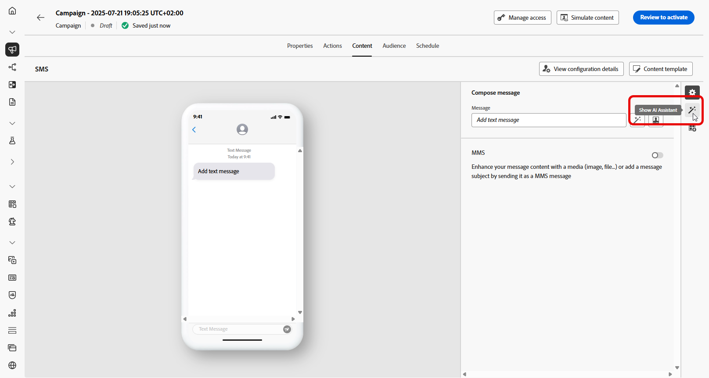
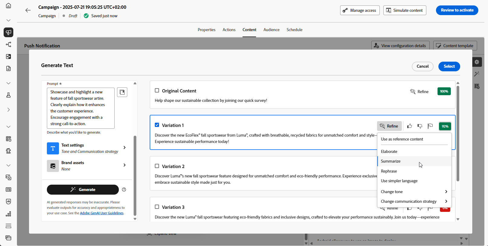

# Tekst genereren met AI Assistant {#generative-text}

>[!IMPORTANT]
>
>Alvorens te beginnen gebruikend dit vermogen, lees uit verwante [ Grafieken en Beperkingen ](gs-generative.md#generative-guardrails).
> 
>
>U moet met a [ gebruikersovereenkomst ](https://www.adobe.com/legal/licenses-terms/adobe-dx-gen-ai-user-guidelines.html) akkoord gaan alvorens u AI Medewerker in Journey Optimizer kunt gebruiken. Neem voor meer informatie contact op met uw Adobe-vertegenwoordiger.

Met AI Assistant in Journey Optimizer kunt u aansprekende tekstinhoud genereren die op uw publiek lijkt. Of u het e-mailexemplaar moet verbeteren, dwingende Web-inhoud tot stand moet brengen, overredende het landen paginatekst, druk berichten, of de berichten van sms samenstellen, AI Medewerker helpt u onechte tekst leveren.

## Voor e-mail- en webkanalen {#email-web-channels}

Met AI Assistant kunt u tekstinhoud van hoge kwaliteit genereren voor e-mailcampagnes, webervaringen en bestemmingspagina&#39;s. Met deze mogelijkheid kunt u aansprekende, on-brand berichten maken die via digitale aanraakpunten verbinding maken met uw publiek.

### Toegang en configuratie {#access-configure}

Voordat u tekstinhoud kunt genereren met AI Assistant, moet u eerst uw campagne of reis instellen en toegang krijgen tot de inhoudeditor. Voer de volgende stappen uit om uw werkruimte voor te bereiden en het deelvenster AI Assistant te openen.

1. Maak en configureer uw campagne of reis:

   * **E-mail**: Na het creëren van en het vormen van uw e-mailcampagne, klik **[!UICONTROL Edit content]**. [Meer informatie](../email/create-email.md)
   * **Web**: Na het creëren van en het vormen van uw Web-pagina, klik **[!UICONTROL Edit web page]**. [Meer informatie](../web/create-web.md)
   * **het Bestaan Pagina**: Na het creëren van en het vormen van uw het landen pagina, klik **[!UICONTROL Open designer]**. [Meer informatie](../landing-pages/create-lp.md)

1. Selecteer een **[!UICONTROL Text component]** als u alleen een specifieke inhoud als doel wilt instellen en het menu **[!UICONTROL AI Assistant]** (of **[!UICONTROL Show AI Assistant]** voor het web) wilt openen.

   {zoomable="yes"}

### Inhoud genereren {#generate-content}

Leer hoe u duidelijke aanwijzingen maakt, instellingen nauwkeurig afstemt en op maat gemaakte tekst genereert met AI Assistant, zodat uw berichten worden afgestemd op uw merk- en communicatiedoelstellingen.

1. Schakel de optie **[!UICONTROL Use original content]** voor AI Assistant in om nieuwe inhoud aan te passen op basis van de geselecteerde inhoud.

1. Selecteer **[!UICONTROL Brand]** om te zorgen dat door AI gegenereerde inhoud wordt uitgelijnd op de specificaties van uw merk. [ leer meer ](brands.md) op Banden.

1. Verfijn de inhoud door te beschrijven wat u wilt genereren in het veld **[!UICONTROL Prompt]** .

   Als u hulp bij het ontwerpen van uw herinnering zoekt, toegang **[!UICONTROL Prompt Library]** die een diverse waaier van snelle ideeën verstrekt om uw campagnes te verbeteren.

   {zoomable="yes"}

1. Volg uw vraag met de optie **[!UICONTROL Text settings]** :

   * **[!UICONTROL Communication strategy]**: Kies de meest geschikte communicatiestijl voor de gegenereerde tekst.
   * **[!UICONTROL Languages]**: kies de taal van de gegenereerde inhoud.
   * **[!UICONTROL Tone]**: De toon zou met uw publiek moeten resoneren. Of u informatief wilt klinken, playful, of overtuigend, AI Medewerker kan het bericht dienovereenkomstig aanpassen.
   * **Lengte van de Tekst**: Gebruik de schuif om de gewenste lengte van uw tekst te selecteren.

   {zoomable="yes"}

1. Klik in het menu **[!UICONTROL Brand assets]** op **[!UICONTROL Upload brand asset]** om een merkelement toe te voegen dat inhoud bevat die extra context-AI-assistent kan bieden of selecteer een eerder geüpload element.

   Eerder geüploade bestanden zijn beschikbaar in de vervolgkeuzelijst **[!UICONTROL Uploaded brand assets]** . Schakel eenvoudig de elementen in die u wilt opnemen in uw generatie.

   {zoomable="yes"}

1. Klik op **[!UICONTROL Generate]** als de vraag gereed is.

### Verfijnen en voltooien {#refine-finalize}

Leer hoe u de gegenereerde tekst kunt reviseren, verfijningen kunt aanbrengen en personalisatie kunt toepassen om uw inhoud te voltooien, zodat u gepolijst en boeiende berichten kunt maken die u kunt leveren.

1. Blader door het gegenereerde bestand **[!UICONTROL Variations]** .

   Klik op **[!UICONTROL Preview]** om een schermvullende versie van de geselecteerde variant weer te geven of klik op **[!UICONTROL Apply]** om de huidige inhoud te vervangen.

1. Klik op het percentagepictogram om uw **[!UICONTROL Brand Alignment Score]** weer te geven en eventuele onjuiste uitlijningen met uw merk te identificeren.

   Leer meer op [ de groeperingsscore van het Merk ](brands-score.md).

   {zoomable="yes"}

1. Navigeer naar de optie **[!UICONTROL Refine]** in het **[!UICONTROL Preview]** -venster voor toegang tot extra aanpassingsfuncties:

   * **[!UICONTROL Use as reference content]**: De gekozen variant zal als verwijzingsinhoud voor het produceren van andere resultaten dienen.

   * **[!UICONTROL Rephrase]**: herschrijf het bericht terwijl de betekenis behouden blijft. Met deze optie kunt u alternatieve bewoordingen genereren, de stroom verbeteren of de formulering aanpassen zonder het kernbericht te wijzigen.

   * **[!UICONTROL Use simpler language]**: Gebruik AI Assistant om uw taal te vereenvoudigen, zodat een groter publiek helderheid en toegankelijkheid krijgt.

   * **[!UICONTROL Change tone]**: pas de toon van het bericht aan om uw communicatie stijl beter aan te passen, d.w.z. het vriendelijker, professioneel, dringend, of inspirerend te maken.

   * **[!UICONTROL Change Communication strategy]**: wijzig de berichtenbenadering op basis van uw doelstellingen, zoals het creëren van urgentie, of het benadrukken van opwindende aantrekkingskracht.

   {zoomable="yes"}

1. Open het **[!UICONTROL Brand Alignment]** lusje om te zien hoe uw inhoud zich op uw [ merkrichtlijnen ](brands.md) richt.

1. Klik op **[!UICONTROL Select]** zodra u de juiste inhoud hebt gevonden.

   U kunt ook experimenteren met uw inhoud inschakelen. [Meer informatie](generative-experimentation.md)

1. Voeg verpersoonlijkingsgebieden in om uw inhoud aan te passen die op profielgegevens wordt gebaseerd. Klik vervolgens op de knop **[!UICONTROL Simulate content]** om de rendering te beheren en controleer de instellingen voor aanpassing met testprofielen. [Meer informatie](../personalization/personalize.md)

1. Bekijk en activeer uw inhoud:
   * **E-mail**: Wanneer u uw inhoud, publiek en programma hebt bepaald, bent u klaar om uw e-mailcampagne voor te bereiden. [Meer informatie](../campaigns/review-activate-campaign.md)
   * **Web**: Zodra u uw montages van de Webcampagne bepaalde en uw inhoud zoals gewenst uitgeeft, kunt u uw Webcampagne herzien en activeren. [Meer informatie](../web/create-web.md#activate-web-campaign)
   * **het Bestaan Pagina**: Zodra uw het landen pagina klaar is, kunt u het publiceren om het voor gebruik in een bericht ter beschikking te stellen. [Meer informatie](../landing-pages/create-lp.md#publish-landing-page)

## Voor mobiele kanalen {#mobile-channels}

Met AI Assistant kunt u aansprekende tekstinhoud voor uw pushberichten en SMS-berichten genereren, zodat u aantrekkelijke mobiele communicatie kunt maken die op alle mobiele aanraakpunten aansluit bij uw doelgroep.

### Toegang en configuratie {#mobile-access-configure}

Voordat u begint met het genereren van tekst met AI Assistant voor mobiele kanalen, moet u uw campagne instellen en toegang krijgen tot de AI Assistant. De toegangsmethode verschilt enigszins tussen pushberichten en SMS-berichten.

1. Maak en configureer uw mobiele campagne:
   * **Duw berichten**: Na het creëren van en het vormen van uw campagne van het pushbericht, klik **[!UICONTROL Edit content]**. [Meer informatie](../push/create-push.md)
   * **SMS**: Na het creëren van en het vormen van uw campagne van SMS, klik **[!UICONTROL Edit content]**. [Meer informatie](../sms/create-sms.md)

1. Vul **[!UICONTROL Basic details]** in voor uw campagne. Klik op **[!UICONTROL Edit content]** als u klaar bent.

1. Pas uw bericht naar wens aan:
   * **duw berichten**: [ Leer meer ](../push/design-push.md)
   * **SMS**: [ Leer meer ](../sms/create-sms.md)

1. AI-assistent openen:
   * **voor Push berichten**: Klik het **[!UICONTROL Edit text with AI Assistant]** menu naast uw **[!UICONTROL Title]** of **[!UICONTROL Message]** gebieden. U kunt tot het **AI hulp** menu ook direct toegang hebben.

     {zoomable="yes"}

   * **voor SMS**: Klik het **[!UICONTROL Edit text with AI Assistant]** menu naast uw **[!UICONTROL Message]** of toegang tot het **[!UICONTROL Show AI Assistant]** menu.

     {het bericht van SMS van 0} redacteur met AI Hulp geopend paneel {zoomable="yes"}

### Inhoud genereren {#mobile-generate-content}

Zodra u de Medewerker van AI hebt betreden, kunt u de generatie montages vormen om mobiele inhoud tot stand te brengen die uw merk en campagnedoelstellingen aanpast. Pas tekstparameters aan, voeg merkelementen toe en geef instructies om AI te begeleiden bij het genereren van relevante variaties.

1. Selecteer **[!UICONTROL Brand]** om te zorgen dat door AI gegenereerde inhoud wordt uitgelijnd op de specificaties van uw merk. [ leer meer ](brands.md) op Banden.

   Merk op dat de eigenschap van Merken als privé bèta wordt vrijgegeven en aan alle klanten in toekomstige versies geleidelijk beschikbaar zal zijn.

1. Verfijn de inhoud door te beschrijven wat u wilt genereren in het veld **[!UICONTROL Prompt]** .

   Als u hulp bij het ontwerpen van uw herinnering zoekt, toegang **[!UICONTROL Prompt Library]** die een diverse waaier van snelle ideeën verstrekt om uw campagnes te verbeteren. [ Leer meer op snelle beste praktijken ](ai-assistant-prompting-guide.md)

   {zoomable="yes"}

1. **voor het Push- bericht**, kies welk gebied u wilt produceren: Titel en/of Bericht.

1. Volg uw vraag met de optie **[!UICONTROL Text settings]** :

   * **[!UICONTROL Communication strategy]**: Kies de meest geschikte communicatiestijl voor de gegenereerde tekst.
   * **[!UICONTROL Languages]**: kies de taal van de gegenereerde inhoud.
   * **[!UICONTROL Tone]**: De toon zou met uw publiek moeten resoneren. Of u informatief wilt klinken, playful, of overtuigend, AI Medewerker kan het bericht dienovereenkomstig aanpassen.

     {zoomable="yes"}

1. Klik in het menu **[!UICONTROL Reference content]** op **[!UICONTROL Upload file]** om een merkelement toe te voegen dat inhoud bevat die extra context-AI-assistent kan bieden of selecteer een eerder geüpload element.

   Eerder geüploade bestanden zijn beschikbaar in de vervolgkeuzelijst **[!UICONTROL Uploaded reference content]** . Schakel eenvoudig de elementen in die u wilt opnemen in uw generatie.

1. Klik op **[!UICONTROL Generate]** als de vraag gereed is.

### Verfijnen en voltooien {#mobile-refine-finalize}

Nadat u tekstvariaties voor uw mobiele berichten hebt gegenereerd, kunt u de resultaten afstemmen om ervoor te zorgen dat deze precies aan uw vereisten voldoen. Controleer de uitlijning van het merk, pas de toon en de taal aan en bereid de inhoud voor activering.

1. Blader na het genereren door de **[!UICONTROL Variations]** .

1. Klik op het percentagepictogram om uw **[!UICONTROL Brand Alignment Score]** weer te geven en eventuele onjuiste uitlijningen met uw merk te identificeren.

   Leer meer op [ de groeperingsscore van het Merk ](brands-score.md).

   {zoomable="yes"}

1. Klik op **[!UICONTROL Preview]** om een schermvullende versie van de geselecteerde variant weer te geven of klik op **[!UICONTROL Apply]** om de huidige inhoud te vervangen.

1. Navigeer naar de optie **[!UICONTROL Refine]** in het **[!UICONTROL Preview]** -venster voor toegang tot extra aanpassingsfuncties:

   * **[!UICONTROL Use as reference content]**: De gekozen variant zal als verwijzingsinhoud voor het produceren van andere resultaten dienen.

   * **[!UICONTROL Rephrase]**: herschrijf het bericht terwijl de betekenis behouden blijft. Met deze optie kunt u alternatieve bewoordingen genereren, de stroom verbeteren of de formulering aanpassen zonder het kernbericht te wijzigen.

   * **[!UICONTROL Use simpler language]**: Gebruik AI Assistant om uw taal te vereenvoudigen, zodat een groter publiek helderheid en toegankelijkheid krijgt.

   * **[!UICONTROL Translate]**: Vereenvoudig uw taal voor meer duidelijkheid en toegankelijkheid voor een groter publiek.

   * **[!UICONTROL Change tone]**: pas de toon van het bericht aan om uw communicatie stijl beter aan te passen, d.w.z. het vriendelijker, professioneel, dringend, of inspirerend te maken.

   * **[!UICONTROL Change Communication strategy]**: wijzig de berichtenbenadering op basis van uw doelstellingen, zoals het creëren van urgentie, of het benadrukken van opwindende aantrekkingskracht.

     {zoomable="yes"}

1. Open het **[!UICONTROL Brand Alignment]** lusje om te zien hoe uw inhoud zich op uw [ merkrichtlijnen ](brands.md) richt.

1. Klik op **[!UICONTROL Select]** zodra u de juiste inhoud hebt gevonden.

   U kunt ook experimenteren met uw inhoud inschakelen. [Meer informatie](generative-experimentation.md)

1. Voeg verpersoonlijkingsgebieden in om uw inhoud aan te passen die op profielgegevens wordt gebaseerd. Klik vervolgens op de knop **[!UICONTROL Simulate content]** om de rendering te beheren en controleer de instellingen voor aanpassing met testprofielen. [Meer informatie](../personalization/personalize.md)

Wanneer u uw inhoud, publiek en planning hebt gedefinieerd, kunt u uw mobiele campagne voorbereiden. [Meer informatie](../campaigns/review-activate-campaign.md)

