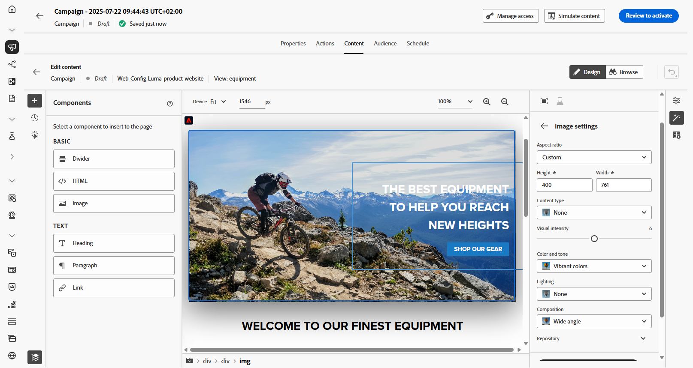
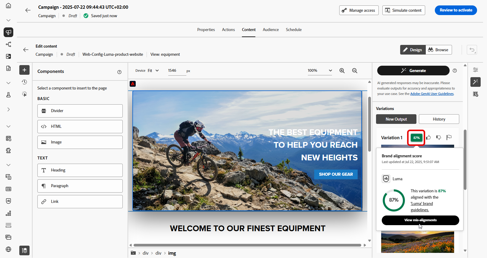

# Webpagina&#39;s genereren met AI Assistant {#generative-web}

>[!IMPORTANT]
>
>Alvorens te beginnen gebruikend dit vermogen, lees uit verwante [ Grafieken en Beperkingen ](gs-generative.md#generative-guardrails).
> 
>
>U moet met a [ gebruikersovereenkomst ](https://www.adobe.com/legal/licenses-terms/adobe-dx-gen-ai-user-guidelines.html) akkoord gaan alvorens u AI Medewerker in Journey Optimizer kunt gebruiken. Neem voor meer informatie contact op met uw Adobe-vertegenwoordiger.

Als u eenmaal uw webpagina&#39;s hebt gemaakt en gepersonaliseerd, gebruikt u AI Assistant in Journey Optimizer, aangedreven door generatieve AI, om uw inhoud naar het volgende niveau te brengen.

De AI Assistant in Journey Optimizer kan u helpen de impact van uw leveringen te optimaliseren door verschillende inhoud voor te stellen die waarschijnlijk beter op uw publiek zal reageren.

>[!BEGINTABS]

>[!TAB  Web-pagina tekstgeneratie ]

1. Klik op **[!UICONTROL Edit web page]** nadat u de webpagina hebt gemaakt en geconfigureerd.

   Voor meer informatie over hoe te om uw Web-pagina te vormen, verwijs naar [ deze pagina ](../web/create-web.md).

1. Selecteer een **[!UICONTROL Text component]** als u alleen een specifieke inhoud als doel wilt instellen. en opent u het menu **[!UICONTROL Show AI Assistant]** .

   {zoomable="yes"}

1. Schakel de optie **[!UICONTROL Use original content]** voor AI Assistant in om nieuwe inhoud aan te passen op basis van de geselecteerde inhoud.

1. Selecteer **[!UICONTROL Brand]** om te zorgen dat door AI gegenereerde inhoud wordt uitgelijnd op de specificaties van uw merk. [ leer meer ](brands.md) op Banden.

   Merk op dat de eigenschap van Merken als privé bèta wordt vrijgegeven en aan alle klanten in toekomstige versies geleidelijk beschikbaar zal zijn.

1. Verfijn de inhoud door te beschrijven wat u wilt genereren in het veld **[!UICONTROL Prompt]** .

   Als u hulp bij het ontwerpen van uw herinnering zoekt, toegang **[!UICONTROL Prompt Library]** die een diverse waaier van snelle ideeën verstrekt om uw campagnes te verbeteren.

   {zoomable="yes"}

1. Volg uw vraag met de optie **[!UICONTROL Text settings]** :

   * **[!UICONTROL Communication strategy]**: Kies de meest geschikte communicatiestijl voor de gegenereerde tekst.
   * **[!UICONTROL Languages]**: kies de taal van de gegenereerde inhoud.
   * **[!UICONTROL Tone]**: De tint van uw webpagina moet reageren op uw publiek. Of u informatief wilt klinken, playful, of overtuigend, AI Medewerker kan het bericht dienovereenkomstig aanpassen.
   * **Lengte van de Tekst**: Gebruik de schuif om de gewenste lengte van uw tekst te selecteren.

   {zoomable="yes"}

1. Klik in het menu **[!UICONTROL Brand assets]** op **[!UICONTROL Upload brand asset]** om een merkelement toe te voegen dat inhoud bevat die extra context-AI-assistent kan bieden of selecteer een eerder geüpload element.

   Eerder geüploade bestanden zijn beschikbaar in de vervolgkeuzelijst **[!UICONTROL Uploaded brand assets]** . Schakel eenvoudig de elementen in die u wilt opnemen in uw generatie.

1. Klik op **[!UICONTROL Generate]** als de vraag gereed is.

1. Blader door het gegenereerde bestand **[!UICONTROL Variations]** .

   Klik op **[!UICONTROL Preview]** om een schermvullende versie van de geselecteerde variant weer te geven of klik op **[!UICONTROL Apply]** om de huidige inhoud te vervangen.

1. Klik op het percentagepictogram om uw **[!UICONTROL Brand Alignment Score]** weer te geven en eventuele onjuiste uitlijningen met uw merk te identificeren.

   Leer meer op [ de groeperingsscore van het Merk ](brands-score.md).

   {zoomable="yes"}

1. Navigeer naar de optie **[!UICONTROL Refine]** in het **[!UICONTROL Preview]** -venster voor toegang tot extra aanpassingsfuncties:

   * **[!UICONTROL Use as reference content]**: De gekozen variant zal als verwijzingsinhoud voor het produceren van andere resultaten dienen.

   * **[!UICONTROL Elaborate]**: De AI-assistent kan u helpen bij het uitvouwen van specifieke onderwerpen en biedt extra informatie voor een beter begrip en betrokkenheid.

   * **[!UICONTROL Summarize]**: langdurige informatie kan ontvangers overladen. Met AI Assistant kunt u belangrijke punten samenvoegen tot heldere, beknopte samenvattingen die aandacht trekken en hen aanmoedigen om verder te lezen.

   * **[!UICONTROL Rephrase]**:TheAI Assistant kan uw bericht op verschillende manieren herformuleren, zodat u steeds fris schrijft en aantrekkelijk wordt voor verschillende soorten publiek.

   * **[!UICONTROL Use simpler language]**: Gebruik AI Assistant om uw taal te vereenvoudigen, zodat een groter publiek helderheid en toegankelijkheid krijgt.

   U kunt ook de **[!UICONTROL Tone]** en **[!UICONTROL Communication strategy]** van de tekst wijzigen.

   {zoomable="yes"}

1. Open het **[!UICONTROL Brand Alignment]** lusje om te zien hoe uw inhoud zich op uw [ merkrichtlijnen ](brands.md) richt.

1. Klik op **[!UICONTROL Select]** zodra u de juiste inhoud hebt gevonden.

   U kunt ook experimenteren met uw inhoud inschakelen. [Meer informatie](generative-experimentation.md)

Nadat u de instellingen voor uw webcampagne hebt gedefinieerd en uw inhoud naar wens hebt bewerkt met de webontwerper, kunt u uw webcampagne reviseren en activeren. [Meer informatie](../web/create-web.md#activate-web-campaign)

>[!TAB  Web-pagina beeldgeneratie ]

In het onderstaande voorbeeld leert u hoe u AI Assistant in Journey Optimizer kunt gebruiken om uw middelen te optimaliseren en te verbeteren, zodat u een gebruiksvriendelijker ervaring hebt.

1. Klik op **[!UICONTROL Edit web page]** nadat u de webpagina hebt gemaakt en geconfigureerd.

   Voor meer informatie over hoe te om uw Web-pagina te vormen, verwijs naar [ deze pagina ](../web/create-web.md).

1. Selecteer het element dat u wilt wijzigen met AI Assistant.

1. Selecteer **[!UICONTROL Show AI Assistant]** in het rechtermenu.

   {zoomable="yes"}

1. Schakel de optie **[!UICONTROL Reference style]** voor AI Assistant in om nieuwe inhoud aan te passen op basis van de referentie-inhoud. U kunt ook een afbeelding uploaden om context aan uw variatie toe te voegen.

1. Selecteer **[!UICONTROL Brand]** om te zorgen dat door AI gegenereerde inhoud wordt uitgelijnd op de specificaties van uw merk. [ leer meer ](brands.md) op Banden.

   Merk op dat de eigenschap van Merken als privé bèta wordt vrijgegeven en aan alle klanten in toekomstige versies geleidelijk beschikbaar zal zijn.

1. Verfijn de inhoud door te beschrijven wat u wilt genereren in het veld **[!UICONTROL Prompt]** .

   Als u hulp bij het ontwerpen van uw herinnering zoekt, toegang **[!UICONTROL Prompt Library]** die een diverse waaier van snelle ideeën verstrekt om uw campagnes te verbeteren.

   {zoomable="yes"}

1. Volg uw vraag met de optie **[!UICONTROL Image settings]** :

   * **[!UICONTROL Aspect ratio]**: hiermee bepaalt u de breedte en hoogte van het element. U hebt de optie om van gemeenschappelijke verhoudingen zoals 16 te kiezen :9, 4 :3, 3 :2, of 1 :1, of u kunt een douanegrootte ingaan.
   * **[!UICONTROL Content type]**: hiermee wordt de aard van het visuele element gecategoriseerd, waarbij onderscheid wordt gemaakt tussen verschillende vormen van visuele representatie, zoals foto&#39;s, afbeeldingen of illustraties.
   * **[!UICONTROL Visual intensity]**: U kunt de invloed van de afbeelding bepalen door de intensiteit ervan aan te passen. Bij een lagere instelling (2) wordt het uiterlijk zachter en minder sterk, terwijl bij een hogere instelling (10) de afbeelding levendiger en visueel krachtiger wordt.
   * **[!UICONTROL Color & tone]**: De algemene weergave van de kleuren in een afbeelding en de sfeer die of de sfeer die door de afbeelding wordt overgebracht.
   * **[!UICONTROL Lighting]**: hiermee wordt de bliksemschicht in een afbeelding bedoeld, die de atmosfeer van de afbeelding bepaalt en specifieke elementen markeert.
   * **[!UICONTROL Composition]**: dit heeft betrekking op de rangschikking van elementen binnen het kader van een afbeelding

   {zoomable="yes"}

1. Klik in het menu **[!UICONTROL Brand assets]** op **[!UICONTROL Upload brand asset]** om een merkelement toe te voegen dat inhoud bevat die extra context-AI-assistent kan bieden of selecteer een eerder geüpload element.

   Eerder geüploade bestanden zijn beschikbaar in de vervolgkeuzelijst **[!UICONTROL Uploaded brand assets]** . Schakel eenvoudig de elementen in die u wilt opnemen in uw generatie.

1. Als u tevreden bent met de snelle configuratie, klikt u op **[!UICONTROL Generate]** .

1. Blader door het gegenereerde bestand **[!UICONTROL Variations]** .

   Klik op **[!UICONTROL Preview]** om een schermvullende versie van de geselecteerde variant weer te geven of klik op **[!UICONTROL Apply]** om de huidige inhoud te vervangen.

1. Klik op het percentagepictogram om uw **[!UICONTROL Brand Alignment Score]** weer te geven en eventuele onjuiste uitlijningen met uw merk te identificeren.

   Leer meer op [ de groeperingsscore van het Merk ](brands-score.md).

   {zoomable="yes"}

1. Navigeer naar de optie **[!UICONTROL Refine]** in het **[!UICONTROL Preview]** -venster voor toegang tot extra aanpassingsfuncties:

   * **[!UICONTROL Generate Similar]** om verwante afbeeldingen met deze variant weer te geven.
   * **[!UICONTROL Edit in Adobe Express]** om uw element verder aan te passen.

[Meer informatie over Adobe Express-integratie](../integrations/express.md)

   * **[!UICONTROL Save]** gebruiken om de elementen op te slaan, zodat u ze later kunt gebruiken.

   {zoomable="yes"}

1. Open het **[!UICONTROL Brand Alignment]** lusje om te zien hoe uw inhoud zich op uw [ merkrichtlijnen ](brands.md) richt.

1. Klik op **[!UICONTROL Select]** zodra u de juiste inhoud hebt gevonden.

   U kunt ook experimenteren met uw inhoud inschakelen. [Meer informatie](generative-experimentation.md)

Nadat u de instellingen voor uw webcampagne hebt gedefinieerd en uw inhoud naar wens hebt bewerkt met de webontwerper, kunt u uw webcampagne reviseren en activeren. [Meer informatie](../web/create-web.md#activate-web-campaign)

>[!ENDTABS]
