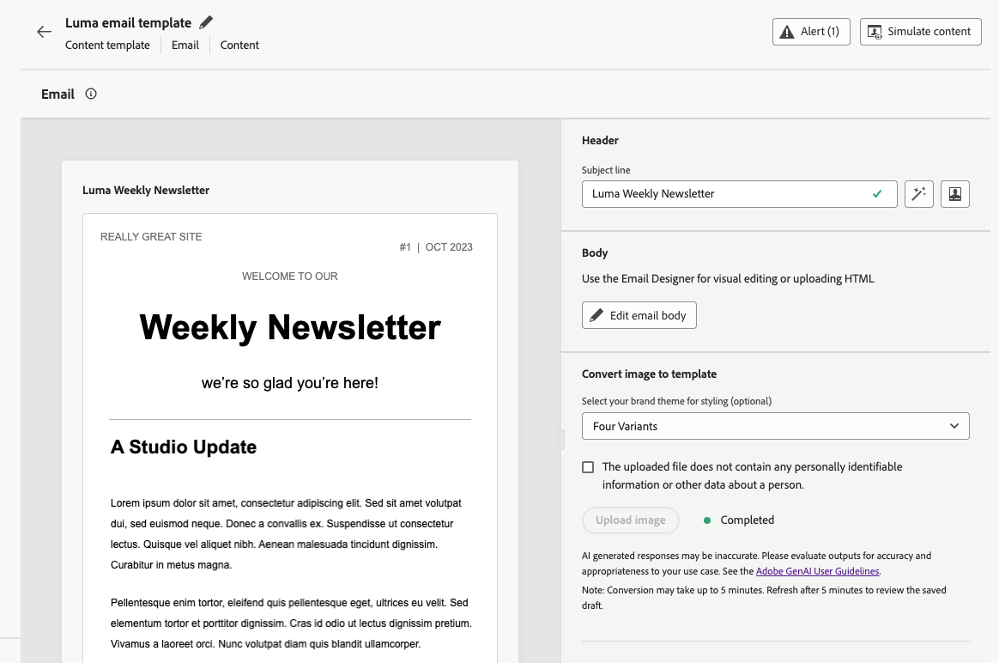

# Afbeeldingen converteren naar sjablonen voor e-mailinhoud {#image-to-html}

Met [!DNL Journey Optimizer] kunt u het maken van e-mail aanzienlijk versnellen door statische afbeeldingsontwerpen om te zetten in volledig aanpasbare, modulaire sjablonen voor e-mailinhoud.

>[!AVAILABILITY]
>
>Als u deze functie wilt gebruiken, moet uw organisatie het addendum [!DNL Generative AI] met Adobe hebben ondertekend. Neem bij twijfel contact op met uw Adobe-vertegenwoordiger.
>
>Deze mogelijkheid is alleen beschikbaar voor het e-mailkanaal.

Door generatieve AI technologie leveraging, analyseert een geïntegreerd hulpmiddel de lay-out, typografie, kleuren, en visuele elementen in uw beeld en produceert schone, modulaire inhoud van HTML die ontwerpwaarachtigheid terwijl het verzekeren van volledige editability met [&#x200B; e-mail Designer &#x200B;](../email/get-started-email-design.md) handhaaft.

Dankzij deze codeerfunctie kunnen marketers visuele elementen van grafische ontwerpers of ontwerpgereedschappen transformeren in responsieve, bewerkbare e-mailsjablonen die kunnen worden opgeslagen en hergebruikt voor meerdere reizen en campagnes, zonder dat hiervoor technische expertise vereist is.

>[!IMPORTANT]
>
>Alvorens te beginnen om deze eigenschap te gebruiken, lees uit verwante [&#x200B; Grafieken en aanbevelingen &#x200B;](#limitations).

De belangrijkste voordelen zijn:

* **sneller dan hand-coderen** - de converter zet beelden in editable inhoud in notulen, zodat kunt u het handtijdrovende mockup-aan-HTML werkschema overslaan.
* **Geen technische vaardigheden nodig** - de Marketers kunnen malplaatjes zonder ontwerp of ontwikkelingssteun produceren en aanpassen.
* **herbruikbaar over campagnes** - sparen malplaatjes aan uw bibliotheek en gebruik hen in om het even welke reis of campagne.
* **Talen waar aan het ontwerp** - de Output past uw lay-out en het stileren aan terwijl het zijn volledig compatibel met E-mail Designer.

<!--* **Design fidelity**: Maintain visual consistency with your original design while creating fully editable content
* **Email compatibility**: Generate HTML that works seamlessly with the Email Designer and across email clients-->

+++ Vaak voorkomende gebruiksscenario&#39;s

De afbeelding naar HTML-converter is ideaal voor:

* **de migratie van het Platform**: Het migreren van een ander e-mailmarketing platform? Zet uw bestaande e-mailontwerpen om in HTML-sjablonen die klaar zijn voor [!DNL Journey Optimizer] zonder dat u ze helemaal opnieuw hoeft op te bouwen.
* **Mockup van het Ontwerp omzetting**: Transformeer ontwerpmodellen van hulpmiddelen zoals Photoshop, Figma, of andere ontwerpsoftware in functionele e-mailmalplaatjes.
* **Snelle malplaatjeverwezenlijking**: Produceer snel e-mailmalplaatjes voor tijd-gevoelige campagnes zonder het wachten op ontwikkelaarsmiddelen.
* **de malplaatjebibliotheken van de Bouw**: Creeer een uitvoerige bibliotheek van brand-verenigbare malplaatjes die de niet-technische teamleden kunnen aanpassen en opstellen.
* **Verminderend technische gebiedsdelen**: Laat marketers toe om op e-mailmalplaatjes onafhankelijk tot stand te brengen en te herhalen, die campagneuitvoering versnellen.

+++

## De afbeelding openen naar HTML-converter {#access-image-to-html}

**Addendum met Adobe**

Uw organisatie moet het addendum [!DNL Generative AI] met Adobe hebben ondertekend om toegang te krijgen tot deze functie. Neem bij twijfel contact op met uw Adobe-vertegenwoordiger.

**Toestemmingen**

* Om tot malplaatjes toegang te hebben en tot stand te brengen, moet uw rol de **[!UICONTROL Manage content templates]** toestemming (onder het **2&rbrace; middel van het Beheer van de Inhoud) omvatten.** [&#x200B; leer meer over toestemmingen &#x200B;](../administration/permissions.md)

* Om het beeld aan de converter van HTML te gebruiken, moet u worden verleend **produceer Inhoud** toestemming. Leer hoe te om Inhoudgeneratie verwante toestemmingen in [&#x200B; toe te wijzen deze sectie &#x200B;](../content-management/gs-generative.md#generative-access).

**Overeenkomst**

Voordat u deze functie kunt gebruiken, moet u akkoord gaan met een gebruikersovereenkomst die de eerste keer dat u Generative AI gebruikt, weergeeft in [!DNL Journey Optimizer] . Voor meer informatie, lees de [&#x200B; Generatieve AI Richtlijnen van de Gebruiker van Adobe Experience Cloud &#x200B;](https://www.adobe.com/legal/licenses-terms/adobe-gen-ai-user-guidelines.html){target="_blank"}.

## Guardrails en aanbevelingen {#limitations}

Houd rekening met de volgende beperkingen en aanbevelingen wanneer u afbeeldingen omzet in sjablonen voor e-mailinhoud.

**Passendheid**

* **AI interpretatie**: AI produceert statische inhoud van HTML die op visuele interpretatie van uw beeld wordt gebaseerd. Het biedt een sterk startpunt voor het maken van e-mails, maar moet worden gecontroleerd en verfijnd met de e-mail Designer om ervoor te zorgen dat deze precies aan uw vereisten voldoet. U dient na conversie indien nodig handmatig personalisatie, dynamische inhoud en tekstspatiëring toe te voegen.

* **de nauwkeurigheid van de Tekst**: Terwijl AI probeert om tekst nauwkeurig te erkennen en te reproduceren, verifieer altijd tekstinhoud en maak correcties zoals nodig. Controleer de [&#x200B; Generatieve AI Richtlijnen van de Gebruiker van Adobe &#x200B;](https://www.adobe.com/legal/licenses-terms/adobe-gen-ai-user-guidelines.html){target="_blank"}.

**selectie van het Beeld**

* **PII en gevoelige gegevens**: Zorg ervoor om een beeld te selecteren dat geen persoonlijk identificeerbare informatie (PII) of andere gevoelige gegevens bevat.

* **de grootte van het Beeld**: U kunt geen beelden uploaden groter dan 10MB.

* **beelden van uitstekende kwaliteit**: Voor beste resultaten, gebruik duidelijke beelden, van uitstekende kwaliteit: scherpe beelden, leesbare tekst, en duidelijk-bepaalde lay-outelementen. De kwaliteit van de omzetting wordt verminderd door vage, donkere of geklonterde afbeeldingen. De afbeeldingen moeten idealiter tussen 600 en 800 pixels breed zijn, zodat ze overeenkomen met de standaard e-mailafmetingen.

* **Eenvoudige lay-outs**: De hoogst complexe ontwerpen met ingewikkelde het in lagen plaatsen, ongebruikelijke vormen, of niet-standaardelementen kunnen niet perfect omzetten. Eenvoudiger ontwerpen leveren over het algemeen betere resultaten op.

**Verwerking**

* **verfrist de pagina**: Het resultaat wordt niet automatisch getoond tot u zich vernieuwt.

* **de tijd van de Verwerking**: De omzetting eindigt vaak binnen **ongeveer 5 minuten**, afhankelijk van ingewikkeldheid en beeldgrootte. Zeer grote of complexe afbeeldingen kunnen soms tot 10 minuten duren. Wacht dienovereenkomstig en vernieuw vervolgens om het resultaat te bekijken.

<!--
* **Background processing**: The AI processing happens in the background, so you can work on other tasks without keeping the screen open. The template is automatically saved as a draft once the conversion is complete.

**Feedback is welcome!** Use the dedicated section to share your thoughts and suggestions with Adobe to help us improve the feature.-->

## Een afbeelding converteren naar een HTML-sjabloon {#convert-image}

Volg onderstaande stappen om een afbeeldingsontwerp om te zetten in een volledig aanpasbare sjabloon voor e-mailinhoud.

1. Zorg ervoor dat u een afbeeldingsbestand in JPEG- of PNG-indeling hebt dat uw e-mailontwerp bevat.

   >[!IMPORTANT]
   >
   >De beeldgrootte kan niet **10MB** overschrijden. Voor beste resultaten, gebruik a **duidelijk beeld van uitstekende kwaliteit** met scherpe visuals, leesbare tekst, en duidelijk-bepaalde lay-outelementen.

1. U kunt de lijst met inhoudssjablonen openen door in het linkermenu **[!UICONTROL Content Management]** > **[!UICONTROL Content templates]** te selecteren.

1. Klik op **[!UICONTROL Create template]**.

1. Vul de sjabloondetails in en selecteer **[!UICONTROL Email]** als het kanaal en klik op **[!UICONTROL Create]** .

1. Voer in de sectie **[!UICONTROL Convert image to template]** de volgende stappen uit:

   * (Optioneel) Als in uw organisatie merkthema&#39;s zijn gedefinieerd in Journey Optimizer, kunt u een thema als invoer selecteren zodat de gegenereerde HTML wordt opgemaakt volgens de themaparameters van uw merk. [&#x200B; leer meer over thema&#39;s &#x200B;](../email/apply-email-themes.md)

     Stijlen zoals achtergrondkleur, knopkleur, lettertypen, regelafstand, marges en opvulling worden toegepast op de gegenereerde sjabloon, waardoor extra ontwerpwerkzaamheden worden verminderd en een sjabloon wordt gemaakt die klaar is voor gebruik met minimale bewerkingen.

   * Als u een afbeelding wilt uploaden, moet u ervoor zorgen dat deze geen PII&#39;s (Persoonlijk identificeerbare gegevens) of andere vertrouwelijke gegevens bevat. Schakel de desbetreffende optie in om te bevestigen dat u het bestand hebt gereviseerd.

   * Klik op de knop **[!UICONTROL Upload image]** om het afbeeldingsbestand te selecteren.

     {width=80%}

     >[!CAUTION]
     >
     >Wanneer u een afbeelding uploadt voor conversie, wordt alle inhoud die momenteel in de e-mail is toegevoegd, verwijderd en vervangen door de gegenereerde sjabloon.

1. Als dit de eerste keer is dat u Generative AI gebruikt in [!DNL Journey Optimizer] , wordt u gevraagd akkoord te gaan met de gebruikersovereenkomst. Om meer te leren, controleer de [&#x200B; Generatieve AI Richtlijnen van de Gebruiker van Adobe &#x200B;](https://www.adobe.com/legal/licenses-terms/adobe-gen-ai-user-guidelines.html){target="_blank"}.

   {width=50%}

   Klik op **[!UICONTROL Agree]** om door te gaan.

1. Na het selecteren van het beeld, klik **[!UICONTROL Open]** om het op AI-Gebaseerde omzettingsproces te beginnen, dat vaak binnen **ongeveer 5 minuten** voltooit - afhankelijk van de ingewikkeldheid en de grootte van uw beeldontwerp.

   >[!NOTE]
   >
   >Zeer grote afbeeldingen kunnen in sommige gevallen tot 10 minuten duren. U kunt buiten dit scherm navigeren en aan andere taken werken terwijl de conversie bezig is.

1. **verfrist de pagina** om de output te zien. Nadat de conversie is voltooid, wordt de gegenereerde inhoud weergegeven en automatisch opgeslagen als concept.

   >[!IMPORTANT]
   >
   >Het resultaat wordt niet automatisch getoond tot u verfrist.

   {width=90%}

1. Gebruik de sectie **[!UICONTROL Image to template converter feedback]** om uw gedachten en suggesties met Adobe te delen om ons te helpen de functie te verbeteren.
   {width=70%}

1. Klik op **[!UICONTROL Edit email body]**. Het omgezette malplaatje opent in [&#x200B; E-mail Designer &#x200B;](../email/get-started-email-design.md) met volledige het uitgeven mogelijkheden. U kunt nu het volgende:

   * Tekstinhoud controleren, bewerken en personalisatie toepassen
   * Afbeeldingen wijzigen en koppelingen toevoegen
   * Kleuren, lettertypen en stijlen aanpassen
   * Inhoud toevoegen, verwijderen of opnieuw rangschikken
   * Gebruik alle Designer-functies voor e-mail net als alle andere sjablonen

   

   Breng de gewenste wijzigingen aan om de sjabloon te verfijnen en aan te passen aan de richtlijnen van uw merk.

1. Klik op **[!UICONTROL Save]** als u tevreden bent met de sjabloon.

Uw sjabloon is nu beschikbaar in de inhoudssjabloonbibliotheek en kan worden gebruikt bij het maken van e-mails tijdens reizen of campagnes. [&#x200B; leer hoe te om inhoudsmalplaatjes &#x200B;](../email/use-email-templates.md) te gebruiken

## Best practices {#best-practices}

Volg deze aanbevelingen om optimale resultaten te bereiken bij het converteren van afbeeldingen naar sjablonen voor e-mailinhoud.

+++Voordat u begint

* **sparen bestaande inhoud**: Het omzetten van een beeld vervangt al bestaande inhoud in uw e-mailmalplaatje. Sla uw huidige werk altijd op voordat u deze functie gebruikt.
* **Plan uw werkschema**: Gebruik deze eigenschap aan het begin van uw proces van de e-mailverwezenlijking, of zorg ervoor u klaar bent om al huidige inhoud te vervangen.

+++

+++Afbeeldingen voorbereiden

* **Resolutie**: Gebruik high-resolution beelden voor betere tekstherkenning en elementenopsporing.
* **Duidelijkheid**: Gebruik duidelijk beeld-tekst moet gemakkelijk zijn te lezen en visuele elementen duidelijk-bepaald; vermijd vage, laag-contrast, of lawaaierige brondossiers.
* **Breedte**: De beelden van het ontwerp bij standaard e-mailbreedten (600-800px) om typische vereisten van de e-mailcliënt aan te passen.
* **formaat van het Dossier**: Het formaat van JPEG of van PNG van het gebruik - vermijd samengeperste of laag-kwaliteit beelden.
* **Volledig ontwerp**: Omvat het volledige e-mailontwerp in één enkel beeld, van kopbal aan footer.

+++

+++Ontwerpaspecten

* **Eenvoudige lay-outs**: De eenvoudigere, goed-gestructureerde lay-outs zetten nauwkeuriger dan hoogst complexe ontwerpen om.
* **Standaardelementen**: De gemeenschappelijke patronen van het e-mailontwerp van het gebruik (kopbal, lichaamssecties, CTAs, footer).
* **leesbaarheid van de Tekst**: Zorg voldoende contrast tussen tekst en achtergronden.
* **Web-veilige doopvonten**: De ontwerpen die gemeenschappelijke web-veilige doopvonten gebruiken zullen betere waarheidsgetrouwheid hebben.
* **vermijd overlappende elementen**: Houd ontwerpelementen duidelijk gescheiden voor betere structuurerkenning.

+++

+++Na conversie

* **verfrist zich om resultaten** te zien: Na ongeveer 5 minuten (of tot 10 minuten voor zeer grote beelden), vernieuw de pagina zodat de voltooide omzetting verschijnt.
* **herzie uw ontwerp**: Zodra de omzetting volledig is, wordt uw malplaatje automatisch bewaard als ontwerp. Neem de tijd om de gegenereerde inhoud zorgvuldig te controleren op nauwkeurigheid.
* **Test grondig**: Test e-mail over verschillende e-mailcliënten en apparaten. [&#x200B; Leer hoe te om inhoud &#x200B;](preview-test.md) voor te vertonen en te testen.
* **verfijnen manueel**: Breng aanpassingen aan zoals nodig gebruikend de [&#x200B; volledige het uitgeven van Designer van de E-mail &#x200B;](../email/get-started-email-design.md) mogelijkheden.
* **Merk groepering**: Verifieer kleuren, doopvonten, en het stileren passen uw merkrichtlijnen aan, gebruikend thema&#39;s als beschikbaar. [&#x200B; Leer meer over e-mailthema&#39;s &#x200B;](../email/apply-email-themes.md).
* **Personalization**: Voeg dynamische inhoud en personalisatietokens toe zoals vereist. [&#x200B; Leer meer over verpersoonlijking &#x200B;](../personalization/personalize.md).
* **Toegankelijkheid**: Herzie en verbeter toegankelijkheidseigenschappen indien nodig. [&#x200B; Leer meer over toegankelijke e-mailinhoud &#x200B;](../email/accessible-content.md).

+++

+++Feedback is welkom!

Gebruik de specifieke sectie om uw gedachten en suggesties met Adobe te delen om ons te helpen de functie te verbeteren.

+++

## Veelgestelde vragen {#faq}

+++Wat gebeurt er met mijn bestaande e-mailinhoud als ik een afbeelding omzet in een inhoudssjabloon?

Alle bestaande inhoud in uw e-mail wordt verwijderd en vervangen door de nieuw gegenereerde sjabloon wanneer u een afbeelding uploadt voor conversie. Sla belangrijke inhoud op voordat u deze functie gebruikt. U kunt deze functie het beste gebruiken aan het begin van het e-mailontwerpproces.

+++

+++Welke bestandsindelingen worden ondersteund?

De converter ondersteunt de afbeeldingsindelingen JPEG (.jpg, .jpeg) en PNG (.png).

+++

+++Hoe lang duurt het conversieproces?

De conversie wordt vaak binnen ongeveer 5 minuten voltooid, afhankelijk van de complexiteit en grootte van het afbeeldingsontwerp. Zeer grote afbeeldingen kunnen soms tot 10 minuten duren; extra tijd toestaan en vervolgens vernieuwen. De AI-verwerking vindt plaats op de achtergrond, zodat u kunt wegnavigeren en aan andere taken kunt werken. U hoeft het scherm niet open te houden. Zodra de conversie is voltooid, wordt uw bestand automatisch opgeslagen als een concept dat u kunt controleren en bewerken.

+++

+++Kan ik de gegenereerde sjabloon bewerken?

Ja! De gegenereerde inhoudssjabloon wordt geopend in de e-mail-Designer met volledige bewerkingsmogelijkheden. U kunt alle aspecten van de sjabloon wijzigen, zoals tekst, afbeeldingen, opmaak, indeling en structuur.

+++

+++Wat gebeurt er als de conversie niet precies overeenkomt met mijn ontwerp?

De AI doet zijn best om uw ontwerp nauwkeurig te interpreteren, maar wat handmatige verfijning kan nodig zijn. Gebruik de E-mail Designer om elementen aan te passen die moeten worden verfijnd.

+++

+++Kan ik deze functie gebruiken voor het landen van pagina&#39;s of andere inhoudstypen?

De afbeelding naar HTML-converter is momenteel specifiek ontworpen voor sjablonen voor e-mailinhoud. Voor andere inhoudstypen gebruikt u de standaardopties voor ontwerp en importeren die beschikbaar zijn in de E-mail Designer.

+++

+++Heb ik speciale toestemmingen nodig om deze eigenschap te gebruiken?

Deze mogelijkheid is beschikbaar voor alle klanten die het addendum [!DNL Gen AI] met Adobe hebben ondertekend. Neem contact op met uw Adobe-vertegenwoordiger als u niet zeker weet of uw organisatie het addendum heeft ondertekend.

+++

+++Kan ik geconverteerde sjablonen opnieuw gebruiken voor meerdere campagnes?

Ja! Sjablonen die met de afbeelding zijn gemaakt, worden automatisch opgeslagen naar de inhoudssjabloonbibliotheek. U kunt ze openen en opnieuw gebruiken in elke e-mail tijdens uw reizen en campagnes. [Meer informatie](content-templates.md)

+++

+++Kan ik dit gebruiken voor platformmigratie?

Ja! De afbeelding wordt omgezet naar HTML en is ideaal voor het migreren van andere marketingplatforms voor e-mail. Exporteer of screenshot gewoon uw bestaande e-mailontwerpen vanaf uw vorige platform en zet ze om in HTML-sjablonen die klaar zijn voor AJO zonder ze helemaal opnieuw op te bouwen.

+++

## Verwante onderwerpen {#related-topics}

* [Aan de slag met inhoudssjablonen](content-templates.md)
* [Inhoudssjablonen maken](create-content-templates.md)
* [E-mailsjablonen gebruiken](../email/use-email-templates.md)
* [E-mailthema&#39;s gebruiken](../email/apply-email-themes.md)
* [Aan de slag met e-mailontwerp](../email/get-started-email-design.md)
