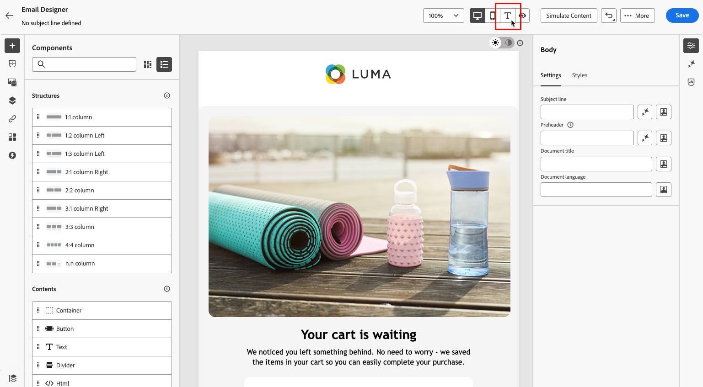

# E-mailtekst voor AI-invakken optimaliseren {#email-text-optimizer}

[!DNL Adobe Journey Optimizer] komt met een e-mail-kanaal vermogen dat u helpt de [ tekstversie ](../email/text-version-email.md) van uw berichten voor betere AI-Gesteunde inbox ervaart-zoals [!DNL Apple Intelligence] en [!DNL Google Gemini] in [!DNL Gmail]-zodat kunnen zij vragen beantwoorden en post samenvatten die op uw inhoud wordt gebaseerd nauwkeuriger, met betere resultaten.

>[!NOTE]
>
>Met deze functie wijzigt u alleen normale tekst, niet de HTML-versie van uw e-mailinhoud.

Met deze e-mailtekstoptimalisator kunt u ervoor zorgen dat de onbewerkte tekstversie van uw e-mailinhoud wordt verbeterd voor inbox-ervaringen met AI-ondersteuning, zodat de informatie die u aan de AI-functies van deze e-mailpostvakproviders verstrekt exact dezelfde is als die u wilt opgeven.

## Werking {#how-it-works}

De typische vraagontvangers kunnen in AI-Bijgewerkte inbox ervaringen vragen zijn *waarover dit e-mailbericht is?* of *wat zijn deze aanbiedingen?*.

* De antwoorden van deze AI-assistenten kunnen een korte samenvatting zijn (bijvoorbeeld dat het bericht promotioneel is, dat VIP vroege toegang en een verkoop noemt en links naar productcategorieën bevat), maar het weglaten van de doelstellingen waar de markt om vraagt, omdat de assistenten de tekst die ze daadwerkelijk zien, niet noodzakelijkerwijs het volledige verhaal dat u bedoelde.

* De medewerkers kunnen ook proactief naar kortingen of coupons zoeken die verband houden met het merk en deze voeden in het antwoord, zodat de gebruiker niet meer alleen kijkt naar wat je daadwerkelijk beloofde bericht. Dat gedrag is nuttig aan eind - gebruikers, maar verwatert controle voor marketers die antwoorden nodig hebben om de echte termijnen in verzenden te volgen.

Om deze problemen te voorkomen, herschrijft [!DNL Journey Optimizer] de onbewerkte tekst, zodat bonnen, kortingsbereiken, oproepen tot acties en andere prioriteiten vooraan in duidelijke, lineaire tekst worden weergegeven. Het doel is om AI aan grondsamenvattingen en Q&amp;A in uw bepaalde aanbiedingen en actie-in plaats van het leiden op een dun dun standaardtekstdeel of op niet verwante Webresultaten te leiden.

>[!IMPORTANT]
>
>Het exacte gedrag van de AI-assistent is afhankelijk van de inbox-provider en de modelversie. Nadat uw e-mail is bezorgd, kunnen de antwoorden en samenvattingen die door externe AI cliënten worden verstrekt verkeerd zijn, onvolledig, of met Webresultaten gemengd.
>
>Met de functie E-mailtekst optimaliseren voor AI-invakken wordt alleen de normale tekst verbeterd die u in Journey Optimizer hebt gemaakt. U kunt hiermee niet garanderen hoe een externe assistent het bericht zal interpreteren of weergeven. Lees meer over de [ beperkingen en de risico&#39;s van derde inbox AI ](#inbox-ai-risks).

## Aanbevolen gebruiksgevallen {#use-cases}

<!--
* **Critical details only in images** — Offers, promo codes, or deadlines shown in banners or graphics are invisible in plain text. Use the optimizer (and manual edits) so the same facts appear as text, improving extraction by AI summaries and text-only clients.-->

* **ontken of gefragmenteerde auto-geproduceerde tekst** - wanneer de standaard duidelijke tekst moeilijk is te scrollen, kan de optimalisering een duidelijkere lineaire verhaal met expliciete aanbiedingen en verbindingen veroorzaken.

* **controlerend inbox Q&amp;A** - wanneer u ontvangers verwacht om medewerkers *te vragen wat e-mail* of *is wat de aanbiedingen* zijn, vermindert een sterke duidelijke tekstversie gedeeltelijke overzichten en vermindert afhankelijkheid van web-rijzige antwoorden die niet aan uw goedgekeurd exemplaar gebonden zijn.

## Optimaliseren voor AI-inbox-ervaringen {#optimize-with-ai}

>[!IMPORTANT]
>
>Alvorens te beginnen gebruikend dit vermogen, lees uit verwante [ Risken en beperkingen ](#inbox-ai-risks).
>
>Als u toegang wilt tot deze functie, moet u akkoord gaan met een gebruikersovereenkomst die de eerste keer dat u Generative AI gebruikt, weergeeft in [!DNL Journey Optimizer] . Voor meer informatie, lees de [ Generatieve AI Richtlijnen van de Gebruiker van Adobe Experience Cloud ](https://www.adobe.com/legal/licenses-terms/adobe-gen-ai-user-guidelines.html){target="_blank"}.

Volg onderstaande stappen om de normale tekstversie van uw e-mailbericht te optimaliseren voor AI-vakken met [!DNL Journey Optimizer] .

1. Open uw e-mail in [ E-mail Designer ](../email/content-from-scratch.md) (van een campagne, reis, of malplaatje, afhankelijk van uw werkschema).

1. Selecteer het pictogram **[!UICONTROL Plain text]** om de tekstversie van uw e-mail te openen. [Meer informatie](../email/text-version-email.md)

   {zoomable="yes"} te openen

1. De tekstversie van uw e-mail wordt weergegeven. Klik op de knop **[!UICONTROL Optimize for AI Inbox]** om een verbeterde versie van onbewerkte tekst te genereren die belangrijke informatie markeert voor lezen en samenvatten met AI-ondersteuning.

   {zoomable="yes" width="80%"}

   >[!NOTE]
   >
   >Als u op de knop **[!UICONTROL Optimize for AI Inbox]** klikt, wordt de optie **[!UICONTROL Sync with HTML]** automatisch uitgeschakeld. [Meer informatie](../email/text-version-email.md#plain-text-custom)

1. Als dit de eerste keer is dat u Generative AI gebruikt in [!DNL Journey Optimizer] , wordt u gevraagd akkoord te gaan met de gebruikersovereenkomst. Om meer te leren, controleer de [ Generatieve AI Richtlijnen van de Gebruiker van Adobe ](https://www.adobe.com/legal/licenses-terms/adobe-gen-ai-user-guidelines.html){target="_blank"}.

   {width=50%}

   Klik op **[!UICONTROL Agree]** om door te gaan.

1. De gegenereerde tekst wordt weergegeven. Controleer de wijzigingen, bewerk indien nodig de wijzigingen en sla uw e-mail op de gebruikelijke manier op.

   {zoomable="yes" width="80%"}

   >[!NOTE]
   >
   >Met de functie voor het optimaliseren van e-mailtekst werkt u alleen de tekst zonder opmaak bij. Het wijzigt het ontwerp, de lay-out of de afbeeldingen van HTML niet.

1. U kunt op elk gewenst moment terugschakelen naar de HTML-versie van uw e-mailbericht door op het pictogram **[!UICONTROL Switch to Desktop view]** te klikken. De wijzigingen in de tekstversie blijven behouden.

   >[!CAUTION]
   >
   >Als u de optie **[!UICONTROL Sync with HTML]** weer inschakelt, gaan de wijzigingen verloren en worden deze vervangen door tekstinhoud die is gegenereerd uit de HTML-versie.

## Risico&#39;s en beperkingen van inbox AI van derden {#inbox-ai-risks}

Met de functie E-mailtekst optimaliseren voor AI-invakken kunt u normale tekst voorbereiden voor de manier waarop postvakproviders uw [!DNL Journey Optimizer] verzenden kunnen verwerken. Zij heeft geen betrekking op de producten van die aanbieders. Zodra een bericht is verzonden, werken alle AI-functies in [!DNL Gmail] , [!DNL Apple] Mail [!DNL Outlook] of andere clients onder hun voorwaarden, modellen en beleidsregels, niet Adobe.

* **Onvoorspelbare presentatie** - de samenvattingen, berichtblurbs, en gespreksantwoorden kunnen aanbiedingen, misstate prijzen of data weglaten, inhoud met niet verwante Webresultaten samenvoegen, of parafrase op manieren die niet meer uw goedgekeurd exemplaar aanpassen. Het gedrag verandert wanneer leveranciers modellen of UI zonder bericht bijwerken.

* **geen garantie van pariteit met HTML** — Ontvangers die op voorproeven of hulpantwoorden vertrouwen kunnen uw volledig ontwerp van HTML, beelden, of wettelijke footers nooit zien. Wat ze geloven dat de boodschap &quot;zegt&quot; alleen afkomstig kan zijn van een korte door AI gegenereerde samenvatting.

* **Privacy, naleving, en gegevensgebruik** - Inbox AI kan berichtinhoud op leveranciersinfrastructuur verwerken onderworpen aan het de privacybeleid, behoud, en regionale regels van die leverancier. Organisaties in gereglementeerde industrieën moeten beoordelen of het gebruik van dergelijke functies door ontvangers van invloed is op hun verplichtingen, onafhankelijk van hoe de e-mail is geschreven in [!DNL Journey Optimizer] .

* **Merk en wettelijke blootstelling** - de Onjuiste of onvolledige overzichten AI kunnen klanten nog tot verwarring of geschillen over bevorderingen, termijnen, of opt-out taal leiden. De optimalisator verbetert de tekstlaag die u opgeeft; het zorgt er niet voor dat het model van een derde de laag correct reproduceert.

* **[!UICONTROL Optimize for AI inbox]** in [!DNL Journey Optimizer] — De authoring-time actie in de e-mail Designer is een apart systeem van inbox-assistenten van eindgebruikers. Geproduceerde onbewerkte tekst altijd controleren voordat deze wordt verzonden.

## Verwante onderwerpen {#related-topics}

* [De tekstversie van een e-mail beheren](../email/text-version-email.md)
* [Aan de slag met e-mailontwerp](../email/get-started-email-design.md)
* Voor de generatieve eigenschappen van Adobe breder, zie [ begonnen worden met AI Medewerker om inhoud ](gs-generative.md) tot stand te brengen.
