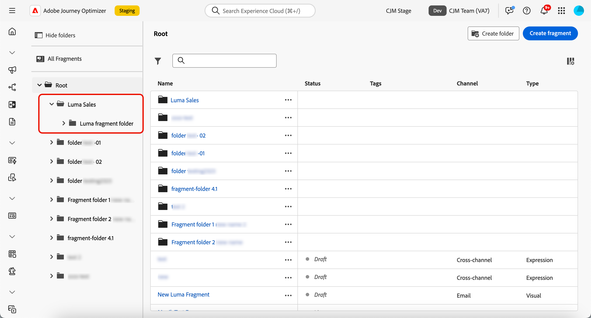

# Fragmenten beheren {#manage-fragments}

## Toegang tot fragmenten {#access-fragments}

Als u uw fragmenten wilt beheren, opent u de fragmentlijst via **[!UICONTROL Content Management]** > **[!UICONTROL Fragments]** links menu.

Alle fragmenten die op de huidige zandbak - of [&#x200B; van het **[!UICONTROL Fragments]** menu &#x200B;](create-fragments.md#create-fragments) werden gecreeerd, of gebruikend [&#x200B; sparen als fragmentoptie &#x200B;](save-fragments.md) - worden getoond.

In het linkerdeelvenster kunt u fragmenten ordenen in mappen. Standaard worden alle fragmenten weergegeven. Wanneer u een map selecteert, worden alleen de fragmenten en mappen in de geselecteerde map weergegeven. [Meer informatie](#folders)

Als u een specifiek item wilt zoeken, typt u een naam in het zoekveld. Wanneer de a [&#x200B; omslag &#x200B;](#folders) wordt geselecteerd, is het onderzoek op alle fragmenten of omslagen in het eerste niveau van hiërarchie van die omslag <!--(not nested items)--> van toepassing.

U kunt fragmenten filteren op hun:

* Status (concept of live)
* Type (visueel of expression)
* Aanmaakdatum of wijzigingsdatum
* Staat (al dan niet gearchiveerd)
* Tags

{width="90%" align="left"}

U kunt er ook voor kiezen om alle fragmenten weer te geven, of alleen de items die de huidige gebruiker heeft gemaakt of gewijzigd.

Via de knop **[!UICONTROL More actions]** naast elk fragment kunt u:

* Voeg het toe aan een pakket voor export. [Meer informatie](#export)
* Als een actief fragment wordt bewerkt, opent u de conceptversie van dit fragment. [Meer informatie](#edit-fragments)
* Dupliceer het fragment.
* Gebruik de optie **[!UICONTROL Explore references]** om de reizen, campagnes of sjablonen te zien waar deze worden gebruikt. [Meer informatie](#explore-references)
* Archiveer het fragment. [Meer informatie](#archive-fragments)
* Bewerk de tags van het fragment. [&#x200B; Leer hoe te met Verenigde markeringen &#x200B;](../start/search-filter-categorize.md#tags) te werken
* Verplaats het fragment naar een map. [Meer informatie](#folders)

## Mappen gebruiken om fragmenten te beheren {#folders}

>[!CONTEXTUALHELP]
>id="ajo_fragments_folders"
>title="Uw fragmenten indelen in mappen"
>abstract="Gebruik mappen om uw fragmenten te categoriseren en te beheren op basis van de behoeften van uw organisatie."

U kunt uw fragmenten eenvoudig navigeren door mappen zodat u ze effectiever kunt ordenen in een gestructureerde hiërarchie. Hierdoor kunt u de items indelen en beheren op basis van de behoeften van uw organisatie.

1. Klik op de knop **[!UICONTROL All Fragments]** om alle items weer te geven die eerder zijn gemaakt zonder de mapgroep.

1. Klik op de map **[!UICONTROL Root]** om alle gemaakte mappen weer te geven.

   >[!NOTE]
   >
   >Als u nog geen mappen hebt gemaakt, worden alle fragmenten weergegeven.

1. Klik op een willekeurige map in de map **[!UICONTROL Root]** om de inhoud ervan weer te geven.

1. Als u op de map **[!UICONTROL Root]** of een andere map klikt, wordt de knop **[!DNL Create folder]** weergegeven. Selecteer het.

   

1. Typ een naam voor de nieuwe map en klik op **[!UICONTROL Save]** . De nieuwe map wordt boven op de fragmentlijst weergegeven in de map **[!UICONTROL Root]** of in de geselecteerde map.

1. U kunt op de knop **[!UICONTROL More actions]** klikken om de map een andere naam te geven of te verwijderen.

   

1. Met de knop **[!UICONTROL More actions]** kunt u het fragment ook naar een andere bestaande map verplaatsen.

   <!---->

1. Nu kunt u naar de map navigeren die u net hebt gemaakt. Elk nieuw fragment u [&#x200B; creeert &#x200B;](create-fragments.md) van hier wordt bewaard in de huidige omslag.

   

## Fragmentstatussen {#fragments-statuses}

>[!CONTEXTUALHELP]
>id="ajo_fragment_statuses"
>title="Nieuwe fragmentstatussen"
>abstract="Aangezien **Ontwerp** en **Levende** statussen met de versie van Journey Optimizer Juni zijn geïntroduceerd, hebben alle fragmenten die vóór deze versie worden gecreeerd de **Ontwerp** status, zelfs als zij in een reis of een campagne worden gebruikt. Als u om het even welke verandering in deze fragmenten aanbrengt, moet u hen publiceren om hen **Levend** te maken en de veranderingen in de bijbehorende campagnes en de reizen te verspreiden. U moet ook een nieuwe reis/campagneversie tot stand brengen en het publiceren.   het Publiceren vereist de <a href="https://experienceleague.adobe.com/en/docs/journey-optimizer/using/access-control/ootb-product-profiles#content-library-manage"> Publish 2&rbrace; gebruikerstoestemming van het Fragment &lbrace;.</a>"
>additional-url="https://experienceleague.adobe.com/en/docs/journey-optimizer/using/access-control/ootb-product-profiles#content-library-manager" text="Meer informatie over machtigingen voor inhoudsfragmenten"

Fragmenten kunnen meerdere statussen hebben:

* **[!UICONTROL Draft]**: het fragment wordt bewerkt en is niet goedgekeurd.

* **[!UICONTROL Live]**: het fragment is goedgekeurd en is actief. [&#x200B; leer hoe te om een fragment &#x200B;](../content-management/create-fragments.md#publish) te publiceren

  Wanneer een actief fragment wordt bewerkt, wordt een specifiek pictogram naast de status weergegeven. Klik op dit pictogram om de conceptversie van het fragment te openen.

* **[!UICONTROL Publishing]**: Het fragment is goedgekeurd en wordt gepubliceerd.
* **[!UICONTROL Archived]**: het fragment is gearchiveerd. [&#x200B; Leer hoe te om fragmenten &#x200B;](#archive-fragments) te archiveren

>[!CAUTION]
>
>Aangezien **Ontwerp** en **Levende** statussen met de versie van Journey Optimizer Juni 2024 zijn geïntroduceerd, hebben alle fragmenten die vóór deze versie worden gecreeerd de **Ontwerp** status, zelfs als zij in een reis of een campagne worden gebruikt. Als u om het even welke verandering in deze fragmenten aanbrengt, moet u hen publiceren om hen **Levend** te maken en de veranderingen in de bijbehorende campagnes en de reizen te verspreiden. U moet ook een nieuwe reis/campagneversie tot stand brengen en het publiceren. Het publiceren vereist de [&#x200B; Publish toestemming van de gebruiker van het Fragment &#x200B;](../administration/ootb-product-profiles.md#content-library-manager).

## Een fragment bewerken {#edit-fragments}

>[!CONTEXTUALHELP]
>id="ajo_fragments_update_campaigns"
>title="Fragmenten bijwerken in campagnes"
>abstract="Deze campagne wordt niet bijgewerkt als u wijzigingen in het fragment publiceert. Er moet een nieuwe versie worden gepubliceerd zodat de functionaliteit voor fragmentupdate kan worden ondersteund."

>[!CONTEXTUALHELP]
>id="ajo_fragments_update_journeys"
>title="Fragmenten worden bijgewerkt tijdens reizen"
>abstract="Deze reis zal niet worden bijgewerkt als u veranderingen in het fragment publiceert. Er moet een nieuwe versie worden gepubliceerd zodat de functionaliteit voor fragmentupdate kan worden ondersteund."

Voer de onderstaande stappen uit om een fragment te bewerken.

1. Klik op het gewenste fragment in de lijst **[!UICONTROL Fragments]** . Het scherm met fragmenteigenschappen wordt geopend met een voorvertoning van de inhoud ervan.

1. U kunt de lijst met reizen, campagnes en inhoudssjablonen controleren waar het fragment momenteel wordt gebruikt. Selecteer hiertoe de optie **[!UICONTROL Explore references]** in de actieknop Meer. [Meer informatie](#explore-references)

1. Als het fragment dat wordt bewerkt de status **[!UICONTROL Live]** heeft, klikt u op de knop **[!UICONTROL Modify]** om een conceptversie van het fragment te maken. Klik op **[!UICONTROL Confirm]**.

   {width="70%" align="left"}

   >[!NOTE]
   >
   >De huidige versie van het fragment blijft actief totdat u de nieuwe bijgewerkte versie publiceert.

1. Breng indien nodig de gewenste wijzigingen aan in de fragmentdetails.

1. Als u de inhoud van het fragment wilt wijzigen, klikt u op de knop **[!UICONTROL Edit]** en werkt u de inhoud bij zoals u zou doen bij het maken van een geheel nieuw fragment. [&#x200B; Leer hoe te om een fragment &#x200B;](create-fragments.md#content) tot stand te brengen

   {width="70%" align="left"}

   >[!NOTE]
   >
   >Wanneer u een gepubliceerd fragment bewerkt, kunt u elk willekeurig aanpassingsveld verwijderen, maar u kunt geen nieuwe velden toevoegen aan de fragmentinhoud. Als u gepersonaliseerde attributen wilt toevoegen, moet u het fragment dupliceren. [Meer informatie](#adding-new-attributes)

1. Als uw wijzigingen gereed zijn, slaat u deze op en klikt u op de knop **[!UICONTROL Publish]** om de wijzigingen live te zetten. [Meer informatie](create-fragments.md#publish)

Wanneer u een fragment bewerkt, worden de wijzigingen automatisch doorgegeven aan alle inhoud met dat fragment, inclusief live reizen en campagnes, behalve inhoud waar u de overerving van het oorspronkelijke fragment hebt verbroken.

>[!NOTE]
>
>Leer hoe te om overerving in [&#x200B; te breken voeg visuele fragmenten aan uw e-mails &#x200B;](../email/use-visual-fragments.md#break-inheritance) en [&#x200B; de uitdrukkingsfragmenten van de Leverage &#x200B;](../personalization/use-expression-fragments.md#break-inheritance) secties toe.

### Nieuwe kenmerken toevoegen aan een actief fragment {#adding-new-attributes}

>[!WARNING]
>
>Het toevoegen van nieuwe [&#x200B; gepersonaliseerde attributen &#x200B;](../personalization/personalization-build-expressions.md) aan een levend fragment wordt niet gesteund.

Nadat een fragment is gepubliceerd, wordt de set met gepersonaliseerde of contextafhankelijke kenmerken vergrendeld voor alle campagnes en reizen die ernaar verwijzen.

Voer de onderstaande stappen uit als u aanvullende kenmerken wilt opnemen in een actief fragment.

1. Dupliceer het bestaande fragment met de knop **[!UICONTROL More actions]** .

   {width="70%" align="left"}

1. Selecteer het gedupliceerde fragment om het te openen en klik op de knop **[!UICONTROL Edit]** .

1. [&#x200B; voeg de nieuwe gewenste attributen &#x200B;](../personalization/personalization-build-expressions.md#add) aan het gedupliceerde fragment, zoals verpersoonlijkingsgebieden toe.

   {width="70%" align="left"}

1. Sla de wijzigingen op en publiceer het nieuwe fragment. [&#x200B; leer hoe &#x200B;](create-fragments.md#publish)

1. Werk campagnes of reizen bij om te verwijzen naar het bijgewerkte fragment waar de nieuwe kenmerken zijn toegevoegd.

   * [Leer hoe u visuele fragmenten kunt gebruiken](../email/use-visual-fragments.md)
   * [Leer hoe u expressiefragmenten kunt gebruiken](../personalization/use-expression-fragments.md)

## Verwijzingen verkennen {#explore-references}

U kunt een lijst weergeven met de reizen, campagnes en inhoudssjablonen die momenteel een fragment gebruiken. Selecteer hiertoe **[!UICONTROL Explore references]** in het menu **[!UICONTROL More actions]** in de fragmentlijst of in het scherm met fragmenteigenschappen.

{width="70%" align="left"}

Selecteer een tabblad om te schakelen tussen reizen, campagnes, sjablonen en fragmenten. U kunt hun status zien en op een naam klikken die moet worden omgeleid naar het corresponderende item waar naar het fragment wordt verwezen.

{width="70%" align="left"}

>[!NOTE]
>
>Als het fragment wordt gebruikt in een reis, campagne of sjabloon met een label dat u ervan weerhoudt het te openen, wordt boven op het geselecteerde tabblad een waarschuwingsbericht weergegeven. [&#x200B; leer meer over de Controle van de Toegang van het Niveau van Objecten (OLAC) &#x200B;](../administration/object-based-access.md)

## Fragmenten archiveren {#archive-fragments}

U kunt de fragmentlijst opruimen van de items die niet meer van belang zijn voor uw merk.

Klik hiertoe op de knop **[!UICONTROL More actions]** naast het gewenste fragment en selecteer **[!UICONTROL Archive]** . Deze verdwijnt uit de fragmentlijst, zodat gebruikers deze niet meer kunnen gebruiken in toekomstige e-mails of sjablonen.

{width="70%" align="left"}

>[!NOTE]
>
>Als u een fragment archiveert dat in een inhoud wordt gebruikt, <!--it will remain in the email or template, but you won't be able to select it from the fragment list to edit it--> dat de inhoud niet zal worden beïnvloed.

Als u het archiveren van een fragment ongedaan wilt maken, filtert u op de **[!UICONTROL Archived]** -items en selecteert u **[!UICONTROL Unarchive]** in het menu **[!UICONTROL More actions]** . Het is nu weer toegankelijk vanuit de fragmentlijst en kan in elke e-mail of sjabloon worden gebruikt.

{width="70%" align="left"}

## Fragmenten exporteren naar een andere sandbox {#export}

Met Journey Optimizer kunt u een fragment van de ene naar de andere sandbox kopiëren. U kunt bijvoorbeeld een fragment uit de sandboxomgeving van het werkgebied kopiëren naar uw productiefandbox.

Het exemplaarproces wordt gedragen via de uitvoer en de invoer van het a **pakket** tussen de bron en doelzandbakken. De gedetailleerde informatie over hoe te om voorwerpen uit te voeren en hen in een doelzandbak in deze sectie in te voeren is beschikbaar: [&#x200B; de voorwerpen van het Exemplaar aan een andere zandbak &#x200B;](../configuration/copy-objects-to-sandbox.md).
