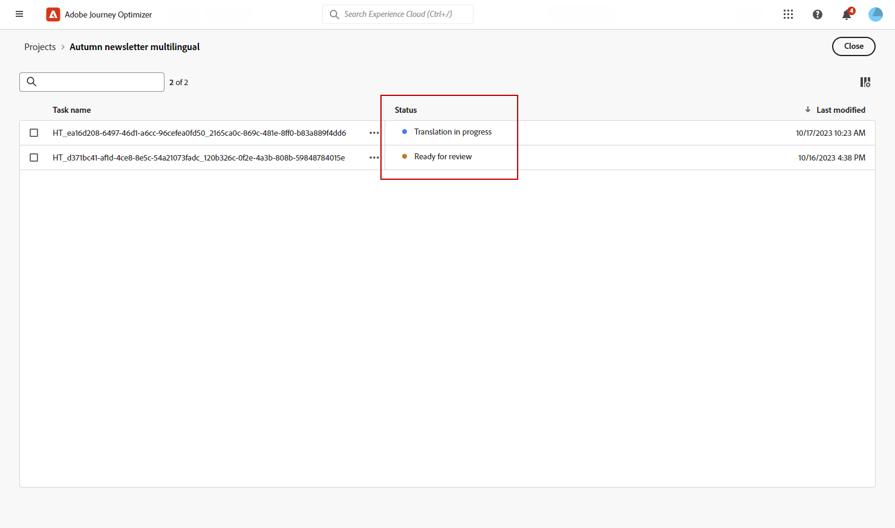

# Meertalige inhoud maken met automatische vertaling {#multilingual-automated}

>[!BEGINSHADEBOX]

**Inhoudsopgave**

* [Aan de slag met meertalige inhoud](multilingual-gs.md)
* [Meertalige inhoud maken met handmatige vertaling](multilingual-manual.md)
* **[Meertalige inhoud maken met automatische vertaling](multilingual-automated.md)**
* [Meertalig campagnerapport](multilingual-report.md)

>[!ENDSHADEBOX]

Met behulp van de geautomatiseerde stroom kunt u gewoon uw doeltaal en taalprovider selecteren. Uw inhoud wordt vervolgens rechtstreeks naar de vertaling verzonden en klaar voor een definitieve revisie wanneer deze is voltooid.

Ga als volgt te werk om meertalige inhoud te maken met automatische vertaling:

1. [Uw landinstelling maken](#create-locale).

1. [Een taalproject maken](#create-translation-project).

1. [Taalinstellingen maken](#create-language-settings).

1. [Een meertalige campagne maken](#create-a-multilingual-campaign).

1. [Uw vertaaltaak controleren (optioneel)](#review-translation-project).

## Landinstelling maken {#create-locale}

Wanneer het vormen van uw taalmontages, zoals die in [Taalinstellingen maken](#language-settings) als een specifieke landinstelling niet beschikbaar is voor meertalige inhoud, hebt u de flexibiliteit om zoveel nieuwe landinstellingen te maken als nodig is met de **[!UICONTROL Translation]** -menu.

1. Van de **[!UICONTROL Administration]** menu, toegang **[!UICONTROL Channel]**.

   Via het menu voor vertalingen hebt u toegang tot de lijst met geactiveerde landinstellingen.

1. Klik op het tabblad **[!UICONTROL Locale dictionary]** op **[!UICONTROL Add locale]**.

   

1. Selecteer uw landinstellingscode in het menu **[!UICONTROL Language]** en de bijbehorende **[!UICONTROL Region]**.

1. Klikken **[!UICONTROL Save]** om uw landinstelling te maken.

   

## Vertaalproject maken {#translation-project}

Start uw vertaalproject door de doellandinstelling op te geven en de specifieke taal of regio voor uw inhoud aan te geven. Vervolgens kunt u uw vertaalprovider kiezen.

1. Van de **[!UICONTROL Translation projects]** menu onder **[!UICONTROL Content management]**, klikt u op **[!UICONTROL Create project]**.

   

1. Type-in a **[!UICONTROL Name]** en **[!UICONTROL Description]**.

1. Selecteer **[!UICONTROL Source locale]**.

   

1. Kies of u de volgende opties wilt inschakelen:

   * **[!UICONTROL Automatically publish approved translations]**: Als de vertalingen eenmaal zijn goedgekeurd, worden ze automatisch in de campagne opgenomen zonder dat er handmatige tussenkomst nodig is.
   * **[!UICONTROL Enable Review workflow]**: Alleen van toepassing op landinstellingen die zijn vertaald in een toepassing voor mensen. Hierdoor kan een interne revisor de vertaalde inhoud op efficiënte wijze evalueren en goedkeuren of afwijzen. [Meer informatie](#review-translation-project)

1. Klikken **[!UICONTROL Add locale]** om het menu te openen en de talen voor uw vertaalproject te definiëren.

   Indien een **[!UICONTROL Locale]** ontbreekt, kunt u het handmatig maken via de **[!UICONTROL Translation]** of door API. Zie [Een nieuwe landinstelling maken](#create-locale).

   

1. Selecteer in de lijst uw **[!UICONTROL Target locale(s)]** en kies welke **[!UICONTROL Translation provider]** wilt u gebruiken voor elke landinstelling.

   **[!UICONTROL Translation provider]** de instellingen zijn toegankelijk via de **[!UICONTROL Translation]** in het menu **[!UICONTROL Administration]** menusectie.

   >[!NOTE]
   >
   >Het contractbeheer met de Vertaalprovider valt buiten het bereik van deze functie. Zorg ervoor dat u een geldig en actief contract hebt met de aangewezen Vertaalpartner.
   >
   > De vertaalprovider is eigenaar van de kwaliteit van de vertaalde inhoud.

1. Klikken **[!UICONTROL Add a locale]** wanneer u klaar bent met het koppelen van uw doellandinstelling aan de juiste vertaalprovider. Klik vervolgens op **[!UICONTROL Save]**.

   Als een provider grijs wordt weergegeven voor een doellandinstelling, geeft dit aan dat de provider die specifieke landinstelling niet ondersteunt.

   

1. Klikken **[!UICONTROL Save]** wanneer uw vertaalproject wordt gevormd.

Uw vertaalproject is nu gemaakt en kan worden gebruikt in een meertalige campagne.

## Taalinstellingen maken {#language-settings}

In deze sectie kunt u de primaire taal en de bijbehorende landinstellingen instellen voor het beheer van meertalige inhoud. U kunt ook het kenmerk kiezen dat u wilt gebruiken om informatie met betrekking tot de profieltaal op te zoeken.

1. Van de **[!UICONTROL Administration]** menu, toegang **[!UICONTROL Channel]**.

1. In de **[!UICONTROL Language settings]** menu, klikt u op **[!UICONTROL Create language settings]**.

   

1. Typ de naam van uw **[!UICONTROL Language settings]**.

1. Kies de optie **[!UICONTROL Translation project]**.

1. Van de **[!UICONTROL Translation project]** veld, klikken **[!UICONTROL Edit]** en kies uw eerder gemaakte **[!UICONTROL Translation project]**.

   Uw eerder geconfigureerde landinstellingen worden automatisch geïmporteerd.

   

1. Van de **[!UICONTROL Sending preference]** selecteert u het kenmerk dat u wilt opzoeken om informatie over profieltalen te zoeken.

1. Klikken **[!UICONTROL Edit]** naast uw **[!UICONTROL Locale]** om het verder aan te passen en toe te voegen **[!UICONTROL Profile preferences]**.

   

1. Als uw **[!UICONTROL Translation project]** wordt bijgewerkt, klikt u op **[!UICONTROL Refresh]** om deze wijzigingen in uw **[!UICONTROL Language settings]**.

   

1. Klikken **[!UICONTROL Submit]** om uw **[!UICONTROL Language settings]**.

<!--
1. Access the **[!UICONTROL Channel surfaces]** menu and create a new channel surface or select an existing one.

1. In the **[!UICONTROL Header parameters]** section, select the **[!UICONTROL Enable multilingual]** option.

1. Select your **[!UICONTROL Locales dictionary]** and add as many as needed.
-->

## Een meertalige campagne maken {#create-multilingual-campaign}

Als u uw vertaalproject en taalinstellingen hebt ingesteld, kunt u uw campagne maken en de inhoud aanpassen voor de verschillende landinstellingen.

1. Begin met het maken en configureren van uw campagne voor e-mail-, sms- of pushmeldingen volgens uw vereisten. [Meer informatie](../campaigns/create-campaign.md)

1. Wanneer de primaire inhoud is gemaakt, klikt u op **[!UICONTROL Save]** en ga terug naar het scherm van de campagneconfiguratie.

1. Klikken **[!UICONTROL Add languages]**.  [Meer informatie](#create-language-settings)

   

1. Selecteer uw eerder gemaakte **[!UICONTROL Language settings]**.

   

1. Klik op **[!UICONTROL Send to translate]** om uw inhoud door te sturen naar het eerder geselecteerde vertaalbureau.

   

1. Nadat de inhoud voor vertaling is verzonden, kan deze niet meer worden bewerkt. Klik op het vergrendelingspictogram om de oorspronkelijke inhoud te wijzigen.

   Als u wijzigingen in deze inhoud wilt aanbrengen, moet u een nieuw vertaalproject maken en dit opnieuw verzenden voor vertaling.

   

1. Klikken **[!UICONTROL Open translation]** om toegang te krijgen tot uw vertaalproject en dit te bekijken.

   

1. Volg op deze pagina de status van uw vertaalproject:

   * **[!UICONTROL Translation in progress]**: Uw serviceprovider werkt actief aan de vertaling.
   * **[!UICONTROL Ready for review]**: Het revisieproces kan worden gestart, zodat u toegang hebt tot de vertaling en deze kunt negeren of goedkeuren.
   * **[!UICONTROL Reviewed]**: Vertaling is goedgekeurd en klaar om naar de campagne te worden verzonden.
   * **[!UICONTROL Ready to publish]**: De computervertaling is voltooid en kan nu naar uw campagne worden verzonden.
   * **[!UICONTROL Completed]**: Vertaling is nu beschikbaar in uw campagne.

   

1. Zodra uw vertaling is voltooid, is uw meertalige inhoud klaar om te worden verzonden.

   

1. Klikken **[!UICONTROL Review to activate]** om een overzicht van de campagne weer te geven.

   In het overzicht kunt u uw campagne desgewenst wijzigen en controleren of een parameter onjuist is of ontbreekt.

1. Blader door uw meertalige inhoud om de rendering in elke taal te bekijken.

   

1. Controleer of uw campagne correct is geconfigureerd en klik vervolgens op **[!UICONTROL Activate]**.

Uw campagne is nu geactiveerd. Het bericht dat in de campagne wordt gevormd wordt verzonden onmiddellijk, of op de gespecificeerde datum. Houd er rekening mee dat uw campagne niet kan worden gewijzigd zodra deze actief is. Als u inhoud opnieuw wilt gebruiken, kunt u uw campagne dupliceren.

Nadat u de campagne hebt verzonden, kunt u de impact van de campagnes meten in de campagnerapporten.

## Het interne vertaalproject beheren {#manage-ht-project}

Als u tijdens het configureren van uw taalinstellingen de interne vertaling hebt geselecteerd, kunt u uw inhoud rechtstreeks in uw vertaalproject vertalen.

1. Van uw **[!UICONTROL Translation project]**, toegang tot de **[!UICONTROL More actions]** en selecteert u **[!UICONTROL In-house translation]**.

   

1. U kunt uw CSV-bestand voor vertaling exporteren met externe vertaalsoftware. U kunt het CSV-bestand ook weer importeren in uw vertaalproject door op de knop **[!UICONTROL Import CSV]** knop.

   

1. Klikken **[!UICONTROL Edit]** om uw vertaalinhoud toe te voegen.

   

1. Als u de vertaalde tekst wilt publiceren, klikt u op **[!UICONTROL Finalize]**.

## Uw vertaalproject bekijken {#review-translation-project}

Als u **[!UICONTROL Enable review worflow]** in uw **[!UICONTROL Translation project]**, kunt u de vertaling direct in Journey Optimizer bekijken nadat deze is voltooid door uw geselecteerde vertaalbureau.

Als deze optie is uitgeschakeld, wordt de status van de vertaaltaak automatisch ingesteld op **[!UICONTROL Reviewed]**, zodat u snel kunt doorgaan door op **[!UICONTROL Publish]**.

1. Zodra uw vertaling van uw dienstverlener is voltooid, kunt u tot de vertaling voor overzicht toegang hebben **[!UICONTROL Translation project]** of rechtstreeks van uw **[!UICONTROL Campaign]**.

   Van de **[!UICONTROL More actions]** menu, klikt u op **[!UICONTROL Review]**.

   

1. Blader vanuit het venster Review door de vertaalde inhoud en accepteer of weiger elke vertaaltekenreeks.

   

1. Klikken **[!UICONTROL Edit]** om de inhoud van uw vertaaltekenreeks te wijzigen.

   

1. Voer uw bijgewerkte vertaling in en klik op **[!UICONTROL Confirm]** wanneer gereed.

   

1. U kunt ook **[!UICONTROL Reject all]** of **[!UICONTROL Approve all]** rechtstreeks.

   Als u **[!UICONTROL Reject all]**, voeg een opmerking toe en klik op **[!UICONTROL Reject]**.

1. Klikken **[!UICONTROL Preview]** om de weergave van uw vertaalde inhoud in elke taal te controleren.

1. Als u de vertaalde tekst wilt publiceren, klikt u op **[!UICONTROL Finalize]**.

   

1. Van uw **[!UICONTROL Translation project]** selecteert u een van uw projecten voor toegang tot meer details. Als u de vertaling hebt afgewezen, kunt u ervoor kiezen deze terug te sturen naar de vertaling.

   

1. Eenmaal uw **[!UICONTROL Translation project]** status is ingesteld op Reviewed, kunt u deze naar uw campagne verzenden.

   Van de **[!UICONTROL More actions]** menu, klikt u op **[!UICONTROL Publish]**.

   

1. Controleer in uw campagne of uw vertaalstatus is gewijzigd in **[!UICONTROL Translation complete]**. U kunt nu uw meertalige inhoud verzenden. Raadpleeg stap 10 in [deze sectie](#create-multilingual-campaign).

   

<!--
# Create a multilingual journey {#create-multilingual-journey}

1. Create your journey with a Delivery and personalize your content as needed.
1. From your delivery action, click Edit content.
1. Click Add languages.

-->
