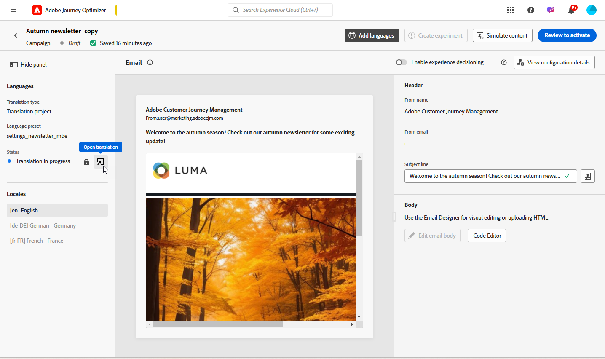

# Meertalige inhoud maken met automatische vertaling {#multilingual-automated}

>[!CONTEXTUALHELP]
>id="ajo_multi_add_provider"
>title="Provider toevoegen"
>abstract="Voeg desgewenst vertaalproviders en landinstellingen toe. Hierdoor kunt u beheren welke providers en landinstellingen actief zijn voor uw project, zodat u over de flexibiliteit beschikt om bronnen en doelgroepen aan te passen op basis van uw huidige vereisten en projectbereik."

>[!CONTEXTUALHELP]
>id="ajo_multi_edit_provider"
>title="Provider bewerken"
>abstract="Wijzig de bestaande vertaalproviders en voeg zo nodig landinstellingen toe. Met deze functionaliteit kunt u bepalen welke providers en landinstellingen actief zijn voor uw project. Zo kunt u op flexibele wijze bronnen aanpassen en specifieke doelgroepen afstemmen op uw huidige behoeften en projectdoelstellingen."

>[!IMPORTANT]
>
>Voor automatische doorloop hebben gebruikers machtigingen nodig die gerelateerd zijn aan de **[!UICONTROL Translation Service]** -mogelijkheid. [&#x200B; leer meer over toestemmingen &#x200B;](../administration/permissions.md)

Met behulp van de geautomatiseerde stroom kunt u gewoon uw doeltaal en taalprovider selecteren. Uw inhoud wordt vervolgens rechtstreeks naar de vertaling verzonden en klaar voor een definitieve revisie wanneer deze is voltooid.

Ga als volgt te werk om meertalige inhoud te maken met automatische vertaling:

1. [Uw provider toevoegen](multilingual-provider.md)

1. [Landinstellingen toevoegen (optioneel)](multilingual-locale.md)

1. [Een taalproject maken](#create-translation-project)

1. [Taalinstellingen maken](#create-language-settings)

1. [Meertalige inhoud maken](#create-a-multilingual-campaign)

1. [Uw vertaaltaak controleren (optioneel)](#review-translation-project)

## Vertaalproject maken {#translation-project}

>[!CONTEXTUALHELP]
>id="ajo_multi_create_project"
>title="Project maken"
>abstract="Als u meertalige inhoud wilt gaan maken, start u uw vertaalproject door de doellandinstelling te identificeren en de juiste taal of het juiste regionale dialect voor uw publiek te selecteren. Kies vervolgens een vertaalprovider die aansluit bij de behoeften van uw project."

>[!CONTEXTUALHELP]
>id="ajo_multi_edit_project"
>title="Project bewerken"
>abstract="Werk uw vertaalproject bij en voeg extra landinstellingen toe, zodat u uw inhoud kunt uitbreiden en een groter publiek kunt bereiken."

Start uw vertaalproject door de doellandinstelling op te geven en de specifieke taal of regio voor uw inhoud aan te geven. Vervolgens kunt u uw vertaalprovider kiezen.

1. Klik in het menu **[!UICONTROL Translation]** onder **[!UICONTROL Content management]** op **[!UICONTROL Create project]** op het tabblad **[!UICONTROL Projects]** .

   

1. Typ een **[!UICONTROL Name]** en **[!UICONTROL Description]** .

1. Selecteer **[!UICONTROL Source locale]**.

   

1. Kies of u de volgende opties wilt inschakelen:

   * **[!UICONTROL Automatically publish approved translations]**: Nadat de vertalingen zijn goedgekeurd, worden ze automatisch in de campagne geïntegreerd zonder dat u handmatig hoeft te ingrijpen.
   * **[!UICONTROL Enable Review workflow]**: alleen van toepassing op landinstellingen die zijn vertaald in een toepassing voor mensen. Hierdoor kan een interne revisor de vertaalde inhoud op efficiënte wijze evalueren en goedkeuren of afwijzen. [Meer informatie](#review-translation-project)

1. Klik op **[!UICONTROL Add locale]** om het menu te openen en de talen voor het vertaalproject te definiëren.

   Als een **[!UICONTROL Locale]** ontbreekt, kunt u het manueel van tevoren van het **[!UICONTROL Translation]** menu of door API tot stand brengen. Verwijs naar [&#x200B; creeer een nieuwe Scène &#x200B;](#create-locale).

   

1. Selecteer in de lijst de **[!UICONTROL Target locale(s)]** en kies welke **[!UICONTROL Translation provider]** u voor elke landinstelling wilt gebruiken.

   U hebt toegang tot **[!UICONTROL Translation provider]** -instellingen via het menu **[!UICONTROL Translation]** in de menusectie **[!UICONTROL Administration]** .

   >[!NOTE]
   >
   >Het contractbeheer met de Vertaalprovider valt buiten het bereik van deze functie. Zorg ervoor dat u een geldig en actief contract hebt met de aangewezen Vertaalpartner.
   >
   ></br> Vertaalleverancier bezit eigendom van de vertaalde kwaliteit van inhoud.

1. Klik op **[!UICONTROL Add a locale]** wanneer u klaar bent met het koppelen van de landinstelling van het doel aan de juiste vertaalprovider. Klik vervolgens op **[!UICONTROL Save]** .

   Als een provider grijs wordt weergegeven voor een doellandinstelling, geeft dit aan dat de provider die specifieke landinstelling niet ondersteunt.

   

1. Klik op **[!UICONTROL Save]** wanneer uw vertaalproject is geconfigureerd.

Uw vertaalproject is nu gemaakt en kan worden gebruikt in een meertalige campagne.

## Taalinstellingen maken {#language-settings}

>[!CONTEXTUALHELP]
>id="ajo_multi_custom_conditional"
>title="Aangepaste voorwaardelijke instellingen"
>abstract="Aangepaste voorwaardelijke instellingen zijn regelsets die bepalen in welke landinstelling de inhoud wordt weergegeven op basis van specifieke criteria. Met deze instellingen hebt u controle over de weergave van inhoud op basis van factoren zoals de locatie van de gebruiker, taalvoorkeuren of andere contextafhankelijke elementen."

>[!CONTEXTUALHELP]
>id="ajo_multi_fallback"
>title="Voorkeuren voor alternatieven"
>abstract="Een voorkeur voor fallback is van cruciaal belang om de gebruikerservaring te verbeteren. Als er geen fallback is geselecteerd en een profiel niet voldoet aan de vereiste vereisten, wordt de inhoud niet geleverd. Door een geschikte reservekopie te selecteren, zorgt u voor een consistente levering van inhoud, zelfs als de profielen niet voldoen aan de oorspronkelijke criteria."

In deze sectie kunt u verschillende landinstellingen instellen voor het beheer van meertalige inhoud. U kunt ook het kenmerk kiezen dat u wilt gebruiken om informatie met betrekking tot de profieltaal op te zoeken.

1. Open **[!UICONTROL Administration]** > **[!UICONTROL Channel]** in het menu **[!UICONTROL General settings]** .

1. Klik in het menu **[!UICONTROL Language settings]** op **[!UICONTROL Create language settings]** .

   

1. Typ de naam van de **[!UICONTROL Language settings]** en kies **[!UICONTROL Translation project]** .

1. Klik in het veld **[!UICONTROL Translation project]** op **[!UICONTROL Edit]** en kies de eerder gemaakte **[!UICONTROL Translation project]** .

   Uw eerder geconfigureerde **[!UICONTROL Locales]** worden automatisch geïmporteerd.

1. Selecteer een **[!UICONTROL Fallback preferences]** om een back-upoptie te definiëren wanneer een profiel niet voldoet aan de vereiste criteria voor het leveren van inhoud.

   Als er geen fallback-optie is geselecteerd, wordt de campagne of de reis niet verzonden.

   

1. Kies uw verzendvoorkeur uit de volgende opties:

   * **[!UICONTROL Select profile language preference attributes]**
   * **[!UICONTROL Create custom conditional rules]**

1. Als u **[!UICONTROL Select profile language preference attributes]** selecteert, kiest u het desbetreffende kenmerk in het menu **[!UICONTROL Profile language preference attributes]** om de taalgegevens van het profiel op te zoeken.

   

1. Als u **[!UICONTROL Create custom conditional rules]** selecteert, selecteert u de landinstelling waarvoor u voorwaarden wilt maken. Vervolgens kunt u regels maken op basis van factoren zoals gebruikerslocatie, taalvoorkeuren of andere contextafhankelijke elementen.

   

1. Begin voorwaarden te creëren door een attribuut, een gebeurtenis, of een publiek toe te voegen om uw doelgroep te bepalen.

   >[!IMPORTANT]
   >
   >Contextuele gegevens zijn uitsluitend beschikbaar voor webkanalen, in-app-, ervaring op basis van code en contentkaartkanalen. Indien gebruikt voor e-mail, sms, pushberichten of direct-mailkanalen, zonder extra kenmerken, wordt de campagne of de reis verzonden in de taal van de eerste optie in de lijst.

   

   +++Vereisten om contextuele gebeurtenissen in uw omstandigheden te gebruiken

   Wanneer gebruikers uw inhoud weergeven, wordt samen met de ervaringsgebeurtenis een verzoek tot aanpassing verzonden. Als u contextafhankelijke gegevens in uw voorwaarden wilt gebruiken, moet u aanvullende gegevens aan de payload van het aanpassingsverzoek koppelen. Om dit te doen, moet u een regel in de Inzameling van Gegevens van Adobe Experience Platform tot stand brengen om te specificeren: ALS een verpersoonlijkingsverzoek wordt verzonden, dan bijlage extra gegevens aan het verzoek, die de attributen om met het taalgebied in uw schema bepalen aan te passen.

   >[!NOTE]
   >
   >Deze voorwaarden zijn alleen vereist voor de kanalen voor de in-app- en inhoudskaarten.

   1. Open in Adobe Experience Platform Data Collection de tageigenschappen.

   1. Open het menu **[!UICONTROL Rules]** en maak een nieuwe regel. De gedetailleerde informatie over hoe te om regels tot stand te brengen is beschikbaar in [!DNL Adobe Experience Platform] [&#x200B; documentatie van de Inzameling van Gegevens &#x200B;](https://experienceleague.adobe.com/en/docs/experience-platform/collection/e2e#create-a-rule){target="_blank"}

   1. Voeg in de sectie **[!UICONTROL IF]** van de regel een gebeurtenis toe die als volgt is geconfigureerd:

      

      * Kies de **[!UICONTROL Extension]** waarmee u werkt.
      * Selecteer in het veld **[!UICONTROL Event type]** de optie &quot;AEP Request Event&quot;.
      * Selecteer in het rechterdeelvenster &quot;XDM Event Type is gelijk aan personalization.request&quot;
      * Klik op de knop **[!UICONTROL Keep changes]** ter bevestiging.

   1. Voeg in de sectie **[!UICONTROL THEN]** van de regel een actie toe die als volgt is geconfigureerd:

      

      * Kies de **[!UICONTROL Extension]** waarmee u werkt.
      * Selecteer in het veld **[!UICONTROL Action Type]** de optie Gegevens koppelen.
      * In de JSON nuttige ladingssectie, zorg ervoor dat de attributen die worden gebruikt om de taal terug te winnen aan gebruik (in het voorbeeld hieronder &quot;taal&quot;) de naam van de attributen aanpassen die in het schema worden gespecificeerd waar uw gegevensstroom van de gegevensinzameling stroomt.

        ```JSON
        {
            "xdm":{
                "application":{
                    "_dc":{
                        "language":"{%%Language%%}"
                    }
                }
            }
        }
        ```

      * Klik op de knop **[!UICONTROL Keep changes]** om uw regel te bevestigen en op te slaan.

   +++

1. Sleep de landinstellingen om ze opnieuw te ordenen en de prioriteit ervan in de lijst te beheren.

1. Klik op **[!UICONTROL Submit]** om een **[!UICONTROL Language settings]** -bestand te maken.

Nadat u de taalvoorkeuren hebt ingesteld, kunt u deze niet meer bewerken.

<!--
1. Access the **[!UICONTROL channel configurations]** menu and create a new channel configuration or select an existing one.

1. In the **[!UICONTROL Header parameters]** section, select the **[!UICONTROL Enable multilingual]** option.


1. Select your **[!UICONTROL Locales dictionary]** and add as many as needed.
-->

## Meertalige inhoud maken {#create-multilingual-campaign}

>[!AVAILABILITY]
>
> Voorvertoning voor op code gebaseerde ervaringen en inhoud van inhoudskaarten is momenteel niet beschikbaar voor de automatische stroom.

Als u uw vertaalproject en taalinstellingen hebt ingesteld, kunt u uw campagne of reis maken en uw inhoud aanpassen voor de verschillende landinstellingen.

1. Begin door uw E-mail, SMS of Push bericht [&#x200B; campagne &#x200B;](../campaigns/create-campaign.md) te creëren en te vormen of [&#x200B; reis &#x200B;](../building-journeys/journeys-message.md) volgens uw vereisten.

1. Wanneer uw primaire inhoud is gemaakt, klikt u op **[!UICONTROL Save]** en gaat u terug naar het scherm met de campagneconfiguratie.

1. Klik op **[!UICONTROL Add languages]** .  [Meer informatie](#create-language-settings)

   

1. Selecteer de eerder gemaakte **[!UICONTROL Language settings]** .

   

1. Nu de landinstellingen zijn geïmporteerd, klikt u op **[!UICONTROL Send to translate]** om de inhoud door te sturen naar het eerder geselecteerde vertaalbureau.

   

1. Nadat de inhoud voor vertaling is verzonden, kan deze niet meer worden bewerkt. Klik op het vergrendelingspictogram om de oorspronkelijke inhoud te wijzigen.

   Als u wijzigingen in deze inhoud wilt aanbrengen, moet u een nieuw vertaalproject maken en dit opnieuw verzenden voor vertaling.

   

1. Klik op **[!UICONTROL Open translation]** om uw vertaalproject te openen en te bekijken.

   

1. Volg op deze pagina de status van uw vertaalproject:

   * **[!UICONTROL Translation in progress]**: Uw serviceprovider werkt actief aan de vertaling.

     Als u **Insourcing** selecteerde toen het vormen van uw **montages van de Taal**, kunt u uw inhoud in uw Vertaalproject direct vertalen. [Meer informatie](#manage-ht-project)

   * **[!UICONTROL Ready for review]**: Het revisieproces kan worden gestart, zodat u toegang hebt tot de vertaling en deze kunt negeren of goedkeuren.

     Als u de optie **[!UICONTROL Enable review worflow]** hebt geselecteerd in uw **[!UICONTROL Translation project]** , kunt u de vertaling direct in Journey Optimizer bekijken nadat deze is voltooid door het geselecteerde vertaalbureau. [Meer informatie](#review-translation-project)

   * **[!UICONTROL Reviewed]**: de vertaling is goedgekeurd en klaar om te worden gepubliceerd en naar de campagne te worden verzonden.

   * **[!UICONTROL Ready to publish]**: de computervertaling is voltooid en kan nu naar uw campagne worden verzonden.

   * **[!UICONTROL Completed]**: Vertaling is nu beschikbaar in uw campagne.

   

1. Zodra uw vertaling is voltooid, is uw meertalige inhoud klaar om te worden verzonden.

   

1. Klik op **[!UICONTROL Review to activate]** om een overzicht van de campagne weer te geven.

   In het overzicht kunt u uw campagne desgewenst wijzigen en controleren of een parameter onjuist is of ontbreekt.

1. Blader door uw meertalige inhoud om de rendering in elke taal te bekijken.

   

1. Controleer of uw campagne correct is geconfigureerd en klik op **[!UICONTROL Activate]** .

   >[!IMPORTANT]
   >
   > Als uw campagne onderworpen is aan een goedkeuringsbeleid, zult u goedkeuring moeten vragen om uw meertalige campagne te kunnen verzenden. [Meer informatie](../test-approve/gs-approval.md)

U kunt nu uw campagne of reis activeren. Als u eenmaal bent verzonden, kunt u de impact van uw meertalige reis of campagne in rapporten meten.

## Insourcing-vertaalproject beheren {#manage-ht-project}

>[!CONTEXTUALHELP]
>id="ajo_multi_insourcing_project"
>title="Insourcing-vertaalproject"
>abstract="Met een Insourcing-vertaalproject kunt u vertalingen rechtstreeks in uw vertaalproject beheren en uitvoeren, het proces stroomlijnen en meer controle houden over de kwaliteit en consistentie van de vertaling."

Als u tijdens het configureren van uw taalinstellingen Insourcing hebt geselecteerd, kunt u uw inhoud rechtstreeks in uw vertaalproject vertalen.

1. Open vanuit de **[!UICONTROL Translation project]** het menu **[!UICONTROL More actions]** en selecteer **[!UICONTROL Insourcing]** .

   

1. U kunt uw CSV-bestand voor vertaling exporteren met externe vertaalsoftware. U kunt het CSV-bestand ook weer importeren in uw vertaalproject door op de knop **[!UICONTROL Import CSV]** te klikken.

   

1. Klik op **[!UICONTROL Edit]** om uw vertaalinhoud toe te voegen.

   

1. Klik op **[!UICONTROL Finalize]** als u de vertaalde tekst wilt publiceren.

## Uw vertaalproject bekijken {#review-translation-project}

>[!CONTEXTUALHELP]
>id="ajo_multi_review_project"
>title="Uw vertaalproject bekijken"
>abstract="Nadat de vertaling door uw gekozen vertaalbureau is voltooid, kunt u de resultaten rechtstreeks in Journey Optimizer bekijken. Op deze manier kunt u de nauwkeurigheid en kwaliteit van de vertaling beoordelen en ervoor zorgen dat de vertaling aansluit bij uw verwachtingen en projectvereisten voordat u de vertaling voltooit."

>[!CONTEXTUALHELP]
>id="ajo_multi_preview_project"
>title="Een voorbeeld van uw vertaalproject bekijken"
>abstract="In het voorvertoningsvenster kunt u zien hoe de vertaalde inhoud in elke taal wordt weergegeven. Met deze functie kunt u de rendering controleren en controleren of de inhoud correct en effectief wordt weergegeven in alle geselecteerde talen."

Als u de optie **[!UICONTROL Enable review worflow]** hebt geselecteerd in uw **[!UICONTROL Translation project]** , kunt u de vertaling direct in Journey Optimizer bekijken nadat deze is voltooid door het geselecteerde vertaalbureau.

Als deze optie is uitgeschakeld, wordt de status van de vertaaltaak automatisch ingesteld op **[!UICONTROL Reviewed]** nadat de vertaling is voltooid. Zo kunt u snel doorgaan door op **[!UICONTROL Publish]** te klikken.

1. Zodra uw vertaling van uw dienstverlener is voltooid, kunt u tot de vertaling voor overzicht van uw **[!UICONTROL Translation project]** of direct van uw **[!UICONTROL Campaign]** toegang hebben.

   Klik in het menu **[!UICONTROL More actions]** op **[!UICONTROL Review]** .

   

1. Blader vanuit het venster Review door de vertaalde inhoud en accepteer of weiger elke vertaaltekenreeks.

   

1. Klik op **[!UICONTROL Edit]** om de inhoud van de vertaaltekenreeks te wijzigen.

   

1. Voer de bijgewerkte vertaling in en klik op **[!UICONTROL Confirm]** wanneer u klaar bent.

   

1. U kunt ook kiezen om **[!UICONTROL Reject all]** of **[!UICONTROL Approve all]** rechtstreeks te gebruiken.

   Als u **[!UICONTROL Reject all]** selecteert, voegt u een opmerking toe en klikt u op **[!UICONTROL Reject]** .

1. Klik op **[!UICONTROL Preview]** om de weergave van uw vertaalde inhoud in elke taal te controleren.

1. Klik op **[!UICONTROL Finalize]** als u de vertaalde tekst wilt publiceren.

   

1. Selecteer in uw **[!UICONTROL Translation project]** een van de projecten voor meer informatie. Als u de vertaling hebt afgewezen, kunt u ervoor kiezen deze terug te sturen naar de vertaling.

   

1. Nadat de status van **[!UICONTROL Translation project]** is ingesteld op Reviewed, kunt u deze naar uw campagne verzenden.

   Klik in het menu **[!UICONTROL More actions]** op **[!UICONTROL Publish]** .

   

1. Controleer in uw campagne of uw vertaalstatus is gewijzigd in **[!UICONTROL Translation complete]** . U kunt uw meertalige inhoud nu verzenden, naar stap 10 in [&#x200B; verwijzen deze sectie &#x200B;](#create-multilingual-campaign).

   

<!--
# Create a multilingual journey {#create-multilingual-journey}

1. Create your journey with a Delivery and personalize your content as needed.
1. From your delivery action, click Edit content.
1. Click Add languages.


-->
