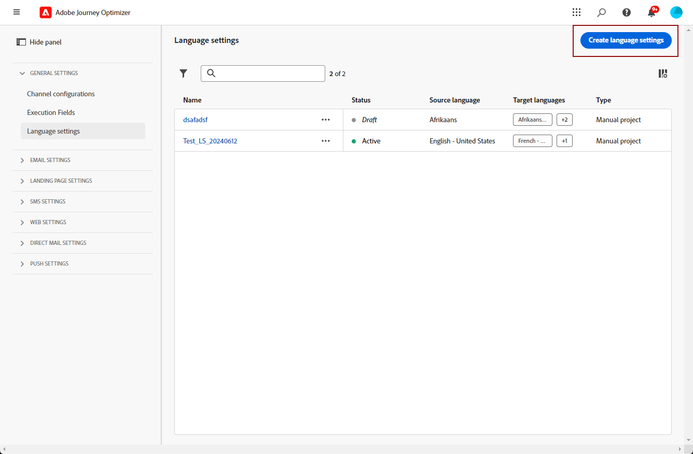

# Meertalige inhoud maken met automatische vertaling {#multilingual-automated}

>[!AVAILABILITY]
>
>Meertalige inhoud is momenteel alleen beschikbaar voor een aantal organisaties (beperkte beschikbaarheid). Neem contact op met uw Adobe als u toegang wilt.

Met behulp van de geautomatiseerde stroom kunt u gewoon uw doeltaal en taalprovider selecteren. Uw inhoud wordt vervolgens rechtstreeks naar de vertaling verzonden en klaar voor een definitieve revisie wanneer deze is voltooid.

Ga als volgt te werk om meertalige inhoud te maken met automatische vertaling:

1. [ creeer uw scène ](#create-locale).

1. [ creeer een taalproject ](#create-translation-project).

1. [ creeer taalmontages ](#create-language-settings).

1. [ creeer een meertalige inhoud ](#create-a-multilingual-campaign).

1. [ herzie uw vertaaltaak (facultatief) ](#review-translation-project).

## Landinstelling maken {#create-locale}

Wanneer het vormen van uw taalmontages, zoals die in [ worden beschreven creeer uw taalmontages ](#language-settings) sectie, als een specifieke scène niet beschikbaar voor uw meertalige inhoud is, hebt u de flexibiliteit om zo vele nieuwe scènes tot stand te brengen zoals vereist gebruikend het **[!UICONTROL Translation]** menu.

1. Open **[!UICONTROL Translation]** via het menu **[!UICONTROL Content management]** .

1. Klik op het tabblad **[!UICONTROL Locale dictionary]** op **[!UICONTROL Add locale]**.

   

1. Selecteer uw landinstellingscode in de lijst **[!UICONTROL Language]** en de bijbehorende **[!UICONTROL Region]** .

1. Klik op **[!UICONTROL Save]** om uw landinstelling te maken.

   

## Vertaalproject maken {#translation-project}

Start uw vertaalproject door de doellandinstelling op te geven en de specifieke taal of regio voor uw inhoud aan te geven. Vervolgens kunt u uw vertaalprovider kiezen.

1. Klik in het menu **[!UICONTROL Translation]** onder **[!UICONTROL Content management]** op **[!UICONTROL Create project]** op het tabblad **[!UICONTROL Projects]** .

   

1. Typ een **[!UICONTROL Name]** en **[!UICONTROL Description]** .

1. Selecteer **[!UICONTROL Source locale]**.

   

1. Kies of u de volgende opties wilt inschakelen:

   * **[!UICONTROL Automatically publish approved translations]**: Nadat de vertalingen zijn goedgekeurd, worden ze automatisch in de campagne geïntegreerd zonder dat u handmatig hoeft te ingrijpen.
   * **[!UICONTROL Enable Review workflow]**: alleen van toepassing op landinstellingen die zijn vertaald in een toepassing voor mensen. Hierdoor kan een interne revisor de vertaalde inhoud op efficiënte wijze evalueren en goedkeuren of afwijzen. [Meer informatie](#review-translation-project)

1. Klik op **[!UICONTROL Add locale]** om het menu te openen en de talen voor het vertaalproject te definiëren.

   Als een **[!UICONTROL Locale]** ontbreekt, kunt u het manueel van tevoren van het **[!UICONTROL Translation]** menu of door API tot stand brengen. Verwijs naar [ creeer een nieuwe Scène ](#create-locale).

   

1. Selecteer in de lijst de **[!UICONTROL Target locale(s)]** en kies welke **[!UICONTROL Translation provider]** u voor elke landinstelling wilt gebruiken.

   U hebt toegang tot **[!UICONTROL Translation provider]** -instellingen via het menu **[!UICONTROL Translation]** in de menusectie **[!UICONTROL Administration]** .

   >[!NOTE]
   >
   >Het contractbeheer met de Vertaalprovider valt buiten het bereik van deze functie. Zorg ervoor dat u een geldig en actief contract hebt met de aangewezen Vertaalpartner.
   >
   >  Vertaalleverancier bezit eigendom van de vertaalde kwaliteit van inhoud.

1. Klik op **[!UICONTROL Add a locale]** wanneer u klaar bent met het koppelen van de landinstelling van het doel aan de juiste vertaalprovider. Klik vervolgens op **[!UICONTROL Save]** .

   Als een provider grijs wordt weergegeven voor een doellandinstelling, geeft dit aan dat de provider die specifieke landinstelling niet ondersteunt.

   

1. Klik op **[!UICONTROL Save]** wanneer uw vertaalproject is geconfigureerd.

Uw vertaalproject is nu gemaakt en kan worden gebruikt in een meertalige campagne.

## Taalinstellingen maken {#language-settings}

In deze sectie kunt u de primaire taal en de bijbehorende landinstellingen instellen voor het beheer van meertalige inhoud. U kunt ook het kenmerk kiezen dat u wilt gebruiken om informatie met betrekking tot de profieltaal op te zoeken.

1. Open **[!UICONTROL Channel]** via het menu **[!UICONTROL Administration]** .

1. Klik in het menu **[!UICONTROL Language settings]** op **[!UICONTROL Create language settings]** .

   

1. Typ de naam van de **[!UICONTROL Language settings]** .

1. Kies de optie **[!UICONTROL Translation project]**.

1. Klik in het veld **[!UICONTROL Translation project]** op **[!UICONTROL Edit]** en kies de eerder gemaakte **[!UICONTROL Translation project]** .

   Uw eerder geconfigureerde landinstellingen worden automatisch geïmporteerd.

   

1. Selecteer in het menu **[!UICONTROL Sending preference]** het kenmerk dat u wilt opzoeken naar informatie over profieltalen.

1. Klik op **[!UICONTROL Edit]** naast de **[!UICONTROL Locale]** om deze verder aan te passen en toe te voegen **[!UICONTROL Profile preferences]** .

   

1. Als de **[!UICONTROL Translation project]** wordt bijgewerkt, klikt u op **[!UICONTROL Refresh]** om deze wijzigingen in de **[!UICONTROL Language settings]** door te voeren.

   

1. Klik op **[!UICONTROL Submit]** om een **[!UICONTROL Language settings]** -bestand te maken.

<!--
1. Access the **[!UICONTROL Channel surfaces]** menu and create a new channel surface or select an existing one.

1. In the **[!UICONTROL Header parameters]** section, select the **[!UICONTROL Enable multilingual]** option.

1. Select your **[!UICONTROL Locales dictionary]** and add as many as needed.
-->

## Meertalige inhoud maken {#create-multilingual-campaign}

Als u uw vertaalproject en taalinstellingen hebt ingesteld, kunt u uw campagne of reis maken en uw inhoud aanpassen voor de verschillende landinstellingen.

1. Begin door uw E-mail, SMS of Push bericht [ campagne ](../campaigns/create-campaign.md) te creëren en te vormen of [ reis ](../building-journeys/journeys-message.md) volgens uw vereisten.

1. Wanneer uw primaire inhoud is gemaakt, klikt u op **[!UICONTROL Save]** en gaat u terug naar het scherm met de campagneconfiguratie.

1. Klik op **[!UICONTROL Add languages]** .  [Meer informatie](#create-language-settings)

   

1. Selecteer de eerder gemaakte **[!UICONTROL Language settings]** .

   

1. Nu de landinstellingen zijn geïmporteerd, klikt u op **[!UICONTROL Send to translate]** om de inhoud door te sturen naar het eerder geselecteerde vertaalbureau.

   

1. Nadat de inhoud voor vertaling is verzonden, kan deze niet meer worden bewerkt. Klik op het vergrendelingspictogram om de oorspronkelijke inhoud te wijzigen.

   Als u wijzigingen in deze inhoud wilt aanbrengen, moet u een nieuw vertaalproject maken en dit opnieuw verzenden voor vertaling.

   

1. Klik op **[!UICONTROL Open translation]** om uw vertaalproject te openen en te bekijken.

   

1. Volg op deze pagina de status van uw vertaalproject:

   * **[!UICONTROL Translation in progress]**: Uw serviceprovider werkt actief aan de vertaling.

     Als u **Insourcing** selecteerde toen het vormen van uw **montages van de Taal**, kunt u uw inhoud in uw Vertaalproject direct vertalen. [Meer informatie](#manage-ht-project)

   * **[!UICONTROL Ready for review]**: Het revisieproces kan worden gestart, zodat u toegang hebt tot de vertaling en deze kunt negeren of goedkeuren.

     Als u de optie **[!UICONTROL Enable review worflow]** hebt geselecteerd in uw **[!UICONTROL Translation project]** , kunt u de vertaling direct in Journey Optimizer bekijken nadat deze is voltooid door het geselecteerde vertaalbureau. [Meer informatie](#review-translation-project)

   * **[!UICONTROL Reviewed]**: de vertaling is goedgekeurd en klaar om te worden gepubliceerd en naar de campagne te worden verzonden.

   * **[!UICONTROL Ready to publish]**: de computervertaling is voltooid en kan nu naar uw campagne worden verzonden.

   * **[!UICONTROL Completed]**: Vertaling is nu beschikbaar in uw campagne.

   

1. Zodra uw vertaling is voltooid, is uw meertalige inhoud klaar om te worden verzonden.

   

1. Klik op **[!UICONTROL Review to activate]** om een overzicht van de campagne weer te geven.

   In het overzicht kunt u uw campagne desgewenst wijzigen en controleren of een parameter onjuist is of ontbreekt.

1. Blader door uw meertalige inhoud om de rendering in elke taal te bekijken.

   

1. Controleer of uw campagne correct is geconfigureerd en klik op **[!UICONTROL Activate]** .

U kunt nu uw campagne of reis activeren. Als u eenmaal bent verzonden, kunt u de impact van uw meertalige reis of campagne in rapporten meten.

## Insourcingvertaalproject beheren {#manage-ht-project}

Als u tijdens het configureren van uw taalinstellingen de optie Insourcing hebt geselecteerd, kunt u uw inhoud rechtstreeks in uw vertaalproject vertalen.

1. Open vanuit de **[!UICONTROL Translation project]** het menu **[!UICONTROL More actions]** en selecteer **[!UICONTROL Insourcing]** .

   

1. U kunt uw CSV-bestand voor vertaling exporteren met externe vertaalsoftware. U kunt het CSV-bestand ook weer importeren in uw vertaalproject door op de knop **[!UICONTROL Import CSV]** te klikken.

   

1. Klik op **[!UICONTROL Edit]** om uw vertaalinhoud toe te voegen.

   

1. Klik op **[!UICONTROL Finalize]** als u de vertaalde tekst wilt publiceren.

## Uw vertaalproject bekijken {#review-translation-project}

Als u de optie **[!UICONTROL Enable review worflow]** hebt geselecteerd in uw **[!UICONTROL Translation project]** , kunt u de vertaling direct in Journey Optimizer bekijken nadat deze is voltooid door het geselecteerde vertaalbureau.

Als deze optie is uitgeschakeld, wordt de status van de vertaaltaak automatisch ingesteld op **[!UICONTROL Reviewed]** nadat de vertaling is voltooid. Zo kunt u snel doorgaan door op **[!UICONTROL Publish]** te klikken.

1. Zodra uw vertaling van uw dienstverlener is voltooid, kunt u tot de vertaling voor overzicht van uw **[!UICONTROL Translation project]** of direct van uw **[!UICONTROL Campaign]** toegang hebben.

   Klik in het menu **[!UICONTROL More actions]** op **[!UICONTROL Review]** .

   

1. Blader vanuit het venster Review door de vertaalde inhoud en accepteer of weiger elke vertaaltekenreeks.

   

1. Klik op **[!UICONTROL Edit]** om de inhoud van de vertaaltekenreeks te wijzigen.

   

1. Voer de bijgewerkte vertaling in en klik op **[!UICONTROL Confirm]** wanneer u klaar bent.

   

1. U kunt ook kiezen om **[!UICONTROL Reject all]** of **[!UICONTROL Approve all]** rechtstreeks te gebruiken.

   Als u **[!UICONTROL Reject all]** selecteert, voegt u een opmerking toe en klikt u op **[!UICONTROL Reject]** .

1. Klik op **[!UICONTROL Preview]** om de weergave van uw vertaalde inhoud in elke taal te controleren.

1. Klik op **[!UICONTROL Finalize]** als u de vertaalde tekst wilt publiceren.

   

1. Selecteer in uw **[!UICONTROL Translation project]** een van de projecten voor meer informatie. Als u de vertaling hebt afgewezen, kunt u ervoor kiezen deze terug te sturen naar de vertaling.

   

1. Nadat de status van **[!UICONTROL Translation project]** is ingesteld op Reviewed, kunt u deze naar uw campagne verzenden.

   Klik in het menu **[!UICONTROL More actions]** op **[!UICONTROL Publish]** .

   

1. Controleer in uw campagne of uw vertaalstatus is gewijzigd in **[!UICONTROL Translation complete]** . U kunt uw meertalige inhoud nu verzenden, naar stap 10 in [ verwijzen deze sectie ](#create-multilingual-campaign).

   

<!--
# Create a multilingual journey {#create-multilingual-journey}

1. Create your journey with a Delivery and personalize your content as needed.
1. From your delivery action, click Edit content.
1. Click Add languages.

-->
