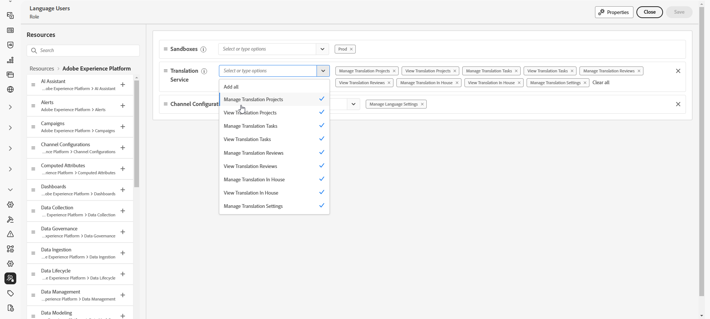

# Aan de slag met meertalige inhoud {#multilingual-gs}

>[!CONTEXTUALHELP]
>id="ajo_multi_translation_homepage"
>title="Vertalingen"
>abstract="Met de meertalige functie kunt u eenvoudig inhoud in meerdere talen maken in één campagne of reis. Via de pagina Vertalingen kunt u projecten instellen, vertaalbureaus selecteren of taalspecifieke woordenboeken beheren"

Met de meertalige functie kunt u moeiteloos inhoud in meerdere talen maken in één campagne of reis. Met deze functie kunt u schakelen tussen talen tijdens het bewerken van uw campagne, het hele bewerkingsproces stroomlijnen en uw mogelijkheden verbeteren om meertalige inhoud efficiënt te beheren.

Met Journey Optimizer kunt u meertalige inhoud maken met twee verschillende methoden:

* **Handmatige vertaling**: Vertaal uw inhoud direct in E-mail Designer of voer bestaande meertalige inhoud in. [Meer informatie](multilingual-manual.md)

* **Geautomatiseerde vertaling**: verzend inhoud naar uw aangewezen taalleverancier voor geautomatiseerde vertaling. [Meer informatie](multilingual-automated.md)

 

## Vereisten {#prerequisites}

>[!CONTEXTUALHELP]
>id="ajo_multi_translation_error"
>title="Vertaalfout"
>abstract="Als u geen toegang hebt tot de pagina Vertaling, is dit mogelijk omdat de functie Vertaling niet is ingeschakeld. Om dit probleem op te lossen, dient u ervoor te zorgen dat de vertaalfunctie wordt geactiveerd door uw organisatie en Sandbox-beheerder."

Adobe Journey Optimizer is momenteel geïntegreerd met vertalers, die externe vertaalservices (automatische vertaling of menselijke vertaling) aanbieden die onafhankelijk zijn van Adobe Journey Optimizer.

Voordat u de geselecteerde vertaalprovider gaat toevoegen, moet u een account maken bij die provider.

Voor het gebruik van de vertaalservices van een vertaalbureau gelden aanvullende voorwaarden en bepalingen van de betreffende provider.  Als oplossingen van derden zijn vertaalservices via integratie beschikbaar voor Adobe Journey Optimizer-gebruikers.  Adobe heeft geen zeggenschap over producten van derden en is niet verantwoordelijk voor deze producten.

Neem contact op met de betreffende vertaler voor alle problemen of verzoeken om assistentie met betrekking tot uw vertalingen.

Voor de meertalige inhoud moeten de volgende instellingen worden gedefinieerd:

* Als u de vertaalfunctie in Journey Optimizer wilt gebruiken, moet u API aan de bijbehorende rol toewijzen. [Meer informatie](https://experienceleague.adobe.com/en/docs/experience-platform/landing/platform-apis/api-authentication#assign-api-to-a-role)

* Gebruikers moeten de machtiging **[!UICONTROL Manage Language settings]** krijgen om meertalige inhoud te maken. Voor automatische doorloop hebben gebruikers ook machtigingen nodig die betrekking hebben op de mogelijkheden van **[!UICONTROL Translation Service]** . [ leer meer over toestemmingen ](../administration/permissions.md)

  +++ Meer informatie over het toewijzen van meertalige gerelateerde machtigingen

   1. In het **product van Toestemmingen**, ga naar het **lusje van Rollen** en selecteer de gewenste **Rol**.

   1. Klik **uitgeven** om de toestemmingen te wijzigen.

   1. Voeg het **middel van de vertaaldienst 0} {toe, dan selecteer de aangewezen meertalige toestemmingen van het drop-down menu.**

      {zoomable="yes"}

   1. Klik **sparen** om veranderingen toe te passen.

      Voor alle gebruikers die al zijn toegewezen aan deze rol, worden hun machtigingen automatisch bijgewerkt.

   1. Om deze rol aan nieuwe gebruikers toe te wijzen, navigeer aan het **lusje van Gebruikers** binnen het **dashboard van Rollen** en klik **toevoegen Gebruiker**.

   1. Ga de naam van de gebruiker, e-mailadres in, of kies van de lijst, dan klik **sparen**.

   1. Als de gebruiker niet eerder werd gecreeerd, verwijs naar [ deze documentatie ](https://experienceleague.adobe.com/en/docs/experience-platform/access-control/abac/permissions-ui/users).

  +++

* Als u geen toegang hebt tot de pagina Vertaling, moet u de functie Vertaling inschakelen en moet u **[!UICONTROL Translation service]** -gerelateerde machtigingen krijgen. [Meer informatie](../administration/ootb-permissions.md)

  +++ Leer hoe u de functie Vertalen kunt inschakelen

   1. Als u de volgende foutpagina ziet, geeft deze aan dat de functie **[!UICONTROL Translation]** nog niet is ingeschakeld. Neem contact op met de beheerder van uw organisatie en sandbox om toegang aan te vragen.

  

   1. Uw beheerder moet naar het menu **[!UICONTROL Translation]** in de linkerzijbalk navigeren.

      Het systeem schakelt automatisch de functie Vertaling in.

   1. Zodra de functie is ingeschakeld, hebt u toegang tot de pagina **[!UICONTROL Translation]** , samen met de tabbladen **[!UICONTROL Projects]** , **[!UICONTROL Providers]** en **[!UICONTROL Locale]** .

   1. Als deze procedure is mislukt, wordt dezelfde foutpagina weergegeven. Neem in dat geval contact op met uw Adobe-vertegenwoordiger voor verdere ondersteuning.

  +++

## Hoe kan ik-video {#video}

Leer hoe u inhoud maakt in meerdere talen binnen één campagne of reis.

>[!VIDEO](https://video.tv.adobe.com/v/3430921/)
