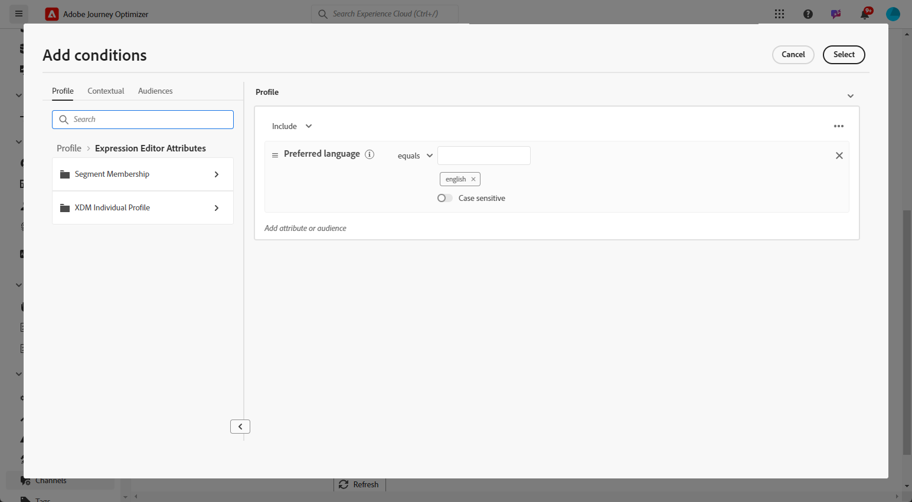
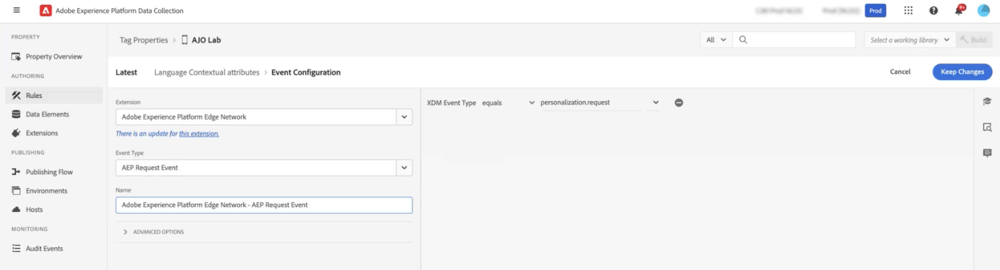

# Meertalige inhoud maken met handmatige vertaling {#multilingual-manual}

>[!IMPORTANT]
>
>Gebruikers moeten de machtiging **[!UICONTROL Manage Language settings]** krijgen voor handmatige doorloop.

Met de handmatige stroom kunt u uw inhoud moeiteloos rechtstreeks vertalen in uw campagnes en reizen, zodat u nauwkeurige controle- en aanpassingsopties hebt voor uw meertalige berichten. Bovendien kunt u bestaande meertalige inhoud eenvoudig importeren met de optie HTML importeren.

Ga als volgt te werk om meertalige inhoud te maken met handmatige vertaling:

1. [Uw provider toevoegen (optioneel)](multilingual-provider.md)

1. [Landinstellingen toevoegen (optioneel)](multilingual-locale.md)

1. [Taalinstellingen maken](#language-settings)

1. [Meertalige inhoud maken](#create-multilingual-campaign)

## Taalinstellingen maken {#language-settings}

In deze sectie kunt u verschillende landinstellingen instellen voor het beheer van meertalige inhoud. U kunt ook het kenmerk kiezen dat u wilt gebruiken om informatie met betrekking tot de profieltaal op te zoeken

1. Open **[!UICONTROL Administration]** > **[!UICONTROL Channel]** in het menu **[!UICONTROL General settings]** .

1. Klik in het menu **[!UICONTROL Language settings]** op **[!UICONTROL Create language settings]** .

   

1. Typ de naam van de **[!UICONTROL Language settings]** en kies **[!UICONTROL Manual Translation]** .

1. Selecteer de **[!UICONTROL Locales]** die aan deze instellingen is gekoppeld. U kunt maximaal 50 landinstellingen toevoegen.

   Als een **[!UICONTROL Locale]** ontbreekt, kunt u het manueel van tevoren van het **[!UICONTROL Translation]** menu of door API tot stand brengen. Verwijs naar [&#x200B; creeer een nieuwe Scène &#x200B;](multilingual-locale.md).

   

1. Selecteer een **[!UICONTROL Fallback preferences]** om een back-upoptie te definiëren wanneer een profiel niet voldoet aan de vereiste criteria voor het leveren van inhoud.

   Als er geen fallback-optie is geselecteerd, wordt de campagne of de reis niet verzonden.

1. Kies uw verzendvoorkeur uit de volgende opties:

   * **[!UICONTROL Select profile language preference attributes]**
   * **[!UICONTROL Create custom conditional rules]**

1. Als u **[!UICONTROL Select profile language preference attributes]** selecteert, kiest u het desbetreffende kenmerk in het menu **[!UICONTROL Profile language preference attributes]** om de taalgegevens van het profiel op te zoeken.

   

1. Als u **[!UICONTROL Create custom conditional rules]** selecteert, selecteert u de landinstelling waarvoor u voorwaarden wilt maken. Vervolgens kunt u regels maken op basis van factoren zoals gebruikerslocatie, taalvoorkeuren of andere contextafhankelijke elementen.

   

1. Begin voorwaarden te creëren door een attribuut, een gebeurtenis, of een publiek toe te voegen om uw doelgroep te bepalen.

   >[!IMPORTANT]
   >
   >Contextuele gegevens zijn uitsluitend beschikbaar voor webkanalen, in-app-, ervaring op basis van code en contentkaartkanalen. Indien gebruikt voor e-mail, sms, pushberichten of direct-mailkanalen, zonder extra kenmerken, wordt de campagne of de reis verzonden in de taal van de eerste optie in de lijst.

   

   +++Vereisten om contextuele gebeurtenissen in uw omstandigheden te gebruiken

   Wanneer gebruikers uw inhoud weergeven, wordt samen met de ervaringsgebeurtenis een verzoek tot aanpassing verzonden. Als u contextafhankelijke gegevens in uw voorwaarden wilt gebruiken, moet u aanvullende gegevens aan de payload van het aanpassingsverzoek koppelen. Om dit te doen, moet u een regel in de Inzameling van Gegevens van Adobe Experience Platform tot stand brengen om te specificeren: ALS een verpersoonlijkingsverzoek wordt verzonden, dan bijlage extra gegevens aan het verzoek, die de attributen om met het taalgebied in uw schema bepalen aan te passen.

   >[!NOTE]
   >
   >Deze voorwaarden zijn alleen vereist voor de kanalen voor de in-app- en inhoudskaarten.

   1. Open het menu **[!UICONTROL Rules]** in Adobe Experience Platform Data Collection en maak een nieuwe regel. De gedetailleerde informatie over hoe te om regels tot stand te brengen is beschikbaar in [!DNL Adobe Experience Platform] [&#x200B; documentatie van de Inzameling van Gegevens &#x200B;](https://experienceleague.adobe.com/en/docs/experience-platform/collection/e2e#create-a-rule){target="_blank"}

   2. Voeg in de sectie **[!UICONTROL IF]** van de regel een gebeurtenis toe die als volgt is geconfigureerd:

      

      * Kies de **[!UICONTROL Extension]** waarmee u werkt.
      * Selecteer in het veld **[!UICONTROL Event type]** de optie &quot;AEP Request Event&quot;.
      * Selecteer in het rechterdeelvenster &quot;XDM Event Type is gelijk aan personalization.request&quot;
      * Klik op de knop **[!UICONTROL Keep changes]** ter bevestiging.

   3. Voeg in de sectie **[!UICONTROL THEN]** van de regel een actie toe die als volgt is geconfigureerd:

      

      * Kies de **[!UICONTROL Extension]** waarmee u werkt.
      * Selecteer in het veld **[!UICONTROL Action Type]** de optie Gegevens koppelen.
      * In de JSON nuttige ladingssectie, zorg ervoor dat de attributen die worden gebruikt om de taal terug te winnen aan gebruik (in het voorbeeld hieronder &quot;taal&quot;) de naam van de attributen aanpassen die in het schema worden gespecificeerd waar uw gegevensstroom van de gegevensinzameling stroomt.

        ```JSON
        {
            "xdm":{
                "application":{
                    "_dc":{
                        "language":"{%%Language%%}"
                    }
                }
            }
        }
        ```

      * Klik op de knop **[!UICONTROL Keep changes]** om uw regel te bevestigen en op te slaan.

   +++

1. Sleep de landinstellingen om ze opnieuw te ordenen en de prioriteit ervan in de lijst te beheren.

1. Als u een landinstelling wilt verwijderen, klikt u op het binpictogram.

   

1. Klik op **[!UICONTROL Submit]** om een **[!UICONTROL Language settings]** -bestand te maken.

Nadat u de taalvoorkeuren hebt ingesteld, kunt u deze niet meer bewerken.

<!--
1. Access the **[!UICONTROL channel configurations]** menu and create a new channel configuration or select an existing one.


1. In the **[!UICONTROL Header parameters]** section, select the **[!UICONTROL Enable multilingual]** option.

1. Select your **[!UICONTROL Locales dictionary]** and add as many as needed.
-->

## Meertalige inhoud maken {#create-multilingual-campaign}

Nadat u meertalige inhoud hebt ingesteld, kunt u uw campagne of reis plannen en de inhoud voor elk van uw geselecteerde landinstellingen aanpassen.

1. Begin door uw E-mail, SMS of Push bericht [&#x200B; campagne &#x200B;](../campaigns/create-campaign.md) te creëren en te vormen of [&#x200B; reis &#x200B;](../building-journeys/journey-action.md) volgens uw vereisten.

   >[!IMPORTANT]
   >
   >We raden aan slechts één vertaalproject per reis op te nemen.

1. Maak of importeer de originele inhoud en pas deze indien nodig aan.

1. Wanneer de inhoud is gemaakt, klikt u op **[!UICONTROL Save]** en gaat u terug naar het scherm met de campagneconfiguratie.

   

1. Klik op **[!UICONTROL Add languages]** en selecteer de eerder gemaakte **[!UICONTROL Language settings]** . [Meer informatie](#language-settings)

   

1. Kies de gewenste landinstelling in het keuzemenu die u wilt toepassen op de bestaande geschreven inhoud.

1. Open de geavanceerde instellingen van het menu **[!UICONTROL Locales]** en selecteer **[!UICONTROL Copy to all locales]** .

   

1. Nadat de inhoud in de geselecteerde **[!UICONTROL Locales]** is gedupliceerd, opent u elke landinstelling en klikt u op **[!UICONTROL Edit email body]** om de inhoud te vertalen.

   

1. U kunt ervoor kiezen om landinstellingen uit te schakelen of in te schakelen via het menu **[!UICONTROL More action]** van de geselecteerde landinstelling.

   

1. Als u de meertalige configuratie wilt deactiveren, klikt u op **[!UICONTROL Add languages]** en selecteert u de taal die u als lokale taal wilt behouden.

   

1. Klik op **[!UICONTROL Review to activate]** om een overzicht van de campagne weer te geven.

   In het overzicht kunt u uw campagne desgewenst wijzigen en controleren of een parameter onjuist is of ontbreekt.

1. Blader door uw meertalige inhoud om de rendering in elke taal te bekijken.

   

U kunt nu uw campagne of reis activeren. Als u eenmaal bent verzonden, kunt u de impact van uw meertalige reis of campagne in rapporten meten.

>[!IMPORTANT]
>
> Als uw campagne onderworpen is aan een goedkeuringsbeleid, zult u goedkeuring moeten vragen om uw meertalige campagne of reis te kunnen verzenden. [Meer informatie](../test-approve/gs-approval.md)

<!--
# Create a multilingual journey {#create-multilingual-journey}

1. Create your journey with a Delivery and personalize your content as needed.
1. From your delivery action, click Edit content.
1. Click Add languages.

-->
