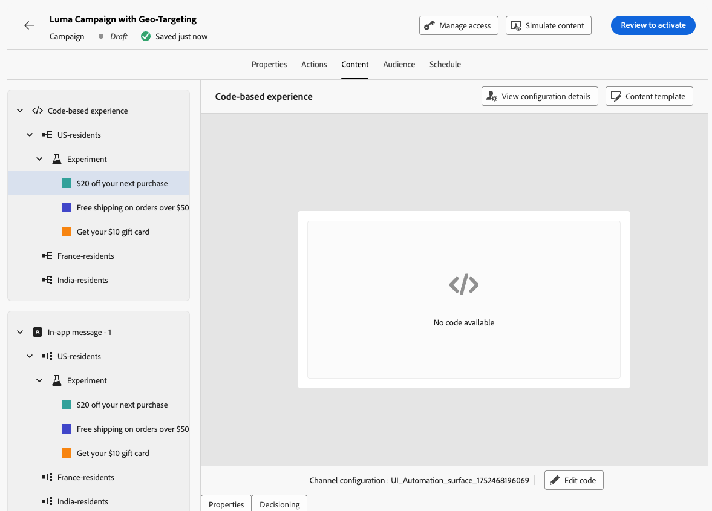

# Doelstellingen en experimenten combineren {#combination}

Met Journey Optimizer kunt u ook gerichte toepassingen en experimenten combineren binnen één reis of campagne om geavanceerdere strategieën te ontwikkelen.

U kunt doelgericht gebruiken om verschillende varianten te maken. Voor elke variant kunt u experimenteren om elke inhoud verder te optimaliseren. Dit zorgt ervoor dat de experimenten voor elke het richten regel specifiek zijn en zich niet over varianten uitstrekken.

U kunt bijvoorbeeld een &#39;50% korting op promotie&#39; testen in plaats van een &#39;50% cadeaukaart&#39; voor klanten in de VS en een andere test uitvoeren voor klanten in Europa, zoals &#39;gratis verzending voor bestellingen van meer dan 50 euro&#39; in plaats van &#39;20% korting op hun volgende aankoop&#39;.

Volg de onderstaande stappen om zowel gerichte als experimenten op een reis of campagne te combineren.

1. Creeer een reis of een campagne waar u verscheidene richtingsregels bepaalt. [ leer hoe ](optimization-targeting.md)

   {width=85%}

1. Maak een experiment voor de eerste doelregel.

1. Ontwerp en configureer uw content-experiment naar wens. [ leer hoe ](../content-management/content-experiment.md)

   {width=85%}

   Zodra de experimentatie wordt bepaald, is het slechts op de eerste gerichte regel van toepassing.

1. Selecteer **[!UICONTROL Actions]** weer op het tabblad **[!UICONTROL Edit content]** .

1. Voor de groep die door uw eerste het richten regel wordt bepaald, kunt u een specifieke inhoud voor elke variant van uw experiment bepalen.

   Als u meer dan één binnenkomende actie aan uw reis of campagne toevoegde, is de zelfde combinatie gericht en experiment op elke actie van toepassing. Nochtans, moet u een specifieke inhoud voor elke variant van elke actie bepalen.

   {width=85%}

1. Ga zo gelijkaardig voor andere het richten regels te werk, en ontwerp de overeenkomstige inhoud voor elke variant.

1. Sparen uw veranderingen en [ activeer ](review-activate-campaign.md) uw reis of campagne.

Zodra de reis/de campagne levend is, worden de gebruikers van elke doelgroep willekeurig toegewezen de verschillende inhoudvariaties die voor de groep worden bepaald zij tot behoren.

<!--
## Reporting on Message optimization

E.g. explaining how a marketer can look at the report to determine which treatment (e.g. which message content) is performing the best for the targeting audience
-->

