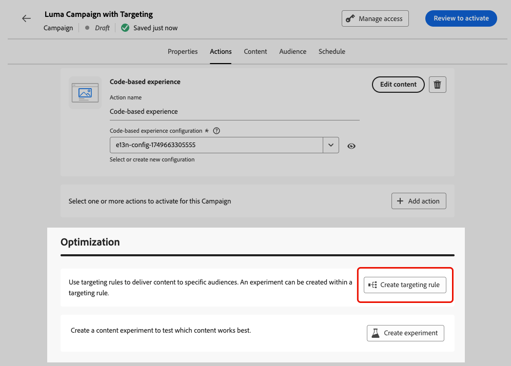

# Doelen {#targeting}

>[!CONTEXTUALHELP]
>id="ajo_content_targeting_fallback"
>title="Wat is fallback-inhoud?"
>abstract="Met de inhoud voor alternatieven kan uw doelgroep een standaardinhoud ontvangen wanneer geen doelregel is gekwalificeerd.  als u deze optie niet selecteert, om het even welk publiek dat niet voor een het richten hierboven bepaalde regel kwalificeert zal geen inhoud ontvangen."

Het richten levert gepersonaliseerde inhoud aan specifieke publiekssegmenten die op gebruikersprofielattributen of contextafhankelijke attributen worden gebaseerd.

In tegenstelling tot experimenteren, een willekeurige toewijzing van de inhoud van een bericht, is het richten deterministisch wat betreft het leveren van de inhoud aan het juiste publiek.

Met betrekking tot doelgerichtheid kunnen specifieke regels worden vastgesteld op basis van:

* **de profielattributen van de Gebruiker** zoals plaats (b.v. geo-targeting), leeftijd of voorkeuren. Gebruikers in de VS zien bijvoorbeeld een &#39;Golden Gate&#39;-promotie, terwijl gebruikers in Frankrijk een &#39;Eiffeltoren&#39;-promotie zien.

* **Contextuele gegevens** zoals apparatentype (b.v. apparaat-richt), tijd van dag, of zittingsdetails. Desktopgebruikers ontvangen bijvoorbeeld inhoud die geoptimaliseerd is voor het bureaublad, terwijl mobiele gebruikers inhoud ontvangen die geoptimaliseerd is voor mobiele apparaten.

* **Soorten publiek** die kunnen worden gebruikt om profielen te omvatten of uit te sluiten die een bepaald publiekslidmaatschap hebben.

Volg de onderstaande stappen om doelframes in te stellen.

1. Creeer a [&#x200B; reis &#x200B;](../building-journeys/journey-gs.md#jo-build) of a [&#x200B; campagne &#x200B;](../campaigns/create-campaign.md).

   >[!NOTE]
   >
   >Als u onderweg bent, voegt u een **[!UICONTROL Action]** -activiteit toe, kiest u een kanaalactiviteit en selecteert u **[!UICONTROL Configure action]** . [Meer informatie](../building-journeys/journey-action.md#add-action)

1. Selecteer op het tabblad **[!UICONTROL Actions]** ten minste één actie.

1. Selecteer **[!UICONTROL Optimization]** in de sectie **[!UICONTROL Create targeting rule]** .

   {width=85%}

1. Klik op **[!UICONTROL Create rule]** > **[!UICONTROL Create new]** en gebruik de regelbouwer om uw criteria onderweg te definiëren.

   {width=100%}

   Definieer bijvoorbeeld een regel voor inwoners van de VS, een regel voor inwoners van Frankrijk en een regel voor inwoners van India.

   {width=85%}

1. U kunt ook op **[!UICONTROL Create rule]** > **[!UICONTROL Select rule]** klikken om een bestaande doelregel te selecteren die in het menu **[!UICONTROL Rules]** is gemaakt. [Meer informatie](../experience-decisioning/rules.md)

   {width=70%}

   In dit geval wordt de formule van de regel gewoon gekopieerd naar de reis of campagne. Eventuele volgende wijzigingen in die regel in het menu **[!UICONTROL Rules]** hebben geen invloed op de kopie van de reis of campagne.

   >[!AVAILABILITY]
   >
   >[&#x200B; Creërend het richten van regels &#x200B;](../experience-decisioning/rules.md#create) van het specifieke [!DNL Journey Optimizer] menu is momenteel beschikbaar aan organisaties die het Besluit toe:voegen-op aanbieden hebben gekocht, en zij zijn beschikbaar op bestelling voor de andere organisaties (Beperkte Beschikbaarheid).
   >
   >Deze capaciteit zal geleidelijk aan aan alle klanten worden uitgebreid. Neem in de tussentijd contact op met uw Adobe-vertegenwoordiger voor toegang.

1. Nadat u een regel hebt toegevoegd, kunt u deze nog steeds wijzigen. Kies **[!UICONTROL Edit inline]** om de regel onderweg bij te werken met de regelbuilder of **[!UICONTROL Select rule]** om een andere bestaande regel op te halen.

   {width=100%}

   >[!NOTE]
   >
   >Het inline bewerken van een regel heeft geen invloed op de bestaande regel waaruit de regel afkomstig is.

1. Selecteer de optie **[!UICONTROL Enable fallback content]** naar wens. Met de inhoud voor alternatieven kan uw doelgroep een standaardinhoud ontvangen als er geen specifieke doelregels zijn.

   >[!NOTE]
   >
   >Als u deze optie niet selecteert, ontvangen alle doelgroepen die niet in aanmerking komen voor een hierboven gedefinieerde doelregel geen inhoud.

1. Sla de instellingen voor de doelregel op.

1. Selecteer **[!UICONTROL Actions]** weer op het tabblad **[!UICONTROL Edit content]** .

1. Ontwerp aangewezen inhoud voor elke groep die door uw het richten regelmontages wordt bepaald.

   {width=85%}

   In dit voorbeeld, ontwerp een specifieke inhoud voor inwoners van de V.S., een verschillende inhoud voor Franse ingezetenen en een andere inhoud voor inwoners van India.

1. [&#x200B; activeer &#x200B;](../campaigns/review-activate-campaign.md) uw reis of campagne.

Zodra de reis/campagne live is, wordt inhoud die voor elk doel is ontworpen, verzonden zodat inwoners van de VS een specifieke boodschap krijgen, inwoners van Frankrijk een andere boodschap, enzovoort.

<!--Default content:

* If no targeting rules match, default content can be delivered.

* If default content is not enabled, passthrough behavior ensures lower-priority campaigns are evaluated.-->
