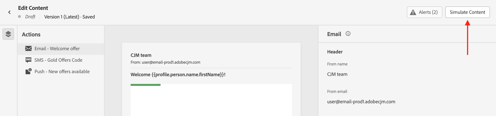

# Inhoud voorvertonen en testen {#preview-test}

>[!CONTEXTUALHELP]
>id="ac_preview_testprofiles"
>title="Controleren hoe uw inhoud wordt gerenderd"
>abstract="Nadat de inhoud is gedefinieerd, kunt u testprofielen gebruiken om deze voor te vertonen en te controleren of de rendering correct is volgens het kanaal dat u gebruikt."

>[!CONTEXTUALHELP]
>id="ajo_preview_simulate"
>title="Controleren hoe uw inhoud wordt gerenderd"
>abstract="Nadat u de inhoud hebt gedefinieerd, kunt u deze voorvertonen en controleren of de rendering correct is volgens het kanaal dat u gebruikt."

## Voorvertoning en testen {#about}

Nadat u de inhoud hebt gedefinieerd, kunt u de inhoud ervan voorvertonen voordat u het bericht verzendt. Dit is een cruciale stap om ervoor te zorgen dat deze accuraat is, maar ook vrij van fouten in zowel de inhoud als de personalisatie-instellingen.

U kunt ook testleveringen van uw e-mailberichten naar specifieke ontvangers of abonnees verzenden voor tests en validatie, en hun rendering controleren bij populaire desktops, mobiele en webclients.

>[!CAUTION]
>
>Wanneer u een bericht voorvertoont of proefdrukken verzendt, worden alleen profielverpersoonlijkingsgegevens weergegeven. Personalization op basis van contextgegevens, zoals informatie over gebeurtenissen, kan alleen worden getest in het kader van een reis. Leer hoe te om verpersoonlijking in [ te testen dit gebruiksgeval ](../personalization/personalization-use-case.md).

Al deze handelingen kunnen worden uitgevoerd met de knop **[!UICONTROL Simulate Content]** , die toegankelijk is vanuit het scherm Inhoud bewerken van uw bericht of vanuit de ontwerpers van de e-mail en het web voor de e-mail en webkanalen.

U moet de machtiging **[!DNL Manage Simulate Content]** opnemen in het productprofiel van **[!DNL Content Library Manager]** . [Meer informatie](../administration/ootb-product-profiles.md#content-library-manager).

## Testen met testprofielen of gegevens uit de voorbeeldinvoer {#methods}

U kunt de inhoud voorvertonen en testen met:

* **Testprofielen**

  Gebruik testprofielen om een voorvertoning van uw inhoud weer te geven, proefdrukken per e-mail te verzenden en het renderen van e-mail te controleren. Als u persoonlijke velden hebt toegevoegd, kunt u controleren hoe deze worden weergegeven met behulp van de gegevens van het testprofiel.

  ➡️ [ Uitgezochte testprofielen ](test-profiles.md)

  ➡️ [ Voorproef uw inhoud gebruikend testprofielen ](preview.md)

  ➡️ [ verzendt e-mailproef ](proofs.md)

  ➡️ [ e-mailteruggevende controle ](rendering.md)

  ➡️ [ Leer om uw e-mail in deze video voor te vertonen en te proeven ](#video-preview)

* **de inputgegevens van de Steekproef**

  Met [!DNL Journey optimizer] kunt u verschillende varianten van uw inhoud testen door deze voor te vertonen en proefdrukken te verzenden met behulp van voorbeeldinvoergegevens die vanuit een CSV-/JSON-bestand zijn geüpload of handmatig zijn toegevoegd.

  Alle profielkenmerken die in de inhoud worden gebruikt voor personalisatie worden automatisch gedetecteerd door het systeem en kunnen worden gebruikt voor uw tests om meerdere varianten te maken.

  ➡️ [ leren hoe te om uw inhoud te testen gebruikend de gegevens van de steekproefinput ](../test-approve/simulate-sample-input.md)

  >[!NOTE]
  >
  >Deze functies zijn momenteel alleen beschikbaar voor alle klanten als een openbare bètaversie voor de communicatiekanalen E-mail, SMS en Push.

## Hoe kan ik-video {#video-preview}

Leer hoe u testprofielen kunt gebruiken om het renderen van e-mail in verschillende vakken te testen, een voorbeeld van uw persoonlijke e-mails te bekijken op basis van testprofielen en proefdrukken te verzenden.

>[!VIDEO](https://video.tv.adobe.com/v/3425026?quality=12)
