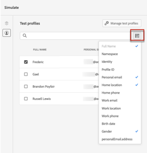

# Voorbeeld van uw inhoud bekijken {#preview}

Eenmaal [testprofielen](test-profiles.md) geselecteerd, kunt u een voorvertoning van uw inhoud weergeven. Voer de onderstaande stappen uit:

1. Klik in het scherm Inhoud bewerken van uw bericht of in de e-mailontwerper op de knop **[!UICONTROL Simulate content]** knop.

1. Selecteer een testprofiel. U kunt de waarden controleren die beschikbaar zijn in de kolommen. Gebruik de pijl-rechts/pijl-links om door gegevens te bladeren.

   

   >[!NOTE]
   >
   >Als u meer testprofielen wilt toevoegen, selecteert u **[!UICONTROL Manage test profiles]**. [Meer informatie](test-profiles.md)

1. Klik op de knop **[!UICONTROL Select data]** boven de lijst om kolommen toe te voegen of te verwijderen.

   U kunt de gebieden van de verpersoonlijking voor het huidige bericht aan het eind van de lijst zien. In dit voorbeeld worden stad, voornaam en achternaam van het profiel weergegeven. Selecteer deze velden en zorg ervoor dat deze waarden worden ingevuld in uw testprofielen.

   

1. In de berichtvoorvertoning worden gepersonaliseerde elementen vervangen door de geselecteerde gegevens van het testprofiel. Voor dit bericht zijn bijvoorbeeld zowel de e-mailinhoud als het onderwerp van de e-mail gepersonaliseerd:

   

1. Selecteer andere testprofielen om een voorbeeld van uw e-mail te bekijken voor elke variant van uw bericht.
