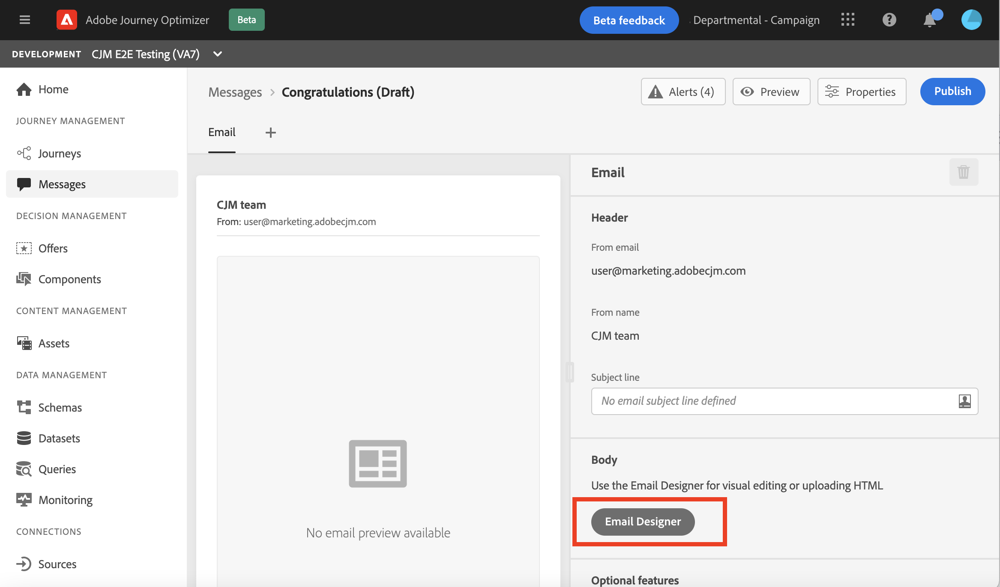

# Ontwerp uw e-mailinhoud in de gebruikersinterface {#create-email-content}

Als u uw bericht [hebt gemaakt](create-message.md), kunt u beginnen met het maken van uw e-mailinhoud.

1. Selecteer **[!UICONTROL Email designer]** in de sectie **[!UICONTROL Body]** van het zojuist gemaakte bericht.

   

1. Kies op de introductiepagina van E-mail Designer hoe u uw e-mail wilt ontwerpen uit de volgende opties:

   * Selecteer **[!UICONTROL Design from scratch]** om de mogelijkheden van de e-mailontwerper te gebruiken om uw e-mailinhoud tot stand te brengen. [Meer informatie](#design-scratch)

   * Selecteer **[!UICONTROL Start from template]** om uw e-mail van een ingebouwde lijst van malplaatjes tot stand te brengen. U kunt geen andere sjablonen maken.

   * Selecteer **[!UICONTROL Code your own]** om onbewerkte HTML-code in te voeren of te plakken. [Meer informatie](existing-content.md#import-raw-html-code).

   * Selecteer **[!UICONTROL Import HTML]** om een HTML- dossier of .zip omslag in te voeren. [Meer informatie](existing-content.md#import-html-content-from-file).

   

## Ontwerpen vanaf nul {#design-scratch}

>[!CONTEXTUALHELP]
>id="ac_structure_components"
>title="Informatie over de componenten Structuur"
>abstract="Structuurelementen definiëren de indeling van de e-mail."

>[!CONTEXTUALHELP]
>id="ac_edition_columns"
>title="E-mailkolommen definiëren"
>abstract="Met de E-mailontwerper kunt u de indeling van uw e-mail eenvoudig definiëren door de kolomstructuur te definiëren."

Met de e-mailontwerper kunt u de structuur van uw e-mail eenvoudig definiëren. Door structuurelementen toe te voegen en te bewegen met eenvoudige belemmering-en-dalingsacties, kunt u de vorm van uw e-mail binnen seconden ontwerpen.

Voer de onderstaande stappen uit om uw e-mailinhoud samen te stellen met de e-mailontwerper:

1. Nadat u de optie **[!UICONTROL Design from scratch]** hebt geselecteerd, kunt u uw e-mailinhoud ontwerpen door **[!UICONTROL Structure components]** te slepen en neer te zetten om de lay-out van uw e-mail te definiëren.

   >[!NOTE]
   >
   >Kolommen zijn niet compatibel met alle e-mailprogramma&#39;s. Kolommen worden niet gestapeld als deze functie niet wordt ondersteund.
   >
   >Nadat u de onderdelen in de e-mail hebt geplaatst, kunt u deze alleen verplaatsen of verwijderen als er al een inhoudscomponent of een fragment in de e-mail is geplaatst.

   

1. Voeg zo veel **[!UICONTROL Structure components]** toe zoals nodig.

   Selecteer de **[!UICONTROL n:n column]** component om het aantal kolommen van uw keus (tussen 3 en 10) te bepalen. U kunt de breedte van elke kolom ook bepalen door de pijlen bij de bodem van elke kolom te bewegen.

   >[!NOTE]
   >
   >Elke kolomgrootte mag niet kleiner zijn dan 10% van de totale breedte van de structuurcomponent. U kunt geen kolom verwijderen die niet leeg is.

1. In de vervolgkeuzelijst **[!UICONTROL Content components]** kunt u zoveel **[!UICONTROL Content components]** toevoegen als u nodig hebt in de structuurcomponent. [Meer informatie over de componenten](content-components.md) Inhoud.

   

1. Elke component kan verder worden aangepast met de sectie **[!UICONTROL Component settings]**. U kunt bijvoorbeeld de tekststijl, de opvulling of marge van de component wijzigen. [Meer informatie over stijlen in de e-maileditor](https://experienceleague.adobe.com/docs/campaign-standard/using/designing-content/styles.html).

   

1. Vanuit **[!UICONTROL Assets picker]** kunt u elementen die zijn opgeslagen in **[!UICONTROL Assets library]** rechtstreeks aan uw e-mail toevoegen. [Meer informatie over middelenbeheer](assets-essentials.md).

   Dubbelklik op de map met uw elementen en sleep het element dat u aan uw e-mail wilt toevoegen.

   

1. Voeg verpersoonlijkingsgebieden toe om de inhoud van uw profielgegevens aan te passen. [Meer weten over content personalization](personalization/personalize.md)?

   

1. Controleer op het tabblad **[!UICONTROL Links]** in het linkerdeelvenster de lijst met alle URL&#39;s van de inhoud die wordt bijgehouden. U kunt de **[!UICONTROL Tracking Type]**, **[!UICONTROL Label]** en **[!UICONTROL Tags]** indien nodig wijzigen.

   

   >[!NOTE]
   >
   >Meer informatie over koppelingen en het bijhouden van berichten vindt u op [deze pagina](message-tracking.md).

1. Indien nodig, kunt u op code redacteur schakelen om uw e-mail verder te personaliseren door **[!UICONTROL Switch to code editor]** van het geavanceerde menu te klikken. Voor meer informatie over de coderedacteur, verwijs naar deze [pagina](existing-content.md#import-raw-html-code).

   >[!NOTE]
   >
   >U zult niet de visuele ontwerper voor deze e-mail na omschakeling aan de coderedacteur kunnen gebruiken.

   

1. Klik **[!UICONTROL Show preview]** om uw e-mailrendering te controleren. U kunt kiezen voor de weergave Computer of Mobiel.

   Voor meer informatie over hoe voorproef uw e-mail, verwijs naar [Voorproef en test uw berichten](preview.md).

   

1. Wanneer uw e-mail klaar is, klikt u op **[!UICONTROL Save & Close]**.

Uw e-mailinhoud kan nu worden gebruikt in een bericht. [Leer hoe u een bericht](publish-manage-message.md) verzendt.

## Maak de tekstversie van een e-mailbericht {#generate-text-version}

U wordt aangeraden een tekstversie van de e-mailtekst te maken die wordt gebruikt wanneer HTML-inhoud niet kan worden weergegeven.

Standaard maakt de e-mailontwerper een **[!UICONTROL Plain text]**-versie van uw e-mail, inclusief personalisatievelden. Deze versie wordt automatisch gegenereerd en gesynchroniseerd met de HTML-versie van uw inhoud.

Voer de onderstaande stappen uit als u liever een andere inhoud gebruikt voor de versie zonder opmaak:

1. Selecteer het tabblad **[!UICONTROL Plain text]** in uw e-mail.

   

1. Gebruik de schakeloptie **[!UICONTROL Sync with HTML]** om synchronisatie uit te schakelen.

   

1. Klik op het vinkje om uw keuze te bevestigen.

   

1. Vervolgens kunt u de versie zonder tekst naar wens bewerken.

>[!CAUTION]
>
>* Wijzigingen die worden aangebracht in de weergave **[!UICONTROL Plain text]** worden niet weerspiegeld in de HTML-weergave.
   >
   >
* Als u de optie **[!UICONTROL Sync with HTML]** weer inschakelt nadat u de onbewerkte tekstinhoud hebt bijgewerkt, gaan de wijzigingen verloren en worden deze vervangen door tekstinhoud die uit de HTML-versie is gegenereerd.

## Een preheader gebruiken {#preheader}

>[!CONTEXTUALHELP]
>id="ac_edition_preheader"
>title="Een preheader gebruiken"
>abstract="Met de preheader kunt u een korte samenvattingstekst configureren die u kan helpen uw e-mails beter bij te houden en aan te passen."

>[!NOTE]
>
>Voorkoppen zijn niet compatibel met alle e-mailclients. Als deze optie niet wordt ondersteund, wordt de preheader niet weergegeven.

Een preheader is een korte samenvattingstekst die op de onderwerpregel volgt wanneer een e-mailbericht van uw e-mailclient wordt weergegeven. De preheader kan je helpen je e-mails beter bij te houden en aan te passen.

1. Voeg bij de e-mailontwerper een **[!UICONTROL Structure components]** toe om uw e-mailontwerp te starten.

   

1. Klik in het rechterdeelvenster **[!UICONTROL Body settings]** op **Bewerken** naast het veld **[!UICONTROL Preheader]** om inhoud toe te voegen.

   

1. Voeg de preheader toe. U kunt het verder personaliseren door het **[!UICONTROL Add personalization]** pictogram te klikken.

   

1. In het venster **[!UICONTROL Edit Personalization]** kunt u **[!UICONTROL Content block]**, **[!UICONTROL Dynamic content]** of **[!UICONTROL Personalization fields]** toevoegen.

1. Klik **[!UICONTROL Validate]** om uw verpersoonlijkingssyntaxis te controleren.

   

1. Klik op **[!UICONTROL Save]**.

Uw preheader is nu geconfigureerd voor uw e-mail.

## Achtergrondinstellingen {#about-backgrounds}

>[!CONTEXTUALHELP]
>id="ac_edition_backgroundimage"
>title="Achtergrondinstellingen"
>abstract="Met de e-mailontwerper kunt u de achtergrondkleur of achtergrondafbeelding voor uw inhoud personaliseren. Achtergrondafbeelding wordt niet door alle e-mailclients ondersteund."
>additional-url="https://docs.google.com/spreadsheets/d/1TLo62YKm3tThUWDOIliCQFWs3dpNjpDfw6DdTr1oGOw/edit#gid=0" text="Aanvullende informatie"

Als het gaat om het instellen van achtergronden met de e-mailontwerper, raadt Adobe het volgende aan:

1. Pas een achtergrondkleur toe op de tekst van uw e-mail, indien dat door uw ontwerp wordt vereist.
1. In de meeste gevallen stelt u achtergrondkleuren in op kolomniveau.
1. Probeer geen achtergrondkleuren te gebruiken voor afbeeldings- of tekstcomponenten, omdat deze moeilijk te beheren zijn.

Hieronder vindt u de beschikbare achtergrondinstellingen die u kunt gebruiken.

* Stel een **[!UICONTROL Background color]** in voor de hele e-mail. Selecteer de instellingen voor de hoofdtekst in de boomstructuur die toegankelijk is in het linkerpalet.

* Stel dezelfde achtergrondkleur in voor alle structuurcomponenten door **[!UICONTROL Viewport background color]** te selecteren. Met deze optie kunt u een andere instelling selecteren dan de achtergrondkleur.

* Stel een andere achtergrondkleur in voor elke structuurcomponent. Selecteer een structuur in de boomstructuur die toegankelijk is vanuit het linkerpalet als u alleen een specifieke achtergrondkleur op die structuur wilt toepassen.

   Zorg ervoor dat u geen achtergrondkleur voor de viewport instelt, omdat hierdoor de achtergrondkleuren van de structuur kunnen worden verborgen.

* Stel een **[!UICONTROL Background image]** in voor de inhoud van een structuurcomponent.

   >[!NOTE]
   >
   >Sommige e-mailprogramma&#39;s ondersteunen achtergrondafbeeldingen niet. Als deze optie niet wordt ondersteund, wordt in plaats daarvan de achtergrondkleur van de rij gebruikt. Selecteer de gewenste achtergrondkleur voor fallback als de afbeelding niet kan worden weergegeven.

* Stel een achtergrondkleur in op kolomniveau.

   >[!NOTE]
   >
   >Dit is het meest gebruikte geval. Adobe raadt aan achtergrondkleuren in te stellen op kolomniveau, omdat dit meer flexibiliteit biedt bij het bewerken van de volledige e-mailinhoud.

   U kunt ook een achtergrondafbeelding instellen op kolomniveau, maar dit wordt zelden gebruikt.

## Verticale uitlijning en opvulling {#adjusting-vertical-alignment-and-padding} aanpassen

U wilt de opvulling en de verticale uitlijning aanpassen binnen een structuurcomponent die uit drie kolommen bestaat. Volg de onderstaande stappen om dit te doen:

1. Selecteer de structuurcomponent rechtstreeks in de e-mail of met gebruik van de boomstructuur die beschikbaar is in het linkerpalet **Palet**.
1. Klik op **contextafhankelijke werkbalk** en kies de werkbalk die u wilt bewerken. **[!UICONTROL Select a column]** U kunt deze ook selecteren in de boomstructuur.

   De bewerkbare parameters voor die kolom worden weergegeven in het **[!UICONTROL Settings]** deelvenster aan de rechterkant.

1. Selecteer onder **[!UICONTROL Vertical alignment]** de optie **[!UICONTROL Up]**.

   De inhoudcomponent wordt vóór de kolom weergegeven.

1. Definieer onder **[!UICONTROL Padding]** de opvulling boven in de kolom. Klik op het vergrendelingspictogram om de synchronisatie met de onderste opvulling te verbreken.

   Definieer de linker- en rechteropvulling voor die kolom.

1. Ga op dezelfde manier te werk om de uitlijning en opvulling van de andere kolommen aan te passen.

1. Sla uw wijzigingen op.

## Een stijl definiëren voor koppelingen {#about-styling-links}

U kunt een koppeling onderstrepen en de kleur en het doel ervan selecteren in de e-mailontwerper.

1. In een component waar een verbinding wordt opgenomen, selecteer de etikettekst van uw verbinding.

1. In de componentenmontages, controleer **[!UICONTROL Underline link]** om de etikettekst van uw verbinding te onderstrepen.

1. Selecteer een **[!UICONTROL Target]** als u wilt selecteren in welke browsercontext de koppeling wordt geopend.

1. Als u de kleur van de koppeling wilt wijzigen, klikt u op **[!UICONTROL Link color]**.

1. Kies de gewenste kleur.

1. Sla uw wijzigingen op.

## Inline-opmaakkenmerken toevoegen {#adding-inline-styling-attributes}

Wanneer u in de interface E-mailontwerper een element selecteert en de instellingen van het element in het zijpaneel weergeeft, kunt u de inline-kenmerken en de bijbehorende waarde voor dat specifieke element aanpassen.

1. Selecteer een element in de inhoud.
1. Op het zijpaneel, zoek de **[!UICONTROL Styles Inline]** montages.

1. Wijzig de waarden van de bestaande kenmerken of voeg nieuwe kenmerken toe met de knop **+**. U kunt alle kenmerken en waarden toevoegen die CSS-compatibel zijn.

De stijl wordt vervolgens toegepast op het geselecteerde element. Als voor de onderliggende elementen geen specifieke stijlkenmerken zijn gedefinieerd, wordt de opmaak van het bovenliggende element overgeërfd.

