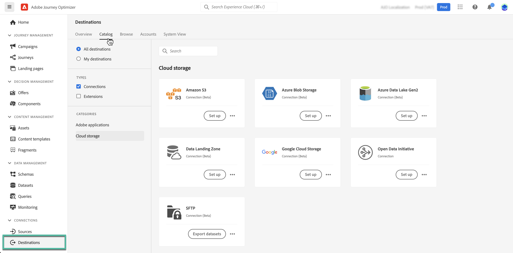
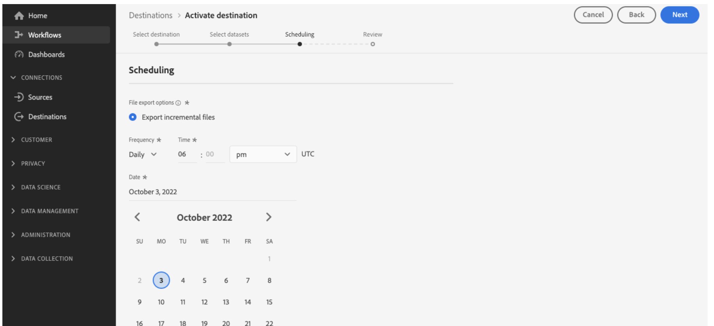

# Gegevenssets exporteren naar opslaglocaties in de cloud {#export-datasets}

>[!AVAILABILITY]
>
>De de uitvoereigenschap van datasets is momenteel in bèta en beschikbaar aan alle gebruikers van Adobe Journey Optimizer. Werk samen met uw Adobe-medewerker om toegang te krijgen tot Doelen als u nog geen toegang hebt.

Met Journey Optimizer kunt u een live verbinding maken met opslaglocaties in de cloud om de inhoud van uw gegevenssets te exporteren.

Door uw gegevens periodiek te exporteren, kunt u ervoor zorgen dat u een volledig en bijgewerkt overzicht hebt van uw klanteninteractie, deze informatie voor rapportage- of analysedoeleinden gebruikt en naleving van wettelijke vereisten handhaaft.

## Beschikbare cloudopslagbestemmingen {#destinations}

U kunt gegevenssets exporteren naar 6 cloudopslagdoelen die toegankelijk zijn vanuit de **[!UICONTROL Destinations]** in het menu **[!UICONTROL Catalog]** tab.

>[!AVAILABILITY]
>
>Deze bestemmingen zijn allemaal beschikbaar in bèta en kunnen worden gewijzigd.

Gedetailleerde informatie over elke bestemming is beschikbaar in de documentatie van Adobe Experience Platform:

* [Amazon S3](https://experienceleague.adobe.com/docs/experience-platform/destinations/catalog/cloud-storage/amazon-s3.html)
* [Azure Blob](https://experienceleague.adobe.com/docs/experience-platform/destinations/catalog/cloud-storage/azure-blob.html)
* [Azure Data Lake Gen 2](https://experienceleague.adobe.com/docs/experience-platform/destinations/catalog/cloud-storage/adls-gen2.html)
* [Gegevenslandingszone](https://experienceleague.adobe.com/docs/experience-platform/destinations/catalog/cloud-storage/data-landing-zone.html)
* [Google Cloud Storage](https://experienceleague.adobe.com/docs/experience-platform/destinations/catalog/cloud-storage/google-cloud-storage.html)
* [SFTP](https://experienceleague.adobe.com/docs/experience-platform/destinations/catalog/cloud-storage/sftp.html)

## Vereisten {#prerequisites}

Controleer de volgende eerste vereisten voordat u begint met het exporteren van uw gegevenssets:

* Om datasets uit te voeren, hebt u nodig **Doelen beheren**, **Doelen weergeven**, **Doelen activeren**, en **Dataset-doelen beheren en activeren** [toegangsbeheermachtigingen](https://experienceleague.adobe.com/docs/experience-platform/access-control/home.html#permissions). Lees de [toegangsbeheeroverzicht](https://experienceleague.adobe.com/docs/experience-platform/access-control/ui/overview.html) of neem contact op met de productbeheerder om de vereiste machtigingen te verkrijgen.

* Deze functie ondersteunt alleen het exporteren van gegevens van de eerste generatie, dat wil zeggen onbewerkte gegevens zoals gedefinieerd in het dialoogvenster [Real-time Customer Data Platform-productbeschrijving](https://helpx.adobe.com/legal/product-descriptions/real-time-customer-data-platform-b2c-edition-prime-and-ultimate-packages.html). Zorg ervoor dat de dataset die u wilt uitvoeren geen gegevens van de tweede generatie bevat.

## Belangrijkste stappen om gegevenssets te exporteren {#main-steps}

De belangrijkste stappen om een dataset naar een plaats van de wolkenopslag uit te voeren zijn als volgt:

Gedetailleerde informatie over elke stap is beschikbaar in de documentatie van Adobe Experience Platform: [Gegevenssets exporteren naar cloudopslagbestemmingen](https://experienceleague.adobe.com/docs/experience-platform/destinations/ui/activate/export-datasets.html?lang=en).

1. **De bestemming voor cloudopslag instellen**. Als u dit nog niet hebt gedaan, maakt u verbinding met een bestemming voor cloudopslag vanuit de doelcatalogus. [Leer hoe u een nieuwe doelverbinding maakt](https://experienceleague.adobe.com/docs/experience-platform/destinations/ui/connect-destination.html?lang=en#setup)

   <!---->

1. **Selecteer de bestemming voor cloudopslag** waar u uw datasets wilt uitvoeren. Klik in de catalogus met doelen op de knop **[!UICONTROL Export datasets]** op de gewenste kaart en selecteer de verbinding die u wilt gebruiken.

   <!---->

   >[!NOTE]
   >
   >Als u Adobe Journey Optimizer samen met de profielen van de Klant in real time gebruikt, zullen de bestemmingskaarten een &quot;Activate&quot;knoop tonen, die u toestaat om datasets uit te voeren en segmenten voor deze bestemming te activeren, afhankelijk van de toestemmingen u hebt toegelaten.

1. **Selecteer de gegevensset(s)** die u naar het geselecteerde doel wilt exporteren.

   <!---->

1. **Het exporteren plannen** van uw gegevensset. Geef aan wanneer het exporteren moet beginnen en met welke frequentie dit moet gebeuren.

   <!---->

1. **De export controleren en bevestigen** door de samenvatting te controleren die aan het eind van de configuratie toont.

   <!---->

Zodra het exporteren is voltooid, wordt de inhoud van uw gegevensset op de locatie van uw cloudopslag gedeponeerd volgens het schema dat u hebt geconfigureerd. [Leer hoe u succesvolle gegevenssetexport kunt controleren](https://experienceleague.adobe.com/docs/experience-platform/destinations/ui/activate/export-datasets.html#verify)
