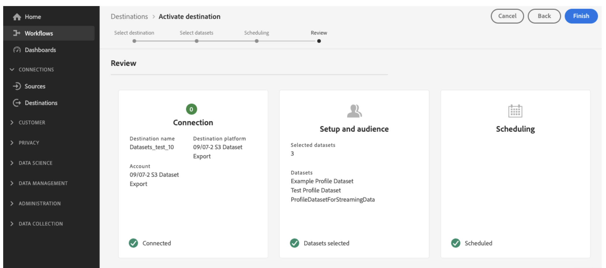

# Gegevenssets exporteren naar opslaglocaties in de cloud {#export-datasets}

Met Journey Optimizer kunt u een live verbinding maken met opslaglocaties in de cloud om de inhoud van uw gegevenssets te exporteren.

Door uw gegevens periodiek te exporteren, kunt u ervoor zorgen dat u een volledig en bijgewerkt overzicht hebt van de interactie van uw klant, zodat u deze direct kunt gebruiken voor rapportage, archivering of gegevensanalyse.

## Beschikbare cloudopslagbestemmingen {#destinations}

U kunt gegevenssets exporteren naar 6 cloudopslagdoelen die toegankelijk zijn via het menu **[!UICONTROL Destinations]** op het tabblad **[!UICONTROL Catalog]** .

Gedetailleerde informatie over elke bestemming is beschikbaar in de documentatie van Adobe Experience Platform:

* [Amazon S3](https://experienceleague.adobe.com/docs/experience-platform/destinations/catalog/cloud-storage/amazon-s3.html){target="_blank"}
* [&#x200B; Azure Blob &#x200B;](https://experienceleague.adobe.com/docs/experience-platform/destinations/catalog/cloud-storage/azure-blob.html){target="_blank"}
* [&#x200B; Azure Gen 2 van Gegevens &#x200B;](https://experienceleague.adobe.com/docs/experience-platform/destinations/catalog/cloud-storage/adls-gen2.html){target="_blank"}
* [&#x200B; Gegevens die Zone &#x200B;](https://experienceleague.adobe.com/docs/experience-platform/destinations/catalog/cloud-storage/data-landing-zone.html){target="_blank"} aanvoeren
* [&#x200B; Google Cloud Storage &#x200B;](https://experienceleague.adobe.com/docs/experience-platform/destinations/catalog/cloud-storage/google-cloud-storage.html){target="_blank"}
* [&#x200B; SFTP &#x200B;](https://experienceleague.adobe.com/docs/experience-platform/destinations/catalog/cloud-storage/sftp.html){target="_blank"}.

## Vereisten {#prerequisites}

Om datasets uit te voeren, hebt u de [&#x200B; hieronder vermelde toegangsbeheertoestemmingen &#x200B;](https://experienceleague.adobe.com/docs/experience-platform/access-control/home.html#permissions){target="_blank"} nodig. Lees het [&#x200B; overzicht van de toegangscontrole &#x200B;](https://experienceleague.adobe.com/docs/experience-platform/access-control/ui/overview.html){target="_blank"} of contacteer uw productbeheerder om de vereiste toestemmingen te verkrijgen.

| Categorie | Machtiging |
|--|--|
| Bestemmingen | Dataset-doelen beheren en activeren |
| Data management | Gegevensbestanden weergeven |
| Bestemmingen | Doelen weergeven |

## Belangrijke stappen voor het exporteren van gegevenssets {#main-steps}

De belangrijkste stappen om een dataset naar een plaats van de wolkenopslag uit te voeren zijn als volgt:

De gedetailleerde informatie over elke stap is beschikbaar in [&#x200B; documentatie van Adobe Experience Platform &#x200B;](https://experienceleague.adobe.com/docs/experience-platform/destinations/ui/activate/export-datasets.html){target="_blank"}.

1. **Opstelling uw bestemming van de wolkenopslag**. Als u dit nog niet hebt gedaan, maakt u verbinding met een bestemming voor cloudopslag vanuit de doelcatalogus. Leer hoe te om een nieuwe bestemmingsverbinding in [&#x200B; documentatie van Adobe Experience Platform &#x200B;](https://experienceleague.adobe.com/docs/experience-platform/destinations/ui/connect-destination.html#setup){target="_blank"} tot stand te brengen.

   <!---->

1. **selecteer de bestemming van de wolkenopslag** waar u uw datasets wilt uitvoeren. Klik in de catalogus met doelen op de knop **[!UICONTROL Export datasets]** op de gewenste kaart en selecteer de verbinding die u wilt gebruiken.

   <!---->

   >[!NOTE]
   >
   >Als u Adobe Journey Optimizer samen met de profielen van de Klant in real time gebruikt, zullen de bestemmingskaarten **activeren** knoop tonen, toestaand u zowel datasets als publiek voor deze bestemming activeren, afhankelijk van de toestemmingen u hebt toegelaten.

1. **selecteer de dataset(s)** die u naar de geselecteerde bestemming wilt uitvoeren. [&#x200B; Leer meer over de datasets van Journey Optimizer beschikbaar voor het uitvoeren &#x200B;](#datasets)

   <!---->

1. **Plan de uitvoer** van uw dataset. Geef aan wanneer het exporteren moet beginnen en met welke frequentie dit moet gebeuren.

   <!---->

1. **Overzicht en bevestig de uitvoer** door de samenvatting te controleren die aan het eind van de configuratie toont.

   <!---->

Zodra het exporteren is voltooid, wordt de inhoud van uw gegevensset op de locatie van uw cloudopslag gedeponeerd volgens het schema dat u hebt geconfigureerd. [&#x200B; Leer hoe te om succesvolle datasetuitvoer &#x200B;](https://experienceleague.adobe.com/docs/experience-platform/destinations/ui/activate/export-datasets.html#verify){target="_blank"} te verifiëren.

## Beschikbare gegevenssets voor exporteren {#datasets}

Begrijp van de lijst hieronder welke datasets van Journey Optimizer u kunt uitvoeren.

| Gegevensset | Beschrijving |
| ------- | ------- | 
| Gegevensset voor AJO BCC-feedbackgebeurtenis | Gegevensset voor AJO BCC-feedbackgebeurtenis |
| AJO Classification-gegevensset | Dataset voor het invoeren van feedback over e-mail- en pushtoepassingen van Journey Optimizer. Gemaakt via SDK. |
| AJO-servicedataset voor toestemming | Hiermee slaat u toestemmingsgegevens van een profiel op. |
| AJO Email Tracking Experience Event Dataset | Interactielogboeken voor e-mailkanaal die worden gebruikt voor rapportage en het maken van doelgroepen.  |
| Gegevensset AJO Entiteit | Dataset om entiteitmeta-gegevens voor berichten op te slaan die naar het eind worden verzonden - gebruiker.  |
| Gegevensset van gebeurtenis Inbound Activity van AJO | Gegevensset voor Journey Optimizer-webkanalen en inApp-kanalen voor levering- en interactiegebeurtenissen. |
| Gegevensset AJO Interactive Messaging Profile | Hiermee worden profielen opgeslagen die zijn gemaakt voor ondersteuning van door API&#39;s geactiveerde campagnes |
| Dataset voor AJO-feedbackgebeurtenis | Berichtenleveringslogboeken. Informatie over alle berichtlevering van Journey Optimizer voor rapportage en het creëren van publiek. De terugkoppeling van e-mailISPs op grenzen wordt ook geregistreerd in deze dataset. Deze gegevensset bevat gebeurtenissen voor alle kanalen: e-mail, SMS/MMS, Direct Mail, enz. |
| Extensie AJO-profieltellers | Bevat een kaart met objecten die counter_value en endDate bevatten en die door counter_id zijn vastgezet |
| Gegevensset van AJO Push Profile | Hiermee worden de pushtokens van een profiel opgeslagen. |
| Dataset voor AJO Push Tracking Experience | Interactielogboeken voor pushkanaal die worden gebruikt voor rapportage en het maken van doelgroepen.  |
| Gegevensset AJO-oppervlakken | Lege dataset met betrekking tot het schema van binnenkomende oppervlakken van Journey Optimizer |
| AOOutputForUPSDataset | Bevat alle AO publiekslidmaatschappen terug naar de Verenigde Dienst van het Profiel te schrijven |
| Gegevensset van publiek orchestratieprofiel | Gegenereerd door publiekscompositie voor publiek compositie publiek. Bevat alle publiek samenstellingspubliek, hun attributen en verrijkingsgegevens |
| Beslissingsobjectopslagplaats - Activiteiten | ook gekend als Besluiten in het gebruikersinterface. Maar dit zijn de objecten die een gebruiker maakt die alle bouwstenen samenbrengt, inclusief de beslissingslogica. Bijvoorbeeld, voor een bepaalde plaatsing (plaats), die zou moeten worden overwogen (de inzameling van de aanbieding), en welke rangschikkingsmethode aan gebruik op die aanbiedingen. |
| Beslissingsobjectopslagplaats - Alternatieve aanbiedingen | Dit is de opslagplaats voor het andere type aanbieding dat een gebruiker maakt. Als zij niet in aanmerking komen voor een gepersonaliseerd aanbod en als zij iets moeten zien, zullen zij tenminste het terugvalaanbod zien. Deze dataset bevat de attributen voor dit type aanbieding |
| Beslissingsobjectopslagplaats - Aangepaste aanbiedingen | Een opslagplaats voor een type aanbieding dat een gebruiker maakt. Deze dataset bevat dus de kenmerken van dit type aanbieding. |
| Beslissingsobjectrepository - Plaatsingen | Opslagplaats van objecten die de locatie bepalen waar een aanbieding moet worden weergegeven. |
| Ervaar het Beslissen van de Bewaarplaats van Objecten - De Persoonlijke Punten van de Aanbieding | Hiermee worden alle aanbiedingsitems opgeslagen, inclusief alle kenmerken en de levenscyclusstatus, ter ondersteuning van personalisatie en rapportage via meerdere kanalen.   Na het toevoegen van nieuwe gebieden van douanekenmerken aan het schema van het aanbiedingspunt, kan er een vertraging van maximaal een uur zijn alvorens deze nieuwe attributen in de dataset zichtbaar worden. Om potentieel gegevensverlies of inconsistenties te vermijden, wordt geadviseerd om minstens een uur te wachten alvorens om het even welke veranderingen of updates te maken die zich op de onlangs toegevoegde attributen baseren. |
| Gebeurtenissen reisstap | Vangt Alle Gebeurtenissen van de Ervaring van de Stap van de Reis die van Journey Optimizer worden geproduceerd om door de diensten zoals het Melden te worden verbruikt. |
| Journeys | Metagegevensset met informatie over de behuizing van elke stap in een reis |
| ODE-beslissingsgebeurtenissen - prodbeslissing | Telkens wanneer we een besluit nemen op basis van een verzoek, tellen we dat als een beslissingsgebeurtenis |