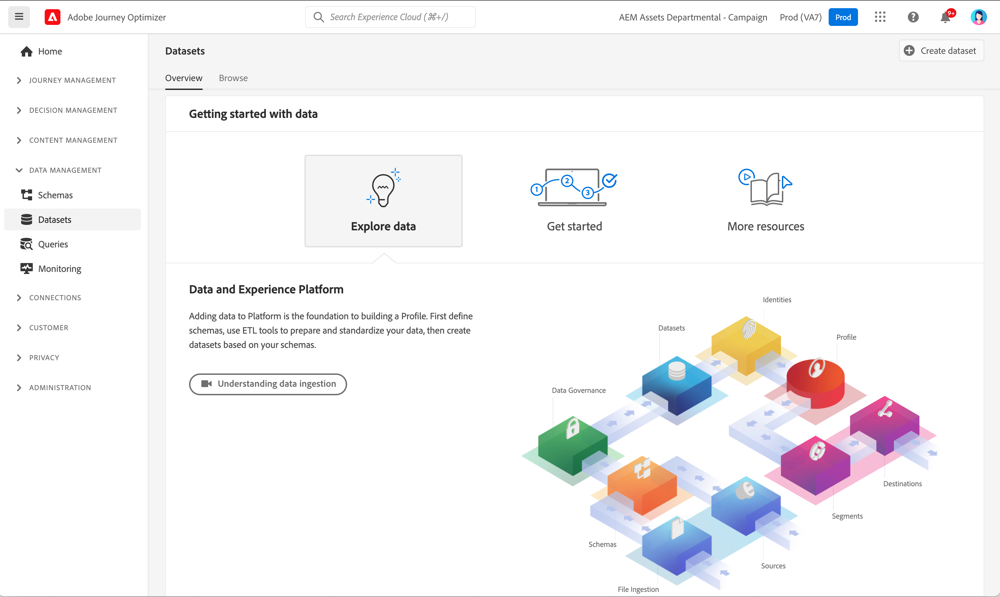
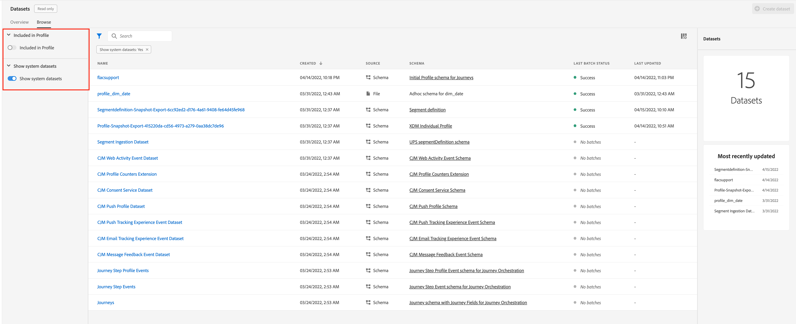

# Aan de slag met gegevenssets {#datasets-gs}

Alle gegevens die in Adobe Experience Platform worden opgenomen, blijven in het Data Lake als datasets bestaan. Een dataset is een opslag en beheersconstructie voor een inzameling van gegevens, typisch een lijst, die een schema (kolommen) en gebieden (rijen) bevat.

## Gegevensbestanden voor toegang{#access-datasets}

De **Gegevenssets** werkruimte in [!DNL Adobe Journey Optimizer] de gebruikersinterface staat u toe om gegevens te onderzoeken en datasets tot stand te brengen.

Selecteren **Gegevenssets** in de linkernavigatie om het dashboard van Datasets te openen.

Gegevens toevoegen aan [!DNL Adobe Experience Platform] is de basis voor het bouwen van een Profiel. Vervolgens kunt u profielen gebruiken in [!DNL Adobe Journey Optimizer]. Bepaal eerst schema&#39;s, gebruik hulpmiddelen ETL om uw gegevens voor te bereiden en te standaardiseren, dan datasets tot stand te brengen die op uw schema&#39;s worden gebaseerd.

Selecteer **Bladeren** tabblad om de lijst weer te geven met alle beschikbare gegevenssets voor uw organisatie. De details worden getoond voor elke vermelde dataset, met inbegrip van zijn naam, het schema de dataset zich aan, en status van de meest recente versiereeks houdt.

Door gebrek, slechts worden de datasets die u hebt ingebed in getoond. Als u de systeem-geproduceerde datasets wilt zien, laat toe **Systeemgegevenssets tonen** van het filter af.

Selecteer de naam van een dataset om tot zijn de activiteitenscherm van de Dataset toegang te hebben en details van de dataset te zien u selecteerde. Het activiteitenlusje omvat een grafiek die het tarief visualiseert van berichten die worden verbruikt evenals een lijst van succesvolle en ontbroken partijen.

Hier zijn de verschillende beschikbare datasets:

**Rapportage**

* _Rapportage - Gegevensset voor feedbackgebeurtenis_: Berichtenleveringslogboeken. Informatie over alle berichtlevering door Journey Optimizer voor rapportage en het creëren van segmenten. De terugkoppeling van e-mailISPs op grenzen wordt ook geregistreerd in deze dataset.
* _Rapportage - Gegevensset over gebeurtenissen voor het bijhouden van e-mail_: Interactielogboeken voor e-mailkanaal die worden gebruikt voor rapportage en het maken van segmenten. Gegevens die zijn opgeslagen, bevatten informatie over acties die de eindgebruiker via e-mail heeft uitgevoerd (openen, klikken, enz.).
* _Rapportage - Gegevensset van gebeurtenissen voor het bijhouden van push_: Interactielogboeken voor Push-kanaal die worden gebruikt voor rapportage en het maken van segmenten. Opgeslagen informatie over acties die door de eindgebruiker op dupberichten worden uitgevoerd.
* _Rapportage - trapsgewijze gebeurtenis_: Vangt Alle Gebeurtenissen van de Ervaring van de Stap van de Reis die van Journey Optimizer worden geproduceerd om door de diensten zoals het Melden te worden verbruikt. Ook essentieel voor het samenstellen van rapporten in Customer Journey Analytics voor YoY-analyse. Bleed aan een Metagegevens van de Reis.
* _Verslaggeving - Reizen_: Metagegevensset met informatie over de behuizing van elke stap op een reis.
* _Rapportage - BCC_: Dataset Feedbackgebeurtenis waarin de leveringslogboeken voor BCC-e-mails worden opgeslagen. Te gebruiken voor rapportagedoeleinden.

**Toestemming**

* _Dataset voor goedgekeurde service_: slaat toestemmingsinformatie van een profiel op.

**Intelligente services**

* _Scores voor optimalisatie van de Send-Time/Engagement Scores_: Uitvoerscores van Journey AI.

## Gegevensbestanden voorvertonen{#preview-datasets}

Selecteer in het activiteitenscherm Gegevensset de optie **Gegevensset voorvertoning** in de rechterbovenhoek van het scherm om een voorvertoning weer te geven van de meest recente succesvolle batch in deze dataset. Wanneer een dataset leeg is, wordt de voorproefverbinding gedeactiveerd.

## Gegevenssets maken{#create-datasets}

Om een nieuwe dataset tot stand te brengen, begin door te selecteren **Gegevensset maken** in het dashboard Datasets.

U kunt:

* Gegevensset maken van schema. [Meer informatie in deze documentatie](https://experienceleague.adobe.com/docs/experience-platform/catalog/datasets/user-guide.html?lang=en#schema){target=&quot;_blank&quot;}
* Gegevensset maken van CSV-bestand. [Meer informatie in deze documentatie](https://experienceleague.adobe.com/docs/experience-platform/ingestion/tutorials/map-a-csv-file.html){target=&quot;_blank&quot;}

Bekijk deze video om te leren hoe te om een dataset tot stand te brengen, het in kaart te brengen aan een schema, gegevens aan het toe te voegen, en te bevestigen dat de gegevens zijn opgenomen.

>[!VIDEO](https://video.tv.adobe.com/v/334293?quality=12)

## Data Governance

Blader in een gegevensset door de **Gegevensbeheer** tabblad om labels op gegevensset- en veldniveau te controleren. Gegevensbeheer categoriseert gegevens op basis van het soort beleid dat van toepassing is.

Een van de kernmogelijkheden van [!DNL Adobe Experience Platform] is gegevens van meerdere bedrijfssystemen samen te brengen om marketers beter in staat te stellen klanten te identificeren, te begrijpen en in dienst te nemen. Deze gegevens zijn mogelijk onderworpen aan gebruiksbeperkingen die zijn gedefinieerd door uw organisatie of wettelijke voorschriften. Daarom is het belangrijk om ervoor te zorgen dat uw gegevensbewerkingen in overeenstemming zijn met het beleid voor gegevensgebruik.

[!DNL Adobe Experience Platform Data Governance] staat u toe om klantengegevens te beheren en naleving van verordeningen, beperkingen, en beleid te verzekeren van toepassing op gegevensgebruik. Het speelt een sleutelrol binnen Experience Platform op diverse niveaus, met inbegrip van catalogisering, gegevenslijn, het etiketteren van het gegevensgebruik, het beleid van het gegevensgebruik, en het controleren van het gebruik van gegevens voor marketing acties.

Meer informatie over labels voor gegevensbeheer en gegevensgebruik vindt u in de [Documentatie gegevensbeheer](https://experienceleague.adobe.com/docs/experience-platform/data-governance/labels/user-guide.html){target=&quot;_blank&quot;}

## Monsters en gebruiksgevallen{#uc-datasets}

Leer hoe u een schema, een gegevensset en nieuwe gegevens maakt om testprofielen toe te voegen in Adobe Journey Optimizer in [deze end-to-end steekproef](../segment/creating-test-profiles.md)

Meer informatie over het maken van gegevenssets in [Adobe Experience Platform-documentatie](https://experienceleague.adobe.com/docs/experience-platform/catalog/datasets/overview.html){target=&quot;_blank&quot;}.

Leer hoe u de interface Gegevensbestanden in het dialoogvenster [Documentatie over gegevensinsluiting](https://experienceleague.adobe.com/docs/experience-platform/ingestion/home.html){target=&quot;_blank&quot;}.

Er is een lijst met gebruiksgevallen met queryvoorbeelden beschikbaar [hier](../data/datasets-query-examples.md).

**Zie ook**

* [Overzicht van het opnemen van streaming](https://experienceleague.adobe.com/docs/experience-platform/ingestion/streaming/overview.html?lang=nl){target=&quot;_blank&quot;}
* [Gegevens opnemen in Adobe Experience Platform](https://experienceleague.adobe.com/docs/experience-platform/ingestion/tutorials/ingest-batch-data.html){target=&quot;_blank&quot;}
