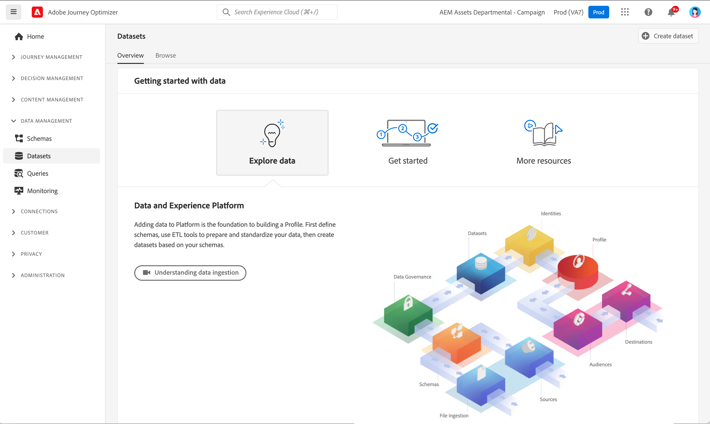

# Aan de slag met gegevenssets {#datasets-gs}

Alle gegevens die in Adobe Experience Platform worden opgenomen, blijven in het Datameer als datasets bestaan. Een dataset is een opslag en beheersconstructie voor een inzameling van gegevens, typisch een lijst, die een schema (kolommen) en gebieden (rijen) bevat.

## Gegevensbestanden voor toegang{#access-datasets}

De **werkruimte van Datasets** in [!DNL Adobe Journey Optimizer] gebruikersinterface staat u toe om gegevens te onderzoeken en datasets tot stand te brengen.

Selecteer **Datasets** in de linkernavigatie om het dashboard van Datasets te openen.

Het toevoegen van gegevens aan [!DNL Adobe Experience Platform] is de basis voor het bouwen van een Profiel. Vervolgens kunt u profielen gebruiken in [!DNL Adobe Journey Optimizer] . Bepaal eerst schema&#39;s, gebruik hulpmiddelen ETL om uw gegevens voor te bereiden en te standaardiseren, dan datasets tot stand te brengen die op uw schema&#39;s worden gebaseerd.

Selecteer **doorbladeren** lusje om de lijst van alle beschikbare datasets voor uw organisatie te tonen. De details worden getoond voor elke vermelde dataset, met inbegrip van zijn naam, het schema de dataset zich aan, en status van de meest recente versiereeks houdt.

Door gebrek, slechts worden de datasets die u hebt ingebed in getoond. Als u de systeem-geproduceerde datasets wilt zien, laat **systeemdatasets** knevel van de filter toe tonen.

>[!NOTE]
>
>Vanaf 1 november 2024 ondersteunt streaming segmentatie niet langer het verzenden en openen van gebeurtenissen vanuit [!DNL Journey Optimizer] reeksgegevens voor bijhouden en feedback. Voor het uitvoeren van het Afbakenen van de Frequentie of het Beheer van de Moeheid, gelieve BedrijfsRegels in plaats daarvan te gebruiken. U kunt meer details in [&#x200B; deze sectie &#x200B;](../conflict-prioritization/rule-sets.md) vinden, met inbegrip van een verklaring van het gebruiksgeval voor dagelijks het in kaart brengen [&#x200B; hier &#x200B;](https://experienceleaguecommunities.adobe.com/t5/journey-optimizer-blogs/elevate-customer-experience-with-daily-frequency-capping-in-ajo/ba-p/761510){target="_blank"}.
>
>Daarnaast wordt vanaf februari 2025 een time-to-live (TTL)-guardrail (time-to-live) uitgerold naar door het Journey Optimizer-systeem gegenereerde gegevenssets. [Meer informatie](datasets-ttl.md)

Selecteer de naam van een dataset om tot zijn de activiteitenscherm van de Dataset toegang te hebben en details van de dataset te zien u selecteerde. Het activiteitenlusje omvat een grafiek die het tarief visualiseert van berichten die worden verbruikt evenals een lijst van succesvolle en ontbroken partijen.

Systeemgegevenssets voor Adobe Journey Optimizer worden hieronder weergegeven.

>[!CAUTION]
>
> De datasets van het systeem **moeten niet worden gewijzigd**. Elke wijziging wordt automatisch teruggezet bij elke productupdate.

**Meldend**

* _Meldend - de Dataset van de Gebeurtenis van de Terugkoppeling van het Bericht_: De leveringslogboeken van het bericht. Informatie over alle berichtlevering van Journey Optimizer voor rapportage en het creëren van publiek. De terugkoppeling van e-mailISPs op grenzen wordt ook geregistreerd in deze dataset.
* _het Melden - E-mail die de Dataset van de Gebeurtenis van de Ervaring volgen_: De logboeken van de interactie voor E-mail kanaal dat voor het melden en de doeleinden van de publieksverwezenlijking wordt gebruikt. Gegevens die zijn opgeslagen, bevatten informatie over acties die de eindgebruiker via e-mail heeft uitgevoerd (openen, klikken, enz.).
* _het Melden - de Dataset van de Gebeurtenis van de Ervaring van de Duw_: De logboeken van de interactie voor het Duw kanaal dat voor het melden en de doeleinden van de publieksverwezenlijking wordt gebruikt. Opgeslagen informatie over acties die door de eindgebruiker op dupberichten worden uitgevoerd.
* _het Melden - de Gebeurtenis van de Stap van de Reis_: Vangt Alle Gebeurtenissen van de Ervaring van de Stap van de Reis die van Journey Optimizer worden geproduceerd om door de diensten zoals het Melden worden verbruikt. Ook essentieel voor het samenstellen van rapporten in Customer Journey Analytics for YoY analyse. Bleed aan een Metagegevens van de Reis.
* _het Melden - Reizen_: De informatie van de de huisvesting van de gegevensreeks van meta-gegevens van elke stap in een reis.
* _Meldend - BCC_: Dataset van de Gebeurtenis van de terugkoppeling die de leveringslogboeken voor BCC e-mails opslaat. Te gebruiken voor rapportagedoeleinden.

**Toestemming**

* _de Dataset van de Dienst van de Goedkeuring_: slaat toestemmingsinformatie van een profiel op.

**Intelligente Diensten**

* _Send-Time de Scores van de Optimalisering / de Scores van de Betrokkenheid_: De scores van de Output van Reis AI.

Om de volledige lijst van gebieden en attributen voor elk schema te bekijken, raadpleeg het [&#x200B; het schemawoordenboek van Journey Optimizer &#x200B;](https://experienceleague.adobe.com/tools/ajo-schemas/schema-dictionary.html?lang=nl-NL){target="_blank"}.

## Gegevensbestanden voorvertonen{#preview-datasets}

Van het de activiteitenscherm van de Dataset, uitgezochte **dataset van de Voorproef** dichtbij de hoogste juiste hoek van uw scherm om de meest recente succesvolle partij in deze dataset voor te vertonen. Wanneer een dataset leeg is, wordt de voorproefverbinding gedeactiveerd.

## Gegevenssets maken{#create-datasets}

Om een nieuwe dataset tot stand te brengen, begin door **te selecteren leidt dataset** in het dashboard van Datasets.

U kunt:

* Gegevensset maken van schema. [&#x200B; leer meer in deze documentatie &#x200B;](https://experienceleague.adobe.com/docs/experience-platform/catalog/datasets/user-guide.html?lang=nl-NL#schema){target="_blank"}
* Gegevensset maken van CSV-bestand. [&#x200B; leer meer in deze documentatie &#x200B;](https://experienceleague.adobe.com/docs/experience-platform/ingestion/tutorials/map-a-csv-file.html?lang=nl-NL){target="_blank"}

Bekijk deze video om te leren hoe te om een dataset tot stand te brengen, het in kaart te brengen aan een schema, gegevens aan het toe te voegen, en te bevestigen dat de gegevens zijn opgenomen.

>[!VIDEO](https://video.tv.adobe.com/v/334293?quality=12)

## Datagovernance

In een dataset, doorblader het **lusje van het Beleid van 0&rbrace; Gegevens &lbrace;om etiketten op de dataset en het gebiedsniveau te controleren.** Gegevensbeheer categoriseert gegevens op basis van het soort beleid dat van toepassing is.

Een van de kernmogelijkheden van [!DNL Adobe Experience Platform] is om gegevens van meerdere bedrijfssystemen samen te brengen, zodat marketers hun klanten beter kunnen identificeren, begrijpen en betrekken. Deze gegevens zijn mogelijk onderworpen aan gebruiksbeperkingen die zijn gedefinieerd door uw organisatie of wettelijke voorschriften. Daarom is het belangrijk om ervoor te zorgen dat uw gegevensbewerkingen in overeenstemming zijn met het beleid voor gegevensgebruik.

Met [!DNL Adobe Experience Platform Data Governance] kunt u klantgegevens beheren en ervoor zorgen dat de regels, beperkingen en beleidsregels die van toepassing zijn op het gebruik van gegevens worden nageleefd. Het speelt binnen Experience Platform een sleutelrol op verschillende niveaus, zoals catalogisering, gegevenskoppeling, etikettering van het gegevensgebruik, het beleid voor gegevensgebruik en het controleren van het gebruik van gegevens voor marketingacties.

Leer meer over de etiketten van het gegevensbeheer en van het gegevensgebruik in de [&#x200B; documentatie van het Beleid van Gegevens &#x200B;](https://experienceleague.adobe.com/docs/experience-platform/data-governance/labels/user-guide.html?lang=nl-NL){target="_blank"}

## Monsters en gebruiksgevallen{#uc-datasets}

Leer hoe te om een schema, een dataset tot stand te brengen en gegevens in te voeren om de profielen van de Test in Adobe Journey Optimizer in [&#x200B; toe te voegen deze steekproef van begin tot eind &#x200B;](../audience/creating-test-profiles.md)

Leer meer over datasetverwezenlijking in [&#x200B; documentatie van Adobe Experience Platform &#x200B;](https://experienceleague.adobe.com/docs/experience-platform/catalog/datasets/overview.html?lang=nl-NL){target="_blank"}.

Leer hoe te om Datasets UI in de [&#x200B; documentatie van het overzicht van de Ingestie van Gegevens te gebruiken &#x200B;](https://experienceleague.adobe.com/docs/experience-platform/ingestion/home.html?lang=nl-NL){target="_blank"}.

Een lijst van gebruiksgevallen met vraagvoorbeelden is beschikbaar [&#x200B; hier &#x200B;](../data/datasets-query-examples.md).

>[!MORELIKETHIS]
>
>* [&#x200B; het stromen ingegaan overzicht &#x200B;](https://experienceleague.adobe.com/docs/experience-platform/ingestion/streaming/overview.html?lang=nl){target="_blank"}
>* [&#x200B; Ingest gegevens in Adobe Experience Platform &#x200B;](https://experienceleague.adobe.com/docs/experience-platform/ingestion/tutorials/ingest-batch-data.html?lang=nl-NL){target="_blank"}
