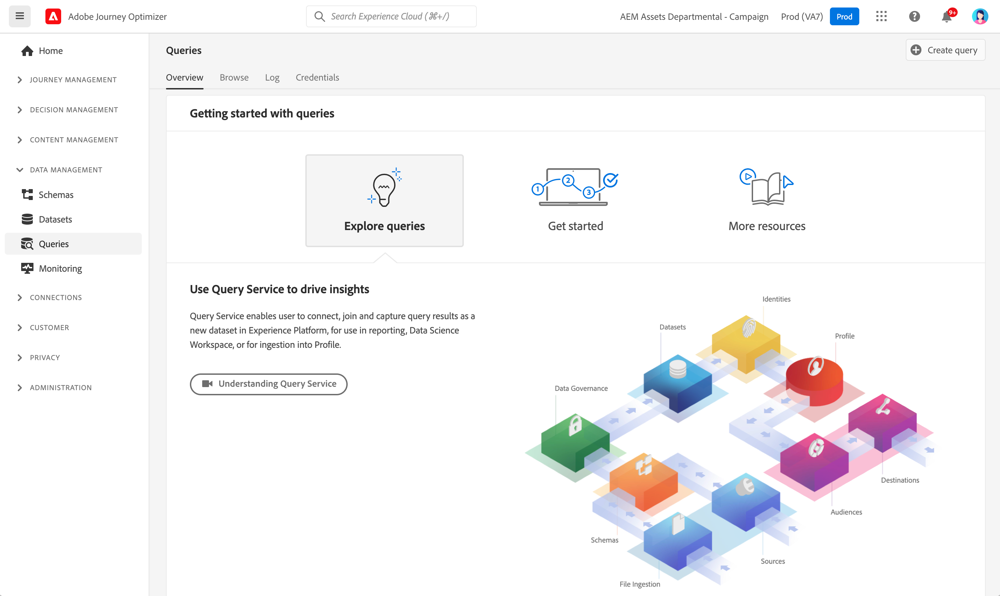

# Aan de slag met query&#39;s {#queries-gs}

De Redacteur van de vraag is een interactief hulpmiddel dat door de Dienst van de Vraag van Adobe Experience Platform wordt verstrekt, die u toestaat schrijven, bevestigen en vragen voor de gegevens van de klantenervaring in werking stellen binnen [!DNL Adobe Journey Optimizer] gebruikersinterface.

De Redacteur van de vraag steunt het ontwikkelen van vragen voor analyse en gegevensexploratie, en staat u toe om interactieve vragen voor ontwikkelingsdoeleinden evenals niet-interactieve vragen in werking te stellen om te bevolken [gegevenssets](get-started-datasets.md).

Leer hoe te om de Redacteur van de Vraag te gebruiken in [deze documentatie](https://experienceleague.adobe.com/docs/experience-platform/query/ui/user-guide.html){target="_blank"}.

**Zie ook**

* [Documentatie bij Query Service](https://experienceleague.adobe.com/docs/experience-platform/query/home.html?lang=nl){target="_blank"}
* [Overzicht van Query Service-video](https://experienceleague.adobe.com/docs/platform-learn/tutorials/queries/understanding-query-service.html){target="_blank"}
