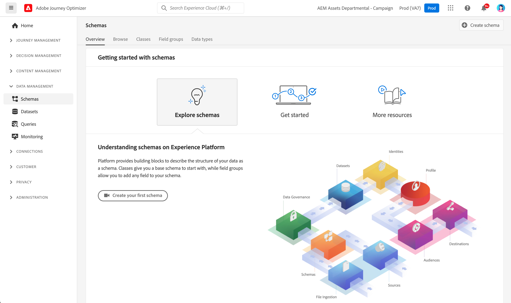

# Aan de slag met schema&#39;s {#schemas-gs}

Schema&#39;s zijn de standaardmanier om gegevens in Experience Platform te beschrijven, zodat alle gegevens die aan schema&#39;s voldoen, opnieuw kunnen worden gebruikt in een organisatie zonder conflicten, of zelfs kunnen worden gedeeld tussen meerdere organisaties.

➡️ [ leren hoe te om een schema in deze video ](#video-schema) (video) tot stand te brengen en te vormen

Een schema is een set regels die de structuur en indeling van gegevens vertegenwoordigen en valideren. Op een hoog niveau, verstrekken de schema&#39;s een abstracte definitie van een real-world voorwerp (zoals een persoon) en schetsen welke gegevens in elke instantie van dat voorwerp (zoals voornaam, achternaam, verjaardag, etc.) zouden moeten worden omvat.

Leer hoe te schema&#39;s in [ te bouwen deze documentatie ](https://experienceleague.adobe.com/docs/experience-platform/xdm/schema/composition.html?lang=nl-NL){target="_blank"} .

De **werkruimte van Schema&#39;s** in [!DNL Adobe Journey Optimizer] gebruikersinterface staat u toe om de middelen van het Model van de Gegevens van de Ervaring (XDM), met inbegrip van schema&#39;s, klassen, de groepen van het schemagebied, en gegevenstypes te beheren. U kunt de kernbronnen van Adobe bekijken en verkennen en aangepaste bronnen en schema&#39;s voor uw organisatie maken.

Leer hoe te om het gebruikersinterface van Schema&#39;s in [ te gebruiken deze documentatie ](https://experienceleague.adobe.com/docs/experience-platform/xdm/ui/overview.html?lang=nl-NL){target="_blank"} 

De geleidelijke documentatie om een schema tot stand te brengen gebruikend de Redacteur van het Schema is beschikbaar in [ documentatie van Adobe Experience Platform ](https://experienceleague.adobe.com/docs/experience-platform/xdm/tutorials/create-schema-ui.html?lang=nl-NL){target="_blank"} .

Raadpleeg het [ het schemawoordenboek van Journey Optimizer ](https://experienceleague.adobe.com/tools/ajo-schemas/schema-dictionary.html?lang=nl-NL){target="_blank"}  om de volledige lijst van gebieden en attributen voor elk schema te bekijken.

## Hoe kan ik-video{#video-schema}

Leer hoe u een schema maakt, veldgroepen toevoegt en aangepaste veldgroepen maakt en configureert.

>[!VIDEO](https://video.tv.adobe.com/v/334461?quality=12)

>[!MORELIKETHIS]
>
>* [ creeer een schema, een dataset en neemt gegevens op om de profielen van de Test in Journey Optimizer toe te voegen ](../audience/creating-test-profiles.md)
>* [ XDM overzicht van het Systeem ](https://experienceleague.adobe.com/docs/experience-platform/xdm/home.html?lang=nl){target="_blank"} 
>* [ Beste praktijken voor gegevens modelleren ](https://experienceleague.adobe.com/docs/experience-platform/xdm/schema/best-practices.html?lang=nl-NL){target="_blank"} 
>* [ creeer een schema gebruikend de Registratie API van het Schema ](https://experienceleague.adobe.com/docs/experience-platform/xdm/tutorials/create-schema-api.html?lang=nl-NL){target="_blank"} 
>* [ bepaal een verband tussen twee schema&#39;s gebruikend de Redacteur van het Schema ](https://experienceleague.adobe.com/docs/experience-platform/xdm/tutorials/relationship-ui.html?lang=nl-NL){target="_blank"} 
