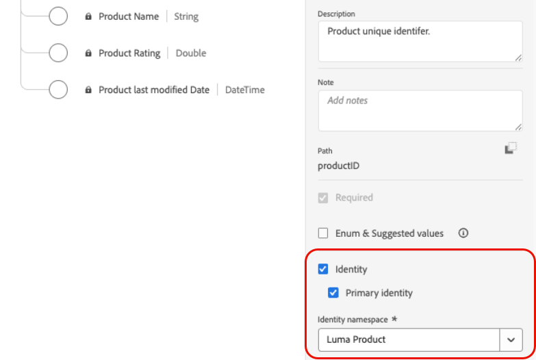

# Adobe Experience Platform-gegevens gebruiken {#aep-data}

>[!CONTEXTUALHELP]
>id="lookup-aep-data"
>title="Opzoeken inschakelen"
>abstract="Als u een dataset voor opzoeken inschakelt, kunt u de gegevens ervan benutten binnen de mogelijkheden van Journey Optimizer op het gebied van personalisatie, besluitvorming en reisorganisatie."

>[!AVAILABILITY]
>
>Deze functie is momenteel beschikbaar voor alle klanten als een beperkte beschikbaarheidsrelease.

Met Journey Optimizer kunt u gegevens uit Adobe Experience Platform-gegevens benutten met mogelijkheden voor personalisatie, besluitvorming en reisorkest. Om dit te doen, op verslag-gebaseerde datasets nodig voor raadplegingsverpersoonlijking moet eerst voor de raadplegingsdienst worden toegelaten zoals hieronder beschreven.

## Lees hier meer

### Hulplijnen en richtlijnen {#guidelines}

Controleer voordat u begint de volgende beperkingen en richtlijnen:

* Datasets die zijn ingeschakeld voor opzoeken, mogen geen PII (Personeel Identified Information) bevatten.
* Datasets die voor raadpleging worden toegelaten en in verpersoonlijking worden gebruikt worden niet beschermd tegen schrapping. Het is aan u om spoor te houden van welke datasets voor verpersoonlijking worden gebruikt om ervoor te zorgen zij niet worden geschrapt of worden verwijderd.
* Datasets moeten worden gekoppeld aan een schema dat NIET van het type Profiel of Gebeurtenis is is.
* Schema&#39;s moeten een primaire identiteit hebben. Voor zoekopdrachten kan slechts één primaire sleutel worden gebruikt.

### Entitlement for lookup service

| Functie-component | Limieten | Notities |
| ------- | ------- | ------- |
| Gegevensbestanden voor opzoeken ingeschakeld | Maximaal 10 per organisatie | Maximum aantal datasets die voor raadpleging in om het even welke bepaalde tijd kunnen worden gevormd. Deze grens is op het totale gecombineerde aantal raadplegingsdatasets over zowel productie als ontwikkelingszandbakken binnen de klanteninstantie van toepassing. |
| Aantal gegevensrecords | Tot 2 miljoen verslagen per dataset | Maximum aantal verslagen toegestaan in één enkele dataset, die als totale telling over alle partijen binnen die dataset wordt berekend. |
| Recordgrootte | Maximaal 2 kB per record | Standaard maximale ondersteunde recordgrootte. |
| Gegevensgrootte | Tot 4 GB | Maximale grootte van een individuele dataset, niet de gecombineerde grootte over alle datasets in een zandbak. De limieten voor het aantal records en de grootte van gegevenssets zijn onafhankelijke instructies. Beide moeten worden nageleefd. |
| Updates van gegevenssetfrequentie | Tot 5 updates per dag per dataset | Maximale frequentie van updatebewerkingen toegestaan voor één gegevensset per dag. |

>[!NOTE]
>
>Neem contact op met uw Adobe-vertegenwoordiger als er meer volumes nodig zijn dan de hierboven vermelde instructies.

### Aanvullende prestatieoverwegingen

De volgende aanbevelingen zijn een leidraad om vertragingen in de leverbaarheid te voorkomen:

| Overwegingen | Aanbevolen limiet | Beschrijving |
| ------- | ------- | ------- |
| Kenmerken per opzoekopdracht | Maximaal 20 | Het aantal gegevensvelden dat per record wordt opgehaald in één opzoekactiviteit. |
| Opzoeken | Tot 5 per reis | Elke reis kan tot 5 afzonderlijke raadplegingsactiviteiten bevatten. Elke raadpleging kan een verschillende dataset richten. |

## Een dataset inschakelen voor gegevensopzoekhandeling {#enable}

Om gegevens van uw dataset voor verpersoonlijking te hefboomwerking, moet u de dataset voor raadpleging toelaten.

### Vereisten {#prerequisites-enable}

Het schema verbonden aan uw dataset dat u wenst om voor raadpleging toe te laten moet van verslag-type zijn. Het schema mag GEEN profiel- of gebeurtenisklasse zijn.

+++Voorbeeld


+++

Voor het schema moet een primaire identiteit zijn gedefinieerd.

+++Voorbeeld



+++

Als er nog geen aangepaste naamruimte is gedefinieerd, controleert u of de identiteit een id is die geen persoon is.

+++Voorbeeld


+++

### Laat de dataset voor raadpleging in de interface van het gegevenssetbeheer toe

In het gegevenssetbeheer gebruikersinterface, gebruik de knevel om de dataset voor raadpleging toe te laten.


>[!NOTE]
>
>Het wordt aanbevolen dat de gegevensset NIET ook is ingeschakeld voor profielen, omdat dit tot een toename van de profielrijkheid kan leiden en niet nodig is om de zoekopdrachten uit te voeren.

### API-methode

Volg de richtingen die in [ worden gedetailleerd deze documentatie ](https://developer.adobe.com/journey-optimizer-apis/references/authentication/) om uw milieu te vormen om API bevelen te verzenden.

#### Vereisten

* De API&#39;s van Adobe Journey Optimizer en Adobe Experience Platform moeten aan het project worden toegevoegd.

  

* U moet de toestemming van datasets als deel van uw rol leiden.

* Het schema waarop de dataset is gebaseerd moet een primaire identiteit bevatten die als raadplegingssleutel kan dienst doen.

#### API-oproepstructuur

```shell
curl -s -XPATCH "https://platform.adobe.io/data/core/entity/lookup/dataSets/${DATASET_ID}/${ACTION}" \ -H "Authorization: Bearer ${ACCESS_TOKEN}" \ -H "x-api-key: ${API_KEY}" \ -H "x-gw-ims-org-id: ${IMS_ORG}" \ -H "x-sandbox-name: ${SANDBOX_NAME}" 
```

Waarbij:

* URL is `https://platform.adobe.io/data/core/entity/lookup/dataSets/${DATASET_ID}/${ACTION}`
* Dataset-id is de gegevensset waarvoor u de gegevensset wilt inschakelen.
* Actie is in- OF uitgeschakeld.
* Het teken van de toegang kan van de ontwikkelaarsconsole worden teruggewonnen.
* API-sleutel kan worden opgehaald uit de ontwikkelaarsconsole.
* IMS Org ID is uw Adobe-organisatie.
* Sandbox Name is de naam van de sandbox waarin de gegevensset zich bevindt (d.w.z. prod, dev enz.).

>[!NOTE]
>
>Als u de hieronder beschreven fout tegenkomt bij het proberen van een API-aanroep om gegevenssets in te schakelen, probeert u de Adobe Journey Optimizer API&#39;s uit uw project voor de ontwikkelaarsconsole te verwijderen en deze vervolgens opnieuw toe te voegen:
>
>`"error_code": "403003",`
>`"message": "Api Key is invalid"`

## Dataset controleren

Zodra een dataset voor raadpleging is toegelaten, kunt u het statuut van opname in de raadplegingsdienst herzien door naar het **[!UICONTROL Monitoring]** menu te gaan en **[!UICONTROL Journey Optimizer]** tabel te selecteren.

Deze procesindicator helpt in begrip wanneer de nieuwe partijen gegevens in de raadplegingsdienst beschikbaar zijn.


## Volgende stappen

Nadat een dataset voor raadpleging gebruikend een API vraag is toegelaten, kunt u de gegevens met [!DNL Journey Optimizer] verpersoonlijking en Beslissingsmogelijkheden gebruiken. Raadpleeg de volgende secties voor meer informatie:

* [Adobe Experience Platform-gegevens gebruiken voor personalisatie](../personalization/aep-data-perso.md)
* [Adobe Experience Platform-gegevens gebruiken voor beslissingen](../experience-decisioning/aep-data-exd.md)
* [Adobe Experience Platform-gegevens gebruiken voor reisorchestratie](../building-journeys/dataset-lookup.md)
