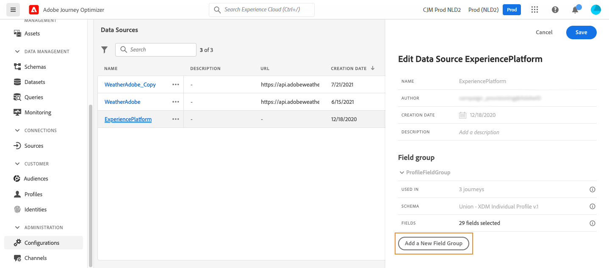

# Adobe Experience Platform-databron {#adobe-experience-platform-data-source}

>[!CONTEXTUALHELP]
>id="ajo_journey_data_source_built_in"
>title="Adobe Experience Platform-databron"
>abstract="Adobe Experience Platform-gegevensbron definieert de verbinding met Adobe Real-time klantprofiel. Deze gegevensbron is ingebouwd en vooraf geconfigureerd en kan niet worden verwijderd. Het is ontworpen om gegevens van de Real-time Dienst van het Profiel van de Klant terug te winnen en te gebruiken (bijvoorbeeld, controleer of de persoon die een reis inging een vrouwelijk is)."

Adobe Experience Platform-gegevensbron definieert de verbinding met Adobe Real-time klantprofiel. Deze gegevensbron is ingebouwd en vooraf geconfigureerd en kan niet worden verwijderd. Deze gegevensbron is ontworpen om gegevens van de Real-time Dienst van het Profiel van de Klant terug te winnen en te gebruiken (bijvoorbeeld, controleer of de persoon die een reis inging een vrouwelijk is). Voor meer informatie over het Profiel van de Klant in real time van Adobe, verwijs naar [&#x200B; documentatie van Adobe Experience Platform &#x200B;](https://experienceleague.adobe.com/docs/experience-platform/profile/home.html?lang=nl){target="_blank"}.

Om de verbinding aan de Dienst van het Profiel van de Klant in real time toe te staan, moeten wij een sleutel gebruiken om een persoon, en een namespace te identificeren die contextualizes de sleutel. Hierdoor kunt u deze gegevensbron alleen gebruiken als uw reizen beginnen met een gebeurtenis die een sleutel en een naamruimte bevat. [Meer informatie](../building-journeys/journey.md).

U kunt de vooraf geconfigureerde veldgroep met de naam &quot;ProfileFieldGroup&quot; bewerken, nieuwe veldgroepen toevoegen en de groepen verwijderen die niet worden gebruikt in concepten of livedagen. [Meer informatie](../datasource/configure-data-sources.md#define-field-groups).

>[!CAUTION]
>
>Het gebruik van ervaringsgebeurtenissen in reisexpressies/omstandigheden wordt niet ondersteund. Als uw gebruikscase het gebruik van ervaringsgebeurtenissen vereist, overweeg alternatieve methodes. [Meer informatie](../building-journeys/exp-event-lookup.md)

De belangrijkste stappen om gebiedsgroepen aan de ingebouwde gegevensbron toe te voegen zijn hieronder gedetailleerd:

1. Van de lijst van gegevensbronnen, selecteer de bouwstijl-in **Adobe Experience Platform** gegevensbron.

   Hiermee opent u het configuratiedeelvenster voor de databron aan de rechterkant van het scherm.

   

1. Selecteer **[!UICONTROL Add a New Field Group]** om a [&#x200B; nieuwe reeks gebieden te bepalen om terug te winnen &#x200B;](../datasource/configure-data-sources.md#define-field-groups).

   

1. Selecteer een schema in de vervolgkeuzelijst **[!UICONTROL Schema]** . Het maken van schema&#39;s wordt uitgevoerd in Adobe Experience Platform en niet in Adobe Journey Optimizer.
1. Selecteer de velden die u wilt gebruiken en sla uw wijzigingen op.

>[!TIP]
>
>Houd de cursor boven de naam van een veldgroep om twee pictogrammen aan de rechterkant weer te geven. Gebruik deze aan **Dupliceer** of **schrap** de gebiedsgroep. Merk op dat het **[!UICONTROL Delete]** pictogram slechts beschikbaar is als de gebiedsgroep niet in om het even welk **Levend**, **Ontwerp** of **Voltooid** reis wordt gebruikt. Raadpleeg het veld **[!UICONTROL Used in]** om te controleren of dit het geval is.
